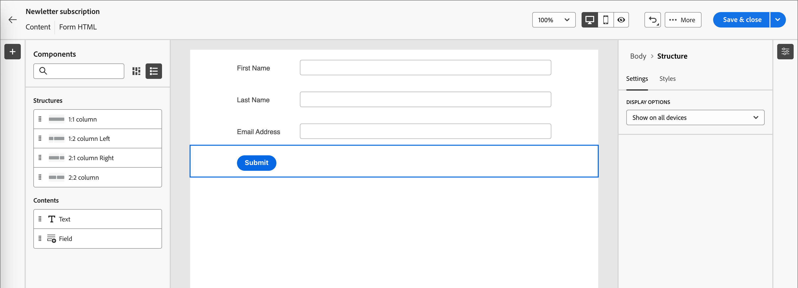

# Formulários

Para capturar informações de visitantes de páginas da Web, crie formulários e adicione-os às suas páginas de aterrissagem. Um formulário é um conjunto de campos que os visitantes da página preenchem e enviam para obter algum tipo de conteúdo ou oferta, como um white paper, um webinário sob demanda ou uma avaliação gratuita.

A quantidade de informações que o formulário deve capturar depende do valor do conteúdo ou da oferta. Se estiver oferecendo algo simples, como um white paper, você deve coletar apenas o mínimo de informações, como nome, email e empresa. Se a oferta for algo de valor maior, como uma demonstração ou uma avaliação gratuita, você pode coletar mais informações. A exigência de um formulário enviado para permitir a exibição de conteúdo é chamada de _conteúdo restrito_. Sua organização decide qual conteúdo deve ser restringido e qual não é (_gratuito_). A prática recomendada é permitir algum conteúdo gratuitamente e apenas o conteúdo premium ou de alta demanda.

## Acessar e gerenciar formulários

Para acessar formulários no Journey Optimizer B2B edition, vá para a navegação à esquerda e clique em **[!UICONTROL Gerenciamento de Conteúdo]** > **[!UICONTROL Forms]**. Essa ação abre uma página de listagem com todos os formulários criados na instância listada em uma tabela.

{width="700" zoomable="yes"}

A tabela é classificada pela coluna _[!UICONTROL Modificado]_, com os formulários atualizados mais recentemente na parte superior por padrão. Clique no título da coluna para alterar entre crescente e decrescente.

### Status e ciclo de vida do formulário

O status do formulário determina sua disponibilidade para uso em uma página de aterrissagem ou modelo de página de aterrissagem e as alterações que você pode fazer nela.

| Status | Descrição |
| -------------------- | ----------- |
| Rascunho | Quando você cria um formulário, ele está no status de rascunho. Ele permanece nesse status à medida que você define ou edita os campos, até que você os publique para uso em uma página de aterrissagem ou modelo de página de aterrissagem. Ações disponíveis: <ul><li>Editar todos os detalhes<li>Editar no espaço de design visual<li>Publicação<li>Duplicar<li>Excluir |
| Publicado | Ao publicar um formulário, ele fica disponível para uso em uma landing page ou template de landing page. O conteúdo do formulário publicado não pode ser modificado no espaço de design visual. Ações disponíveis: <ul><li>Editar nome, descrição ou página de agradecimento<li>Adicionar a uma página ou modelo de página de aterrissagem<li>Criar versão de rascunho<li>Duplicar<li>Excluir (se não estiver em uso)<li>Integrar código |
| Publicado com rascunho | Ao criar um rascunho de um formulário publicado, a versão publicada permanece disponível para uso em uma página de aterrissagem ou modelo de página de aterrissagem, e o conteúdo do rascunho pode ser modificado no espaço de design visual. Se você publicar a versão de rascunho, ela substituirá a versão publicada atual e o conteúdo será atualizado nas páginas de aterrissagem ou modelos de página de aterrissagem em que está em uso. Ações disponíveis: <ul><li>Editar páginas de nome, descrição ou agradecimento<li>Adicionar a uma página ou modelo de página de aterrissagem<li>Editar versão de rascunho no espaço de design visual<li>Publicar versão de rascunho<li>Duplicar<li>Excluir (se não estiver em uso)<li>Integrar código |

{zoomable="yes"}

### Filtrar a lista de formulários

Para pesquisar um formulário por nome, insira uma cadeia de texto na barra de pesquisa para uma correspondência. Clique no ícone _Filtro_ (  ) para mostrar as opções de filtro disponíveis e alterar as configurações para filtrar os itens exibidos de acordo com seus critérios especificados.

{width="700" zoomable="yes"}

### Personalizar a exibição da coluna

Personalize as colunas que deseja exibir na tabela clicando no ícone _Personalizar tabela_ (  ) na parte superior direita.

Na caixa de diálogo, selecione as colunas a serem exibidas e clique em **[!UICONTROL Aplicar]**.

{width="300"}

## Criar formulários

Há vários aspectos a serem considerados antes de começar a criar formulários reutilizáveis no Journey Optimizer B2B edition:

* Determine quais formulários são necessários.

  Pode ser possível utilizar apenas quatro formulários-tipo. Um para acessar conteúdo baixável, um para acessar páginas da Web premium, um para visualizar vídeos e um para se registrar em coisas como webinários. Se você precisar alterar um campo em um formulário, é mais fácil atualizar quatro formulários padrão usados globalmente do que alterar vários formulários distribuídos em todos os seus programas de marketing. <!-- Global forms also make progressive profiling much easier to implement. -->

* Para cada formulário padrão, determine quais campos usar e como apresentá-los.

  Considere usar formulários mais curtos, pois eles são comprovadamente melhores para conversões. Ao analisar cada formulário, decida quais campos são razoáveis e necessários para sua finalidade.

  Considere se os campos de formulário devem ser preenchidos previamente, para que as informações básicas, como nome e email, sejam preenchidas previamente. Mas outras informações, como cargo e tamanho da organização, não são. Dessa forma, o visitante precisa preencher apenas dois campos e enviar o formulário. Também é possível usar um preenchimento de formulário social com dados do Facebook ou do Twitter.

* Planeje qual página de acompanhamento será exibida depois que um visitante enviar um formulário (_página de agradecimento_).

  Todos recebem a mesma página ou ela é dinâmica e baseada em seus dados? Por exemplo, alguém no setor de saúde pode ver um conteúdo de página diferente de alguém no setor de tecnologia.

* Considere se deve ignorar completamente um formulário se já tiver as informações necessárias.

  Quando você permite um bypass de formulário para uma pessoa conhecida que visita sua landing page, ela pode simplesmente acessar o conteúdo diretamente. Ignorar o formulário fornece uma experiência do visitante mais simplificada.

### Adicionar um novo formulário

Você pode criar um formulário no Journey Optimizer B2B edition clicando em **[!UICONTROL Criar formulário]** na parte superior direita da página da lista do _[!UICONTROL Forms]_.

1. Na caixa de diálogo _[!UICONTROL Criar formulário]_, insira um **[!UICONTROL Nome]** útil (obrigatório) e a **[!UICONTROL Descrição]** (opcional).

   Requisitos de formulário:

   * Nome - Máximo de 100 caracteres; deve ser exclusivo, não diferencia maiúsculas de minúsculas

   * Descrição - Máximo de 300 caracteres

   * São permitidos caracteres Alpha, numéricos e especiais

   * Os caracteres reservados **_não são permitidos_**: `\ / : * ? " < > |`

   {width="400"}

1. Clique em **[!UICONTROL Criar]**.

   A página de detalhes do formulário é aberta com uma definição de formulário básico padrão.

   {width="700" zoomable="yes"}

### Alterar o design do formulário padrão

Use as ferramentas de design visual para alterar o conteúdo do formulário conforme necessário:

* [Adicionar campos](./form-design.md#add-a-field)
* [Alterar estilo do campo](./form-design.md#change-field-styling)
* [Reordenar campos](./form-design.md#reorder-fields)
* [Alterar o texto e o estilo do botão Enviar](./form-design.md#edit-and-style-the-submit-button)
* [Alterar o estilo do formulário](./form-design.md#change-form-styling)

Clique em **[!UICONTROL Salvar e fechar]** para salvar as alterações de design do conteúdo do formulário e ir para os detalhes do formulário.

### Defina a página de agradecimento

No painel _[!UICONTROL Resumo]_ à direita, role até a seção **[!UICONTROL Página de agradecimento]** e use a configuração **[!UICONTROL Acompanhamento com]** para definir o que acontece quando um visitante envia o formulário:

* **[!UICONTROL Permanecer na página]** - Escolha essa opção para manter o visitante na mesma página quando o formulário for enviado.

* **[!UICONTROL Página de aterrissagem]** - Escolha essa opção para selecionar qualquer página de aterrissagem do Journey Optimizer B2B edition ou do Marketo Engage como acompanhamento.

* **[!UICONTROL URL Externa]** - Escolha esta opção para especificar qualquer URL como página de acompanhamento. Depois que o visitante envia o formulário, o navegador carrega o URL designado.

  >[!TIP]
  >
  >Se quiser que o use o formulário para baixar um arquivo, você pode especificar uma URL para o arquivo hospedado. Com essa configuração, o botão de envio funciona como um botão de download.

### Publicar o rascunho do formulário

Quando estiver pronto para disponibilizar o formulário para uso em uma página de aterrissagem ou modelo de página de aterrissagem, clique em **[!UICONTROL Publicar]**.

{width="400"}

Essa ação abre uma caixa de diálogo de confirmação. Você pode anular o processo de publicação clicando em **[!UICONTROL Cancelar]** ou em **[!UICONTROL Publicar]** para confirmar.

## Exibir detalhes do formulário

Clique no nome de qualquer formulário na página da lista para abrir a página de detalhes do fragmento. Você pode optar por editar o formulário, renomeá-lo ou atualizar sua descrição. Faça atualizações e clique fora do campo de nome ou descrição para salvar automaticamente as alterações.

>[!NOTE]
>
>Se um formulário publicado estiver sendo usado por uma página de aterrissagem ou template de página de aterrissagem, não será possível editar o conteúdo ou alterar a página de agradecimento. Você pode criar uma versão de rascunho se quiser fazer alterações nos formulários

{width="600" zoomable="yes"}

Clique em **[!UICONTROL Editar formulário]** para abrir o fragmento no espaço de design visual.

Saia da exibição a qualquer momento clicando na seta _Voltar_ na parte superior esquerda, que o retorna à página da lista _[!UICONTROL Forms]_.

## Exibir formulário usado por referências

No painel _[!UICONTROL Resumo]_ à direita, clique na guia **[!UICONTROL Usado por]** para exibir detalhes sobre onde o formulário é usado atualmente no Journey Optimizer B2B edition, em páginas de aterrissagem e modelos de página de aterrissagem.

>[!IMPORTANT]
>
>Não é possível excluir nenhum formulário que esteja sendo usado por qualquer página de aterrissagem ou modelo de página de aterrissagem.

{width="600" zoomable="yes"}

As referências são exibidas de acordo com a categoria: _Página de aterrissagem_ ou _Modelo de página de aterrissagem_. Clique no link para abrir a página ou o modelo correspondente em que o formulário é usado.

## Excluir formulários

Não é possível excluir nenhum formulário que esteja sendo usado atualmente por uma página de aterrissagem ou modelo de página de aterrissagem. Você pode verificar as referências _used-by_ antes de iniciar a remoção de um formulário. Além disso, uma remoção não pode ser desfeita, portanto, verifique antes de iniciar uma ação de exclusão.

É possível excluir um formulário usando um dos seguintes métodos:

* Na parte superior direita, clique em **[!UICONTROL ... Mais]** e escolha **[!UICONTROL Excluir]**.
* Na página da lista _[!UICONTROL Forms]_, clique nas reticências ao lado do nome do formulário e escolha **[!UICONTROL Excluir]**.

Essa ação abre uma caixa de diálogo de confirmação. Você pode anular o processo clicando em **[!UICONTROL Cancelar]** ou em **[!UICONTROL Excluir]** para confirmar a exclusão.

{width="400"}

Se o formulário estiver em uso no momento, a ação abrirá uma caixa de diálogo informativa que o alerta de que não pode ser excluído. Clique em **[!UICONTROL OK]**, que anula a ação de exclusão.

{width="400"}

## Formulários duplicados

Duplique um formulário como uma maneira rápida e fácil de criar um novo formulário usando um formulário existente como ponto de partida para o design do formulário.

É possível duplicar um formulário usando um dos seguintes métodos:

* Na parte superior direita da página de detalhes do formulário, clique em **[!UICONTROL ... Mais]** e escolha **[!UICONTROL Duplicar]**.
* Na página da lista _[!UICONTROL Forms]_, clique nas reticências ao lado do nome do formulário e escolha **[!UICONTROL Duplicar]**.

{width="450"}

Na caixa de diálogo do, digite um nome útil (exclusivo) e uma descrição. Clique em **[!UICONTROL Duplicar]** para concluir a ação.

{width="400"}

Edite o formulário duplicado para alterar o nome conforme necessário e alterar o formulário para o uso pretendido.

## Editar formulários

As alterações em um formulário dependem do status atual:

* Quando um formulário está com o status _Rascunho_, é possível editar todos os seus detalhes e conteúdo (campos, botão e estilo).
* Quando um formulário está no status _Publicado_, você pode editar o nome ou a descrição do formulário. Não é possível editar o conteúdo.
* Quando um formulário está no status _Publicado com rascunho_, você pode editar o nome ou a descrição do formulário. Na versão de rascunho, também é possível editar o conteúdo e as páginas de agradecimento

>[!BEGINTABS]

>[!TAB Rascunho]

1. Na página da lista _[!UICONTROL Forms]_, clique no nome do formulário para abri-lo.

   Uma pré-visualização do conteúdo do formulário é exibida, com os detalhes do formulário à direita.

1. Modifique quaisquer detalhes, como nome e descrição.

   {width="600" zoomable="yes"}

1. Para fazer alterações no formulário no espaço de design visual, clique em **[!UICONTROL Editar formulário]**.

   Use as ferramentas de design visual conforme necessário:

   * [Adicionar campos](./form-design.md#add-a-field)
   * [Alterar estilo do campo](./form-design.md#change-field-styling)
   * [Reordenar campos](./form-design.md#reorder-fields)
   * [Alterar o texto e o estilo do botão Enviar](./form-design.md#submit-button)
   * [Alterar o estilo do formulário](./form-design.md#change-form-styling)

   Clique em **[!UICONTROL Salvar e fechar]** para retornar aos detalhes do formulário.

1. Quando o formulário atender aos seus critérios e você quiser disponibilizá-lo para uso em uma página de aterrissagem ou modelo de página de aterrissagem, clique em **[!UICONTROL Publicar]**.

>[!TAB Publicado]

1. Na página da lista _[!UICONTROL Forms]_, clique no nome do formulário para abri-lo.

   Uma pré-visualização do conteúdo do formulário é exibida, com os detalhes do formulário à direita.

1. Para criar uma versão de rascunho para edição do formulário, clique em **[!UICONTROL Editar formulário]** no painel _[!UICONTROL Resumo]_ à direita.

1. Clique em **[!UICONTROL Criar versão de rascunho]** na caixa de diálogo para abrir a versão de rascunho no espaço de design visual.

   {width="400"}

1. Use as ferramentas de design visual conforme necessário para atualizar o conteúdo do formulário:

   * [Adicionar campos](./form-design.md#add-a-field)
   * [Alterar estilo do campo](./form-design.md#change-field-styling)
   * [Reordenar campos](./form-design.md#reorder-fields)
   * [Alterar o texto e o estilo do botão Enviar](./form-design.md#submit-button)
   * [Alterar o estilo do formulário](./form-design.md#change-form-styling)

   Clique em **[!UICONTROL Salvar e fechar]** para retornar aos detalhes do formulário.

1. Quando o formulário de rascunho atender aos seus critérios e você quiser disponibilizar as alterações para uso em uma página de aterrissagem ou modelo de página de aterrissagem, clique em **[!UICONTROL Publicar]**.

   Ao publicar a versão de rascunho, ela substitui a versão publicada atual, e o conteúdo do formulário é atualizado nas páginas de aterrissagem ou modelos de página de aterrissagem em que já está em uso.

>[!TAB Publicado com rascunho]

1. Clique no nome do formulário para abri-lo.

1. Selecione a guia **[!UICONTROL Rascunho]**.

   Uma pré-visualização do conteúdo do formulário da versão de rascunho é exibida, com os detalhes do formulário à direita.

   {width="700" zoomable="yes"}

1. Clique em **[!UICONTROL Editar formulário]** no painel _[!UICONTROL Resumo]_ à direita e use as ferramentas de design visual conforme necessário:

   * [Adicionar campos](./form-design.md#add-a-field)
   * [Alterar estilo do campo](./form-design.md#change-field-styling)
   * [Reordenar campos](./form-design.md#reorder-fields)
   * [Alterar o texto e o estilo do botão Enviar](./form-design.md#submit-button)
   * [Alterar o estilo do formulário](./form-design.md#change-form-styling)

   Clique em **[!UICONTROL Salvar e fechar]** para retornar aos detalhes do formulário.

1. Quando o formulário de rascunho atender aos seus critérios e você quiser disponibilizar as alterações para uso em páginas de aterrissagem e modelos de páginas de aterrissagem, clique em **[!UICONTROL Publicar]**.

   Ao publicar a versão de rascunho, ela substitui a versão publicada atual, e o formulário é atualizado nas páginas de aterrissagem e modelos nos quais já está em uso.

>[!ENDTABS]

## Adicionar formulários a uma página de aterrissagem ou modelo

Os Forms foram criados para reutilização e podem ser inseridos ao criar uma [página de aterrissagem](./landing-page-design.md) ou [modelo de página de aterrissagem](./landing-page-templates.md).

{{$include /help/_includes/content-design-add-forms.md}}

## Ações de formulário para criação de páginas e modelos

Quando um formulário é incluído em uma página de aterrissagem ou modelo de página de aterrissagem, o conteúdo do formulário não pode ser alterado na página ou no modelo. No entanto, você pode aplicar as seguintes ações:

* **[!UICONTROL Excluir]** - Esta ação remove o formulário da página atual ou o conteúdo do modelo (a origem do fragmento não é afetada).
* **[!UICONTROL Duplicar]** - Esta ação duplica o formulário na mesma página ou modelo no editor, com as mesmas dimensões e adicionada logo abaixo.
* **[!UICONTROL Exibir HTML]** - Esta ação abre um pop-up com a HTML para o formulário. É possível editar a HTML ou copiá-la para uso em outro conteúdo da Web.
* **[!UICONTROL Editar Formulário]** - Esta ação abre uma nova guia do navegador com a página e os detalhes do editor de formulário.

Quando você seleciona o formulário no espaço de design da página de aterrissagem, essas ações estão disponíveis na barra de ferramentas de contexto e no painel de propriedades à direita.

{width="600" zoomable="yes"}
