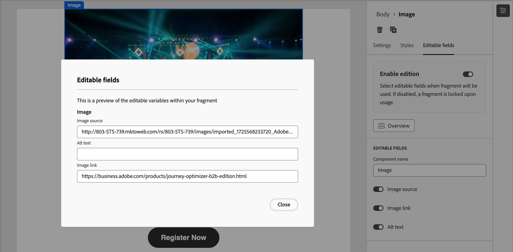

# Criação de fragmentos

Depois de [criar um fragmento](./fragments.md#create-fragments), use o espaço de design visual para criar os componentes de estrutura e conteúdo no fragmento.

## Adicionar estrutura e conteúdo {#design-fragment}

{{$include /help/_includes/content-design-components.md}}

## Adicionar ativos

{{$include /help/_includes/content-design-assets.md}}

## Navegar pelas camadas, configurações e estilos

{{$include /help/_includes/content-design-navigation.md}}

## Personalizar conteúdo

{{$include /help/_includes/content-design-personalization.md}}

## Conteúdo condicional

Para adicionar conteúdo condicional que adapta o conteúdo aos perfis direcionados com base em regras, selecione um componente de conteúdo e clique no botão **[!UICONTROL Habilitar conteúdo condicional]** na barra de ferramentas do componente. Quando o fragmento publicado é incluído em uma mensagem de email, as regras condicionais determinam a variante de um componente condicional que é renderizado na mensagem de email.

Para obter mais informações, consulte [_Conteúdo condicional_](./conditional-content.md).

## Ativar personalização de fragmentos

Quando um autor adiciona um fragmento a um [modelo de email](./email-authoring.md#content-authoring---use-visual-fragments) ou [modelo de email](./email-template-authoring.md#content-authoring---use-visual-fragments), o conteúdo do fragmento é bloqueado por padrão. Quaisquer alterações no fragmento publicado são propagadas automaticamente para todos os ativos de conteúdo nos quais o fragmento é usado. Quando você designa um parâmetro para um componente no fragmento como editável, o autor do email ou modelo pode especificar um valor de campo personalizado específico para suas necessidades. Esse sinalizador de personalização é limitado aos componentes visuais de imagem, texto e botão.

Por exemplo, se você criar um banner reutilizável que inclua um botão clicável, poderá designar o parâmetro de URL do botão como editável. Os autores de email podem usar um URL mais específico para a campanha de email. Com esses campos personalizáveis, os profissionais de marketing podem gerenciar e personalizar o conteúdo reutilizável sem a necessidade de criar blocos de conteúdo totalmente novos ou interromper as atualizações herdadas do fragmento original.

1. No editor de conteúdo visual, selecione a imagem, o texto ou o elemento de botão no qual deseja habilitar a personalização.

1. Nos detalhes do componente à direita, selecione a guia **[!UICONTROL Campos editáveis]**.

1. Clique na opção **[!UICONTROL Habilitar edição]** e defina os campos editáveis.

   {width="700" zoomable="yes"}

   Você pode ativar a personalização para os campos exibidos, que dependem do tipo de componente e dos parâmetros definidos no fragmento.

   Altere a alternância para um estado ativado para cada campo onde deseja permitir a personalização.

1. Clique em **[!UICONTROL Visão geral]** para revisar todos os campos editáveis e seus valores padrão.

   {width="700" zoomable="yes"}

1. Salve as alterações.

## Editar rastreamento de URL vinculado

{{$include /help/_includes/content-design-links.md}}
