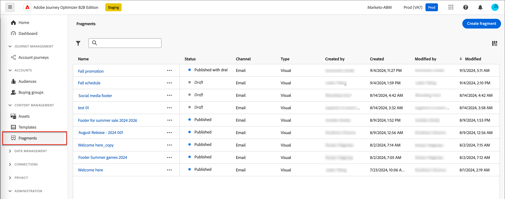
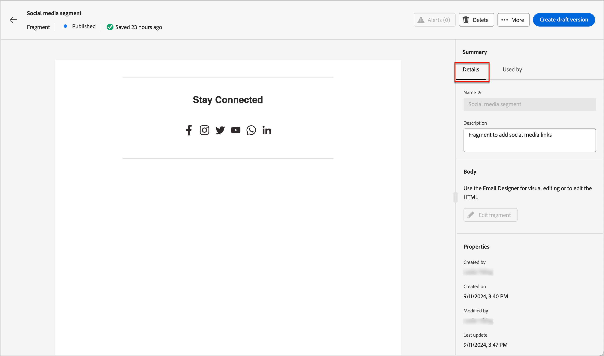

# Fragmentos

Um fragmento é um componente reutilizável que pode ser referenciado em um ou mais emails e modelos de email no Adobe Journey Optimizer B2B edition. Geralmente, é um bloco de conteúdo (texto, imagem ou ambos) que pode ser pré-criado e inserido rapidamente em um email ou modelo de email. Com essa funcionalidade, você pode pré-criar vários blocos de conteúdo personalizados para serem usados pelos membros da equipe de marketing para montar conteúdo de email a fim de oferecer um processo de design aprimorado. Casos de uso comuns incluem blocos de conteúdo de cabeçalho/rodapé para email, evento convidar banners e saudações sazonais.

>[!BEGINSHADEBOX]

**Fragmentos visuais**

Fragmentos visuais são blocos visuais predefinidos criados usando o visual conteúdo designer que você pode reutilizar em vários e-mails ou modelos de email. A escopo atual do Journey Optimizer B2B Edition e esta documentação são apenas de fragmentos visuais. Fragmentos baseados em expressão ainda não são suportados no Journey Optimizer B2B Edition.

>[!ENDSHADEBOX]

Para fazer o melhor uso dos fragmentos na workflows:

* _Criar seus próprios fragmentos_ - Criar fragmentos visuais, do zero ou salvando conteúdo como um fragmento do editor visual conteúdo.
* _Reutilizar fragmentos_ - Use-os quantas vezes forem necessárias em seu conteúdo.

## Acessar e gerenciar fragmentos

Para acessar fragmentos visuais no Adobe Journey Optimizer B2B edition, vá para a navegação à esquerda e clique em **[!UICONTROL Gerenciamento de Conteúdo]** > **[!UICONTROL Fragmentos]**. Essa ação abre uma página de listagem com todos os fragmentos criados na instância listada em uma tabela.

{width="700" zoomable="yes"}

A tabela é classificada pela coluna _[!UICONTROL Modificado]_, com os fragmentos atualizados mais recentemente na parte superior por padrão. Clique no título da coluna para alterar entre crescente e decrescente.

### Status do fragmento e ciclo de vida

O status do fragmento determina sua disponibilidade para uso em um email ou modelo de email e as alterações que você pode fazer nele.

| Status | Descrição |
| -------------------- | ----------- |
| Rascunho | Quando você cria um fragmento, ele está no status de rascunho. Ele permanece nesse status à medida que você define ou edita o conteúdo visual, até que você o publique para uso em um modelo de email ou de email. Ações disponíveis: <ul><li>Editar todos os detalhes<li>Editar no designer visual<li>Publicação<li>Duplicar<li>Excluir |
| Publicado | Ao publicar um fragmento, ele fica disponível para uso em um email ou template de email. O conteúdo do fragmento publicado não pode ser modificado no designer visual. Ações disponíveis: <ul><li>Edite a descrição<li>Adicionar a um email ou modelo<li>Criar versão de rascunho<li>Duplicar<li>Excluir (se não estiver em uso) |
| Publicado com rascunho | Quando você cria um rascunho de um fragmento publicado, a versão publicada permanece disponível para uso em um email ou modelo de email, e o rascunho conteúdo pode ser modificado no designer visual. Se você publicar a versão de rascunho, ela substitui a versão publicada atual e a conteúdo é atualizada nos modelos de e-mails e email onde está em uso. Ações disponíveis: <ul><li>Edite a descrição<li>Adicionar a um email ou modelo<li>Editar versão de rascunho no visual designer<li>Publish versão de rascunho<li>Duplicar<li>Excluir (se não estiver em uso) |

{zoomable="yes"}

>[!IMPORTANT]
>
>O status do fragmento foi introduzido na versão de agosto do Journey Optimizer B2B edition. Todos os fragmentos criados antes desta versão têm o status _Rascunho_, mesmo se forem usados em um email ou modelo. Se você fizer qualquer alteração nesses fragmentos, deverá publicar o fragmento para propagar as alterações.

### Filtrar a lista de fragmentos

Para pesquisar um fragmento por nome, insira uma string de texto na barra de pesquisa para uma correspondência. Clique no ícone _Filtro_ (  ) para mostrar as opções de filtro disponíveis e alterar as configurações para filtrar os itens exibidos de acordo com seus critérios especificados.

{width="700" zoomable="yes"}

### Personalizar a exibição da coluna

Personalize as colunas que deseja exibir na tabela clicando no ícone _Personalizar tabela_ (  ) na parte superior direita.

Na caixa de diálogo, selecione as colunas a serem exibidas e clique em **[!UICONTROL Aplicar]**.

{width="300"}

## Criar fragmentos

Você pode criar novos fragmentos visuais no Journey Optimizer B2B edition clicando em **[!UICONTROL Criar fragmento]** na parte superior direita.

1. Na caixa de diálogo _[!UICONTROL Criar fragmento]_, insira um **[!UICONTROL Nome]** e uma **[!UICONTROL Descrição]** úteis (opcional).

   Requisitos de fragmento:

   * Nome - máximo de 100 caracteres, deve ser exclusivo, sem distinção entre maiúsculas e minúsculas

   * Descrição - Máximo de 300 caracteres

   * São permitidos caracteres alfa, numérico e especiais

   * Caracteres reservados não são permitidos **__**:`\ / : * ? " < > |`

   {width="400"}

1. Clique em **[!UICONTROL Criar]**.

   O visual designer é aberto com uma tela vazia.

1. Use as ferramentas de design conteúdo para criar o fragmento visual conteúdo:

   * [Adicionar estrutura e conteúdo](./fragment-authoring.md#add-structure-and-content)
   * [Adicionar Assets](./fragment-authoring.md#add-assets)
   * [Navegue pelas camadas, configurações e estilos](./fragment-authoring.md#navigate-the-layers-settings-and-styles)
   * [Personalizar conteúdo](./fragment-authoring.md#personalize-content)
   * [Habilitar campos personalizados](./fragment-authoring.md#enable-fragment-customization)
   * [Editar rastreamento de URL vinculado](./fragment-authoring.md#edit-linked-url-tracking)

1. Clique em **[!UICONTROL Salvar]** a qualquer momento para salvar o fragmento de rascunho.

1. Quando estiver pronto para disponibilizar o fragmento para uso em um modelo de email ou email, clique em **[!UICONTROL Publicar]**.

## Exibir detalhes do fragmento

Clique no nome de qualquer fragmento na página da lista para abrir a página de detalhes do fragmento. Você pode optar por editar o fragmento, renomear o fragmento ou atualizar a descrição do fragmento. Faça atualizações e clique fora do campo de nome ou descrição para salvar automaticamente as alterações.

>[!NOTE]
>
>Se um fragmento publicado estiver sendo usado por um modelo de email ou de email, você não poderá alterar o nome ou editar o conteúdo. Você pode criar uma versão de rascunho se quiser fazer alterações no fragmento.

{width="600" zoomable="yes"}

Clique em **[!UICONTROL Editar fragmento]** para abrir o fragmento no editor de conteúdo visual.

Saia da exibição a qualquer momento clicando na seta _Voltar_ na parte superior esquerda, que o retorna à página da lista _Fragmentos_.

## Exibir fragmento usado por referências

Na página de detalhes do fragmento, clique na guia **[!UICONTROL Usado por]** para exibir detalhes sobre onde o fragmento é usado atualmente no Journey Optimizer B2B edition, em emails, modelos de email e fragmentos.

>[!IMPORTANT]
>
>Qualquer fragmento que esteja sendo usado atualmente por qualquer email ou modelo de email não pode ser excluído.

As referências são exibidas de acordo com categoria: _Email_ ou _Email modelo_. Os emails no Journey Optimizer B2B edition são incorporados e criados nas jornadas da conta, de modo que a jornada principal do email que usa o fragmento é exibida nas referências.

{width="600" zoomable="yes"}

Clique no link para abrir o email ou modelo de email correspondente onde o fragmento é usado.

## Excluir fragmentos

Qualquer fragmento que esteja sendo usado atualmente por qualquer email ou modelo de email não pode ser excluído, portanto, verifique as referências _usado por_ antes de iniciar a remoção de um fragmento. Além disso, uma remoção não pode ser desfeita, portanto, verifique antes de iniciar uma ação de exclusão.

É possível excluir um fragmento usando qualquer um dos seguintes métodos:

* Nos detalhes do fragmento à direita, clique **[!UICONTROL Excluir]**.
* Na lista Fragmentos que _[!UICONTROL lista página, clique nas elipses]_ ao lado do fragmento e escolha **[!UICONTROL Excluir]**.

Essa ação abre uma caixa de diálogo de confirmação. Você pode suspender o processo clicando **[!UICONTROL Cancelar]** ou clicar **[!UICONTROL em Excluir]** para confirmar a exclusão.

{width="400"}

Se o fragmento estiver em uso no momento, a ação abre uma caixa de diálogo informativa que alerta que ele não pode ser excluído. Clique **[!UICONTROL OK]**, que anula a ação de exclusão.

{width="400"}

## Editar fragmentos

As edições em um fragmento dependem do status atual:

* Quando um fragmento está no status _Rascunho_, é possível editar qualquer um de seus detalhes e o conteúdo visual.
* Quando um fragmento está no status _Publicado_, é possível editar a descrição do fragmento, mas não o nome. Não é possível editar o conteúdo visual.
* Quando um fragmento está no status _Publicado com rascunho_, a edição de detalhes fica limitada à descrição. Também é possível editar o conteúdo visual da versão de rascunho.

>[!BEGINTABS]

>[!TAB Rascunho]

1. Na página de listagem _[!UICONTROL Fragmentos]_, clique no nome do fragmento para abri-lo.

   Uma visualização do conteúdo visual é exibida, com os detalhes do fragmento à direita.

1. Modifique quaisquer detalhes, como nome e descrição.

   {width="600" zoomable="yes"}

1. Para fazer alterações no conteúdo no designer visual, clique em **[!UICONTROL Editar fragmento]**.

   Use as ferramentas do designer visual conforme necessário:

   * [Adicionar estrutura e conteúdo](./fragment-authoring.md#add-structure-and-content)
   * [Adicionar o Assets](./fragment-authoring.md#add-assets)
   * [Navegar pelas camadas, configurações e estilos](./fragment-authoring.md#navigate-the-layers-settings-and-styles)
   * [Personalizar conteúdo](./fragment-authoring.md#personalize-content)
   * [Habilitar campos personalizados](./fragment-authoring.md#enable-fragment-customization)
   * [Editar rastreamento de URL vinculado](./fragment-authoring.md#edit-linked-url-tracking)

   Clique em **[!UICONTROL Salvar]** ou **[!UICONTROL Salvar e fechar]** para retornar aos detalhes do fragmento.

1. Quando o fragmento atender aos seus critérios e você desejar disponibilizá-lo para uso em um email ou modelo de email, clique **[!UICONTROL Publish]**.

>[!TAB Publicado]

1. Na lista _[!UICONTROL Fragmentos que]_ lista página, clique no nome do fragmento para abri-lo.

   Uma pré-visualização do conteúdo visual é exibida, com os detalhes do fragmento à direita.

1. Modifique a descrição, se necessário.

   Para um fragmento publicado, todos os outros detalhes não podem ser alterados.

1. Se desejar atualizar a conteúdo, clique **[!UICONTROL Criar versão]** de rascunho na parte superior direita.

   Clique **[!UICONTROL OK]** na caixa de diálogo para abrir a versão de rascunho no visual designer.

   {width="300"}

   Use as ferramentas do visual designer conforme necessário:

   * [Adicionar estrutura e conteúdo](./fragment-authoring.md#add-structure-and-content)
   * [Adicionar o Assets](./fragment-authoring.md#add-assets)
   * [Navegar pelas camadas, configurações e estilos](./fragment-authoring.md#navigate-the-layers-settings-and-styles)
   * [Personalizar conteúdo](./fragment-authoring.md#personalize-content)
   * [Habilitar campos personalizados](./fragment-authoring.md#enable-fragment-customization)
   * [Editar rastreamento de URL vinculado](./fragment-authoring.md#edit-linked-url-tracking)

   Clique em **[!UICONTROL Salvar]** ou **[!UICONTROL Salvar e fechar]** para retornar aos detalhes do fragmento.

1. Quando o fragmento de rascunho atender aos seus critérios e você quiser disponibilizar as alterações para uso em um modelo de email ou email, clique em **[!UICONTROL Publicar]**.

   Ao publicar a versão de rascunho, ela substitui a versão publicada atual e o conteúdo é atualizado nos emails e templates de email em que já está em uso.

>[!TAB Publicado com rascunho]

Há duas maneiras de abrir a versão de rascunho para edição na página de listagem _[!UICONTROL Fragmentos]_:

* Clique no ícone _Mais_ (**...**) ao lado do nome do fragmento e escolha **[!UICONTROL Abrir versão de rascunho]**.

  {width="300"}

* Clique no nome do fragmento para abri-lo. Em seguida, clique em **[!UICONTROL Abrir versão de rascunho]** na parte superior direita.

  Uma visualização do conteúdo visual da versão de rascunho é exibida, com os detalhes do fragmento à direita.

Para atualizar o conteúdo:

1. Clique **[!UICONTROL Editar fragmento]** na parte superior direita. Use as ferramentas do designer visual conforme necessário:

   * [Adicionar estrutura e conteúdo](./fragment-authoring.md#add-structure-and-content)
   * [Adicionar o Assets](./fragment-authoring.md#add-assets)
   * [Navegar pelas camadas, configurações e estilos](./fragment-authoring.md#navigate-the-layers-settings-and-styles)
   * [Personalizar conteúdo](./fragment-authoring.md#personalize-content)
   * [Habilitar campos personalizados](./fragment-authoring.md#enable-fragment-customization)
   * [Editar rastreamento de URL vinculado](./fragment-authoring.md#edit-linked-url-tracking)

   Clique em **[!UICONTROL Salvar]** ou **[!UICONTROL Salvar e fechar]** para retornar aos detalhes do fragmento.

1. Quando o fragmento de rascunho atender aos seus critérios e você quiser disponibilizar as alterações para uso em um modelo de email ou email, clique em **[!UICONTROL Publicar]**.

   Ao publicar a versão de rascunho, ela substitui a versão publicada atual e o conteúdo é atualizado nos emails e templates de email em que já está em uso.

>[!ENDTABS]

## Duplicar fragmentos

É possível duplicar um fragmento usando um dos seguintes métodos:

* Na página de listagem _[!UICONTROL Fragmentos]_, clique no ícone _Mais_ (**...**) ao lado do nome do fragmento e escolha **[!UICONTROL Duplicar]**.
* Na parte superior direita da página de detalhes do fragmento, clique em **[!UICONTROL ... Mais]** e escolha **[!UICONTROL Duplicar]**.

{width="600" zoomable="yes"}

Na caixa de diálogo do, digite um nome útil (exclusivo) e uma descrição. Clique em **[!UICONTROL Duplicar]** para concluir a ação.

{width="400"}

O fragmento duplicado (novo) aparece na listagem _Fragmentos_.

## Salvar um novo fragmento do conteúdo do email ou do modelo

Ao criar/editar um modelo de email ou de email no editor de conteúdo visual, você pode optar por salvar todo o conteúdo ou partes dele como um fragmento para que ele fique disponível para reutilização.

1. Quando tiver conteúdo a ser salvo como fragmento, clique em **[!UICONTROL Mais]** e escolha **[!UICONTROL Salvar como fragmento]**.

1. Selecione os diferentes elementos a serem incluídos no fragmento.

   Selecione várias estruturas mantendo pressionado o botão Shift ou Control.

   Você só pode selecionar estruturas adjacentes entre si e a interface não permite selecionar elementos não adjacentes.

1. Com o conteúdo selecionado, clique em **[!UICONTROL Criar]** na parte superior direita.

1. Na caixa de diálogo, insira um nome e uma descrição úteis para o fragmento. Depois clique em **[!UICONTROL Criar]**.

   O novo fragmento é exibido na página de listagem _Fragmentos_ e também está disponível para uso em emails e modelos de email.

## Adicionar fragmentos visuais ao conteúdo do email ou modelo

Os fragmentos são projetados para reutilização e podem ser inseridos para criação de template de email e email. Você pode adicionar até 30 fragmentos em um email ou modelo. Os fragmentos podem ser aninhados somente até um nível.

>[!BEGINTABS]

>[!TAB Adicionar fragmentos a um email]

1. Navegue até **[!UICONTROL Jornadas de conta]** e abra uma jornada existente ou crie uma nova jornada.

1. Criar um nó enviar email[__.](./email-authoring.md#add-an-email-action-in-an-account-journey)

1. Criar ou edite [conteúdo de email do nó](./email-authoring.md#create-the-email-content).

1. Arraste e solte um item do **[!UICONTROL menu Componentes]** para fornecer uma _estrutura_ para o fragmento.

1. Para abrir a listagem de fragmentos publicados, clique no ícone _Fragmentos_.

   É possível:
   * Classifique a listagem.
   * Procure, pesquisa e filtre a listagem.
   * Alternar entre exibições de cartão (miniatura) e lista.
   * Atualizar o lista para refletir qualquer um dos fragmentos criados recentemente.

   {width="600"}

1. Arraste e solte qualquer um dos fragmentos no espaço reservado do componente de estrutura.

   O editor renderiza o fragmento na seção/elemento da estrutura de email.

O conteúdo do fragmento é atualizado dinamicamente na estrutura para renderizar um visual de como o conteúdo aparece no email.

>[!TIP]
>
>Se quiser que o fragmento ocupe todo o layout horizontal no email, adicione uma estrutura de coluna [!UICONTROL 1:1] e arraste e solte o fragmento nele.

Depois que o email for salvo, ele aparecerá na página de detalhes do fragmento quando a guia _[!UICONTROL Usado por]_ for selecionada. Os fragmentos adicionados a um email não podem ser editados no email ou no modelo — o fragmento de origem publicado define o conteúdo.

>[!TAB Adicionar fragmentos a um modelo de email]

1. Na navegação à esquerda, clique em **[!UICONTROL Gerenciamento de Conteúdo]** > **[!UICONTROL Modelos]**.

1. Crie um novo modelo ou abra um modelo de email existente e clique em **[!UICONTROL Editar Modelo de Email]**.

1. Arraste e solte um item do menu **[!UICONTROL Componentes]** para fornecer uma _estrutura_ para o fragmento.

1. Para abrir a lista de fragmentos, clique no ícone _Fragmentos_.

   É possível:
   * Classifique a listagem.
   * Procurar, pesquisar e filtrar a listagem.
   * Alternar entre as visualizações de cartão (miniatura) e de lista.
   * Atualize a lista para refletir qualquer um dos fragmentos criados recentemente.

   {width="600"}

1. Arraste e solte qualquer um dos fragmentos no espaço reservado do componente de estrutura.

   O editor renderiza o fragmento na seção/elemento da estrutura do modelo de email.

1. Arraste e solte qualquer um dos fragmentos no espaço reservado do componente de estrutura.

   O editor renderiza o fragmento na seção/elemento da estrutura do modelo de email.

>[!TIP]
>
>Se quiser que o fragmento ocupe todo o layout horizontal no modelo de email, adicione uma estrutura de coluna _[!UICONTROL 1:1]_ e arraste e solte o fragmento nele.

Depois que o modelo de email é salvo, ele aparece na página de detalhes do fragmento quando a guia _[!UICONTROL Usado por]_ é selecionada. Os fragmentos adicionados a um modelo de email não são editáveis no modelo — o fragmento de origem publicado define o conteúdo.

>[!ENDTABS]

## Fragmentar as ações durante o email e a criação do modelo

Quando um fragmento é adicionado a um email ou modelo de email, o conteúdo do fragmento não pode ser editado no email ou modelo. No entanto, você pode aplicar as seguintes ações:

* **[!UICONTROL Excluir]** - Esta ação remove o fragmento do conteúdo do email ou do modelo de email atual (a origem do fragmento não é afetada).
* **[!UICONTROL Atualizar]** - Esta ação atualiza o conteúdo do fragmento no email ou modelo de email atual. Atualizar é útil quando você deseja refletir qualquer edição recente no fragmento após a adição ao email ou modelo de email.
* **[!UICONTROL Duplicar]** - Esta ação duplica o fragmento no mesmo email ou modelo de email no editor, com as mesmas dimensões e adicionada logo abaixo dele.
* **[!UICONTROL Abrir fragmento]** - Essa ação abre uma nova guia do navegador com a página e os detalhes do editor de fragmento.
* **[!UICONTROL Interromper herança]** - Esta ação interrompe a herança do fragmento (e suas alterações) da origem. Use esta ação para disponibilizar o conteúdo do fragmento como conteúdo independente e editável no modelo de email ou de email. Esta ação também remove o email ou o modelo de email da referência _Usado por_ do fragmento original.

Quando você seleciona o fragmento na página do editor, essas ações estão disponíveis na barra de ferramentas de contexto e no painel de propriedades à direita.

{width="600" zoomable="yes"}
