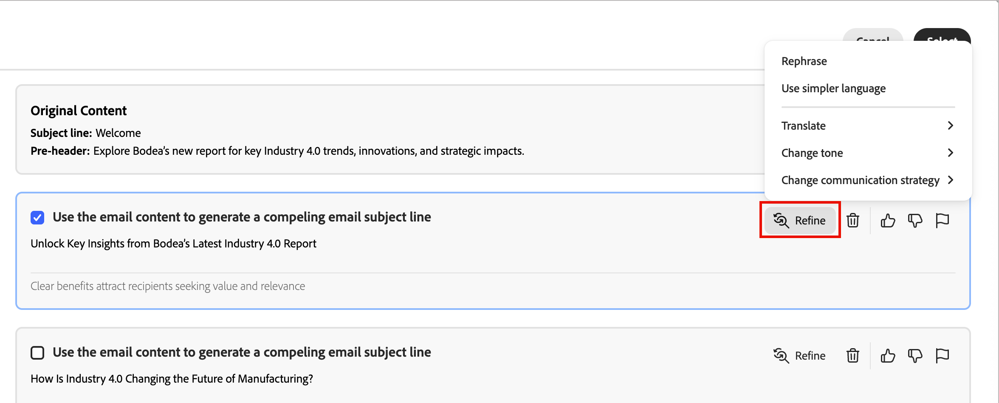
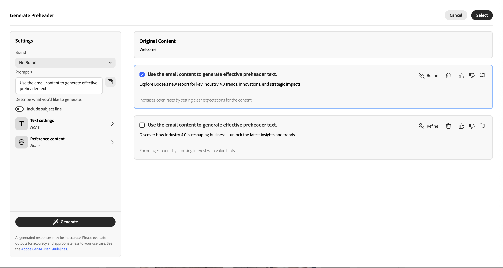
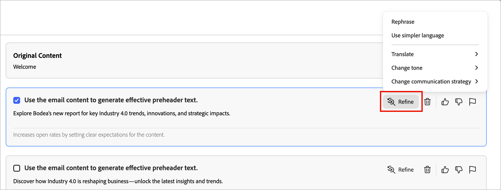
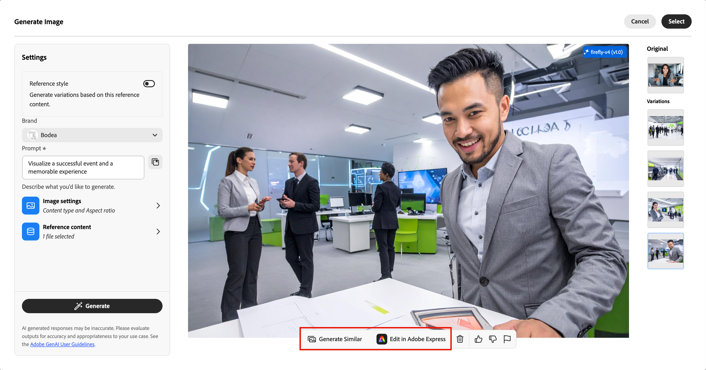
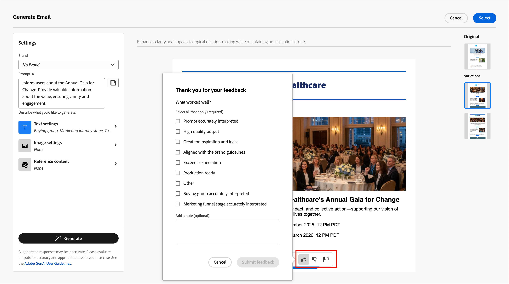

# Gerar conteúdo de email

À medida que o setor de marketing se torna mais competitivo, as marcas buscam maneiras eficientes de gerar conteúdo impactante. O [!DNL Adobe Journey Optimizer B2B Edition] inclui a geração de conteúdo habilitado por IA que ajuda os profissionais de marketing a criar conteúdo de email profissional consistente com a marca. Com modelos avançados de IA gerativa e profunda compreensão das diretrizes da marca, ele gera automaticamente conteúdo personalizado, envolvente e eficaz. Ele usa seu objetivo de marketing e otimiza o conteúdo para estilos, layouts, tons e muito mais. O uso dessas ferramentas torna a criação e a execução de campanhas de marketing por email intuitivas, simples e eficientes. Adicionar esse recurso aos workflows pode economizar tempo, melhorar a eficiência e gerar melhores resultados.

Esse novo recurso fornece geração de conteúdo com base em prompts para geração completa de email ou direcionada a componentes estruturais de email. Para imagens, você pode gerar novos ativos de imagem ou gerar recomendações no catálogo de imagens no ativo de marca de entrada. Você também pode usar esse recurso para gerar linhas de assunto e pré-cabeçalhos ideais para afetar a taxa de abertura do email.

>[!PREREQUISITES]
>
>Para acessar esses recursos no Adobe Journey Optimizer B2B edition, você deve ter a permissão _[!UICONTROL Assistente de IA]_ > _[!UICONTROL Gerar conteúdo]_. Para obter mais informações sobre como um administrador de produto pode conceder permissões de recursos, consulte [Editar funções para permissões de produto](../admin/user-management.md#edit-roles-for-product-permissions).

## Diretrizes e limitações

Antes de começar a usar esse recurso, reveja as [diretrizes e limitações](./generative-ai-content.md#general-guidelines-and-limitations). A aceitação do [Contrato de usuário](https://www.adobe.com/br/legal/licenses-terms/adobe-gen-ai-user-guidelines.html){target="_blank"} também é necessária para que você possa usar os recursos de IA no [!DNL Journey Optimizer B2B Edition]. Para obter mais informações, entre em contato com o seu representante da Adobe.

A Adobe aplica [credenciais de conteúdo](https://helpx.adobe.com/br/firefly/web/get-started/learn-the-basics/content-credentials-overview.html){target="_blank"} aos ativos gerados pela Firefly após o download ou a exportação para promover a transparência.

As limitações e diretrizes a seguir aplicam-se à geração de conteúdo de email em [!DNL Journey Optimizer B2B Edition]:

* O único idioma suportado é o inglês.
* O conteúdo gerado pode não ser preciso — compartilhe seu feedback para que os engenheiros da Adobe possam refinar os modelos.
* Você pode fazer upload de vários ativos de referência de conteúdo, mas pode aproveitar apenas um para uma geração específica.
* Use um modelo específico da marca ou personalizado para gerar conteúdo para um email completo. São recomendados modelos de e-mail com até 8 a 10 imagens.
* Relate quaisquer saídas problemáticas usando a miniatura para cima, a miniatura para baixo ou os ícones de sinalizador ao selecionar variantes geradas.

## Entrada e configurações para geração de conteúdo

Você pode gerar conteúdo completo para um email ou para componentes selecionados no email. Ao usar as ferramentas de geração de conteúdo, você fornece prompts, conteúdo de referência e configurações para texto e imagens.

### Prompts

Use prompts bem definidos para que o modelo de IA gerativa seja interpretado com precisão. O objetivo/prompt de marketing fornecido afeta a qualidade do conteúdo gerado.

{width="320"}

Para obter mais informações sobre como criar prompts efetivos, consulte _[Práticas recomendadas para prompts](./generative-ai-content.md#generative-ai-prompting-guide)_.

>[!BEGINSHADEBOX]

#### Biblioteca de Prompts

Um prompt eficaz é essencial para gerar o melhor conteúdo possível. Se quiser ajuda para criar seu prompt, clique no ícone da _Biblioteca de Prompts_  para acessar uma biblioteca de ideias de prompt organizadas de acordo com os objetivos. Digite texto no campo de pesquisa para localizar um prompt com base em uma string de palavra-chave.

{width="600" zoomable="no"}

Selecione o prompt que melhor reflete suas metas e clique em **[!UICONTROL Tentar este Prompt]**. No campo _[!UICONTROL Prompt]_, substitua os espaços reservados (como `[Key Feature/Information]`) pelos detalhes da sua marca, oferta, campanha e caso de uso.

>[!ENDSHADEBOX]

### Configurações de texto

Expanda as **[!UICONTROL Configurações de texto]** no painel direito e defina as opções para o texto gerado.

* **[!UICONTROL Grupo de compras]** - Escolha a [função de grupo de compras](../buying-groups/buying-groups-role-templates.md) a ser usada para direcionar suas mensagens. O [!DNL Journey Optimizer B2B Edition] oferece cinco funções de grupo de compra B2B padrão pré-configuradas. Cada função de grupo de compras tem um foco de mensagem distinto:

  | Função | Foco da mensagem |
  | ---- | --------------- |
  | Comitê Diretor Executivo | Informações do produto  Preços  Detalhes da integração técnica  Recursos e funções do produto |
  | Influenciador | Prova de qualidade  Facilidade de implementação  Experiência no assunto  Vantagens competitivas |
  | Tomador de decisão | Retorno do investimento  Valor financeiro (ROI)  Histórias de clientes |
  | Profissional | Facilidade de uso  Recursos e funcionalidade do produto  Compatibilidade do produto  Facilidade de integração do produto |
  | Campeão | Conteúdo educacional  Conteúdo de liderança de pensamento  Histórias de clientes |

* **[!UICONTROL Estágio da jornada de marketing]** - Escolha o [estágio de grupo de compras](../buying-groups/buying-group-stages.md) para usar para direcionar as mensagens.
* **[!UICONTROL Estratégia de comunicação]** - Escolha o estilo de comunicação mais adequado para o texto gerado.
* **[!UICONTROL Idioma]** - Escolha o idioma do conteúdo gerado.
* **[!UICONTROL Tom]** - O tom que repercute em seu público-alvo. Por exemplo, você pode ajustar a mensagem para soar informativa, divertida ou persuasiva.

{width="350" zoomable="yes"}

Clique na seta à esquerda para retornar às _[!UICONTROL Configurações]_ principais.

### Configurações da imagem

Para incluir imagens em seu conteúdo gerado, expanda as **[!UICONTROL Configurações de imagem]** no painel direito e defina as opções.

Por padrão, o sistema desabilita a opção **[!UICONTROL Gerar imagens usando IA]**. Habilite esse recurso e defina as seguintes opções para incluir imagens geradas nas variações de conteúdo propostas:

* **[!UICONTROL Modelo gerativo]**: selecione entre o modelo pronto para uso fornecido pela Adobe, o modelo de parceiro para recursos especializados ou modelos personalizados configurados e treinados nos ativos da sua marca. Para obter mais informações sobre modelos gerativos, consulte _[Modelos de IA gerativa para alinhamento de marca](generative-ai-models.md)_.
* **[!UICONTROL Taxa de proporção]**: quando um componente de imagem é selecionado, esta configuração determina a largura e a altura do ativo. Escolha entre as taxas comuns, como 16:9, 4:3, 3:2 ou 1:1, ou insira uma taxa personalizada.
* **[!UICONTROL Tipo de conteúdo]**: o tipo categoriza a natureza do elemento visual, distinguindo entre diferentes formas de representação visual, como fotos, gráficos ou arte.
* **[!UICONTROL Intensidade visual]**: controle o impacto da imagem ajustando sua intensidade. Uma configuração mais baixa (como 2) cria uma aparência mais suave e restrita, enquanto uma configuração mais alta (como 10) torna a imagem mais vibrante e visualmente poderosa.
* **[!UICONTROL Cor e tom]**: a aparência geral das cores em uma imagem e o humor ou atmosfera que ela transmite.
* **[!UICONTROL Iluminação]**: o estilo de iluminação usado para a imagem, que molda sua atmosfera e realça elementos específicos.
* **[!UICONTROL Composição]**: a disposição dos elementos dentro do quadro de uma imagem.

{width="350" zoomable="yes"}

Clique na seta à esquerda para retornar às _[!UICONTROL Configurações]_ principais.

### Conteúdo de referência

Faça upload de ativos de conteúdo de referência para gerar conteúdo preciso sobre a marca. Caso contrário, o conteúdo gerado será baseado em informações publicamente disponíveis. O conteúdo de referência serve como fonte para a geração de conteúdo e recomendações de imagem. Para obter diretrizes e práticas recomendadas, consulte _[Conteúdo de referência otimizado](./generative-ai-content.md#reference-content)_.

Nas configurações de **[!UICONTROL Conteúdo de referência]**, clique em **[!UICONTROL Carregar arquivo]** para adicionar qualquer ativo que contenha conteúdo que você deseja usar para contexto adicional.

{width="350" zoomable="yes"}

O arquivo a ser carregado pode estar nos seguintes formatos: PDF, JPEG, PNG ou ZIP (contendo formatos de arquivo compatíveis). O tamanho máximo para um ativo de marca carregado é de 50 MB. Arquivos maiores ou um grande número de imagens podem funcionar, mas isso aumenta o tempo de processamento.

Se quiser selecionar um arquivo carregado anteriormente, expanda a lista **[!UICONTROL Conteúdo de referência carregado]** e habilite o ativo que deseja usar para a geração de conteúdo.

{width="350" zoomable="yes"}

## Gerar propriedades de email

Ao [adicionar uma ação de email](./add-email.md#add-an-email-action-node-in-a-journey) a uma jornada de conta, você define um conjunto de propriedades de email que são usadas para enviar o email. As ferramentas de IA gerativa podem ajudar a melhorar o engajamento no email, gerando o conteúdo recomendado para a **_linha de assunto_** e o **_pré-cabeçalho_** do email.

Ao criar um email a partir de uma jornada ou abrir um email existente a partir de um nó de jornada, a página de visualização de email é exibida com as _[!UICONTROL Propriedades de email]_ à direita. Na guia _[!UICONTROL Resumo]_, você pode usar as ferramentas de geração de conteúdo para gerar uma linha de assunto, um pré-cabeçalho ou ambos.

>[!BEGINTABS]

>[!TAB Geração da linha de assunto]

As etapas a seguir descrevem a sequência de tarefas para gerar uma linha de assunto otimizada para seu email:

1. No painel _Resumo_ com a guia _Detalhes_ selecionada, role até o campo **[!UICONTROL Linha de assunto]**.

1. Clique no ícone _Gerar conteúdo_ ( {width="30"} ) à direita do campo.

   {width="600" zoomable="yes"}

   A caixa de diálogo _[!UICONTROL Gerar Linha de Assunto]_ é aberta com as configurações de geração da linha de assunto do email.

1. (Obrigatório) No campo **[!UICONTROL Prompt]**, digite uma descrição do que deseja gerar.

   Use a [Biblioteca de Prompts](#prompt-library) se precisar de ajuda para criar um prompt eficaz.

1. (Opcional) Para fornecer informações adicionais para gerar o pré-cabeçalho, complete as configurações de orientação de conteúdo:

   * [**[!UICONTROL Configurações de texto]**](#text-settings) - Fornece orientação para o conteúdo de texto gerado.
   * [**[!UICONTROL Conteúdo de referência]**](#reference-content) - Forneça o ativo de conteúdo que serve como fonte para a geração de conteúdo.

1. Quando o prompt e as configurações estiverem prontos, clique em **[!UICONTROL Gerar]**.

   As variantes geradas são exibidas na caixa de diálogo.

   {width="600" zoomable="yes"}

1. Role o painel _Gerar conteúdo_ e navegue pelas variações geradas para determinar qual é a mais adequada.

   Você pode [enviar comentários](#submit-variation-feedback) sobre uma variante gerada clicando no ícone de _Polegar para Cima_, _Polegar para Baixo_ ou _Sinalizar_ e escolhendo o motivo que melhor resume seus comentários.

1. Clique na opção **[!UICONTROL Refinar]** para acessar recursos de personalização adicionais:

   * **[!UICONTROL Refrase]** - Reescreva a mensagem preservando seu significado. Essa opção ajuda a gerar texto alternativo ou ajustar o estilo sem alterar a mensagem principal.

   * **[!UICONTROL Usar linguagem mais simples]** - Simplifique a linguagem, garantindo clareza e acessibilidade para um público-alvo maior.

   * **[!UICONTROL Traduzir]** - Traduza o texto para outro idioma. (Atualmente, o único idioma suportado é o inglês. Outros idiomas estão planejados para versões futuras.)

   * **[!UICONTROL Alterar tom]** - Ajuste o tom da mensagem para alinhá-la ao seu estilo de comunicação, tornando-a mais amigável, profissional, urgente ou inspiradora.

   * **[!UICONTROL Alterar estratégia de comunicação]** - Modifique a abordagem de mensagens com base em seus objetivos, como criar urgência ou enfatizar o apelo convincente.

   {width="600" zoomable="yes"}

1. Clique em **[!UICONTROL Selecionar]** para substituir o texto da linha de assunto pela variante selecionada e retornar às propriedades de email.

>[!TAB Geração de pré-cabeçalho]

Um pré-cabeçalho de email é o texto curto de resumo que segue a linha de assunto quando um email é visualizado na caixa de entrada. É um elemento opcional de um email, mas uma oportunidade eficaz para melhorar o engajamento. As etapas a seguir descrevem a sequência de tarefas para gerar um pré-cabeçalho otimizado para o seu email:

1. No painel _Resumo_ com a guia _Detalhes_ selecionada, role para baixo e marque a caixa de seleção **[!UICONTROL Pré-cabeçalho]**.

   {width="600" zoomable="yes"}

   A caixa de diálogo _[!UICONTROL Gerar pré-cabeçalho]_ é aberta com as configurações de geração do pré-cabeçalho de email.

1. (Obrigatório) No campo **[!UICONTROL Prompt]**, digite uma descrição do que deseja gerar.

   Use a [Biblioteca de Prompts](#prompt-library) se precisar de ajuda para criar um prompt eficaz.

1. (Opcional) Para fornecer informações adicionais para gerar o pré-cabeçalho, complete as configurações de orientação de conteúdo:

   * [**[!UICONTROL Configurações de texto]**](#text-settings) - Fornece orientação para o conteúdo de texto gerado.
   * [**[!UICONTROL Conteúdo de referência]**](#reference-content) - Forneça o ativo de conteúdo que serve como fonte para a geração de conteúdo.

1. Quando o prompt e as configurações estiverem prontos, clique em **[!UICONTROL Gerar]**.

   As variantes geradas são exibidas na caixa de diálogo.

   {width="600" zoomable="yes"}

1. Role para baixo no painel _Gerar conteúdo_ e navegue pelas variações geradas para determinar qual é a mais adequada.

   Você pode [enviar comentários](#submit-variation-feedback) sobre uma variante gerada clicando no ícone de _Polegar para Cima_, _Polegar para Baixo_ ou _Sinalizar_ e escolhendo o motivo que melhor resume seus comentários.

1. Clique na opção **[!UICONTROL Refinar]** para acessar recursos de personalização adicionais:

   * **[!UICONTROL Refrase]** - Reescreva a mensagem preservando seu significado. Essa opção ajuda a gerar texto alternativo ou ajustar o estilo sem alterar a mensagem principal.

   * **[!UICONTROL Usar linguagem mais simples]** - Simplifique a linguagem, garantindo clareza e acessibilidade para um público-alvo maior.

   * **[!UICONTROL Traduzir]** - Traduza o texto para outro idioma. (Atualmente, o único idioma suportado é o inglês. Outros idiomas estão planejados para versões futuras.)

   * **[!UICONTROL Alterar tom]** - Ajuste o tom da mensagem para alinhá-la ao seu estilo de comunicação, tornando-a mais amigável, profissional, urgente ou inspiradora.

   * **[!UICONTROL Alterar estratégia de comunicação]** - Modifique a abordagem de mensagens com base em seus objetivos, como criar urgência ou enfatizar um apelo interessante.

   {width="500" zoomable="yes"}

1. Clique em **[!UICONTROL Selecionar]** para substituir o pré-cabeçalho pela variante selecionada e retornar às propriedades de email.

>[!ENDTABS]

## Gerar conteúdo do corpo do email {#generative-ai-email-design}

Depois de [criar e personalizar seu email](./email-authoring.md), use as ferramentas generativas de IA da Adobe para melhorar o conteúdo do corpo do email.

No espaço de design de email, as ferramentas de IA gerativas podem ajudar você a otimizar o impacto de seus deliveries, gerando o corpo completo do email, o conteúdo de texto direcionado e as imagens que refletem no seu público-alvo. Essa otimização de suas campanhas de email foi projetada para produzir um melhor engajamento. Selecione a opção _Gerar conteúdo_ ( {width="25" zoomable="no"} ) para exibir as ferramentas de geração de conteúdo disponíveis para a seleção de conteúdo atual.

{width="600" zoomable="yes"}

Use as seguintes etapas de acordo com o tipo de geração de conteúdo de email que você deseja usar:

>[!BEGINTABS]

>[!TAB Geração de email completa]

Para gerar um email completo refinando um template de email existente, siga estas etapas:

1. Depois de [criar o email](./add-email.md), clique em **[!UICONTROL Editar conteúdo do email]**.

1. Selecione um modelo.

   A geração de conteúdo completo requer um modelo. Pode ser um modelo padrão fornecido pelo Adobe ou um modelo salvo. Você também pode usar a opção _[!UICONTROL Importar HTML]_ para importar um modelo.

   Para obter mais informações sobre como usar um modelo de email, consulte _[Selecionar um modelo](./email-authoring.md#select-a-template)_.

1. No espaço de design de email, clique no ícone _Gerar conteúdo_ ( {width="25"} ) à direita.

   As configurações à direita refletem _Gerar Email_.

   {width="600" zoomable="yes"}

1. Selecione sua **[!UICONTROL Marca]** para garantir que o conteúdo gerado pela IA esteja alinhado às especificações da sua marca.

   Se não houver marcas publicadas, clique em **[!UICONTROL Criar uma marca]** para definir suas [diretrizes de marca reutilizáveis](./brands-overview.md).

1. No campo **[!UICONTROL Prompt]**, insira uma descrição do que você deseja gerar.

   Use a [Biblioteca de Prompts](#prompt-library) se precisar de ajuda para criar um prompt eficaz.

   >[!TIP]
   >
   >Se você nunca solicitou o conteúdo gerado, reveja as _[Práticas recomendadas de solicitação](./generative-ai-content.md#generative-ai-prompting-guide)_.

1. Para personalizar o conteúdo gerado, conclua as configurações de orientação de conteúdo:

   * [**[!UICONTROL Configurações de texto]**](#text-settings) - Fornece orientação para o conteúdo de texto gerado.
   * [**[!UICONTROL Configurações de imagem]**](#image-settings) - Se quiser incluir imagens no conteúdo gerado, habilite a geração de imagens e forneça orientações.
   * [**[!UICONTROL Conteúdo de referência]**](#reference-content) - Forneça o ativo de conteúdo que serve como fonte para a geração de conteúdo.

1. Quando o prompt e as configurações estiverem prontos, clique em **[!UICONTROL Gerar]**.

   As variações geradas são exibidas no painel direito.

1. Navegue pelas variações geradas ou clique no ícone _Tela cheia_ (  ) para abrir a caixa de diálogo _[!UICONTROL Gerar email]_.

   A caixa de diálogo fornece espaço adicional para comparar as variações, ajustar o texto e as configurações de conteúdo de referência (se necessário) e gerar novamente as variações.

   Você também pode ajustar uma variação aplicando ações de refinamento e enviando feedback para as variações geradas. Consulte _[Visualização e refinamento de conteúdo](#refine-finalize)_ para obter mais detalhes sobre refinamento de variação e feedback.

   {width="700" zoomable="yes"}

1. Clique em **[!UICONTROL Selecionar]** para substituir o conteúdo do modelo pela variante selecionada e retornar ao espaço de design de email.

   Você pode usar as ferramentas de edição e formatação na tela para alterar o conteúdo gerado, bem como as opções _[!UICONTROL Configurações]_ e _[!UICONTROL Estilo]_ à direita.

>[!TAB Somente texto]

Para refinar ou aprimorar o conteúdo de texto de um email existente, siga estas etapas:

1. No espaço de design de email, selecione um componente _Texto_ para direcionar o conteúdo específico.

1. No painel externo do painel direito, selecione o ícone _Gerar conteúdo_ ( {width="25"} ).

   As configurações à direita refletem as configurações de geração de conteúdo para o componente de texto.

1. Selecione sua **[!UICONTROL Marca]** para garantir que o conteúdo gerado pela IA esteja alinhado às especificações da sua marca.

   Se não houver marcas publicadas, clique em **[!UICONTROL Criar uma marca]** para [definir suas diretrizes de marca reutilizáveis](./brands-overview.md).

1. No campo **[!UICONTROL Prompt]**, insira uma descrição do que você deseja gerar.

   {width="600" zoomable="yes"}

   Use a [Biblioteca de Prompts](#prompt-library) se precisar de ajuda para criar um prompt eficaz.

1. Para personalizar o conteúdo gerado, conclua as configurações de orientação de conteúdo:

   * [**[!UICONTROL Configurações de texto]**](#text-settings) - Fornece orientação para o conteúdo de texto gerado.

   * [**[!UICONTROL Conteúdo de referência]**](#reference-content) - Forneça os ativos de conteúdo que servem como origem para a geração de conteúdo.

1. Quando o prompt e as configurações estiverem prontos, clique em **[!UICONTROL Gerar]**.

1. Navegue pelas variações geradas ou clique no ícone _Tela cheia_ (  ) para abrir a caixa de diálogo _[!UICONTROL Gerar texto]_.

   A caixa de diálogo fornece espaço adicional para comparar as variações, ajustar o texto e as configurações de conteúdo de referência (se necessário) e gerar novamente as variações.

   Você também pode ajustar uma variação aplicando ações de refinamento e enviando feedback para as variações geradas. Consulte _[Visualização e refinamento de conteúdo](#preview-and-refine-the-content)_ para obter mais detalhes sobre refinamento de variação e feedback.

   {width="700" zoomable="yes"}

1. Quando tiver o conteúdo desejado, clique em **[!UICONTROL Selecionar]** para substituir o texto pela variante selecionada e retornar ao espaço de design de email.

   Você pode usar as ferramentas de edição e formatação da tela para alterar o texto, bem como as opções de _[!UICONTROL Configurações]_ e _[!UICONTROL Estilo]_ à direita.

>[!TAB Somente imagem]

Para refinar ou aprimorar o conteúdo de imagem de um email existente, siga estas etapas:

1. No espaço de design de email, selecione um componente de _Imagem_ para direcionar o conteúdo específico.

1. No painel externo do painel direito, selecione o ícone _Gerar conteúdo_ ( {width="25"} ).

   As configurações à direita refletem as configurações de geração do componente de imagem.

1. Selecione sua **[!UICONTROL Marca]** para garantir que o conteúdo gerado pela IA esteja alinhado às especificações da sua marca.

   Se não houver marcas publicadas, clique em **[!UICONTROL Criar uma marca]** para [definir suas diretrizes de marca reutilizáveis](./brands-overview.md).

1. Insira uma descrição do que você deseja no campo **[!UICONTROL Prompt]**.

   {width="600" zoomable="yes"}

   Use a [Biblioteca de Prompts](#prompt-library) se precisar de ajuda para criar um prompt eficaz.

1. Para personalizar o conteúdo gerado, conclua as configurações de orientação de conteúdo:

   * [**[!UICONTROL Configurações de imagem]**](#image-settings) - Se quiser incluir imagens no conteúdo gerado, habilite a geração de imagens e use as configurações de orientação.

   * [**[!UICONTROL Conteúdo de referência]**](#reference-content) - Forneça os ativos de conteúdo que servem como origem para a geração de conteúdo.

1. Quando estiver satisfeito com seu prompt e suas configurações, clique em **[!UICONTROL Gerar]**.

   O sistema processa a solicitação e gera as imagens mais adequadas com base no prompt e em outras entradas.

   >[!IMPORTANT]
   >
   >Se não houver imagens no conteúdo de referência ou se não houver imagens relevantes para o prompt de entrada, a saída estará vazia.

1. Navegue pelas variações geradas ou clique no ícone _Tela cheia_ (  ) para abrir a caixa de diálogo _[!UICONTROL Gerar imagem]_.

   A caixa de diálogo fornece espaço adicional para comparar as variações, ajustar a imagem e as configurações de conteúdo de referência (se necessário) e gerar novamente as variações.

   Você pode selecionar uma variação e clicar em **[!UICONTROL Gerar semelhante]** para gerar imagens adicionais semelhantes à variante selecionada. Ou clique em **[!UICONTROL Editar no Adobe Express]** para fazer suas próprias alterações na imagem. Consulte [Ações rápidas no Adobe Express](./image-edit-adobe-express.md#quick-actions-in-adobe-express) para obter mais informações sobre como usar o Adobe Express para refinar suas imagens.

   {width="700" zoomable="yes"}

   Você também pode [enviar comentários](#submit-variation-feedback) sobre as variações geradas.

1. Realce a imagem desejada e clique em **[!UICONTROL Selecionar]** para substituir a imagem ou o espaço reservado pelo item selecionado e retornar ao espaço de design de email.

   Você pode usar as ferramentas de edição e formatação da tela para alterar a imagem, bem como as opções de _[!UICONTROL Configurações]_ e _[!UICONTROL Estilo]_ à direita.

>[!ENDTABS]

## Pré-visualizar e refinar o conteúdo {#refine-finalize}

Depois de gerar variações de conteúdo, você pode ajustar os resultados para garantir que eles atendam aos seus requisitos exatos. Revise o alinhamento da marca, ajuste o tom e o idioma e prepare o conteúdo para um rascunho revisável. Você também pode enviar feedback sobre uma variação para ajudar a treinar as ferramentas de IA gerativas e melhorar os resultados futuros.

### Abrir o modo de exibição de tela inteira

1. Após a geração inicial do conteúdo, navegue pelas **[!UICONTROL Variações]**.

1. Identifique a variação que é a melhor correspondência para suas metas e clique no ícone _Tela cheia_ (  ) para exibir a variação selecionada com mais detalhes.

   {width="700" zoomable="yes"}

1. Quando estiver satisfeito com a variação selecionada, clique em **[!UICONTROL Selecionar]** para aplicá-la à tela.

### Refinar uma variação

Clique na opção **[!UICONTROL Refinar]** para acessar recursos de personalização adicionais para variações de email e texto:

* **[!UICONTROL Elaborar]** - amplie sobre tópicos específicos, fornecendo detalhes adicionais para compreender e participar melhor.

* **[!UICONTROL Resumir]** - Informações extensas podem sobrecarregar os leitores. Use essa opção para condensar os pontos principais em resumos claros e concisos que chamem a atenção e incentivem os leitores a ler mais.

* **[!UICONTROL Refrase]** - Reescreva a mensagem preservando seu significado. Essa opção ajuda a gerar texto alternativo, melhorar o fluxo ou ajustar o estilo sem alterar a mensagem principal.

* **[!UICONTROL Usar linguagem mais simples]** - Simplifique a linguagem, garantindo clareza e acessibilidade para um público-alvo maior.

* **[!UICONTROL Traduzir]** - Traduza o texto para outro idioma. (Atualmente, o único idioma suportado é o inglês. Outros idiomas estão planejados para versões futuras.)

* **[!UICONTROL Alterar tom]** - Ajuste o tom da mensagem para alinhá-la ao seu estilo de comunicação, tornando-a mais amigável, profissional, urgente ou inspiradora.

* **[!UICONTROL Alterar estratégia de comunicação]** - Modifique a abordagem de mensagens com base em seus objetivos, como criar urgência ou enfatizar um apelo interessante.

<!-- is this option coming back? * **[!UICONTROL Use as reference content]** - Select this option to use the variant as the reference content for generating other results. -->

{width="700" zoomable="yes"}

### Enviar feedback sobre variações

Forneça feedback sobre as variantes geradas clicando no ícone _Polegar para Cima_, _Polegar para Baixo_ ou _Sinalizar_ e escolhendo o motivo que melhor resume seu feedback.

{width="700" zoomable="yes"}

### Verifique o alinhamento da marca (Beta)

<!-- Are we surfacing scoring here in the future, or will it be a separate post-creation task? 1. Click the percentage icon to view your **[!UICONTROL Brand Alignment Score]** and identify any misalignments with your brand. -->

A avaliação e a pontuação do alinhamento da marca ajudam a garantir a consistência no tom, nas mensagens e na identidade visual em todas as campanhas de email, além de servir como uma verificação de qualidade antes do conteúdo ser publicado. Quando o conteúdo do email for concluído, clique no ícone de _Alinhamento da marca_ (  ) à direita para abrir o painel direito _Alinhamento da marca_ no espaço de design de email.

{width="600" zoomable="yes"}

Para obter informações detalhadas, consulte [_Pontuação de alinhamento da marca_](./content-evaluation.md#brand-alignment-score).
