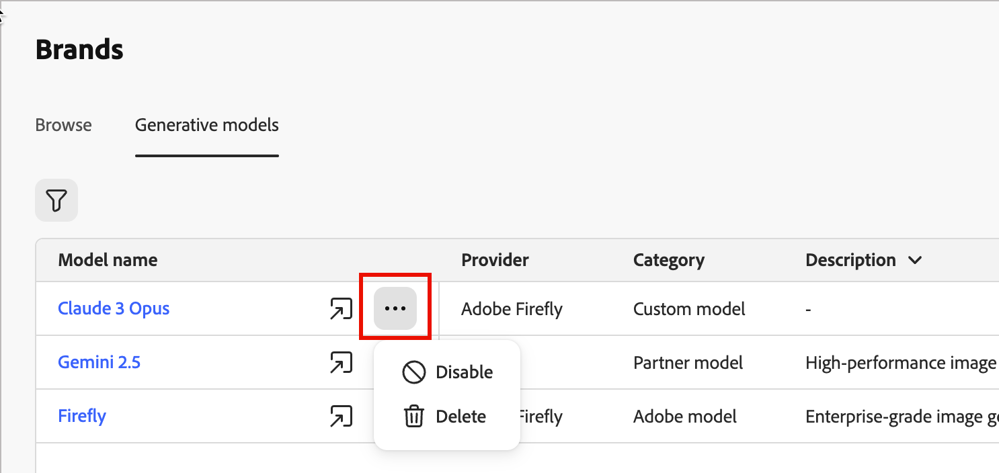

# Modelos de IA gerativa para alinhamento de marca

Expanda os recursos de criação de imagens de IA com modelos integrados, modelos personalizados de Firefly e provedores de geração de imagens de terceiros para atender às suas necessidades específicas e melhorar o alinhamento da marca:

- O **[!UICONTROL Adobe model]**, desenvolvido pela Firefly Image Model 4, é fornecido imediatamente e está pronto para uso para geração imediata de imagem sem configuração adicional.
- O **[!UICONTROL Partner model]**, desenvolvido pelo Gemini 2.5 Flash, oferece recursos especializados para casos de uso específicos.
- **[!UICONTROL Os modelos personalizados]** são modelos específicos da marca treinados em seus próprios ativos e adicionados pela sua organização.

Saiba mais sobre modelos personalizados na [documentação do Adobe Firefly](https://helpx.adobe.com/firefly/web/work-with-enterprise-features/train-custom-models/custom-models-overview.html){target="_blank"}.

Os profissionais de marketing podem selecionar qualquer um dos modelos gerativos ativados ao gerar imagens para seu conteúdo de email ou de página de aterrissagem.

## Gerenciar modelos gerativos

Em um local central, você pode visualizar todos os modelos disponíveis, filtrar e pesquisar para encontrar modelos específicos e definir as configurações do modelo para suas marcas.

1. Na navegação à esquerda, vá para **[!UICONTROL Gerenciamento de Conteúdo]** > **[!UICONTROL Marcas]**.

1. Na página, selecione a guia **[!UICONTROL Generative models]**.

{width="800" zoomable="yes"}

### Filtrar e pesquisar na lista

Clique no ícone _Filtro_  para acessar o menu de filtro. Filtrar modelos por **[!UICONTROL Tipo]** ou **[!UICONTROL Status]**.

{width="700" zoomable="yes"}

Você também pode usar a barra de pesquisa para encontrar um modelo generativo específico por nome.

### Ações do modelo

Para um modelo personalizado na lista, clique no ícone de menu _Mais_ . Você pode escolher **[!UICONTROL Habilitar]** ou **[!UICONTROL Desabilitar]** para alterar o status de disponibilidade do modelo ou escolher **[!UICONTROL Excluir]** para remover o modelo da lista.

{width="450"}

Para um modelo interno, clique no ícone _Habilitar_ (  ) ou _Desabilitar_ (  ) para alterar a disponibilidade do modelo para geração de imagem.

>[!NOTE]
>
>Somente modelos personalizados podem ser excluídos.

## Adicionar um modelo generativo

Crie modelos personalizados do Firefly ou conecte provedores de geração de imagens de terceiros para expandir seus recursos de IA gerativa.

>[!NOTE]
>
>A criação de modelos personalizados do Firefly requer um contrato do Firefly ETLA.

1. Na guia _[!UICONTROL Modelos gerativos]_, clique em **[!UICONTROL Adicionar modelo]**.

1. Insira um **[!UICONTROL Nome]** para seu modelo.

<!-- 1. Select a **[!UICONTROL Model provider]**. future development -->

1. Insira a **[!UICONTROL ID do Modelo]**.

   Para encontrar a ID do modelo, acesse o site da Firefly e navegue até os modelos treinados. O identificador exclusivo está disponível na seção de gerenciamento do modelo após a publicação. Para obter mais informações, consulte a [documentação de modelos personalizados do Firefly](https://helpx.adobe.com/firefly/web/work-with-enterprise-features/train-custom-models/custom-models-overview.html){target="_blank"}.

1. Opcionalmente, insira uma **[!UICONTROL Descrição]** para ajudar a identificar o modelo e seu uso pretendido.

   {width="550" zoomable="yes"}

1. Clique em **[!UICONTROL Testar conexão]** para verificar a configuração do modelo.

1. Quando o teste de conexão for bem-sucedido, clique em **[!UICONTROL Salvar]** para salvar a configuração do modelo.

   Salvar o modelo o adiciona à lista de modelos gerativos, onde você pode habilitá-lo para uso pelos profissionais de marketing. Você também pode desativá-la ou excluí-la a qualquer momento.

   {width="600" zoomable="yes"}
