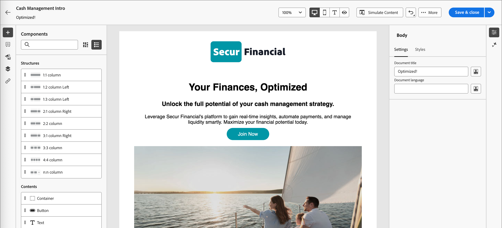

# Criação de conteúdo de email com o GenStudio for Performance Marketing {#genstudio-workflow}

>[!CONTEXTUALHELP]
>id="ajo-b2b_genstudio_button"
>title="Usar um modelo criado com o GenStudio"
>abstract="Use a integração com o Adobe GenStudio for Performance Marketing para importar um template do GenStudio aprimorado com a tecnologia Adobe AI."

>[!AVAILABILITY]
>
>A integração do GenStudio no [!DNL Adobe Journey Optimizer B2B Edition] não está disponível para uso com as ofertas complementares do **Healthcare Shield** ou **Privacy and Security Shield**.
>
>Essa integração está disponível somente para o canal de email.

Para aprimorar a eficiência do fluxo de trabalho e manter a consistência da marca, você pode combinar experiências do GenStudio for Performance Marketing com a orquestração de email do Adobe Journey Optimizer B2B edition. Esse fluxo de trabalho expandido permite aproveitar as ferramentas de criação de conteúdo com IA no GenStudio para expandir e maximizar as comunicações por email por meio de jornadas de conta.

Por exemplo, um profissional de marketing técnico que usa o Journey Optimizer B2B edition para desenvolver e automatizar comunicações por email para contas importantes pode colaborar com um profissional de marketing de desempenho que cria conteúdo usando o GenStudio. Com esse fluxo de trabalho, ambos podem trabalhar juntos para combinar conteúdo sobre a marca do GenStudio com a automação de marketing baseada em conta do Journey Optimizer B2B edition, fornecendo emails envolventes que direcionam grupos de compra específicos e impulsionam as vendas.

>[!BEGINSHADEBOX]

## Recursos de geração de conteúdo do GenStudio

O [Adobe GenStudio for Performance Marketing](https://business.adobe.com/products/genstudio-for-performance-marketing.html){target="_blank"} é um aplicativo generativo de IA que capacita as equipes de marketing a criar anúncios e emails impactantes e personalizados que seguem os padrões da marca e estão em conformidade com as políticas da empresa. Ao utilizar a tecnologia de IA do Adobe, ele fornece um conjunto abrangente de ferramentas que simplificam as complexidades da criação e do gerenciamento de conteúdo para que os criadores possam se concentrar na inovação.

{width="30"} [Criar emails de marketing sobre marcas](https://experienceleague.adobe.com/pt-br/docs/genstudio-for-performance-marketing-learn/tutorials/creating-experiences/creating-on-brand-emails){target="_blank"}

Saiba mais sobre os recursos do GenStudio for Performance Marketing na [documentação](https://experienceleague.adobe.com/pt-br/docs/genstudio-for-performance-marketing/user-guide/home){target="_blank"}

>[!ENDSHADEBOX]

## Exportar o HTML do Journey Optimizer B2B edition

Primeiro, no Journey Optimizer B2B edition, exporte o HTML de um email que inclua as diretrizes da sua marca.

1. No Journey Optimizer B2B edition, acesse o conteúdo do seu email no espaço de design visual.

1. No menu _[!UICONTROL Mais...]_, na parte superior do espaço de design de email, escolha **[!UICONTROL Exportar HTML]**.

   {width="600"}

   Essa ação gera um arquivo .zip baixado que contém os arquivos HTML e de imagem.

## Usar o HTML exportado no GenStudio for Performance Marketing

O GenStudio for Performance Marketing reconhece determinados elementos no HTML de email importado quando são identificados com um nome de campo reconhecido. Adicione nomes de campo no HTML exportado usando a sintaxe Handlebars, na qual você precisa do GenStudio for Performance Marketing para gerar um determinado tipo de conteúdo.

| Campo | Tipo de conteúdo |
| ----------------- | ------------------------- |
| `{{pre_header}}` | Pré-cabeçalho |
| `{{headline}}` | Título |
| `{{sub_headline}}` | Subtítulo |
| `{{body}}` | Corpo de texto |
| `{{cta}}` | Call to action (botão) |
| `{{image}}` | Imagem |
| `{{link}}` | Call to action na imagem |

### Criar o modelo

Use o arquivo HTML para criar um modelo no GenStudio for Performance Marketing.

Para obter informações detalhadas sobre como carregar um modelo do HTML no GenStudio no Adobe GenStudio for Performance Marketing, consulte [Adicionar um modelo](https://experienceleague.adobe.com/pt-br/docs/genstudio-for-performance-marketing/user-guide/content/templates/use-templates#add-a-template) na documentação do GenStudio for Performance Marketing.

Ao fazer upload do HTML exportado como um modelo, o GenStudio for Performance Marketing verifica o arquivo do HTML em busca de campos reconhecidos. Use a visualização para revisar os elementos do modelo e confirmar que você os identificou corretamente com os nomes de campo reconhecidos.

### Gerar experiências por email

No GenStudio for Performance Marketing, use o modelo para criar várias variações de experiência de email e salvá-las.

Para obter informações detalhadas sobre como gerar experiências de email de marca, consulte [Criar uma experiência de email](https://experienceleague.adobe.com/pt-br/docs/genstudio-for-performance-marketing/user-guide/create/create-email-experience) na documentação do GenStudio for Performance Marketing.

## Adicionar experiências de email geradas ao Journey Optimizer B2B edition

>[!NOTE]
>
>A integração do GenStudio for Performance Marketing está disponível somente para a criação de emails e não está disponível para a criação de um template de email.

Para usar as variações de email do GenStudio criadas a partir do arquivo HTML de email do Journey Optimizer B2B edition exportado, siga estas etapas:

1. No Journey Optimizer B2B edition, [adicione um email](./add-email.md) a uma jornada de conta usando um nó _[!UICONTROL Realizar uma ação]_.

   * Para o destino _[!UICONTROL Ação em]_, escolha **[!UICONTROL Pessoas]**.

   * Para a _[!UICONTROL Ação sobre pessoas]_, escolha **[!UICONTROL Enviar email]**.

     {width="700" zoomable="yes"}

   * Para a _[!UICONTROL fonte de email]_, escolha **[!UICONTROL Criar novo email]** para criar o email nativamente no Journey Optimizer B2B edition.

1. Na página _Criar email_, selecione **[!UICONTROL Importar HTML]**.

1. Na caixa de diálogo _[!UICONTROL Importar seu email]_, clique em **[!UICONTROL Adobe GenStudio for Performance Marketing]**.

   {width="500" zoomable="yes"}

1. Navegue pelas experiências publicadas.

   Você pode filtrar as experiências com vários critérios, como _Modelo_ e _Criado por_.

   {width="600" zoomable="yes"}

1. Selecione uma experiência e clique em **[!UICONTROL Usar]** para começar a criar seu conteúdo de email.

   >[!NOTE]
   >
   >As experiências do GenStudio criadas a partir de um modelo do Journey Optimizer B2B edition ou do Marketo Engage são importadas diretamente para o espaço de design de email. As experiências criadas sem um modelo do Journey Optimizer B2B edition são importadas para o modo de compatibilidade.

1. Use as [ferramentas de personalização e conteúdo de email](./email-authoring.md) para editar seu email conforme necessário e salvá-lo.

   {width="800" zoomable="yes"}
