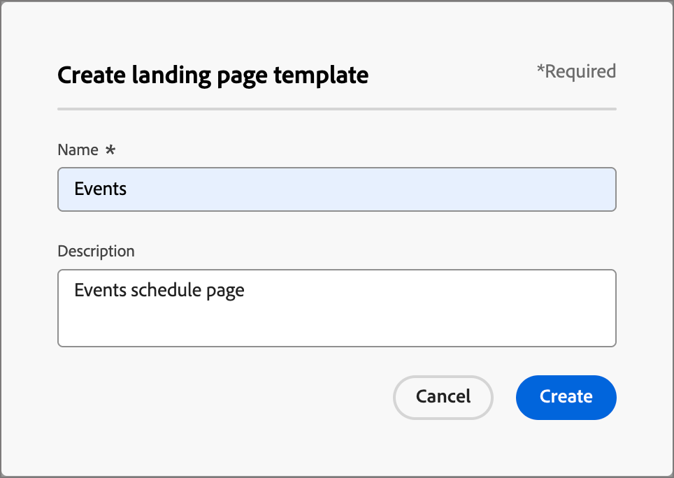

# Modelos de páginas de destino

Para um processo de design acelerado e aprimorado, é possível criar modelos de página de aterrissagem independentes para padronizar o design e o conteúdo da página. Os estrategistas de marketing podem reutilizar as páginas e adaptá-las de acordo com o uso em campanhas e jornadas.

## Acessar e gerenciar modelos de página de aterrissagem

Para acessar modelos de página de aterrissagem no Adobe Journey Optimizer B2B edition, acesse **[!UICONTROL Gerenciamento de Conteúdo]** > **[!UICONTROL Modelos]**. Em _[!UICONTROL WEB]_, no painel de navegação, selecione **[!UICONTROL Modelos de página de aterrissagem]**.

A página de listagem exibida inclui todos os templates de landing page criados na instância listada no formato de tabela. A tabela é classificada pela coluna _[!UICONTROL Modificado]_ por padrão, com os modelos atualizados mais recentes na parte superior. Clique no título da coluna para alterar entre crescente e decrescente.

Para pesquisar um modelo por nome, digite uma string de texto na barra de pesquisa.

{width="700" zoomable="yes"}

Clique no ícone _Filtro_ (  ) na parte superior esquerda para filtrar a lista de acordo com as datas de criação ou modificação e os modelos que você criou ou modificou.

Personalize as colunas que deseja exibir na tabela clicando no ícone _Personalizar tabela_ (  ) na parte superior direita. Selecione as colunas a serem exibidas e clique em **[!UICONTROL Aplicar]**.

Na lista exibida de modelos, é possível realizar as ações descritas nas seções a seguir.

## Criar um modelo de landing page

Você pode criar um modelo de página de aterrissagem a partir da página de listagem de modelos de página de aterrissagem clicando em **[!UICONTROL Criar modelo]** na parte superior direita.

1. Na caixa de diálogo, insira um **[!UICONTROL Nome]** exclusivo (obrigatório) e uma **[!UICONTROL Descrição]** útil (opcional).

   {width="400"}

1. Clique em **[!UICONTROL Criar]**.

A página _[!UICONTROL Criar sua página de aterrissagem primária]_ é aberta e fornece opções para a criação do modelo: _[!UICONTROL Criar do zero]_, _[!UICONTROL Importar HTML]_ ou selecionar um dos _[!UICONTROL Modelos salvos]_.

{width="800" zoomable="yes"}

Após selecionar o método que deseja usar para iniciar o design do modelo, use o espaço de design visual para [criar o conteúdo do modelo da página de aterrissagem](./landing-page-design.md).

### Criar do zero

Use o espaço de design visual para definir a estrutura do conteúdo da landing page. Ao adicionar e mover componentes estruturais com ações simples de arrastar e soltar, você pode criar a forma do conteúdo da página reutilizável em segundos.

>[!NOTE]
>
>As ferramentas de design disponíveis são equivalentes às ferramentas usadas para design de página de destino. A diferença é que esse conteúdo é salvo como um template que pode ser reutilizado em várias landing pages.

1. Na página inicial _[!UICONTROL Criar seu modelo]_, selecione a opção **[!UICONTROL Criar do zero]**.

1. [Adicionar estrutura e conteúdo](./landing-page-design.md#add-structure-and-content) ao modelo.

### Importar HTML

O Adobe Journey Optimizer B2B edition permite importar conteúdo existente do HTML para criar seus modelos de página de aterrissagem.

{{$include /help/_includes/content-design-import.md}}

{width="500"}

>[!NOTE]
>
>Usar uma marca `<table>` como a primeira camada em um arquivo do HTML pode causar perda de estilo, incluindo configurações de plano de fundo e largura na marca de camada superior.

Você pode personalizar o conteúdo importado conforme necessário com o espaço de design visual.

### Selecionar um modelo de design

{{$include /help/_includes/content-design-select-template.md}}

## Exibir detalhes do modelo de página

Na página de listagem _Modelos de página de aterrissagem_, clique no nome de um modelo de página de aterrissagem para abrir a página de detalhes. Aqui, é possível visualizar as propriedades básicas do modelo de página de aterrissagem e acessar o espaço de design visual para fazer alterações no conteúdo do modelo.

{width="700" zoomable="yes"}

* Exibir os detalhes do modelo, como nome e descrição. Essas configurações podem ser editadas. Clique fora da caixa de descrição para salvar as alterações automaticamente.

* Visualize as propriedades do modelo, como criado por, criado em, atualizado pela última vez em e modificado por.

* Clique em **[!UICONTROL Mais]** na parte superior direita para executar ações rápidas no modelo de página de aterrissagem, como _Duplicar_ e _Excluir_.

* Se houver alertas ativos (erros e avisos para o modelo de página de aterrissagem), clique em **[!UICONTROL Alertas]** na parte superior direita para exibir as informações.

  Esses alertas não proíbem o uso do modelo de página de aterrissagem para a criação de páginas de aterrissagem. As informações fornecem visibilidade para os profissionais de marketing da sua equipe sobre o que pode não funcionar e as atualizações necessárias antes que possam ser usadas para o delivery.

## Exibir modelo usado por referências

Na página de detalhes dos modelos, clique na guia **[!UICONTROL Usado por]** para exibir detalhes sobre onde esse modelo é usado em uma página de aterrissagem.

{width="400"}

* Ao clicar no link, você será direcionado para a página de aterrissagem correspondente onde o template é usado.

* Saia da exibição a qualquer momento clicando na seta para trás, que o levará de volta à página da lista.

## Editar modelos de página de destino

Esta ação pode ser tomada a partir de:

* A página de detalhes - Clique em **[!UICONTROL Editar modelo de página de aterrissagem]**.
* A página de listagem - Clique nas reticências (**...**) ao lado de um modelo e escolha **[!UICONTROL Editar]**.

Esta ação direciona você à página _Criar modelo_ ou à página do editor de conteúdo visual (com base no último status salvo do modelo de página de aterrissagem). Aqui, você pode editar o conteúdo do modelo da sua landing page, conforme necessário. Consulte [Criar um modelo de página de aterrissagem](#create-a-landing-page-template) para obter informações sobre as opções de edição.

## Modelos de página de aterrissagem duplicados

É possível duplicar um template de landing page usando um dos seguintes métodos:

* Nos detalhes do modelo à direita, expanda **[!UICONTROL Mais]** e clique em **[!UICONTROL Duplicar]**.

  {width="400"}

* Na página de listagem _[!UICONTROL Modelos de página de aterrissagem]_, clique nas reticências (...) ao lado do modelo e escolha **[!UICONTROL Duplicar]**.

Na caixa de diálogo do, digite um nome útil (exclusivo) e uma descrição. Clique em **[!UICONTROL Duplicar]** para concluir a ação.

O (novo) modelo de página de aterrissagem duplicado aparece na listagem _Modelos de página de aterrissagem_.

## Excluir modelos de página de destino

A remoção de um modelo de página de aterrissagem não pode ser desfeita, portanto, verifique antes de iniciar uma ação de exclusão. É possível excluir um template de landing page usando um dos seguintes métodos:

* Nos detalhes do modelo à direita, expanda **[!UICONTROL Mais]** e clique em **[!UICONTROL Excluir]**.
* Na página de listagem _Modelos de página de aterrissagem_, clique nas reticências (...) ao lado do modelo e escolha **[!UICONTROL Excluir]**.

  {width="500"}

Essa ação abre uma caixa de diálogo de confirmação. Você pode anular o processo clicando em **[!UICONTROL Cancelar]** ou em **[!UICONTROL Excluir]** para confirmar a remoção.

## Realizar ações em massa

Na página da listagem de templates de landing page, selecione vários templates de cada vez marcando as caixas de seleção à esquerda. Um banner é exibido na parte inferior ao selecionar vários modelos.

{width="600"}

**[!UICONTROL Excluir]** — É possível excluir até 20 modelos de uma vez. Uma caixa de diálogo de confirmação permite suspender a ação ou confirmar a remoção dos modelos.

## Criar uma página de aterrissagem a partir de um modelo salvo

Na página _[!UICONTROL Criar sua página de aterrissagem]_, use a seção _Selecionar modelo de design_ para começar a criar o conteúdo a partir de um modelo.

Para começar a criar o conteúdo com um dos templates de landing page criados, siga estas etapas:

1. Acesse o espaço de design visual na página _Editar conteúdo_.

   Na página _[!UICONTROL Criar sua página de aterrissagem]_, a guia _Modelos de amostra_ é selecionada por padrão.

1. Para usar um modelo de página de aterrissagem personalizado, selecione a guia **[!UICONTROL Modelos salvos]**.

   Essa guia exibe uma lista de todos os templates de landing page criados na sandbox. Você pode classificá-los _Pelo nome_, _Última modificação_ e _Última criação_.

1. Selecione o template de sua escolha na lista.

   Após a seleção, é exibida uma pré-visualização do modelo. No modo de visualização, você pode navegar entre todos os modelos de uma categoria (amostra ou salva, dependendo da seleção) usando as setas para a direita e para a esquerda.

1. Clique em **[!UICONTROL Usar este modelo]** na parte superior direita.

1. No espaço de design de conteúdo visual, edite o conteúdo conforme necessário.
