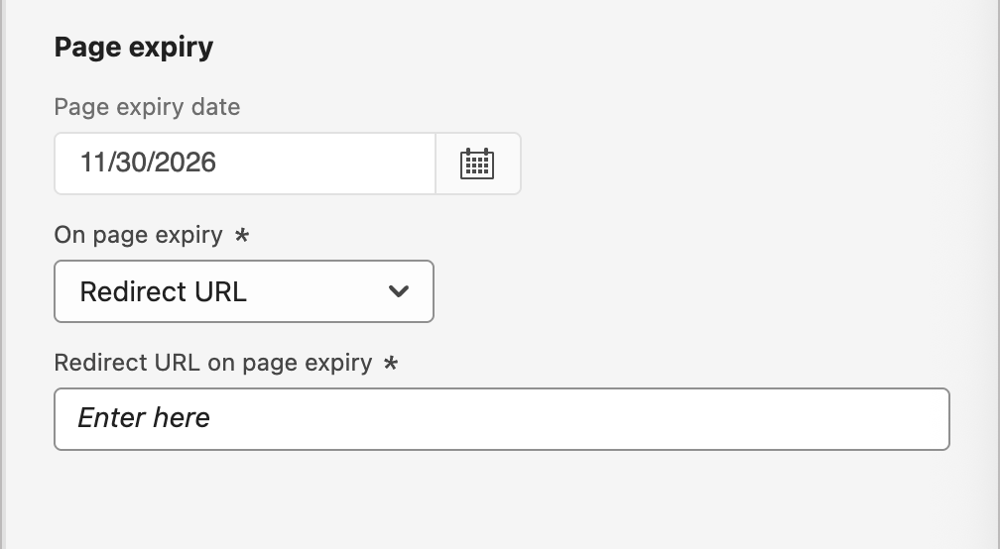

# Criar e publicar páginas de destino

Como profissional de marketing, você pode definir e publicar páginas que deseja incorporar em suas jornadas de conta e pessoa. Ao adicionar uma nova página de aterrissagem, você configura a página principal e quaisquer subpáginas, projeta o conteúdo, testa-o e o publica.

>[!BEGINSHADEBOX]

## Pré-requisitos da página de destino {#landing-page-prerequisites}

Para que os profissionais de marketing possam criar páginas de aterrissagem para oferecer suporte a suas jornadas e campanhas, as seguintes configurações e ativos devem estar em vigor:

* [Subdomínio da página de aterrissagem](../admin/configure-channels-landing-pages.md#lp-subdomains) - Configure um subdomínio dedicado à hospedagem das páginas de aterrissagem.
* [Predefinição de página de aterrissagem](../admin/configure-channels-landing-pages.md#lp-presets) - Uma predefinição define o subdomínio e outras configurações aplicadas às suas páginas de aterrissagem.
* [Formulário](./forms.md) (para casos de uso de captura de dados) - Obrigatório quando você deseja incorporar um formulário em uma página de aterrissagem e enviar dados para o Experience Platform.
  <!-- * Subscription list (for subscription use cases) - Required if you want customers to subscribe to or unsubscribe from a specific service. This is in AJO B2C-->

>[!ENDSHADEBOX]

## Criar uma página de destino {#create-landing-page}

>[!CONTEXTUALHELP]
>id="ajo-b2b_lp_create"
>title="Definir e configurar a página de destino"
>abstract="Para criar uma página de destino, você precisa selecionar uma predefinição, configurar a página principal e as subpáginas e, por fim, testar a página antes de publicá-la."

1. Vá para a navegação à esquerda e selecione **[!UICONTROL Gerenciamento de conteúdo]** > **[!UICONTROL Páginas de aterrissagem]**.

1. Clique em **[!UICONTROL Criar página de aterrissagem]** na parte superior direita.

1. Na página, insira um **[!UICONTROL Título]** útil (obrigatório) e **[!UICONTROL Descrição]** (opcional).

   Critérios de título e descrição:

   * Título - Máximo de 100 caracteres; deve ser exclusivo, não diferencia maiúsculas de minúsculas

   * Descrição - Máximo de 300 caracteres

   * São permitidos caracteres Alpha, numéricos e especiais

   * Os caracteres reservados **_não são permitidos_**: `\ / : * ? " < > |`

   {width="600"}

1. Selecione uma **[!UICONTROL Predefinição]**.

   Um administrador de produto [configura uma predefinição](../admin/configure-channels-landing-pages.md#lp-presets) para definir o subdomínio e outras configurações usadas para páginas de aterrissagem. Você pode selecionar uma predefinição e, em seguida, clicar em **[!UICONTROL Exibir predefinição]** para abrir os detalhes da predefinição e verificar as configurações para garantir que ela corresponda aos requisitos da sua página de aterrissagem.

1. Clique em **[!UICONTROL Criar]**.

   A página principal e suas propriedades são exibidas.

   {width="700" zoomable="yes"}

## Configurar a página principal {#configure-primary-page}

>[!CONTEXTUALHELP]
>id="ajo-b2b_lp_primary_page"
>title="Definir as configurações da página principal"
>abstract="Defina a página principal, que é exibida imediatamente quando um recipient clica no link da página de aterrissagem, como de um email ou site."

>[!CONTEXTUALHELP]
>id="ajo-b2b_lp_access_settings"
>title="Definir o URL da página de destino"
>abstract="Nesta seção, defina um URL de página de destino exclusivo. A primeira parte do URL exige a configuração prévia de um subdomínio de página de aterrissagem como parte da predefinição selecionada."

1. Altere o **[!UICONTROL Nome da página]** de acordo com suas necessidades, que é a _Página principal_ por padrão.

1. Defina a parte final do URL da página.

   A predefinição selecionada determina a primeira parte do URL.

   >[!CAUTION]
   >
   >O URL da landing page deve ser exclusivo.
   >
   >Você não pode acessar sua landing page simplesmente copiando esse URL em um navegador da Web, mesmo que publicado. Teste-o usando a função de visualização.

1. Se quiser uma página de aterrissagem anônima, desabilite a opção **[!UICONTROL Requer usuários identificados]**.

   <!-- The option 'Require identified users' would be visible in both AJO & AJOB2B when the Landing page is of type 'Data capture' -->

1. Clique no ícone _Calendário_ (  ) para definir a **[!UICONTROL Expiração da página]**.

   Após selecionar uma data de expiração, escolha a ação após a expiração da página:

   * **[!UICONTROL URL de redirecionamento]** - Digite a URL da página para usar como redirecionamento.

     {width="400"}

     <!-- * **[!UICONTROL Custom page]** - Configure a subpage and select it from the list. -->
   * **[!UICONTROL Erro do navegador]** - Digite o texto do erro a ser exibido no lugar da página.

     {width="400"}

## Escolha o tipo de design de conteúdo {#choose-design-type}

Para adicionar o _[!UICONTROL Conteúdo]_ da página, clique em **[!UICONTROL Abrir o Designer]**. A página inicial _[!UICONTROL Criar página de aterrissagem primária]_ é carregada e o processo de design começa com a escolha de como você deseja iniciar o design:

* [[!UICONTROL Design do zero]](#design-from-scratch)
* [[!UICONTROL Codifique o seu próprio &#x200B;]](#code-your-own)
* [[!UICONTROL Importar HTML]](#import-html)
* [Usar um modelo de página de destino](#select-template)

{width="800" zoomable="yes"}

Depois de selecionar seu método preferido para iniciar o design da página de aterrissagem, use as ferramentas de design visual para [concluir o conteúdo da página](./landing-page-design.md).

### Criar do zero {#design-from-scratch}

Use o editor de conteúdo visual para definir a estrutura do conteúdo da página de destino. Ao adicionar e mover componentes estruturais com ações simples de arrastar e soltar, você pode projetar a forma do conteúdo da página em segundos.

1. Na página inicial _[!UICONTROL Criar sua página de aterrissagem primária]_, selecione a opção **[!UICONTROL Criar do zero]**.

1. Escolha como deseja gerenciar o estilo do conteúdo da página:

   * **[!UICONTROL Usar Temas]** - Escolha esta opção para criar o conteúdo da página no _Modo de Tema_. Neste modo, você pode usar um [tema de marca](./brand-themes.md) definido para simplificar o processo de criação de conteúdo e garantir que o design se alinhe aos padrões definidos.

   * **[!UICONTROL Estilo Manual]** - Escolha esta opção para criar o conteúdo da página no _modo Manual_. Nesse modo, você define manualmente o estilo de todos os componentes de estrutura e conteúdo adicionados à tela em branco.

1. Clique em **[!UICONTROL Confirmar]**.

1. [Adicionar estrutura e conteúdo](./landing-page-design.md#structure-content-landing-page) à página.

### Desenvolva o seu {#code-your-own}

_Codifique o seu próprio_ permite escrever ou colar HTML bruto para criar o conteúdo da página diretamente no espaço de design. Use esse modo quando precisar de controle total sobre a marcação. A utilização desse modo exige que você tenha habilidades no HTML.

Após escolher esse modo, você permanece no editor de código; não é possível alternar para o editor visual.

1. Na página inicial _[!UICONTROL Criar sua página de aterrissagem primária]_, selecione a opção **[!UICONTROL Codificar você mesmo]**.

1. Digite ou cole seu código HTML bruto.

Para limpar o conteúdo da página e começar com um novo design, selecione **[!UICONTROL Alterar design]** no menu opções.

### Importar HTML {#import-html}

O Adobe Journey Optimizer B2B edition permite importar conteúdo existente do HTML para criar suas páginas de aterrissagem.

{{$include /help/_includes/content-design-import.md}}

{width="500"}

>[!NOTE]
>
>Usar uma marca `<table>` como a primeira camada em um arquivo do HTML pode causar perda de estilo, incluindo configurações de plano de fundo e largura na marca de camada superior.

Você pode personalizar o conteúdo importado conforme necessário com o espaço de design visual.

### Selecione um modelo {#select-template}

[!BADGE Beta]{type=Informative tooltip="Recurso do Beta"}

Se quiser usar um template de landing page, você poderá escolher entre:

* **Modelos de exemplo**. A interface do Journey Optimizer B2B edition oferece uma coleção de templates de landing page prontos para uso que você pode usar como ponto de partida para o design da landing page.

* **Modelos salvos**. Use um modelo personalizado salvo criado por um membro de sua organização usando o menu _[!UICONTROL Modelos]_ <!-- or the _[!UICONTROL Save as content template]_ option when designing a landing page. -->

Use a seção _[!UICONTROL Selecionar modelo de design]_ para começar a criar o conteúdo a partir de um modelo. Você pode usar um modelo de amostra ou um modelo de página de aterrissagem personalizado salvo na instância do Journey Optimizer B2B edition.

>[!BEGINTABS]

>[!TAB Modelos salvos]

A página inicial _Criar sua página de aterrissagem primária_ exibe a guia _Modelos de amostra_ por padrão. Para usar um modelo personalizado, selecione a guia **[!UICONTROL Modelos salvos]**.

A lista de todos os modelos de página de aterrissagem salvos é exibida. Você pode classificá-los por _[!UICONTROL Nome]_, _[!UICONTROL Última modificação]_ e _[!UICONTROL Última criação]_.

{width="700" zoomable="yes"}

Selecione uma miniatura de modelo para exibir uma visualização. No modo de visualização, você pode navegar entre todos os modelos de uma categoria (amostra ou salva, dependendo da seleção) usando as setas para a direita e para a esquerda.

{width="800" zoomable="yes"}

Quando a exibição corresponder ao que você deseja usar, clique em **[!UICONTROL Usar este modelo]** na parte superior direita da janela de visualização.

Essa ação copia o conteúdo para o espaço de design visual, onde você pode editar o conteúdo conforme necessário.

<!-- 
>[!NOTE]
>
>Saved templates may have governance (content locking) settings applied to one or more components. The design tools provide guidelines about locked components when you [author content from a governed template](./email-authoring-governance.md). 
-->

>[!TAB Modelos de exemplo]

O Adobe Journey Optimizer B2B edition oferece uma seleção de _modelos de página de aterrissagem_ prontos para uso, que podem ser usados para criar suas próprias páginas de aterrissagem e modelos de página de aterrissagem.

<!-- {width="800" zoomable="yes"} -->

>[!ENDTABS]

## Verificar alertas {#check-alerts}

À medida que você projeta o conteúdo da página de aterrissagem, os alertas são exibidos na parte superior direita, quando as principais configurações estão ausentes.

{width="250"}

Se você não vir esse botão, não há problemas detectados.

Há dois tipos de alertas:

* **_Avisos_** que se referem a recomendações e práticas recomendadas, como:

   * `Placeholder links are present in the landing page body`: não se esqueça de substituir os espaços reservados por links válidos.

   * `Text version of HTML is empty`: não se esqueça de definir uma versão de texto do corpo da página, que é usada quando o conteúdo do HTML não pode ser exibido.

   * `Empty link is present in page body`: verifique se todos os links na sua página estão corretos.

* **_Erros_** que impedem que você teste ou ative a jornada/campanha enquanto não forem resolvidos, como:

   * `The landing page content is empty`: o conteúdo da página é obrigatório.

## Testar a página de destino {#test-landing-page}

>[!CONTEXTUALHELP]
>id="ajo-b2b_preview_lp_profiles"
>title="Visualizar e testar a página de destino"
>abstract="Depois de definir as configurações e o conteúdo da página de aterrissagem, use perfis de teste para visualizar a página."

Quando as configurações e o conteúdo da landing page são definidos, você pode usar perfis de teste para visualizar a página. Se você inseriu [conteúdo personalizado](./personalization.md), é possível verificar como esse conteúdo é exibido na página de aterrissagem, usando os dados do perfil de teste.

>[!PREREQUISITES]
>
>Para visualizar e testar páginas de aterrissagem, você deve ter a permissão **[!UICONTROL Publicar Mensagens]** e um conjunto de dados definido que contenha [perfis de teste](../audiences/test-profiles.md).

1. Clique em **[!UICONTROL Visualizar e testar]** para abrir a seleção de perfil de teste.

   >[!NOTE]
   >
   >Você também pode usar **[!UICONTROL Simular conteúdo]** quando estiver no espaço de design visual.

1. Na tela _[!UICONTROL Simular]_, selecione um perfil de teste.

   {width="700" zoomable="yes"}

   Se os perfis necessários não estiverem listados, clique em **[!UICONTROL Gerenciar perfis de teste]** para usar um endereço de email conhecido de [perfil de teste](../audiences/test-profiles.md) e adicioná-lo à lista.

   +++Adicionar perfis de teste

   Para o **[!UICONTROL Namespace de identidade]**, clique no ícone _Selecionar_ (  ) e escolha o namespace `Email` para usar para testar perfis.

   {width="700" zoomable="yes"}

   No campo **[!UICONTROL Valor de identidade]**, insira o endereço de email para identificar o perfil de teste e clique em **[!UICONTROL Adicionar perfil]**. Você pode repetir isso para adicionar vários perfis.

   {width="700" zoomable="yes"}

   Clique na seta para trás na parte superior esquerda para retornar à página _[!UICONTROL Simular]_.

   +++

1. Selecione **[!UICONTROL Abrir visualização]** para testar a página de aterrissagem.

   A pré-visualização da landing page é aberta em uma nova guia. Os dados do perfil de teste selecionado substituem os elementos personalizados.

   {width="600"}

1. Selecione outros perfis de teste para visualizar a renderização de cada variante da página de aterrissagem.

## Publicar a página {#publish-landing-page}

>[!PREREQUISITES]
>
>Para publicar páginas de aterrissagem, você deve ter a permissão **[!UICONTROL Publicar Mensagens]**.  Antes de publicar, [verifique e resolva todos os alertas](#check-alerts).

Quando a página de rascunho atender aos seus critérios e você quiser disponibilizá-la para vinculação a partir de mensagens do jornada, clique em **[!UICONTROL Publicar]** na parte superior direita. E na janela de confirmação, clique em **[!UICONTROL Publicar]**.

{width="250"}

Quando a página de aterrissagem é publicada, ela é exibida na lista de páginas de aterrissagem com o status **_[!UICONTROL Publicado]_**. Isso significa que ele está ao vivo e pronto para ser usado em uma mensagem de email, SMS ou WhatsApp enviada por meio de uma jornada.

Não é possível acessar a landing page publicada ao copiar e colar o URL em um navegador da Web. Você pode testá-lo a qualquer momento usando a [função de visualização](#test-landing-page).

Você pode monitorar os impactos da landing page por meio de relatórios específicos.
