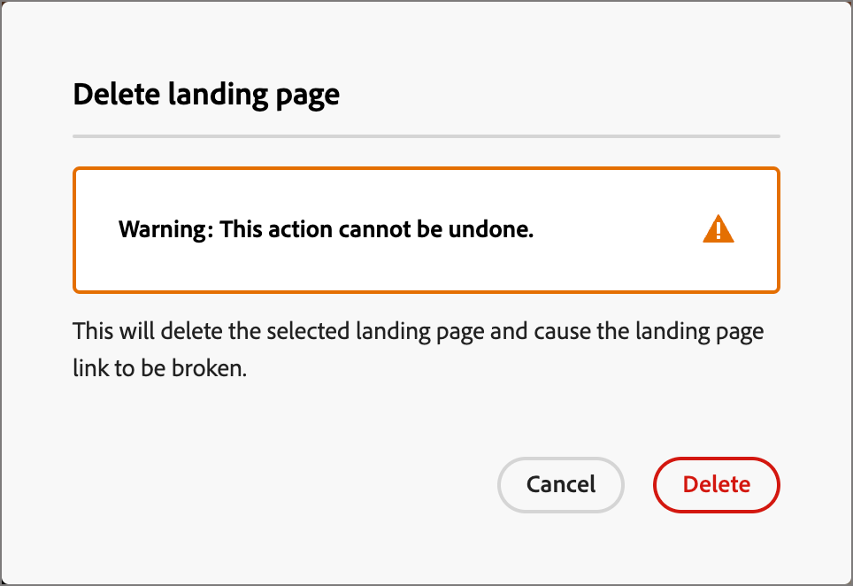

# Páginas de destino

Uma landing page é uma página da Web independente onde você pode direcionar contatos e clientes depois que eles clicarem em um item vinculado em um email, mensagem SMS ou qualquer local digital. É possível incorporar essas páginas nas jornadas da conta para que seus clientes potenciais e clientes visualizem suas mensagens na Web, além de avançar nas jornadas da conta. Você pode criar, personalizar e visualizar páginas de aterrissagem no espaço de design visual da página de aterrissagem.

Para direcionar seus clientes para uma página da Web definida quando clicarem em um link específico, crie uma página de aterrissagem no Journey Optimizer B2B edition.

* Criar a página
* Projetar a página de aterrissagem e o conteúdo do autor
* Testar a página
* Publicar a página
* Link para a página do conteúdo da jornada

Por exemplo, você pode criar e projetar páginas de aterrissagem para direcionar seus usuários para informações online. A página pode incluir um formulário no qual eles possam aceitar ou recusar receber suas comunicações. Ou pode ser uma oportunidade de assinar uma comunicação recorrente, como um boletim informativo.

Você pode criar, personalizar e pré-visualizar páginas de aterrissagem no espaço de design visual.
<!-- 
For the Beta phase, you can only design landing pages from scratch and publish your landing pages. The landing pages will be served on adobe hosted domain for the Beta phase. The capability to define your branded domains for hosting will be delivered in a future release. -->

## Acessar e gerenciar páginas de destino

Para acessar páginas de aterrissagem no Adobe Journey Optimizer B2B edition, vá para a navegação à esquerda e clique em **[!UICONTROL Gerenciamento de Conteúdo]** > **[!UICONTROL Páginas de aterrissagem]**. Essa ação abre uma página de listagem com todas as landing pages criadas na instância listada em uma tabela.

{width="800" zoomable="yes"}

A tabela é classificada pela coluna _[!UICONTROL Modificado]_, com os itens atualizados mais recentes no topo por padrão. Clique no título da coluna para alterar entre crescente e decrescente.

### Filtrar a lista de páginas de destino

Para procurar uma página de aterrissagem por nome, digite uma string de texto na barra de pesquisa para uma correspondência. Clique no ícone _Filtro_ (  ) para mostrar as opções de filtro disponíveis e alterar as configurações para filtrar os itens exibidos de acordo com seus critérios especificados.

{width="700" zoomable="yes"}

### Personalizar a exibição da coluna

Personalize as colunas que deseja exibir na tabela clicando no ícone _Personalizar tabela_ (  ) na parte superior direita.

Na caixa de diálogo, selecione as colunas a serem exibidas e clique em **[!UICONTROL Aplicar]**.

{width="300"}

### Status e ciclo de vida da página de destino

O status da landing page determina a disponibilidade para vinculação no conteúdo de email e SMS e as alterações que você pode fazer nela.

| Status | Descrição |
| -------------------- | ----------- |
| Rascunho | Quando você cria uma página de aterrissagem, ela está no status de rascunho. Ele permanece nesse status conforme você define ou edita o conteúdo visual e até que você o publique como uma página hospedada. Ações disponíveis: <ul><li>Editar nome ou descrição<li>Editar URL do link<li>Editar no espaço de design visual<li>Publicação<li>Duplicar<li>Excluir |
| Publicado | Ao publicar uma landing page, ela é hospedada na instância do Journey Optimizer B2B edition e fica disponível para vinculação em um conteúdo de mensagem de email ou SMS. Ações disponíveis: <ul><li>Editar nome ou descrição<li>Editar URL do link<li>Adicionar link no conteúdo do email ou da mensagem SMS<li>Criar versão de rascunho<li>Duplicar<li>Excluir |
| Publicado com rascunho | Ao criar um rascunho de uma página de aterrissagem publicada, a versão publicada permanece e o conteúdo do rascunho pode ser modificado no espaço de design visual. Se você publicar a versão de rascunho, ela substituirá a versão publicada atual e o conteúdo será atualizado na página hospedada. Ações disponíveis: <ul><li>Editar nome ou descrição<li>Editar URL do link<li>Adicionar link no conteúdo do email ou da mensagem SMS<li>Editar versão de rascunho no espaço de design visual<li>Publicar versão de rascunho<li>Duplicar<li>Excluir (exclui ambas as versões)<li>Descartar rascunho (retorna ao status publicado) |

{zoomable="yes"}

## Criar uma página de destino

Você pode adicionar uma nova página de aterrissagem no Journey Optimizer B2B edition clicando em **[!UICONTROL Criar página de aterrissagem]** na parte superior direita.

1. Na caixa de diálogo _[!UICONTROL Criar página de aterrissagem]_, digite um **[!UICONTROL Nome]** e uma **[!UICONTROL Descrição]** úteis (opcional).

   Requisitos da landing page:

   * Nome - Máximo de 100 caracteres; deve ser exclusivo, não diferencia maiúsculas de minúsculas

   * Descrição - Máximo de 300 caracteres

   * São permitidos caracteres Alpha, numéricos e especiais

   * Os caracteres reservados **_não são permitidos_**: `\ / : * ? " < > |`

   {width="400"}

1. Se necessário e se houver vários subdomínios configurados, altere o **[!UICONTROL Subdomínio]** para usar como página de aterrissagem.

1. Clique em **[!UICONTROL Criar]**.

   A página inicial _[!UICONTROL Criar página de aterrissagem primária]_ é aberta e fornece várias opções para a criação da página: _[!UICONTROL Criar do zero]_, _[!UICONTROL Importar HTML]_ ou usar um modelo salvo.

   {width="800" zoomable="yes"}

   Após selecionar o método que deseja usar para iniciar o design da página de aterrissagem, use o espaço de design visual para [criar a página](./landing-page-design.md).

### Criar do zero

Use o editor de conteúdo visual para definir a estrutura do conteúdo da página de destino. Ao adicionar e mover componentes estruturais com ações simples de arrastar e soltar, você pode projetar a forma do conteúdo da página em segundos.

1. Na página inicial _[!UICONTROL Criar sua página de aterrissagem primária]_, selecione a opção **[!UICONTROL Criar do zero]**.

1. [Adicionar estrutura e conteúdo](./landing-page-design.md#add-structure-and-content) à página.

### Importar HTML

O Adobe Journey Optimizer B2B edition permite importar conteúdo existente do HTML para criar suas páginas de aterrissagem.

{{$include /help/_includes/content-design-import.md}}

{width="500"}

>[!NOTE]
>
>Usar uma marca `<table>` como a primeira camada em um arquivo do HTML pode causar perda de estilo, incluindo configurações de plano de fundo e largura na marca de camada superior.

Você pode personalizar o conteúdo importado conforme necessário com o espaço de design visual.

### Selecionar um modelo salvo

Você pode escolher entre:

* **Modelos de exemplo**. A interface do Journey Optimizer oferece uma coleção de templates de landing page prontos para uso que você pode escolher.

* **Modelos salvos**. Use um modelo personalizado salvo criado por um membro de sua organização usando o menu _[!UICONTROL Modelos]_ <!-- or the _[!UICONTROL Save as content template]_ option when designing a landing page. -->

Use a seção _[!UICONTROL Selecionar modelo de design]_ para começar a criar o conteúdo a partir de um modelo. Você pode usar um modelo de amostra ou um modelo de página de aterrissagem personalizado salvo na instância do Journey Optimizer B2B edition.

>[!BEGINTABS]

>[!TAB Modelos salvos]

Na página inicial _Criar sua página de aterrissagem primária_, a guia _Modelos de amostra_ é selecionada por padrão. Para usar um modelo personalizado, selecione a guia **[!UICONTROL Modelos salvos]**.

A lista de todos os modelos de página de aterrissagem salvos é exibida. Você pode classificá-los por _[!UICONTROL Nome]_, _[!UICONTROL Última modificação]_ e _[!UICONTROL Última criação]_.

{width="700" zoomable="yes"}

Selecione o template desejado na lista.

Após a seleção, é exibida uma pré-visualização do modelo. No modo de visualização, você pode navegar entre todos os modelos de uma categoria (amostra ou salva, dependendo da seleção) usando as setas para a direita e para a esquerda.

{width="800" zoomable="yes"}

Quando a exibição corresponder ao que você deseja usar, clique em **[!UICONTROL Usar este modelo]** na parte superior direita da janela de visualização.

Essa ação copia o conteúdo para o espaço de design visual, onde você pode editar o conteúdo conforme necessário.

>[!TAB Modelos de exemplo]

O Adobe Journey Optimizer B2B edition oferece uma seleção de _modelos de página de aterrissagem_ prontos para uso, que podem ser usados para criar suas próprias páginas de aterrissagem e modelos de página de aterrissagem.

<!-- {width="800" zoomable="yes"} -->

>[!ENDTABS]

<!-- 
>[!NOTE]
>
> Saved templates may have governance (content locking) settings applied to one or more components. The visual designer provides guidelines about locked components when you [author an email from a governed template](./email-authoring-governance.md). -->

## Editar uma landing page

As edições em uma landing page dependem do status atual:

* Quando a página de aterrissagem está com o status **_Rascunho_**, você pode editar os detalhes, a URL e o conteúdo visual dela.
* Quando a página de aterrissagem está no status **_Publicado_**, você pode editar a descrição, mas não o nome. Para alterar o conteúdo visual, você deve criar uma versão de rascunho da página.
* Quando a página de aterrissagem está no status **_Publicado com rascunho_**, a edição de detalhes fica limitada à descrição. Também é possível editar o conteúdo visual da versão de rascunho.

>[!BEGINTABS]

>[!TAB Rascunho]

1. Na página de listagem _[!UICONTROL Landing pages]_, clique no nome da landing page para abri-la.

   Uma visualização do conteúdo visual é exibida, com os detalhes da landing page à direita.

1. Modifique quaisquer detalhes, como nome e descrição.

   {width="700" zoomable="yes"}

1. Para fazer alterações no conteúdo do espaço de design visual, clique em **[!UICONTROL Editar página de aterrissagem]**.

   Use as ferramentas de design visual conforme necessário:

   * [Adicionar estrutura e conteúdo](./landing-page-design.md#add-structure-and-content)
   * [Adicionar o Assets](./landing-page-design.md#add-assets)
   * [Navegar pelas camadas, configurações e estilos](./landing-page-design.md#navigate-the-layers-settings-and-styles)
   * [Personalizar conteúdo](./landing-page-design.md#personalize-content)
   * [Editar rastreamento de URL vinculado](./landing-page-design.md#edit-linked-url-tracking)

1. Clique em **[!UICONTROL Salvar]** ou **[!UICONTROL Salvar e fechar]** para retornar aos detalhes da página de aterrissagem.

1. Quando a página atender aos seus critérios e você desejar disponibilizá-la para exibição, clique em **[!UICONTROL Publicar]**.

>[!TAB Publicado]

1. Na página de listagem _[!UICONTROL Landing page]_, clique no nome da página para abri-la.

   Uma visualização do conteúdo visual é exibida, com os detalhes da landing page à direita.

1. Modifique a descrição, se necessário.

   Para uma landing page publicada, todos os outros detalhes não podem ser alterados.

1. Para atualizar o conteúdo, clique em **[!UICONTROL Editar página de aterrissagem]** à direita.

   Clique em **[!UICONTROL Criar versão de rascunho]** na caixa de diálogo para abrir a versão de rascunho no espaço de design visual.

   {width="300"}

   Use as ferramentas de design visual conforme necessário:

   * [Adicionar estrutura e conteúdo](./landing-page-design.md#add-structure-and-content)
   * [Adicionar o Assets](./landing-page-design.md#add-assets)
   * [Navegar pelas camadas, configurações e estilos](./landing-page-design.md#navigate-the-layers-settings-and-styles)
   * [Personalizar conteúdo](./landing-page-design.md#personalize-content)
   * [Editar rastreamento de URL vinculado](./landing-page-design.md#edit-linked-url-tracking)

1. Clique em **[!UICONTROL Salvar]** ou **[!UICONTROL Salvar e fechar]** para retornar aos detalhes da página de aterrissagem.

1. Quando a landing page de rascunho atender aos seus critérios e você quiser disponibilizar as alterações na página publicada, clique em **[!UICONTROL Publicar]**.

   Ao publicar a versão de rascunho, ela substitui a versão publicada atual e o conteúdo é atualizado para o URL da página.

>[!TAB Publicado com rascunho]

Ao abrir a landing page, a versão de rascunho é exibida por padrão. As guias na parte superior do espaço de visualização permitem alternar a exibição entre as versões publicada e de rascunho. Os rascunhos de ações e detalhes são exibidos à direita.

{width="700" zoomable="yes"}

Para atualizar o conteúdo:

1. Clique em **[!UICONTROL Editar página de aterrissagem]** na parte superior direita. Use as ferramentas de design visual conforme necessário:

   * [Adicionar estrutura e conteúdo](./landing-page-design.md#add-structure-and-content)
   * [Adicionar o Assets](./landing-page-design.md#add-assets)
   * [Navegar pelas camadas, configurações e estilos](./landing-page-design.md#navigate-the-layers-settings-and-styles)
   * [Personalizar conteúdo](./landing-page-design.md#personalize-content)
   * [Editar rastreamento de URL vinculado](./landing-page-design.md#edit-linked-url-tracking)

1. Clique em **[!UICONTROL Salvar]** ou **[!UICONTROL Salvar e fechar]** para retornar aos detalhes da página de aterrissagem.

1. Quando a página de rascunho atender aos seus critérios e você desejar disponibilizar as alterações, clique em **[!UICONTROL Publicar]**.

   Ao publicar a versão de rascunho, ela substitui a versão publicada atual e o conteúdo é atualizado na página hospedada.

>[!ENDTABS]

### Verificar alertas

À medida que você cria o conteúdo da página de aterrissagem, os alertas são exibidos na interface (canto superior direito) quando as principais configurações estão ausentes.

{width="250"}

Se você não vir esse botão, não há problemas detectados.

Dois tipos de alertas podem ser detectados:

* **_Avisos_** que se referem a recomendações e práticas recomendadas, como:

   * `Placeholder links are present in the landing page body`: não se esqueça de substituir os espaços reservados por links válidos.

   * `Text version of HTML is empty`: não se esqueça de definir uma versão de texto do corpo da página, que é usada quando o conteúdo do HTML não pode ser exibido.

   * `Empty link is present in page body`: verifique se todos os links na sua página estão corretos.

* **_Erros_** que impedem que você teste ou ative a jornada/campanha enquanto não forem resolvidos, como:

   * `The landing page content is empty`: o conteúdo da página é obrigatório.

## Duplicação de uma landing page

É possível duplicar uma landing page usando um dos seguintes métodos:

* Na página de listagem _[!UICONTROL Página de aterrissagem]_, clique no ícone _Mais_ (**...**) ao lado do nome da página de aterrissagem e escolha **[!UICONTROL Duplicar]**.
* Na parte superior direita da página de detalhes, clique em **[!UICONTROL ... Mais]** e escolha **[!UICONTROL Duplicar]**.

{width="600" zoomable="yes"}

Na caixa de diálogo, digite um nome útil (exclusivo) e uma descrição (opcional). Clique em **[!UICONTROL Duplicar]** para concluir a ação.

{width="350"}

A página duplicada (nova) aparece na listagem _Landing pages_.

## Excluir uma página de destino

É possível excluir uma landing page usando um dos seguintes métodos:

* Na página de listagem _[!UICONTROL Página de aterrissagem]_, clique no ícone _Mais_ (**...**) ao lado do nome da página de aterrissagem e escolha **[!UICONTROL Excluir]**.
* Na parte superior direita da página de detalhes, clique em **[!UICONTROL ... Mais]** e escolha **[!UICONTROL Excluir]**.

Essa ação abre uma caixa de diálogo de confirmação. Você pode anular o processo clicando em **[!UICONTROL Cancelar]** ou em **[!UICONTROL Excluir]** para confirmar a exclusão.

{width="400"}

## Link para uma landing page

Como profissional de marketing ou Designer que cria conteúdo de email, fragmento e página, você pode incorporar links às páginas de aterrissagem publicadas (online) criadas na instância do Journey Optimizer B2B edition.

1. Conforme você trabalha no espaço de design visual de um fragmento, email, página de aterrissagem ou modelo, selecione um trecho de texto, um componente de botão ou um componente de imagem para o link.

   As opções **[!UICONTROL Link]** são exibidas no painel direito.

1. Para a opção **[!UICONTROL Tipo]**, escolha **[!UICONTROL Página de aterrissagem]**.

   {width="700" zoomable="yes"}

1. Na opção **[!UICONTROL Página de aterrissagem]**, clique no ícone _Selecionar página_ (  ).

1. Na caixa de diálogo Selecionar página de aterrissagem, defina a **[!UICONTROL Origem da página de aterrissagem]** como **[!UICONTROL Journey Optimizer B2B edition]**, marque a caixa de seleção da página de aterrissagem na lista de páginas publicadas e clique em **[!UICONTROL Selecionar]**.

   {width="600" zoomable="yes"}

1. Para a opção **[!UICONTROL Target]**, escolha o comportamento de destino do link:

   * **[!UICONTROL Nenhum]** - abre o link usando o comportamento padrão do navegador.
   * **[!UICONTROL Em branco]** - abre o link em uma nova janela ou guia.
   * **[!UICONTROL Self]** - abre o link no mesmo quadro.
   * **[!UICONTROL Pai]** - abre o link no quadro pai.
   * **[!UICONTROL Superior]** - abre o link no corpo inteiro da janela.

1. (Somente link de texto) Se quiser sublinhar o texto vinculado, marque a caixa de seleção **[!UICONTROL Sublinhar link]**.

   É possível definir um estilo adicional para o texto do link, incluindo a cor do link, selecionando a guia **[!UICONTROL Estilos]** no painel direito.
