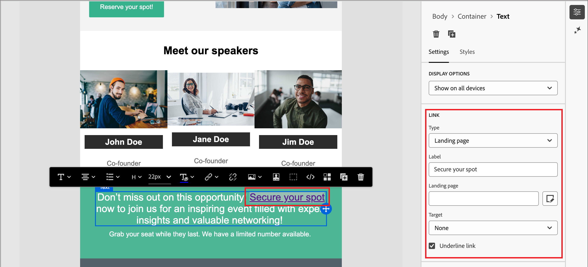

# Páginas de destino

Uma landing page é uma página da Web independente onde você pode direcionar contatos e clientes depois que eles clicarem em um item vinculado em um email, mensagem SMS ou qualquer local digital. É possível incorporar essas páginas nas jornadas da conta para que seus clientes potenciais e clientes visualizem suas mensagens na Web, além de avançar nas jornadas da conta. Você pode criar, personalizar e visualizar páginas de aterrissagem no espaço de design visual da página de aterrissagem.

Casos de uso comuns para landing pages:

* Forneça aceitar ou recusar comunicações de marketing ou um serviço específico. Use um link em um email ou outra comunicação para uma lista direcionada.
* Colete o consentimento antes de enviar comunicações e envie um email de confirmação ao aceitar ou recusar.
* Capture ou atualize os dados de perfil (criação de perfil progressiva, preferências, registros e cenários semelhantes) usando formulários nas páginas de aterrissagem.
* Direcione pessoas para informações específicas de campanha criadas para a orquestração de jornadas.
* Redirecionar pessoas para um formulário web dedicado sem criar uma página externa fora do Journey Optimizer B2B edition.

## Fluxo de trabalho da página de aterrissagem

Para direcionar membros de um público-alvo do jornada para uma página da Web definida ao clicar em um link específico, crie uma landing page no Journey Optimizer B2B edition:

1. [Criar a página](./landing-pages-create-publish.md) - Selecione uma predefinição, configure a página principal e adicione as subpáginas necessárias.
1. [Criar o conteúdo da página de aterrissagem](./landing-page-design.md) - Criar o conteúdo da página usando componentes de design visual de arrastar e soltar.
1. [Testar e publicar a página de aterrissagem](./landing-pages-create-publish.md) - Visualizar a página, testar o comportamento do formulário e publicar para ativá-la.
1. [Link para a página da sua jornada](#link-to-a-landing-page) - Adicione a URL da página de aterrissagem a um email, SMS ou ação de jornada para que os destinatários possam acessá-la.

Por exemplo, você pode criar e projetar páginas de aterrissagem para direcionar seus usuários para informações online. A página pode incluir um formulário no qual eles possam aceitar ou recusar receber suas comunicações. Ou pode ser uma oportunidade de assinar uma comunicação recorrente, como um boletim informativo.

Você pode criar, personalizar e pré-visualizar páginas de aterrissagem no espaço de design visual.

## Acessar e gerenciar páginas de destino

Para acessar páginas de aterrissagem no Journey Optimizer B2B edition, vá para a navegação à esquerda e clique em **[!UICONTROL Gerenciamento de Conteúdo]** > **[!UICONTROL Páginas de aterrissagem]**. Essa ação exibe uma lista de todas as landing pages criadas na instância.

{width="800" zoomable="yes"}

A lista é classificada de acordo com a coluna _[!UICONTROL Modificado]_, com os itens atualizados mais recentes no topo. Clique no título da coluna para alterar entre crescente e decrescente.

### Filtrar a lista de páginas de destino

Para procurar uma página de aterrissagem por nome, digite uma string de texto na barra de pesquisa para uma correspondência. Clique no ícone _Filtro_ (  ) para mostrar as opções de filtro disponíveis e alterar as configurações para filtrar os itens exibidos de acordo com seus critérios especificados.

{width="700" zoomable="yes"}

<!-- 
This is going away? ### Customize the column display

Customize the columns that you want to display in the table by clicking the _Customize table_ icon (  ) at the top right. 

In the dialog, select the columns to display and click **[!UICONTROL Apply]**.

{width="300"} 
-->

### Status e ciclo de vida da página de destino

O status da landing page determina a disponibilidade para vinculação no conteúdo de email e SMS e as alterações que você pode fazer nela.

| Status | Descrição |
| -------------------- | ----------- |
| Rascunho | Quando você cria uma página de aterrissagem, ela está no status de rascunho. Ele permanece nesse status conforme você define ou edita o conteúdo visual e até que você o publique como uma página hospedada. Ações disponíveis: <ul><li>Editar nome ou descrição<li>Editar URL do link<li>Editar no espaço de design visual<li>Publicação<li>Duplicar<li>Excluir |
| Publicado | Ao publicar uma landing page, ela é hospedada na instância do Journey Optimizer B2B edition e fica disponível para vinculação em um conteúdo de mensagem de email ou SMS. Ações disponíveis: <ul><li>Editar nome ou descrição<li>Editar URL do link<li>Adicionar link no conteúdo do email ou da mensagem SMS<li>Criar versão de rascunho<li>Duplicar<li>Excluir |
| Publicado com rascunho | Ao criar um rascunho de uma página de aterrissagem publicada, a versão publicada permanece e o conteúdo do rascunho pode ser modificado no espaço de design visual. Se você publicar a versão de rascunho, ela substituirá a versão publicada atual e o conteúdo será atualizado na página hospedada. Ações disponíveis: <ul><li>Editar nome ou descrição<li>Editar URL do link<li>Adicionar link no conteúdo do email ou da mensagem SMS<li>Editar versão de rascunho no espaço de design visual<li>Publicar versão de rascunho<li>Duplicar<li>Excluir (exclui ambas as versões)<li>Descartar rascunho (retorna ao status publicado) |

{zoomable="yes"}

## Editar uma landing page

As edições em uma landing page dependem do status atual:

* Quando a página de aterrissagem está com o status **_Rascunho_**, você pode editar os detalhes, a URL e o conteúdo visual dela.
* Quando a página de aterrissagem está no status **_Publicado_**, você pode editar a descrição, mas não o nome. Para alterar o conteúdo visual, você deve criar uma versão de rascunho da página.
* Quando a página de aterrissagem está no status **_Publicado com rascunho_**, a edição de detalhes fica limitada à descrição. Também é possível editar o conteúdo visual da versão de rascunho.

>[!BEGINTABS]

>[!TAB Rascunho]

1. Na página de listagem _[!UICONTROL Landing pages]_, clique no nome da landing page para abri-la.

   Uma visualização do conteúdo visual é exibida, com os detalhes da landing page à direita.

1. Modifique quaisquer detalhes, como nome e descrição.

   {width="700" zoomable="yes"}

1. Para fazer alterações no conteúdo do espaço de design visual, clique em **[!UICONTROL Editar página de aterrissagem]**.

   Use as ferramentas de design visual conforme necessário:

   * [Adicionar estrutura e conteúdo](./landing-page-design.md#structure-content-landing-page)
   * [Adicionar o Assets](./landing-page-design.md#add-assets)
   * [Navegar pelas camadas, configurações e estilos](./landing-page-design.md#navigate-the-layers-settings-and-styles)
   * [Personalizar conteúdo](./landing-page-design.md#personalize-content)
   * [Editar rastreamento de URL vinculado](./landing-page-design.md#edit-linked-url-tracking)

1. Clique em **[!UICONTROL Salvar]** ou **[!UICONTROL Salvar e fechar]** para retornar aos detalhes da página de aterrissagem.

1. Quando a página atender aos seus critérios e você desejar disponibilizá-la para exibição, clique em **[!UICONTROL Publicar]**.

>[!TAB Publicado]

1. Na página de listagem _[!UICONTROL Landing pages]_, clique no nome da página para abri-la.

   Uma visualização do conteúdo visual é exibida, com os detalhes da landing page à direita.

1. Modifique a descrição, se necessário.

   Para uma landing page publicada, todos os outros detalhes não podem ser alterados.

1. Para atualizar o conteúdo, clique em **[!UICONTROL Editar página de aterrissagem]** à direita.

   Clique em **[!UICONTROL Criar versão de rascunho]** na caixa de diálogo para abrir a versão de rascunho no espaço de design visual.

   {width="300"}

   Use as ferramentas de design visual conforme necessário:

   * [Adicionar estrutura e conteúdo](./landing-page-design.md#structure-content-landing-page)
   * [Adicionar o Assets](./landing-page-design.md#add-assets)
   * [Navegar pelas camadas, configurações e estilos](./landing-page-design.md#navigate-the-layers-settings-and-styles)
   * [Personalizar conteúdo](./landing-page-design.md#personalize-content)
   * [Editar rastreamento de URL vinculado](./landing-page-design.md#edit-linked-url-tracking)

1. Clique em **[!UICONTROL Salvar]** ou **[!UICONTROL Salvar e fechar]** para retornar aos detalhes da página de aterrissagem.

1. Quando a landing page de rascunho atender aos seus critérios e você quiser disponibilizar as alterações na página publicada, clique em **[!UICONTROL Publicar]**.

   Ao publicar a versão de rascunho, ela substitui a versão publicada atual e o conteúdo é atualizado para o URL da página.

>[!TAB Publicado com rascunho]

Ao abrir a landing page, a versão de rascunho é exibida. As guias na parte superior do espaço de visualização permitem alternar a exibição entre as versões publicada e de rascunho. Os rascunhos de ações e detalhes são exibidos à direita.

{width="700" zoomable="yes"}

Para atualizar o conteúdo:

1. Clique em **[!UICONTROL Editar página de aterrissagem]** na parte superior direita. Use as ferramentas de design visual conforme necessário:

   * [Adicionar estrutura e conteúdo](./landing-page-design.md#structure-content-landing-page)
   * [Adicionar o Assets](./landing-page-design.md#add-assets)
   * [Navegar pelas camadas, configurações e estilos](./landing-page-design.md#navigate-the-layers-settings-and-styles)
   * [Personalizar conteúdo](./landing-page-design.md#personalize-content)
   * [Editar rastreamento de URL vinculado](./landing-page-design.md#edit-linked-url-tracking)

1. Clique em **[!UICONTROL Salvar]** ou **[!UICONTROL Salvar e fechar]** para retornar aos detalhes da página de aterrissagem.

1. Quando a página de rascunho atender aos seus critérios e você desejar disponibilizar as alterações, clique em **[!UICONTROL Publicar]**.

   Ao publicar a versão de rascunho, ela substitui a versão publicada atual e o conteúdo é atualizado na página hospedada.

>[!ENDTABS]

## Duplicação de uma landing page

É possível duplicar uma landing page usando um dos seguintes métodos:

* Na página de listagem _[!UICONTROL Landing page]_, clique no ícone _Mais_ (**...**) ao lado do nome da página de aterrissagem, escolha **[!UICONTROL Duplicar]**.
* Na parte superior direita da página de detalhes, clique em **[!UICONTROL ... Mais]** e escolha **[!UICONTROL Duplicar]**.

{width="600" zoomable="yes"}

Na caixa de diálogo, digite um nome útil (exclusivo) e uma descrição (opcional). Clique em **[!UICONTROL Duplicar]** para concluir a ação.

{width="350"}

A página duplicada (nova) aparece na listagem _Landing pages_.

## Excluir uma página de destino

É possível excluir uma landing page usando um dos seguintes métodos:

* Na página de listagem _[!UICONTROL Landing page]_, clique no ícone _Mais_ (**...**) ao lado do nome da página de aterrissagem, escolha **[!UICONTROL Excluir]**.
* Na parte superior direita da página de detalhes, clique em **[!UICONTROL ... Mais]** e escolha **[!UICONTROL Excluir]**.

Essa ação abre uma caixa de diálogo de confirmação. Você pode anular o processo clicando em **[!UICONTROL Cancelar]** ou em **[!UICONTROL Excluir]** para confirmar a exclusão.

{width="400"}

## Link para uma landing page

Como profissional de marketing ou Designer que cria conteúdo de email, fragmento e página, você pode incorporar links às páginas de aterrissagem publicadas (online) criadas na instância do Journey Optimizer B2B edition.

1. Conforme você trabalha no espaço de design visual de um fragmento, email, página de aterrissagem ou modelo, selecione um trecho de texto, um componente de botão ou um componente de imagem para o link.

   As opções **[!UICONTROL Link]** são exibidas no painel direito.

1. Para a opção **[!UICONTROL Tipo]**, escolha **[!UICONTROL Página de aterrissagem]**.

   {width="700" zoomable="yes"}

1. Na opção **[!UICONTROL Página de aterrissagem]**, clique no ícone _Selecionar página_ (  ).

1. Na caixa de diálogo Selecionar página de aterrissagem, defina a **[!UICONTROL Origem da página de aterrissagem]** como **[!UICONTROL Journey Optimizer B2B edition]**, marque a caixa de seleção da página de aterrissagem na lista de páginas publicadas e clique em **[!UICONTROL Selecionar]**.

   {width="600" zoomable="yes"}

1. Para a opção **[!UICONTROL Target]**, escolha o comportamento de destino do link:

   * **[!UICONTROL Nenhum]** - Abre o link usando o comportamento padrão do navegador.
   * **[!UICONTROL Em branco]** - Abre o link em uma nova janela ou guia.
   * **[!UICONTROL Self]** - Abre o link no mesmo quadro.
   * **[!UICONTROL Pai]** - abre o link no quadro pai.
   * **[!UICONTROL Superior]** - Abre o link no corpo inteiro da janela.

1. (Somente link de texto) Se quiser sublinhar o texto vinculado, marque a caixa de seleção **[!UICONTROL Sublinhar link]**.

   É possível definir um estilo adicional para o texto do link, incluindo a cor do link, selecionando a guia **[!UICONTROL Estilos]** no painel direito.
