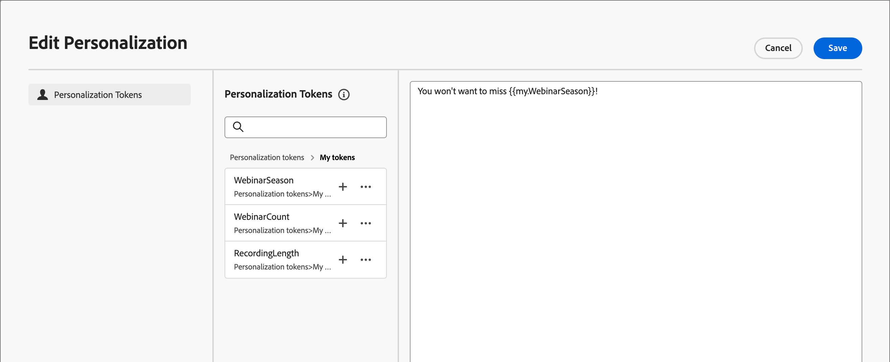

# Tokens personalizados para personalização de email

A personalização de conteúdo usa tokens como espaços reservados ou variáveis que são preenchidas quando o artefato de conteúdo é gerado. Os tokens de personalização padrão estão disponíveis para emails, landing pages, fragmentos e templates. Você também pode definir um conjunto de tokens personalizados com valores específicos para a jornada da conta. Este conjunto de tokens personalizados é chamado de _Meus tokens_, e qualquer um desses tokens personalizados serve para personalização ao [criar emails de jornada](./email-authoring.md#content-authoring---personalization).

Além de _Meus tokens_, que são específicos para a jornada da conta, você pode usar qualquer um dos tokens padrão (incorporados) para personalização de email.

## Gerenciar meus tokens {#my-tokens}

Os _Meus tokens_ são variáveis personalizadas que você cria ou modifica para uma jornada de conta no status Rascunho. Atualmente, esse conjunto de tokens personalizado oferece suporte a definições de token de texto e número.

Ao adicionar um token personalizado a um email, ele é exibido como `{{my.TokenName}}`. Por exemplo, você pode ter `{{my.EventDate}}` ou `{{my.WebinarSpeaker}}` tokens criados para gerenciar conteúdo de email relacionado a webinários futuros.

_Para acessar os tokens personalizados de uma jornada de conta:_

1. Abra a jornada da conta de rascunho.

1. Clique no menu **[!UICONTROL Mais...]** na parte superior direita e escolha **[!UICONTROL Meus tokens]**.

   {width="450"}

   A página _Meus tokens_ lista todos os tokens personalizados definidos para a jornada.

   {width="700" zoomable="yes"}

### Criar um token

1. Na página _[!UICONTROL Meus tokens]_, clique em **[!UICONTROL Criar]** e escolha o tipo de token que deseja definir:

   * **[!UICONTROL Texto]** - Use este tipo para definir um token com um valor de cadeia de caracteres de texto básico.

   * **[!UICONTROL Número]** - Use este tipo para definir um token com um valor numérico.

1. Na caixa de diálogo, insira o **[!UICONTROL Nome]** e o **[!UICONTROL Valor]** para o token.

   {width="400"}

   Não é possível usar espaços ou caracteres especiais no nome do token. Você pode usar _camel case_, como `EventType`, para usar um nome com várias palavras que seja facilmente identificado.

   Se você estiver definindo um token de _Número_, o valor poderá conter somente caracteres numéricos. Você pode usar um valor decimal.

   {width="400"}

1. Clique em **[!UICONTROL Adicionar]**.

### Editar um token

Embora a jornada da conta permaneça no status de rascunho, é possível editar qualquer um dos Meus tokens definidos.

1. Na página _[!UICONTROL Meus tokens]_, clique no ícone _Mais ações_ (**...**) ao lado do nome do token e escolha **[!UICONTROL Editar]**.

   {width="430"}

1. Na caixa de diálogo, altere o **[!UICONTROL Nome]** e o **[!UICONTROL Valor]** conforme necessário para a jornada.

   {width="400"}

1. Clique em **[!UICONTROL Editar]**.

### Excluir um token

É possível excluir um token personalizado da lista _Meus tokens_, mas verifique se ele não está sendo usado no momento no conteúdo de email da jornada.

1. Na página _[!UICONTROL Meus tokens]_, clique no ícone _Mais ações_ (**...**) ao lado do nome do token e escolha **[!UICONTROL Excluir]**.

1. No diálogo de confirmação, clique em **[!UICONTROL Excluir]**.

## Usar tokens personalizados em seu conteúdo

Ao criar conteúdo de email para sua jornada de conta, você pode usar qualquer um dos tokens da lista _Meus tokens_ ao usar as ferramentas de personalização no espaço de design visual.

1. Selecione o componente de texto e clique no ícone _Adicionar personalização_ (  ) na barra de ferramentas.

   {width="600"}

   Esta ação abre a caixa de diálogo _Editar Personalization_. A caixa de diálogo inclui uma pasta _[!UICONTROL Meus tokens]_ na biblioteca _[!UICONTROL Tokens do Personalization]_ se houver tokens personalizados definidos para a jornada de conta.

1. Expanda a pasta **[!UICONTROL Meus tokens]** e clique em **+** ou **...** para adicionar um de seus tokens personalizados ao espaço em branco.

   É possível adicionar qualquer texto estático adicional, conforme necessário.

   {width="700" zoomable="yes"}

1. Clique em **[!UICONTROL Salvar]**.
