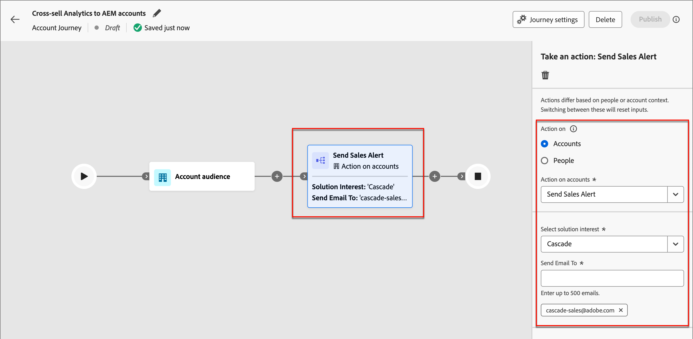

# Email de alerta de vendas

Um _email de alerta de vendas_ sinaliza a entrega de grupos de compras para Vendas. O email contém um resumo do grupo de compra e informações sobre os membros do grupo de compra e suas atividades.

Como profissional de marketing, você pode configurar um nó de email de alerta de vendas nas jornadas da conta para alertar sua equipe de vendas sobre a conclusão da jornada para grupos de compra específicos. No nó, é possível especificar os endereços de email da equipe de vendas ou um alias de distribuição que atinge um conjunto de contas.

>[!NOTE]
>
>O email de alerta de vendas será enviado se o grupo de compras tiver pelo menos quatro membros com a função de grupo de compras atribuída e se o grupo contiver uma pessoa com a função _Decisor_ ou _Influenciador_.

## Conteúdo de email

+++Email de alerta de vendas de exemplo
{width="500" zoomable="yes"}

+++

| Seção | Nome | Descrição |
| - | ---- | ----------- |
| Informações do grupo de compras | Nome do Grupo Comprador | Nome de exibição do grupo de compras. |
|   | Nome da conta | Nome da conta. |
|   | Pontuação de envolvimento | Pontuação de engajamento do grupo de compras, com base nas atividades de engajamento ativas nos últimos 30 dias. |
|   | Pontuação de integridade | Pontuação de integridade do grupo de compras. |
|   | Interesse na solução | Interesse da solução vinculado ao grupo de compras&#39; |
|   | Status | Status do grupo de compras. |
| Destaques do grupo de compras | Membros mais engajados | Principais membros envolvidos do grupo de compras por pontuação de engajamento e função do membro do grupo de compras. |
|   | Tópico de interesse | Palavras-chave mais frequentes que ocorrem no engajamento de conteúdo, com base em emails, downloads, bate-papo, revisão de PDF, resumo da atividade e perguntas do webinário. |
|   | Funções ausentes | Funções obrigatórias no modelo, mas estão ausentes no grupo de compras. |
| Resumo do grupo de compras | Resumo da atividade (viabilizado pelo Generative AI) | Resumo do grupo de compras gerado por IA com base nas atividades dos membros. As atividades dos últimos 30 dias são consideradas. |
|   | Principais momentos interessantes | Momentos interessantes recentes relacionados aos membros do grupo de compra. |
| Membros | Lista de quatro membros compradores | Detalhes dos quatro principais membros do grupo de compras por pontuação de engajamento e função. |
| Cada membro do grupo de compras | Nome do membro | Nome do membro do grupo de compra. |
|   | Título | Título do membro do grupo de compras. |
|   | Função | A função do grupo Comprador do membro. |
|   | Pontuação de envolvimento | Pontuação de engajamento do membro do grupo de compra. A pontuação é baseada em atividades de envolvimento ativo nos últimos 30 dias. |
|   | Último momento interessante | O momento mais interessante recente relacionado ao membro. |
|   | Atividades mais recentes | As duas atividades mais recentes relacionadas ao membro do grupo de compra. |
|   | ID do e-mail | ID de email do membro do grupo de compras. |
|   | Número de telefone | Número de telefone do membro do grupo de compras. |

## Adicionar uma ação de email de alerta de vendas em uma jornada de conta

Você pode configurar entregas de email de alerta de vendas em uma jornada de conta ao adicionar um nó _[!UICONTROL Realizar uma ação]_ e fazer o seguinte:

1. Para o destino _[!UICONTROL Ação em]_, escolha **[!UICONTROL Conta]**.

1. Para _[!UICONTROL Ação nas contas]_, escolha **[!UICONTROL Enviar Alerta de Vendas]**.

1. Para **[!UICONTROL Selecionar interesse da solução]**, escolha o interesse da solução a ser usado para o conteúdo de email gerado.

1. Para **[!UICONTROL Enviar Email para]**, insira cada endereço de email ou alias que você deseja incluir para a entrega.

   {width="600" zoomable="yes"}

   Depois que a jornada da conta é publicada, o Alerta de vendas é entregue de acordo com esses parâmetros.
