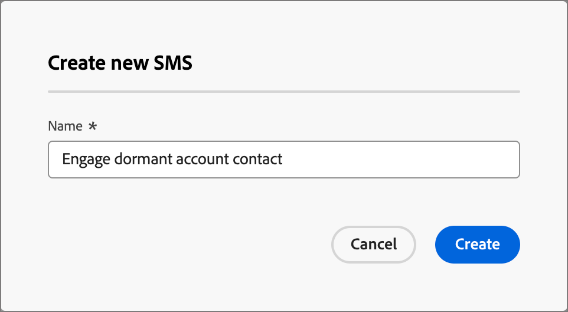

# Criação de SMS

Use o Adobe Journey Optimizer B2B edition para enviar mensagens de texto (SMS) para seus clientes em seus dispositivos móveis. Você pode criar, personalizar e visualizar mensagens em formato de texto no editor de SMS.

Antes de criar mensagens SMS para jornadas de conta, verifique se o [provedor de serviços SMS está configurado](../admin/configure-channels-sms.md) nas configurações do _[!UICONTROL Administrador]_.

## Adicionar uma ação de SMS em uma jornada de conta

Você pode configurar entregas de mensagens de texto em uma jornada de conta ao adicionar um nó _[!UICONTROL Realizar uma ação]_ e fazer o seguinte:

1. Para o destino _[!UICONTROL Ação em]_, escolha **[!UICONTROL Pessoas]**.

1. Para a _[!UICONTROL Ação sobre pessoas]_, escolha **[!UICONTROL Enviar SMS]**.

   {width="800" zoomable="yes"}

1. Na parte inferior do painel _[!UICONTROL Realizar uma ação]_, clique em **[!UICONTROL Criar SMS]**.

1. Na caixa de diálogo, digite um **[!UICONTROL Nome]** exclusivo para a mensagem SMS.

   {width="400"}

1. Clique em **[!UICONTROL Criar]**.

   O _mapa de Jornadas_ é aberto e você pode criar a mensagem e definir as propriedades de SMS para enviar a mensagem.

### Criar a mensagem SMS

>[!IMPORTANT]
>
>**Gerenciamento de consentimento de SMS** 
>
>De acordo com os padrões e regulamentos do setor, todas as mensagens de marketing por SMS devem conter uma maneira de os recipients cancelarem facilmente a inscrição. Para fazer isso, os destinatários de SMS podem responder com palavras-chave de aceitação e recusa. Todas as palavras-chave padrão de aceitação e recusa são compatíveis e respeitadas. Além disso, qualquer palavra-chave personalizada configurada para sua conta de provedor de serviços SMS é compatível e respeitada.

Digite o texto que deseja enviar no campo **[!UICONTROL Mensagem]**.

Você pode criar uma mensagem de até 1600 caracteres, a cada 160 caracteres considerados como uma única mensagem SMS.

{width="800" zoomable="yes"}

#### Personalizar a mensagem de texto

1. A qualquer momento durante a criação da mensagem de texto, clique no ícone _Personalizar_ (  ) à direita da caixa de mensagem de texto.

   A página exibida fornece acesso aos tokens do Adobe Marketo Engage Lead e do Sistema. Os tokens padrão e personalizados estão incluídos. Você pode usar a barra _Pesquisa_ para localizar o token necessário ou navegar pela árvore de pastas para localizar e selecionar qualquer um dos tokens de cliente potencial/sistema.

1. Coloque o cursor no local da mensagem em que deseja adicionar o token.

1. Adicione um token clicando no sinal de adição ( **+** ) ao lado dele.

   Para adicionar o token com um fallback (padrão exibido caso o campo não esteja disponível para um cliente potencial), clique no ícone _Mais_ ( **...** ) e escolha **[!UICONTROL Inserir com texto de fallback]**.

   {width="700" zoomable="yes"}

1. Na caixa de diálogo _[!UICONTROL Inserir valor de fallback]_, insira o texto que aparece como um fallback e clique em **[!UICONTROL Adicionar]**.

   {width="400"}

1. Quando os tokens de personalização forem colocados, clique em **[!UICONTROL Salvar]** para salvar as alterações e retornar ao espaço de trabalho de criação do SMS principal.

   Você pode continuar a editar a mensagem com os tokens conforme necessário.

#### Adicionar links (URLs) à mensagem de texto

1. Depois de inserir o texto da mensagem, clique no ícone _Link_ (  ) à direita da caixa de mensagem de texto.

1. Na caixa de diálogo, escolha o tipo de URLs a serem vinculados:

   * **[!UICONTROL Página de aterrissagem]** - Escolha essa opção para selecionar qualquer uma das páginas de aterrissagem aprovadas do Adobe Marketo Engage da sua instância do Marketo Engage. Selecione o espaço de trabalho e selecione a landing page.

   * **[!UICONTROL URL Externa]** - Esse tipo é qualquer URL externa que você digitar na caixa de texto.

1. Se você optar por usar uma landing page, defina as opções de rastreamento.

   * **[!UICONTROL Habilitar rastreamento]** - Marque esta caixa de seleção para habilitar o rastreamento, o que requer _redução_ da URL. Para uma página de aterrissagem, ela usa o subdomínio do Marketo Engage para o URL mais curto. Uma amostra do formato de URL mais curto é exibida. O URL real é criado quando o SMS é enviado ao recipient.

   * **[!UICONTROL Incluir mkt_tok]** - Marque esta caixa de seleção para rastrear a atividade em relação a um usuário.

     >[!NOTE]
     >
     >Se você permitir o rastreamento, mas desabilitar _[!UICONTROL Incluir mkt_tok]_, a URL de destino não incluirá o parâmetro da cadeia de caracteres de consulta `mkt_tok` após o redirecionamento. Esse parâmetro é usado pelas páginas de aterrissagem do Marketo Engage e pelo Munchkin para garantir que o rastreamento das atividades da pessoa (como quando uma pessoa cancela a assinatura de um email). Não desabilite esta opção, a menos que o parâmetro esteja causando problemas em seu site. 
     >Para obter mais informações sobre como usar os códigos de rastreamento do Munchkin no seu site, consulte a [documentação do Marketo Engage](https://experienceleague.adobe.com/pt-br/docs/marketo/using/product-docs/administration/additional-integrations/add-munchkin-tracking-code-to-your-website){target="_blank"}.

   {width="470"}

1. Quando as opções de link estiverem concluídas, clique em **[!UICONTROL Adicionar]** para salvar as alterações e adicionar o link de URL à mensagem SMS.

### Definir as propriedades do SMS

1. Na seção _[!UICONTROL Propriedades de SMS]_, insira um **[!UICONTROL Nome]** (obrigatório, máximo de 100 caracteres) e uma **[!UICONTROL Descrição]** (opcional, máximo de 300 caracteres) para a mensagem.

   São permitidos caracteres Alpha, numéricos e especiais nesses campos. Os seguintes caracteres reservados são **não permitidos**: `\`, `/`, `:`, `*`, `?`, `"`, `<`, `>` e `|`.

1. Escolha o **[!UICONTROL Tipo de SMS]**:

   * Use `Marketing` para mensagens de texto promocionais, que exigem o consentimento do usuário.
   * Use `Transactional` para mensagens não comerciais, como confirmação de pedidos, notificações de redefinição de senha ou informações de entrega.

1. Para **[!UICONTROL configuração de SMS]**, escolha uma das configurações de API predefinidas.

   Esta configuração determina qual provedor de serviço de gateway SMS e conta são usados para entregar a mensagem.

1. Digite o **[!UICONTROL Número do remetente]** &#x200B;que você deseja usar para suas comunicações.

   {width="700" zoomable="yes"}

   O número do recipient é sempre mapeado para o campo `Lead.mobilePhone` no Marketo Engage.

### Simular o conteúdo da mensagem de texto {#preview-test}

>[!CONTEXTUALHELP]
>id="ajo-b2b_sms_preview_simulate"
>title="Verificar como o conteúdo está sendo renderizado"
>abstract="Após o conteúdo ser definido, é possível visualizar e verificar a renderização para o canal que está sendo utilizado."

Quando o conteúdo da mensagem é definido, você pode usar perfis de teste para simular (pré-visualizar) o conteúdo. Se você inseriu conteúdo personalizado, é possível verificar como esse conteúdo é exibido na mensagem usando os dados do perfil de teste.

>[!IMPORTANT]
>
>Salve a mensagem SMS antes de continuar a simular a mensagem de texto.

1. Clique em **[!UICONTROL Simular Conteúdo]** na parte superior do espaço de trabalho de criação do SMS.

1. Na página _[!UICONTROL Simular Conteúdo]_, clique em **[!UICONTROL Adicionar Pessoas]**.

1. Use a página _Simular Conteúdo_ para gerenciar os clientes em potencial usados para seu perfil de teste.

   Na lista exibida, procure e adicione qualquer um dos leads (até 10 leads de cada vez) do banco de dados de leads da Marketo Engage.

   Para pesquisar, digite o endereço de email completo e pressione _Enter_. O perfil de lead correspondente é exibido para seleção.

   A visualização atualiza os campos de personalização do perfil selecionado.

   Todos os clientes em potencial adicionados aparecem à esquerda.

   Você pode gerenciar essa lista adicionando mais pessoas e excluindo clientes potenciais individuais da lista de perfis (ela não os remove do banco de dados).

1. Simular conteúdo para um cliente potencial selecionado.

   Selecione qualquer um dos clientes em potencial listados à esquerda. A visualização do SMS na página atualiza o lead selecionado.

   Você também pode selecionar um cliente potencial no seletor acima do espaço de visualização para atualizar a visualização do SMS na página do cliente potencial correspondente.

1. Para sair da página _[!UICONTROL Simular Conteúdo]_ e retornar ao espaço de trabalho de criação do SMS, clique em **[!UICONTROL Fechar]** na parte superior direita.

## Gerenciamento de consentimento por SMS

Oferecer aos recipients a capacidade de cancelar a inscrição para receber comunicações de uma marca e honrar essa escolha é um requisito legal. O não cumprimento desses regulamentos traz riscos legais para sua marca. Essa função também ajuda a evitar o envio de comunicações não solicitadas para seus recipients, o que pode fazer com que eles marquem suas mensagens como spam e prejudiquem sua reputação.

Quando você fornece essa opção, os destinatários de SMS podem responder com palavras-chave de aceitação e recusa. Todas as palavras-chave padrão de aceitação e recusa são compatíveis e respeitadas, bem como todas as palavras-chave personalizadas configuradas no provedor de serviços SMS. Quando a assinatura é cancelada, os perfis são removidos automaticamente do público-alvo de futuras mensagens de marketing.

O Journey Optimizer B2B edition fornece a capacidade de gerenciar a opção de não participação em mensagens SMS usando a seguinte lógica:

* Por padrão, se um cliente potencial optar por não receber comunicações de você, o perfil correspondente será excluído dos deliveries de SMS subsequentes

* Esse consentimento principal vindo de diferentes fontes (como o AEP ou o provedor de serviços SMS) é sincronizado com o Journey Optimizer B2B edition. Atualmente, ele suporta apenas um único estado de consentimento por lead no nível da instância (uma &quot;John Doe&quot; lead recebe ou cancela a assinatura de todos os SMS promocionais na instância). No momento, não há suporte para aceitação dupla no nível da marca/consentimento no nível da lista de assinaturas individuais.
