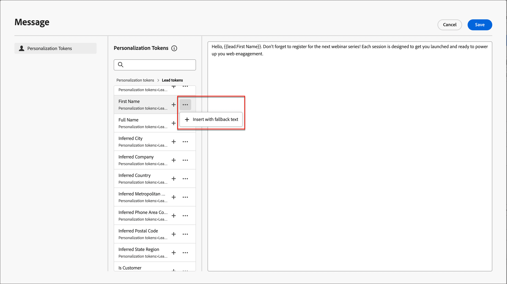

# Criação de SMS

Use o Adobe Journey Optimizer B2B Edition para enviar mensagens de texto (SMS) aos clientes em seus dispositivos móveis. Você pode criar, personalizar e visualizar mensagens no formato de texto do editor de SMS.

## Configurações de SMS

O Adobe Journey Optimizer B2B Edition envia mensagens de texto por meio de provedores de serviços SMS (ou provedores de gateway SMS). Antes de criar a mensagem SMS, configure o provedor de serviços nas configurações do Administrador.

### Provedores de serviços de gateway de SMS

Atualmente, o Adobe Journey Optimizer B2B Edition está integrado a provedores de terceiros que oferecem serviços de mensagens de texto de forma independente. Os provedores de mensagens de texto compatíveis são Sinch, Twilio e Infobip.

Antes de configurar um canal SMS no Adobe Journey Optimizer B2B Edition, você deve criar uma conta com um desses provedores para obter o token da API e a ID do serviço. Essas credenciais são necessárias para configurar a conexão entre o Adobe Journey Optimizer B2B Edition e o provedor aplicável.

>[!IMPORTANT]
>
>O uso dos serviços de mensagens de texto está sujeito a termos e condições adicionais do provedor aplicável. Como soluções de terceiros, o Sinch, o Twilio e o Infobip estão disponíveis para usuários do Adobe Journey Optimizer B2B Edition por meio de uma integração. A Adobe não controla e não é responsável por produtos de terceiros. Em caso de problemas ou solicitações de assistência relacionados aos serviços de mensagens de texto (SMS), entre em contato com seu provedor.

### Verificar uma configuração de API de SMS existente

>[!NOTE]
>
>As configurações descritas podem ser acessadas somente pelos usuários com privilégios de administrador de SMS.

Na navegação à esquerda, expanda a seção **[!UICONTROL Administrador]** e clique em **[!UICONTROL Configuração]**.

{width="800" zoomable="yes"}

A página lista as configurações de API disponíveis para sua instância. Você pode filtrar as credenciais de API exibidas pelo provedor de serviços SMS ou criador.

{width="500"}

### Criar novas credenciais de API para um provedor de serviços SMS

>[!BEGINTABS]

>[!TAB Sinch]

_Para configurar o Sinch como seu provedor de SMS com o Adobe Journey Optimizer B2B Edition:_

1. Na navegação à esquerda, expanda a seção **[!UICONTROL Administrador]** e clique em **[!UICONTROL Configuração]**.

1. Clique em **[!UICONTROL Criar novas credenciais de API]** na parte superior direita da lista _[!UICONTROL Credenciais de API]_.

1. Configurar suas credenciais da API de SMS:

   {width="500"}

   * **[!UICONTROL Fornecedor de SMS]** - Escolha `Sinch` como o provedor de SMS.

   * **[!UICONTROL Nome]** - Digite um nome para a credencial da API.

   * **[!UICONTROL ID de Serviço]** e **[!UICONTROL Token de API]** - Acesse a página de APIs da sua conta Sinch (você pode encontrar suas credenciais na guia SMS).

   Para obter mais informações sobre como encontrar essas informações para sua conta Sinch, consulte a [documentação do desenvolvedor da Sinch](https://developers.sinch.com/docs/sms/getting-started/#2-get-credentials)

1. Clique em **[!UICONTROL Enviar]** quando os detalhes de configuração das suas credenciais de API estiverem concluídos.

>[!TAB Twilio]

_Para configurar o Twilio como seu provedor de SMS com o Adobe Journey Optimizer B2B Edition:_

1. Na navegação à esquerda, expanda a seção **[!UICONTROL Administrador]** e clique em **[!UICONTROL Configuração]**.

1. Clique em **[!UICONTROL Criar novas credenciais de API]** na parte superior direita da lista _[!UICONTROL Credenciais de API]_.

1. Configurar suas credenciais da API de SMS:

   {width="500"}

   * **[!UICONTROL Fornecedor de SMS]** - Escolha `Twilio` como o provedor de SMS.

   * **[!UICONTROL Nome]** - Digite um nome para a definição de credencial de API.

   * **[!UICONTROL SID da Conta]** e **[!UICONTROL Token de Autenticação]** - Acesse o painel _Informações da Conta_ da página Painel do Console do Twilio para encontrar suas credenciais.

   Para obter mais informações sobre como encontrar essas informações para sua conta do Twilio, consulte a [Central de Ajuda do Twilio](https://help.twilio.com/articles/14726256820123-What-is-a-Twilio-Account-SID-and-where-can-I-find-it-).

1. Clique em **[!UICONTROL Enviar]** no canto superior direito da página quando os detalhes de configuração das suas credenciais de API forem concluídos.

>[!TAB Infobip]

_Para configurar o Infobip como seu provedor de SMS com o Adobe Journey Optimizer B2B Edition:_

1. Na navegação à esquerda, expanda a seção **[!UICONTROL Administrador]** e clique em **[!UICONTROL Configuração]**.

1. Clique em **[!UICONTROL Criar novas credenciais de API]** na parte superior direita da lista _[!UICONTROL Credenciais de API]_.

1. Configurar suas credenciais da API de SMS:

   {width="500"}

   * **[!UICONTROL Fornecedor de SMS]** - Escolha `Infobip` como o provedor de SMS.

   * **[!UICONTROL Nome]** - Digite um nome para a definição de credencial de API.

   * **[!UICONTROL URL de base de API]** e **[!UICONTROL chave de API]** - Acesse a página inicial da interface da Web ou a página de gerenciamento de chaves de API da sua conta Infobip para encontrar suas credenciais.

   Para obter mais informações sobre como encontrar essas informações para sua conta Infobip, consulte a [documentação do Infobip](https://www.infobip.com/docs/api/_blank).

1. Clique em **[!UICONTROL Enviar]** no canto superior direito da página quando os detalhes de configuração das suas credenciais de API forem concluídos.

>[!ENDTABS]

Ao clicar em _[!UICONTROL Enviar]_, as credenciais são imediatamente validadas e salvas, redirecionando você para a página de listagem _[!UICONTROL credenciais de API]_. Se as credenciais enviadas forem inválidas, o sistema exibirá uma mensagem de erro na página de listagem. Nesse caso, você pode optar por cancelar a configuração ou atualizá-la e enviar novamente.

## Adicionar uma ação de SMS em uma jornada de conta

Você pode configurar entregas de mensagens de texto em uma Jornada de conta ao adicionar um nó _[!UICONTROL Realizar uma ação]_ e fazer o seguinte:

1. Para o destino _[!UICONTROL Ação em]_, escolha **[!UICONTROL Pessoas]**.

1. Para a _[!UICONTROL Ação sobre pessoas]_, escolha **[!UICONTROL Enviar SMS]**.

   {width="800" zoomable="yes"}

1. Na parte inferior do painel _[!UICONTROL Realizar uma ação]_, clique em **[!UICONTROL Criar SMS]**.

1. Na caixa de diálogo, insira um **[!UICONTROL Nome]** exclusivo para o email e uma **[!UICONTROL Linha de assunto]**.

   {width="500"}

## Criar a mensagem SMS

>[!IMPORTANT]
>
>**Gerenciamento de consentimento de SMS** 
> 
>De acordo com os padrões e regulamentos do setor, todas as mensagens de marketing por SMS devem conter uma maneira de os recipients cancelarem facilmente a inscrição. Para fazer isso, os destinatários de SMS podem responder com palavras-chave de aceitação e recusa. Todas as palavras-chave padrão de aceitação e recusa são compatíveis e respeitadas. Além disso, qualquer palavra-chave personalizada configurada para sua conta de provedor de serviços SMS é compatível e respeitada.

1. Digite o texto que deseja enviar no campo **[!UICONTROL Mensagem]**.

   Você pode criar uma mensagem de até 1600 caracteres, a cada 160 caracteres considerados como uma única mensagem SMS.

1. **Personalizar a mensagem de texto**.

   A qualquer momento durante a criação da mensagem de texto, clique no ícone _Personalizar_ à direita da caixa de mensagem de texto.

   {width="800" zoomable="yes"}

   A página exibida fornece acesso aos tokens do Adobe Marketo Engage Lead e do Sistema. Os tokens padrão e personalizados estão incluídos. Você pode usar a barra de pesquisa para localizar o token necessário ou navegar pela árvore de pastas para localizar e selecionar qualquer um dos tokens de lead/sistema.

   Coloque o cursor no local da mensagem em que deseja adicionar o token. Adicione um token clicando no sinal de adição ( **+** ) ao lado dele. Para adicionar o token com um fallback (padrão exibido caso o campo não esteja disponível para um cliente potencial), clique nas reticências ( **...** ) e escolha **[!UICONTROL Inserir com texto de fallback]**.

   {width="700" zoomable="yes"}

   Na caixa de diálogo _[!UICONTROL Inserir valor de fallback]_, insira o texto que aparece como um fallback e clique em **[!UICONTROL Adicionar]**.

   {width="400"}

   Quando os tokens de personalização forem colocados, clique em **[!UICONTROL Salvar]** para salvar as alterações e retornar ao espaço de trabalho de criação do SMS principal. Você pode continuar a editar a mensagem com os tokens conforme necessário.

<!-- 1. **Add URLs to text message**.

   After defining your content, you can add URLs to your message by clicking the _Link_ icon.
   
   You can add two types of URLs: 

   External URLs - This is ANY external URL that can be directly typed into/ pasted into the input text box
   Adobe Marketo Engage Design Studio Landing Pages - Selecting this option, you will see a 'Landing Page picker' from which you can select any of the listed approved Landing Pages from Marketo Engage

   You can choose to 'shorten' either of these URLs by selecting the checkbox
   Note that the URL shortening function, uses the Marketo subdomain for shortening
   The shortened URL appears as a read-only field within the modal
   You can optionally track clicks on the URL
   You can also choose to include 'mkt_tok' for tracking activity against a user
   Click on Add to save changes & add the chosen URL to the SMS message
-->

## Definir as propriedades do SMS

1. Na seção _[!UICONTROL Propriedades de SMS]_, insira um **[!UICONTROL Nome]** (obrigatório, máximo de 100 cha\racter) e uma **[!UICONTROL Descrição]** (opcional, máximo de 300 caracteres) para a mensagem.

   Caracteres especiais, numéricos e de Alpha são permitidos nesses campos. Os seguintes caracteres reservados são **não permitidos**: `\`, `/`, `:`, `*`, `?`, `"`, `<`, `>` e `|`.

1. Escolha o **[!UICONTROL Tipo de SMS]**:

   * Use `Marketing` para mensagens de texto promocionais, que exigem o consentimento do usuário.
   * Use `Transactional` para mensagens não comerciais, como confirmação de pedidos, notificações de redefinição de senha ou informações de entrega.

1. Para **[!UICONTROL configuração de SMS]**, escolha uma das configurações de API predefinidas.

   Esta configuração determina qual provedor de serviço de gateway SMS e conta são usados para entregar a mensagem.

1. Digite o **[!UICONTROL Número do remetente]** &#x200B;que você deseja usar para suas comunicações.

   {width="700" zoomable="yes"}

   O número do destinatário é sempre mapeado para o campo `Lead.MainPhone` no Marketo Engage.

<!-- ## Preview the text message content

When your message content is defined, you can use test profiles to preview its content. If you inserted personalized content, you can check how this content is displayed in the message, using test profile data.

1. Click **[!UICONTROL Simulate Content]** at the top of the SMS authoring workspace.

1. From the _[!UICONTROL Simulate Content]_ page, click **[!UICONTROL Add People]**.

1. Use the # page to manage the leads used for your test profile.

   In the displayed list, you can search for and add any of the leads (up to 10 leads at a time) from the Marketo Engage lead database.

   To search, enter the whole email address and click enter. The corresponding lead profile shows up for selection.

   The preview updated to the personalization fields for the selected profile.

   All the added leads appear on the left rail of the 'Simulate Content' page

   You can manage this list by adding more people and deleting individual leads from the profile listing (it does not remove them from the database).

1. Simulate content for a lead.

   Select any of the leads listed on the left rail of the Simulate Content page and the SMS preview on the page updates for the corresponding lead.

   You can also select a lead from the 'drop-down' box above the preview space and the SMS preview on the page updates for the corresponding lead

1. To exit the _[!UICONTROL Simulate Content]_ page and return back to the SMS authoring workspace, click Close. -->
