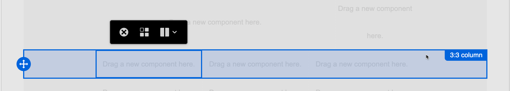
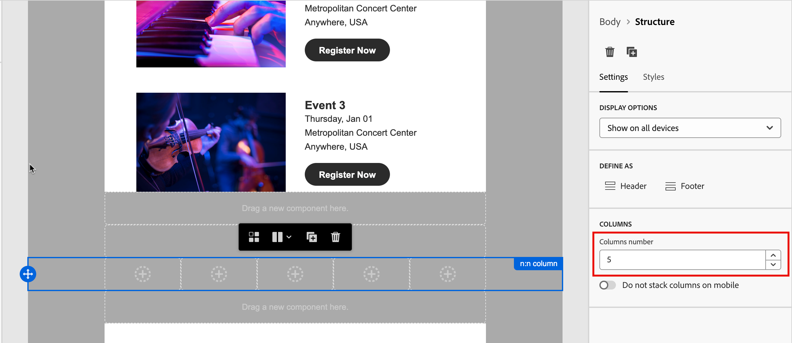

# Componentes da estrutura {#structure-components}

>[!CONTEXTUALHELP]
>id="ajo-b2b_structure_components_email"
>title="Sobre os componentes da estrutura"
>abstract="Componentes da estrutura são elementos do layout que podem ser usados para criar a estrutura de um email."

>[!CONTEXTUALHELP]
>id="ajo-b2b_structure_components_landing_page"
>title="Sobre os componentes da estrutura"
>abstract="Componentes da estrutura são elementos do layout que podem ser usados para criar a estrutura de uma página."

>[!CONTEXTUALHELP]
>id="ajo-b2b_structure_components_fragment"
>title="Sobre os componentes da estrutura"
>abstract="Componentes da estrutura são elementos do layout que podem ser usados para criar a estrutura de um fragmento."

>[!CONTEXTUALHELP]
>id="ajo-b2b_structure_components_template"
>title="Sobre os componentes da estrutura"
>abstract="Componentes da estrutura são elementos do layout que podem ser usados para criar a estrutura de um modelo."

Use os _Componentes da estrutura_ no espaço de design visual para definir a estrutura do seu conteúdo. Ao adicionar e mover elementos estruturais com ações simples de arrastar e soltar, é possível definir rapidamente a forma do layout de conteúdo. Cada componente da estrutura abrange o espaço horizontal e você pode empilhá-los para criar o layout verticalmente. Divida cada componente em colunas para formar cada bloco de conteúdo necessário.

## Biblioteca de estrutura

Na parte superior da biblioteca _[!UICONTROL Componentes]_, a seção **[!UICONTROL Estruturas]** exibe os componentes de estrutura disponíveis:

| Ícone | Componente. | Descrição |
| ----- | ----------- | ----------- |
| Ícone de coluna  | [!UICONTROL 1:1 coluna] | Um container de coluna única que preenche a largura do espaço. |
| Ícone de coluna  | [!UICONTROL 1:2 coluna à esquerda] | Um contêiner de duas colunas que usa uma proporção de 1:2 para preencher a largura do espaço. A primeira coluna (à esquerda) ocupa um terço da largura e a segunda (à direita) ocupa os dois terços restantes. |
| Ícone de coluna  | [!UICONTROL 1:3 coluna à esquerda] | Um contêiner de duas colunas que usa uma proporção de 1:3 para preencher a largura do espaço. A primeira coluna (à esquerda) ocupa um quarto da largura e a segunda (à direita) ocupa os três quartos restantes. |
| Ícone de coluna  | [!UICONTROL 2:1 coluna à direita] | Um contêiner de duas colunas que usa uma proporção de 2:1 para preencher a largura do espaço. A primeira coluna (à esquerda) ocupa dois terços da largura e a segunda (à direita) ocupa o terço restante. |
| Ícone de coluna  | [!UICONTROL 2:2 coluna] | Um contêiner de duas colunas que usa uma proporção de 2:2 para preencher a largura do espaço. As colunas da esquerda e da direita têm a mesma largura. |
| Ícone de coluna  | [!UICONTROL 3:1 coluna à direita] | Um contêiner de duas colunas que usa uma proporção de 3:1 para preencher a largura do espaço. A primeira coluna (à esquerda) ocupa três quartos (75%) da largura e a segunda (à direita) ocupa o quarto restante (25%). |
| Ícone de coluna  | [!UICONTROL 3:3 coluna] | Um contêiner de três colunas que usa uma proporção de 3:3 para preencher a largura do espaço. Todas as três colunas têm a mesma largura. |
| Ícone de coluna  | [!UICONTROL 4:4 coluna] | Um contêiner de quatro colunas que usa uma proporção de 4:4 para preencher a largura do espaço. Todas as quatro colunas têm a mesma largura. |
| Ícone de coluna  | [!UICONTROL n:n coluna] | Uma estrutura de coluna personalizável que preenche o espaço de acordo com as colunas definidas. Você define o número de colunas (entre duas e dez) e define a largura de cada coluna individualmente. [Saiba mais](#change-nn-columns) |

## Adicionar componentes de estrutura

Ao projetar o conteúdo para seu email, página de aterrissagem ou fragmento, adicione cada componente de estrutura para criar o layout. Arraste um item da seção **[!UICONTROL Estruturas]** à esquerda e solte-o na tela. Você pode usar a barra de ferramentas para selecionar uma coluna e usar as guias _Configurações_ e _Estilos_ no painel direito para definir os parâmetros do componente ou da coluna selecionada.

{width="800" zoomable="yes"}

### Barra de ferramentas do componente

A barra de ferramentas é exibida na tela quando você a seleciona na tela. As ferramentas disponíveis fornecem uma maneira fácil de selecionar uma coluna e aplicar funções de componentes.

{width="150"}

| Ferramenta | Nome | Uso |
| ---- | ---- | ----- |
| {width="40"} | Ativar conteúdo condicional | Habilitar variantes condicionais para o componente. [Saiba mais](./conditional-content.md) |
| {width="100"} | Selecionar uma coluna | Selecione uma coluna por número. Quando a coluna é selecionada, é possível aplicar configurações e estilos de coluna. |
| {width="40"} | Duplicar | Crie uma cópia do componente e adicione-a diretamente abaixo. |
| {width="40"} | Excluir | Remova o componente. |

### Configurações de componentes

Depois de adicionar um componente, ele é selecionado no espaço de design visual e suas propriedades são exibidas no painel direito. A guia _[!UICONTROL Configurações]_ é exibida por padrão. Você também pode selecionar um componente de estrutura a qualquer momento para alterar as configurações.

#### Opções de exibição

Se desejar excluir o componente da exibição de desktop ou dispositivo móvel, altere a configuração **[!UICONTROL Opções de Exibição]**. O padrão, _[!UICONTROL Mostrar em todos os dispositivos]_, habilita a exibição em todos os dispositivos.

{width="400" zoomable="yes"}

Escolha outra configuração para tornar o componente exclusivo por tipo de dispositivo:

* _[!UICONTROL Mostrar apenas em dispositivos desktop]_ - Escolha esta configuração quando desejar exibir o componente em dispositivos desktop e excluí-lo de dispositivos móveis.
* _[!UICONTROL Mostrar apenas em dispositivos móveis]_ - Escolha essa configuração quando desejar exibir o componente em dispositivos móveis, como telefones e tablets, e excluí-lo de dispositivos desktop.

#### Cabeçalho e rodapé

Você pode designar um componente de estrutura como o cabeçalho ou rodapé do HTML na mensagem de email ou página de aterrissagem. Com o componente de estrutura selecionado na tela, clique na opção **[!UICONTROL Cabeçalho]** ou **[!UICONTROL Rodapé]**. Pode haver apenas um cabeçalho ou rodapé e a opção não estará disponível se outro componente for atribuído.

{width="600" zoomable="yes"}

Você pode remover a designação do cabeçalho ou rodapé selecionando o componente e clicando na opção para removê-lo.

### Colunas empilhadas

Para telas menores ou janelas de exibição, as colunas no componente de estrutura são exibidas como empilhadas, a menos que você altere a configuração padrão. Com o componente de estrutura de várias colunas selecionado, altere a configuração **[!UICONTROL Não empilhar colunas em dispositivos móveis]** movendo o controle deslizante para a direita.

{width="250"}

## Estilos de componentes

Depois de adicionar um componente, ele é selecionado no espaço de design visual e suas propriedades são exibidas no painel direito. Você também pode selecionar um componente a qualquer momento para alterar as configurações e os estilos.

### Histórico

Com a guia _[!UICONTROL Estilos]_ selecionada no painel direito, use a seção **[!UICONTROL Plano de fundo]** para definir a cor e a imagem opcional a serem usadas como plano de fundo para o componente de estrutura.

#### [!UICONTROL Cor do plano de fundo]

Marque a caixa de seleção e clique no quadrado de cores para escolher uma cor no seletor. Você pode escolher uma cor inserindo um valor RGB, HSL, HSB ou hexadecimal conhecido. Ou use o controle deslizante de cores e o campo de cores para selecionar a cor.

{width="300"}

#### [!UICONTROL Imagem de plano de fundo]

Mova o seletor de alternância para ativar as configurações de imagem do plano de fundo.

{width="250"}

Escolha o [tipo de origem do ativo](./assets-overview.md) e selecione o arquivo de imagem:

+++[!UICONTROL Marketo Engage Assets]

{{me-dam}}

+++

+++[!UICONTROL Experience Manager Assets]

{{aem-assets-dam}}

+++

+++[!UICONTROL Importar mídia]

{{image-upload}}

+++

Use a opção **[!UICONTROL Posicionamento da imagem]** para escolher como a imagem preenche o componente de estrutura. As configurações de posicionamento seguem os [atributos padrão de alinhamento e preenchimento da imagem de plano de fundo do HTML](https://www.w3schools.com/html/html_images_background.asp){target="_blank"}.

{width="250"}

### Outros estilos

Você pode aplicar outros estilos de componentes de estrutura para ajustar a exibição na mensagem de email ou página de aterrissagem.

+++Borda

{{styles-border}}

+++

+++Margem

{{styles-margin}}

+++

+++Avançado

{{styles-advanced}}

+++

## Colunas

Use a ferramenta _Selecionar uma coluna_ na barra de ferramentas do componente para selecionar uma coluna. Em seguida, você pode usar a barra de ferramentas da coluna para alterar a seleção da coluna, remover a coluna ou aplicar variações de conteúdo condicional à coluna. Os parâmetros da coluna são exibidos nas guias _[!UICONTROL Configurações]_ e _[!UICONTROL Estilos]_ à direita.

{width="500"}

| Ferramenta | Nome | Uso |
| ---- | ---- | ----- |
| {width="40"} | Limpar coluna | Limpe o conteúdo na coluna. |
| {width="40"} | Ativar conteúdo condicional | Habilitar variantes condicionais para a coluna. [Saiba mais](./conditional-content.md) |
| {width="100"} | Selecionar uma coluna | Selecione uma coluna por número. Quando a coluna é selecionada, é possível aplicar configurações e estilos. |

### Alterar n:n colunas

As larguras das colunas são estáticas para a maioria dos componentes da estrutura. Ao adicionar o componente _[!UICONTROL n:n coluna]_, você pode alterar o número de colunas e o tamanho da coluna. O componente de coluna n:n começa com cinco colunas de largura igual (20%).

>[!NOTE]
>
>Cada tamanho de coluna não pode ser menor que 10% da largura total do componente de estrutura. Somente colunas vazias podem ser removidas.

Com o componente selecionado na tela, use a opção **[!UICONTROL Colunas número]** no painel direito para alterar o número de colunas. Clique nos ícones de seta para cima e para baixo para aumentar ou diminuir o número de colunas ou insira o número no campo.

{width="650" zoomable="yes"}

Na tela de desenho, mova o ícone de dimensionamento de coluna para ajustar a largura da coluna selecionada. À medida que você aumenta ou diminui a largura, a coluna adjacente também se ajusta para que todas as colunas ocupem 100% da largura do componente.

{width="500" zoomable="yes"}

### Estilos de coluna

Com a coluna selecionada na tela de desenho, é possível definir estilos para serem aplicados a essa coluna.

+++Histórico

* **[!UICONTROL Cor do plano de fundo]** - Marque a caixa de seleção e clique no quadrado de cores para escolher uma cor no seletor. Você pode escolher uma cor inserindo um valor RGB, HSL, HSB ou hexadecimal conhecido. Ou você pode usar o controle deslizante de cores e o campo de cores para selecionar a cor.

  {width="300"}

* **[!UICONTROL Imagem de plano de fundo]** - Mova o seletor de alternância para habilitar as configurações de imagem de plano de fundo.

  {width="250"}

  Escolha o tipo de origem do ativo e [selecione um arquivo de imagem](#background-image).

+++

+++Borda

{{styles-border}}

+++

+++Alinhamento

{{styles-alignment-v}}

+++

+++Margem

{{styles-margin}}

+++

+++Avançado

{{styles-advanced}}

+++

## Árvore de navegação

No espaço de design visual, é possível acessar os componentes estruturais, incluindo colunas e conteúdo, usando a árvore de navegação. Clique no ícone da _[!UICONTROL Árvore de navegação]_ (  ) à esquerda para exibir a árvore.

{width="800" zoomable="yes"}

O elemento _[!UICONTROL Body]_ é a raiz da estrutura de árvore. Clique em qualquer um dos componentes ou elementos filho da coluna na árvore para selecioná-lo na tela de desenho. As guias _[!UICONTROL Configurações]_ e _[!UICONTROL Estilos]_ à direita exibem os parâmetros desse componente ou coluna.

{width="800" zoomable="yes"}
