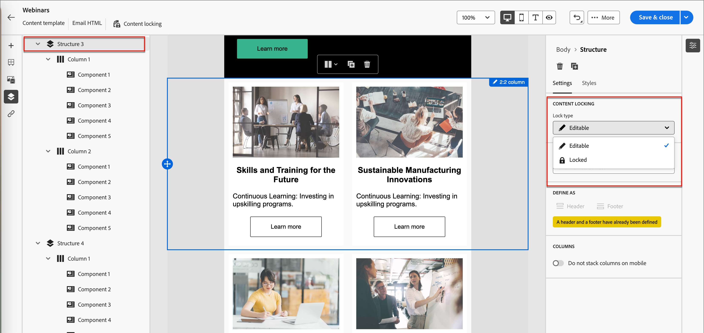

# Governança de conteúdo de modelo

Em muitas organizações de marketing, há profissionais de conteúdo que projetam campanhas de email. Um determinado design pode ser usado como base para jornadas de conta personalizadas em toda a organização. Para garantir a adesão aos designs de conteúdo aprovados, você pode usar os recursos de governança de conteúdo para bloquear componentes de modelo. Com o bloqueio de conteúdo ativado no modelo de email, os profissionais de marketing podem alterar apenas os elementos permitidos para mantê-lo alinhado à estratégia de conteúdo.

Por exemplo, você pode bloquear o cabeçalho e o rodapé projetados para a continuidade das comunicações da marca. Você também pode bloquear a coluna que contém a seção de corpo principal, mas permitir que os autores modifiquem o texto para que ele atenda à sua finalidade no design da jornada da conta.

## Ativar a governança de conteúdo para o modelo

Depois de usar o designer visual para [criar os componentes estruturais e de conteúdo](./email-template-authoring.md) para seu modelo de email, habilite a governança e aplique o bloqueio de conteúdo específico conforme necessário.

1. No designer visual, acesse as camadas/containers e elementos usando a _Árvore de navegação_.

   Clique no ícone da _Árvore de navegação_ (  ) à esquerda da tela para exibir a árvore.

1. Na árvore, selecione o componente raiz **[!UICONTROL Corpo]**.

   O painel de propriedades à direita da tela exibe a guia _[!UICONTROL Configurações]_ por padrão.

1. Habilite a opção **[!UICONTROL Governança]**.

   {width="800" zoomable="yes"}

   Com esta opção habilitada, o _[!UICONTROL Modo]_ padrão é **[!UICONTROL Somente leitura]**. Com esse modo definido no nível raiz, todos os elementos no modelo são bloqueados. A estrutura de árvore à esquerda exibe o ícone _Somente leitura_ (  ) ao lado da raiz e de todos os elementos secundários.

1. Para habilitar o bloqueio de conteúdo específico no modelo, altere o **[!UICONTROL Modo]** para **[!UICONTROL Bloqueio de conteúdo]**.

   Com esse modo definido no nível raiz, todos os elementos no modelo são desbloqueados. A estrutura de árvore à esquerda exibe o ícone de _Bloqueio de conteúdo_ (  ) ao lado do elemento raiz. Aplique o bloqueio de conteúdo a componentes de conteúdo (estruturais) e individuais, conforme necessário.

   Para permitir que autores de email do jornada adicionem elementos estruturais ou de conteúdo, ative **[!UICONTROL Habilitar adição de conteúdo]**. Escolha o tipo de adições que deseja permitir:

   * **[!UICONTROL Permitir adição de estrutura e conteúdo]** - Escolha essa opção se desejar permitir que os autores adicionem elementos estruturais e de conteúdo.

   * **[!UICONTROL Permitir somente adição de conteúdo]** - Escolha esta opção se desejar permitir que os autores adicionem apenas elementos de conteúdo.

   {width="600" zoomable="yes"}

   Com esse modo definido no nível raiz, todos os elementos no modelo são bloqueados. A estrutura de árvore à esquerda exibe o ícone _Somente leitura_ (  ) ao lado da raiz e de todos os elementos secundários.
<!-- 

   
- 
- 
- 
- 
-  -->

## Aplicar bloqueio a uma estrutura

Usando o modelo de herança estrutural, planeje o layout e a estrutura do modelo de email de acordo com a governança que deseja aplicar. Use os componentes estruturais como contêineres para agrupar itens de forma que seja mais fácil designá-los como bloqueados ou editáveis. Quando o design do template de email estiver em vigor, revise a estrutura e aplique recursos de bloqueio de acordo com seu plano.

A aplicação de um tipo de bloqueio no nível da estrutura fornece uma configuração padrão para seus componentes filhos. Em seguida, aplique uma configuração de bloqueio específica no nível da coluna ou do elemento de conteúdo, conforme necessário.

1. Clique no ícone da _Árvore de navegação_ (  ) à esquerda da tela para exibir a árvore.

1. Selecione a estrutura na árvore.

   O painel de propriedades à direita da tela exibe a guia _[!UICONTROL Configurações]_ por padrão.

1. Defina o **[!UICONTROL Tipo de bloqueio]**:

   * **[!UICONTROL Bloqueado]** - Com esta configuração, todos os componentes filho são bloqueados por padrão. A estrutura de árvore à esquerda exibe o ícone _Somente leitura_ (  ) ao lado de todos os componentes filhos.

   * **[!UICONTROL Editável]** - Com esta configuração, todos os componentes filho são editáveis por padrão. A estrutura de árvore à esquerda não exibe ícones ao lado dos componentes secundários.

   {width="800" zoomable="yes"}

## Definir bloqueio para um componente filho

1. Selecione o componente na árvore.

   O painel de propriedades à direita da tela exibe a guia _[!UICONTROL Configurações]_ por padrão.

1. Habilitar a opção **[!UICONTROL Usar bloqueio específico]**.

1. Escolha o tipo de governança a ser aplicado:

   * **[!UICONTROL Editável]** - Permite o controle editorial completo do componente durante a criação do email.
   * **[!UICONTROL Somente conteúdo editável]** - Permite que os autores de email alterem o conteúdo, mas não o próprio componente.
   * **[!UICONTROL Bloqueado]** - Impede quaisquer alterações no componente durante a criação do email.

     Para um componente bloqueado, é possível permitir a remoção do componente durante a criação de email ativando a opção **[!UICONTROL Permitir exclusão]**.

   {width="800" zoomable="yes"}
