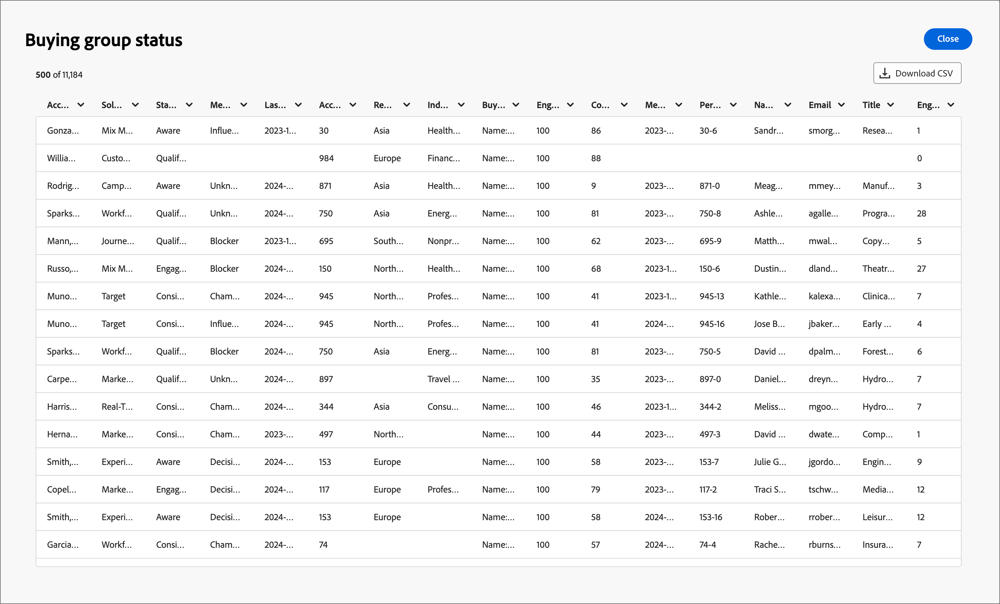

# Painel de Visão Geral de Grupos de Compras

O painel Visão geral do Grupo de compras foi projetado para o processo de Transferência de Vendas B2B. Ela permite que a equipe de marketing compartilhe grupos de compras _prontos_ e seus membros, juntamente com dados essenciais, com a equipe de vendas para execução. Esse processo garante uma transição simplificada do marketing para as vendas.

A Transferência de vendas inclui:

* **Transferência de Dados**: o marketing identifica os dados de destino _prontos_ e os torna acessíveis para o setor de Vendas no formato CSV. 
* **Aceitação de Vendas**: as vendas revisam manualmente e incorporam destinos _prontos_ em seus pipelines.

## Status do grupo de compras

Obtenha insights sobre a progressão dos grupos de compra com a visualização Status do grupo de compra. Esta visualização mostra a distribuição dos seus grupos de compra categorizados por sua atualização de status mais recente em um intervalo de tempo especificado.

{width="800" zoomable="yes"}

**[!UICONTROL Status]** (eixo y): controle a jornada de grupos de compra em vários estágios.
**[!UICONTROL Número de Grupos de Compras]** (eixo x): quantifique o número de grupos de compras em cada status, fornecendo uma métrica clara da integridade e da atividade do funil.
<!-- To generate a shareable PDF of your current view, click **[!UICONTROL Export]** at the top-right corner of the page. -->

### Filtragem de dados

* **Filtro de dados** - Use o _[!UICONTROL Filtro de datas]_, que reflete a data da última alteração de status do Grupo de Compras. A data de início é ajustável. A data final é padronizada para o dia atual.

  {width="400"}

* **Filtro de atributo** - Clique no ícone _Filtro_ na parte superior esquerda para filtrar a exibição de dados usando qualquer um destes atributos:

   * Interesse da solução
   * Status
   * Status do Grupo de Compras
   * Região da conta
   * Setor da conta
  <!-- * Account's Industry -->

  {width="500"}

## Interagir com os dados

Para se envolver com os dados, use o menu de ações no canto superior direito.

{width="400"}

### [!UICONTROL Drill-through]

Escolha **[!UICONTROL Drill-through]** para obter uma análise detalhada dos status de grupos individuais.

{width="600" zoomable="yes"}

Os filtros globais aplicados ao painel são transferidos e não podem ser alterados nesta página.

Clique no ícone do menu de ações na parte superior direita e escolha **[!UICONTROL Exibir mais]** para [exibir dados e insights estendidos](#view-more).

### [!UICONTROL Exibir mais]

Escolha **[!UICONTROL Exibir mais]** para dados e insights estendidos. O pop-up exibido inclui um gráfico e uma tabela que mostram o detalhamento dos status do grupo de compras:

* [!UICONTROL ID da conta ]
* [!UICONTROL Nome da Conta]
* [!UICONTROL Região da Conta]
* [!UICONTROL Setor de Contas]
* [!UICONTROL Nome do Grupo de Compras]
* [!UICONTROL Interesse na solução]
* [!UICONTROL Status]
* [!UICONTROL Pontuação de engajamento]
* [!UICONTROL Pontuação de integridade]
* [!UICONTROL Função de membro]
* [!UICONTROL Data de Inscrição/Criação do Membro]
* [!UICONTROL ID da pessoa]
* [!UICONTROL Nome]
* [!UICONTROL Email]
* [!UICONTROL Title]
* [!UICONTROL Número de Atividades de Envolvimento de Entrada]
* [!UICONTROL Última data de compromisso]

{width="600" zoomable="yes"}

Para baixar os dados, clique em **[!UICONTROL Baixar CSV]** no canto superior direito.
