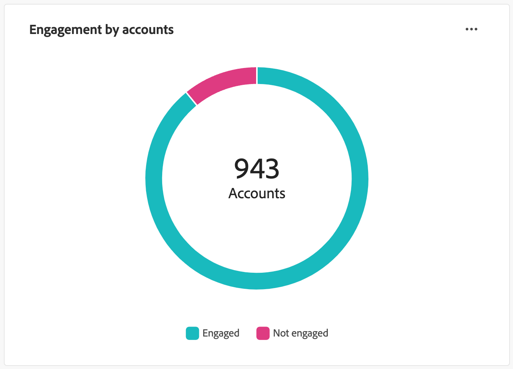
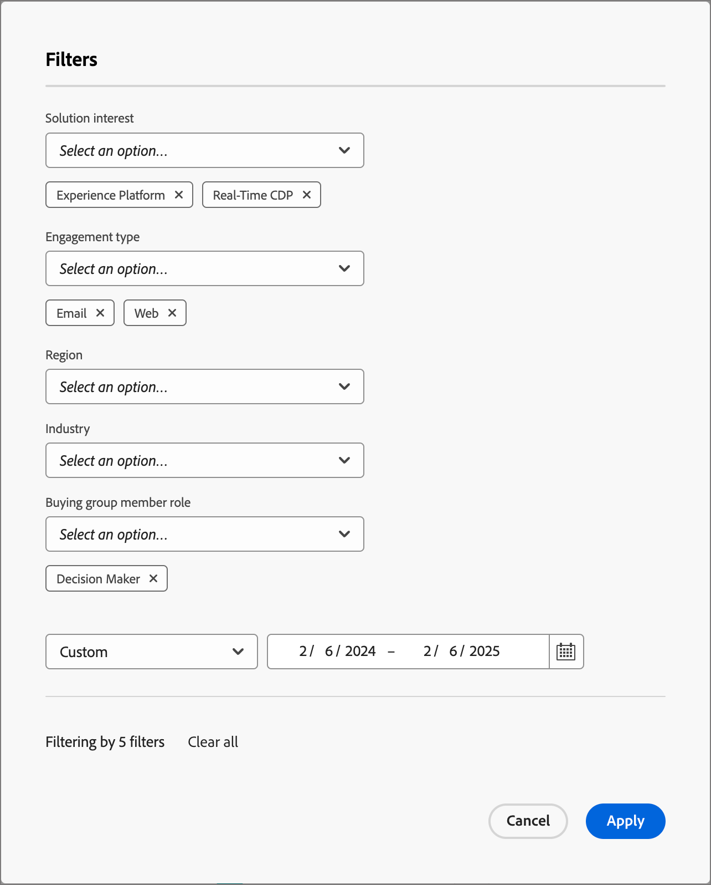

# Painel de visão geral do engajamento

Esse painel fornece uma visão abrangente do engajamento e mostra métricas de conta e interações individuais em tempo real por meio de gráficos de rosca de instantâneos e gráficos de linha que revelam tendências ao longo do tempo. Ele ajuda você a monitorar e criar estratégias para seus esforços de engajamento de maneira eficaz.

Para acessar o _Painel de envolvimentos_, selecione o item **[!UICONTROL Painel]** na navegação à esquerda. Em seguida, selecione a guia **[!UICONTROL Envolvimento]** na parte superior da página.

<!-- To generate a shareable PDF of your current view, click **[!UICONTROL Export]** at the top-right corner of the page. To engage with the data, use the action menu in the top-right corner. -->

{width="800" zoomable="yes"}

## Envolvimento por contas / grupo de compras / pessoas

Os gráficos de círculo dividem contas, grupos de compras ou pessoas em categorias engajadas e não engajadas. A figura central exibe a contagem total em cada categoria, fornecendo uma compreensão rápida do envolvimento geral.

{width="500"}

## Contas/grupos de compras/pessoas envolvidas ao longo do tempo

Esses gráficos de linha exibem os níveis de engajamento de contas ou pessoas ao longo do tempo. Com linhas distintas para &quot;Envolvido&quot; e &quot;Não Envolvido&quot;, visualizadas ao lado de um eixo horizontal com carimbo de data e hora, é possível apontar tendências e padrões. Você pode passar o mouse sobre uma linha para revelar métricas precisas para qualquer data.

{width="500"}

## Filtrar os dados

Você pode filtrar os dados exibidos por intervalo de datas e atributos.

### Filtro de intervalo de datas

Use o _[!UICONTROL Filtro de intervalo de datas]_ na parte superior direita para filtrar os dados de acordo com o intervalo de datas.

{width="380"}

Para o intervalo **[!UICONTROL Personalizado]**, você pode usar a ferramenta de calendário para especificar uma data de início e término. A data final é padronizada para o dia atual.

{width="380"}

### Filtro de atributo

Clique no ícone _Filtro_ (  ) na parte superior esquerda para filtrar os dados exibidos usando qualquer um destes atributos:

* Interesse na solução
* Tipo de engajamento
* Região

* Setor
* Função do membro do grupo de compra

{width="500"}

Selecione quantos valores para cada atributo que deseja usar para filtrar os dados e clique em **[!UICONTROL Aplicar]**.

## Interagir com os dados

Para se envolver com os dados, use o menu **...** na parte superior direita de cada gráfico.

{width="300"}

### Drill-through

Para um gráfico circular, escolha **[!UICONTROL Drill-through]** para uma análise detalhada de dados de engajamento de grupos individuais.

Os filtros globais (intervalo de dados e atributos) são aplicados ao painel e são transferidos. Clique no ícone _Filtro_ (  ) na parte superior esquerda para [alterar os filtros de atributo](#filter-the-data) para a exibição de drill-through. Use o seletor de intervalo de datas na parte superior direita para [alterar o intervalo de datas](#date-range-filter) para a exibição de drill-through.

{width="700" zoomable="yes"}

| Engajamento por contas | Engajamento por grupos de compra | Engajamento por pessoas |
| ---------------------- | --------------------------- | -------------------- |
| <li>Nome da conta <li>Status <li>Pessoas envolvidas (número)<li>Atividades de engajamento (número) <li>Último engajamento (data) | <li>Grupo de compra <li>Conta <li>Interesse na solução <li>Status <li>Atividades de engajamento (número) | <li>Nome <li>Status <li>Email (endereço) <li>Atividades de engajamento (número) <li>Último engajamento (data) |

Você pode clicar no ícone de menu **...** no canto superior direito e escolher **[!UICONTROL Exibir mais]** para [exibir dados e insights estendidos](#view-more).

### Exibir mais

Escolha **[!UICONTROL Exibir mais]** para dados e insights estendidos.

{width="700" zoomable="yes"}

Dependendo do gráfico, há dados estendidos para o seguinte:

| Envolvimento por contas / grupos de compra / pessoas | Contas/grupos de compras/pessoas envolvidas ao longo do tempo |
| ----------------------------------------------- | -------------------------------------------------- | 
| <li>Envolvido <li>Não Envolvido | <li>Data <li>Contas / Grupos de compras / Pessoas (número) <li>Envolvido/Não engajado |

Para copiar os dados estendidos, clique em **[!UICONTROL Baixar CSV]** na parte superior direita.
