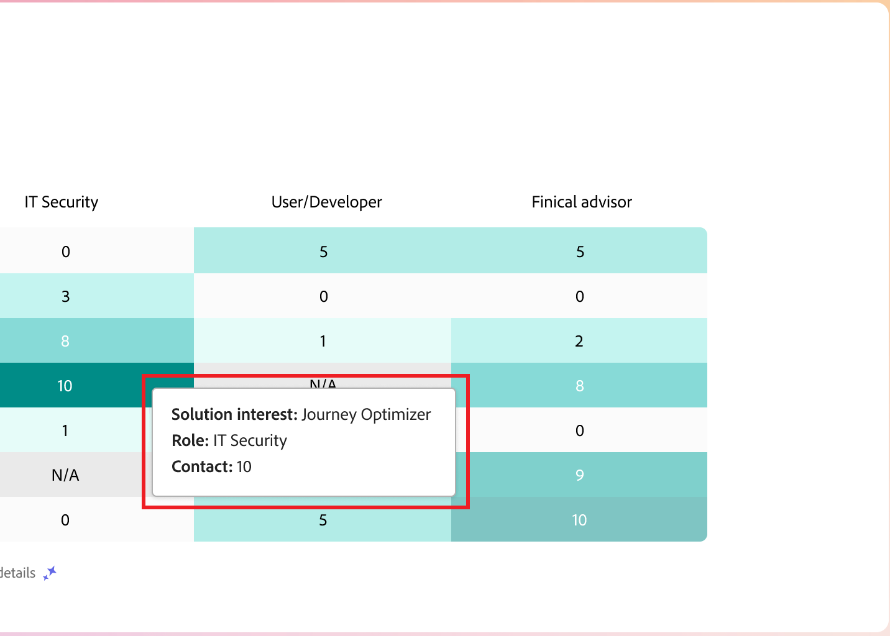
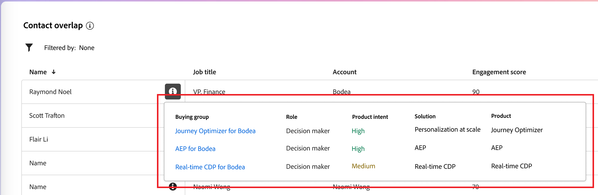

# Painel inteligente

O Painel inteligente fornece uma visão abrangente das métricas de grupos de compras e contas, ajudando você a monitorar e criar estratégias para seus esforços de marketing com mais eficiência.

Para acessar o _Painel Inteligente_, selecione o item **[!UICONTROL Painel]** na navegação à esquerda.

{width="800" zoomable="yes"}

O Painel inteligente também fornece acesso às páginas de detalhes do grupo de compras e contas que incluem dois tipos de recursos de IA gerativa:

* Resumos para contas e grupos de compras
* Detecção de intenção para pessoa, grupo de compras e conta

{{intent-data-note}}

## Estágios do grupo de compra {#buying-group-stages}

>[!CONTEXTUALHELP]
>id="ajo-b2b_intelligent_dashboard_buying_group_stages"
>title="Estágios do grupo de compra"
>abstract="Este gráfico fornece uma visão geral da progressão do grupo de compra em diferentes estágios com base nas regras de transição configuradas. A primeira barra indica o número de grupos de compras em um estágio específico na primeira data do período selecionado em comparação à última data do período selecionado."

O gráfico _[!UICONTROL Estágios de Grupo de Compra]_ fornece uma visão geral da progressão de grupo de compra em diferentes estágios ([com base nas regras de transição configuradas por um administrador](../buying-groups/buying-group-stages.md)).

>[!NOTE]
>
>A disponibilidade das fases de grupo de compra requer a configuração das fases de grupo de compra. Consulte [Estágios de grupo de compra](../buying-groups/buying-group-stages.md) para obter informações detalhadas sobre estágios e como definir e habilitar estágios para grupos de compra.

{width="800" zoomable="yes"}

O gráfico usa os estágios do grupo de compras da versão publicada mais recentemente do modelo de estágios do grupo de compras. Há duas barras para cada estágio. A primeira barra indica o número de grupos de compras na primeira data do intervalo de tempo selecionado. E o segundo (em comparação) é o número de grupos de compra na última data do intervalo de tempo. Você pode passar o mouse sobre cada barra para ver o número de grupos de compras em cada estágio.

{width="400"}

### Resumo da IA gerativa

Clique em uma barra para exibir um resumo da IA gerativa de grupos de compras nesse estágio para o período selecionado.

{width="500"}

O resumo gerado fornece uma visão geral da progressão do grupo de compras em diferentes estágios com base nas regras de transição configuradas.

### Período {#time-period-stages}

Use o filtro de datas na parte superior direita para alterar o intervalo de datas das visualizações de dados. Clique na seta para baixo para definir um intervalo de datas relativo ou para definir datas de início e término personalizadas.

<!-- {width="300"} -->

### Filtro de atributo {#attribute-filter-stages}

Clique no ícone _Filtro_ (  ) na parte superior esquerda para filtrar a exibição de dados usando qualquer um destes atributos:

* Interesse da solução
* Conta
* Nome do estágio

<!-- Add screen when the UI is available {width="500"} -->

## Destaques do grupo de compra {#buying-group-highlights}

>[!CONTEXTUALHELP]
>id="ajo-b2b_intelligent_dashboard_buying_group_highlights_engagement"
>title="Os 5 principais grupos de compra por engajamento"
>abstract="Principais grupos de compra engajados com base em sua pontuação de engajamento normalizada."

>[!CONTEXTUALHELP]
>id="ajo-b2b_intelligent_dashboard_buying_group_highlights_velocity"
>title="Os 5 principais grupos de compra de alta velocidade"
>abstract="Grupos de compra baseados na velocidade com que estão progredindo pelos estágios."

>[!CONTEXTUALHELP]
>id="ajo-b2b_intelligent_dashboard_buying_group_highlights_stagnant"
>title="Os 5 principais grupos de compra estagnados"
>abstract="Grupos de compra estagnados que não estão progredindo pelos estágios, apesar da alta pontuação de conclusão."

A seção _[!UICONTROL Destaques do grupo de compras]_ está organizada em três linhas para exibir informações sobre os grupos de compras de interesse da sua organização.

{width="800" zoomable="yes"}

* **Cinco principais grupos de compras por compromisso** - Esta linha exibe os principais grupos de compras envolvidos com base em sua pontuação de compromisso normalizada.
* **Cinco principais grupos de compras de alta velocidade** - Esta linha exibe os principais grupos de compras com base na velocidade com que eles avançam pelos estágios de grupos de compras.
* **Cinco principais grupos de compras estagnados** - Esta linha exibe os grupos de compras mais estagnados que não estão avançando nos estágios, apesar de uma pontuação de integridade alta.

Cada cartão inclui os seguintes dados:

* **_Nome do grupo de compras_**. Clique no nome para abrir a página de detalhes do grupo de compra.
* **_Nome da conta_**. Clique no nome para abrir a página de detalhes da conta (com o hiperlink para a página de detalhes da conta).
* **_Estágio atual_** do grupo de compras.
* **_Pontuação de engajamento_** (normalizada em todos os grupos de compra). Se todos os grupos de compra tiverem a mesma pontuação superior, ele exibirá a última pontuação atualizada.
* **_Pontuação de integridade_** (variando de 1-100). Se todos os grupos de compra tiverem a mesma pontuação superior, ele exibirá a última pontuação atualizada.
* **_Tentativa de categoria_**. Clique em _[!UICONTROL Exibir detalhes]_ para exibir os dados de intenção:

  {width="500" zoomable="yes"}

   * O pop-up de detalhes exibe o nome da categoria com nível de intenção na parte superior.
   * Os dados de cada linha são organizados em colunas: o nome do produto, a intensidade da intenção do produto e as palavras-chave principais por intensidade da intenção.
   * A ordem de classificação é alta a baixa para categoria, produto e palavras-chave. Se um ou mais tipos tiverem a mesma intensidade de intenção, a classificação usará a ordem alfabética.

  {{intent-data-note}}

Na parte superior direita do painel _Destaques do grupo de compra_, clique em **[!UICONTROL Exibir todos]** para navegar até a página da lista de grupos de compra.

### Filtro de atributo {#attribute-filter-bg-highlights}

Clique no ícone _Filtro_ (  ) na parte superior esquerda para filtrar a exibição de dados usando qualquer um destes atributos:

* Interesse na solução
* Grupo de compra
* Conta

<!-- Add screen when the UI is available {width="500"} -->

### Período {#time-period-bg-highlights}

Use o filtro de datas na parte superior direita para alterar o intervalo de datas das visualizações de dados. Clique na seta para baixo para definir um intervalo de datas relativo ou para definir datas de início e término personalizadas.

<!-- {width="300"} -->

## Aumento de contas {#account-surge}

>[!CONTEXTUALHELP]
>id="ajo-b2b_intelligent_dashboard_account_surge"
>title="Aumentos de conta"
>abstract="Contas com alteração significativa na dinâmica de engajamento no intervalo de tempo selecionado."

A seção _[!UICONTROL Contas de limpeza]_ exibe uma visualização das contas com uma alteração significativa no momento do engajamento dentro do período selecionado.

>[!NOTE]
>
>Os dados de sobrecarga da conta são limitados às contas que foram assimiladas pela Journey Optimizer B2B edition em um público-alvo de conta por meio de jornadas de conta ou grupos de compra.

{width="800" zoomable="yes"}

Passe o mouse sobre cada barra para ver o número de contas em cada categoria.

{width="400"}

Clique em uma barra para exibir um resumo da IA gerativa das contas na categoria para o intervalo de tempo selecionado.

{width="500"}

### Filtro de atributo {#attribute-filter-acct-surge}

Clique no ícone _Filtro_ (  ) na parte superior esquerda para filtrar a exibição de dados usando qualquer um destes atributos:

* Interesse na solução
* Setor
* Região

<!-- Add screen when the UI is available {width="500"} -->

### Período {#time-period-acct-surge}

Use o filtro de datas na parte superior direita para alterar o intervalo de datas das visualizações de dados. Clique na seta para baixo para definir um intervalo de datas relativo ou para definir datas de início e término personalizadas.

<!-- {width="300"} -->

## Destaques da conta {#account-highlights}

>[!CONTEXTUALHELP]
>id="ajo-b2b_intelligent_dashboard_account_highlights_surging"
>title="Aumento de contas"
>abstract="Contas com aumento significativo na dinâmica de engajamento no intervalo de tempo selecionado "

>[!CONTEXTUALHELP]
>id="ajo-b2b_intelligent_dashboard_account_highlights_at_risk"
>title="Contas em risco"
>abstract="Contas com diminuição significativa na dinâmica de engajamento no intervalo de tempo selecionado."

A seção _[!UICONTROL Destaques do grupo de compras]_ está organizada em duas linhas para exibir informações sobre as contas de interesse da sua organização.

>[!NOTE]
>
>Os dados de destaque da conta são limitados às contas que foram assimiladas pelo Journey Optimizer B2B edition em um público-alvo de conta por meio de jornadas de conta ou grupos de compra.

{width="800" zoomable="yes"}

* **Contas novas** - Esta linha exibe as contas com um aumento significativo no momentum de engajamento ao longo do período selecionado.
* **Contas em risco** - Esta linha exibe as contas com uma diminuição significativa no momentum de envolvimento durante o período selecionado.

Cada cartão inclui os seguintes dados:

* **_Nome da conta_**. Clique no nome para abrir a página de detalhes da conta.
* **_Resumo da IA de geração_** da conta.
* **_Tentativa de palavra-chave_**. Clique em _[!UICONTROL Exibir detalhes]_ para exibir os dados de intenção:

  {width="500" zoomable="yes"}

   * O pop-up de detalhes exibe o nome da categoria com nível de intenção na parte superior.
   * Os dados de cada linha são organizados em colunas: o nome do produto, a intensidade da intenção do produto e as palavras-chave principais por intensidade da intenção.
   * A ordem de classificação é alta a baixa para categoria, produto e palavras-chave. Se um ou mais tipos tiverem a mesma intensidade de intenção, a classificação usará a ordem alfabética.

  {{intent-data-note}}
<!-- 
At the top right of the _Buying group highlights_ panel, click **[!UICONTROL View All]** to navigate to the Buying groups list page. -->

### Filtro de atributo {#attribute-filter-acct-highlights}

Clique no ícone _Filtro_ (  ) na parte superior esquerda para filtrar a exibição de dados usando qualquer um destes atributos:

* Interesse na solução
* Grupo de compra

<!-- Add screen when the UI is available {width="500"} -->

### Período {#time-period-acct-highlights}

Use o filtro de datas na parte superior direita para alterar o intervalo de datas das visualizações de dados. Clique na seta para baixo para definir um intervalo de datas relativo ou para definir datas de início e término personalizadas.

<!-- {width="300"} -->

## Cobertura do contato {#contact-coverage}

>[!CONTEXTUALHELP]
>id="ajo-b2b_intelligent_dashboard_contact_coverage"
>title="Cobertura do contato"
>abstract="Exibe o número de contatos com uma função específica associada a um interesse de solução. A atribuição de função e interesse de solução é baseada no modelo de grupo de compra."

A seção _[!UICONTROL Cobertura do contato]_ exibe uma visualização do número de contatos com uma função específica associada a um interesse de solução. A atribuição de função e interesse de solução é baseada no modelo de grupo de compra.

>[!NOTE]
>
>Os dados de cobertura do contato são baseados nos grupos de compra criados na instância do Journey Optimizer B2B edition.

{width="800" zoomable="yes"}

Passe o mouse sobre cada célula para exibir o número de contatos de interesse de função/solução.

{width="400"}

Clique em uma célula para exibir informações detalhadas para os contatos de interesse de função/solução.

{width="700" zoomable="yes"}

### Filtro de atributo {#attribute-filter-contact-coverage}

Clique no ícone _Filtro_ (  ) na parte superior esquerda para filtrar a exibição de dados usando qualquer um destes atributos:

* Interesse na solução
* Contas

<!-- Add screen when the UI is available {width="500"} -->

## Sobreposição de contato {#contact-overlap}

>[!CONTEXTUALHELP]
>id="ajo-b2b_intelligent_dashboard_contact_overlap"
>title="Sobreposição de contato"
>abstract="Lista de contatos que fazem parte de mais de um grupo de compra por estarem associados a vários interesses em soluções."

A seção _[!UICONTROL Sobreposição de contatos]_ exibe uma lista de contatos que fazem parte de mais de um grupo de compras como resultado de estarem associados a vários interesses de solução.

>[!NOTE]
>
>Os dados de sobreposição de contato são baseados nos grupos de compra criados na instância do Journey Optimizer B2B edition.

{width="800" zoomable="yes"}

Clique em _Informações_ (  ) para exibir uma tabela com os seguintes detalhes:

* Nome do grupo de compras (clique no nome para abrir a página de detalhes do grupo de compras)
* Função
* Interesse na solução
* Propósito do produto
* Produto

{width="600" zoomable="yes"}

### Filtro de atributo {#attribute-filter-contact-overage}

Clique no ícone _Filtro_ (  ) na parte superior esquerda para filtrar a exibição de dados usando qualquer um destes atributos:

* Interesse na solução
* Funções
* Contas

<!-- Add screen when the UI is available {width="500"} -->
