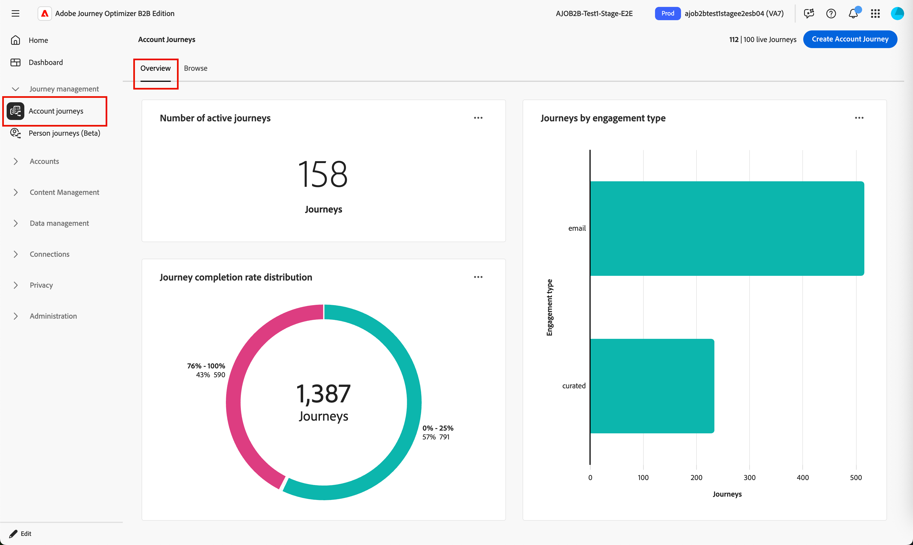

# Painel de visão geral do Jornada

O painel Visão geral das [jornadas de conta ou pessoa](../journeys/journeys-overview.md) fornece um instantâneo abrangente das jornadas ativas. Os gráficos de círculo e de barra categorizam e quantificam as conclusões e atividades de envolvimento para que você possa avaliar a eficácia dos canais de email e SMS por meio das principais métricas de entrega e envolvimento. Para obter uma exibição entre jornadas dos dados de entrega e participação específicos do email, consulte o [Relatório de desempenho de email](email-performance-dashboard.md).

Essa visão geral está disponível para jornadas publicadas e leva aproximadamente quatro horas para os dados começarem a preencher os gráficos e as tabelas.

>[!BEGINTABS]

>[!TAB jornadas da conta]

Na navegação à esquerda, expanda **[!UICONTROL Gerenciamento de Jornadas]** e clique em **[!UICONTROL jornadas de Conta]**. Selecione a guia **[!UICONTROL Visão geral]** se ela não for exibida por padrão.

{width="800" zoomable="yes"}

>[!TAB jornadas de pessoas (Beta)]

[!BADGE Beta]{type=Informative tooltip="Disponível como um recurso beta"}

Na navegação à esquerda, expanda **[!UICONTROL Gerenciamento de Jornadas]** e clique em **[!UICONTROL jornadas de pessoas]**. Selecione a guia **[!UICONTROL Visão geral]** se ela não for exibida por padrão.

{width="800" zoomable="yes"}

>[!ENDTABS]

## Distribuição da taxa de conclusão da jornada {#journey-completion-rate-distribution}

Este gráfico ilustra a distribuição de jornadas com base em sua taxa de conclusão e é categorizado em quatro faixas de pontuação distintas. O número central representa o número total de jornadas e fornece um rápido resumo do progresso geral. As cores segmentadas indicam a proporção de jornadas em cada intervalo de pontuação, o que permite avaliar as tendências de conclusão rapidamente.

Para exibir informações mais detalhadas, clique no ícone de menu **...** na parte superior direita.

{width="500"}

## Jornadas por tipo de engajamento {#journeys-by-engagement-type}

Este gráfico de barras exibe a distribuição de jornadas com base no tipo de envolvimento e ajuda a identificar quais envolvimentos foram mais usados nas jornadas. Cada barra representa um tipo de envolvimento específico, com seu comprimento indicando o número de jornadas com atividades desse tipo. Essa visualização fornece uma compreensão clara e imediata das tendências de engajamento nas jornadas de conta ou pessoa.

Para exibir informações mais detalhadas, clique no ícone de menu **...** na parte superior direita.

{width="500"}

## Interagir com os dados {#engage-with-the-data}

Para se envolver com os dados, use o menu **...** na parte superior direita de cada gráfico.

### [!UICONTROL Drill-through] {#drill-through}

Para o gráfico circular, escolha **[!UICONTROL Drill-through]** para uma análise detalhada dos dados.

{width="700" zoomable="yes"}

Você pode clicar no link _Mais_ (**...**) no canto superior direito e escolha **[!UICONTROL Exibir mais]** para [exibir dados estendidos](#view-more).

### [!UICONTROL Exibir mais] {#view-more}

Escolha **[!UICONTROL Exibir mais]** para exibir dados e insights estendidos.

{width="700" zoomable="yes"}

O pop-up exibido inclui um gráfico e uma tabela que mostram o detalhamento dos dados da jornada.

Para baixar os dados, clique em **[!UICONTROL Baixar CSV]** na parte superior direita da tabela de dados. Para retornar ao painel _Visão geral_, clique em **[!UICONTROL Fechar]**.
