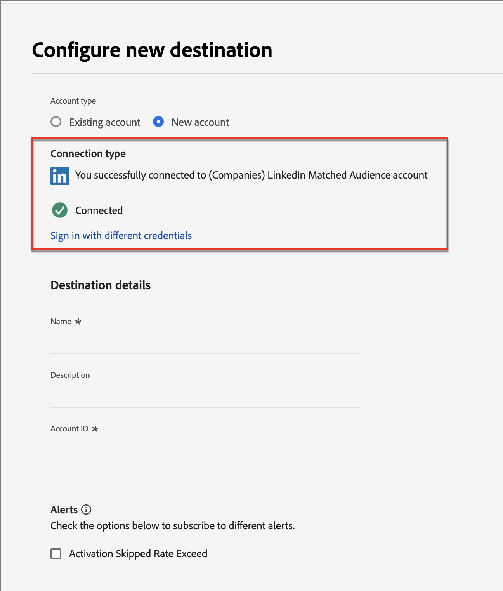
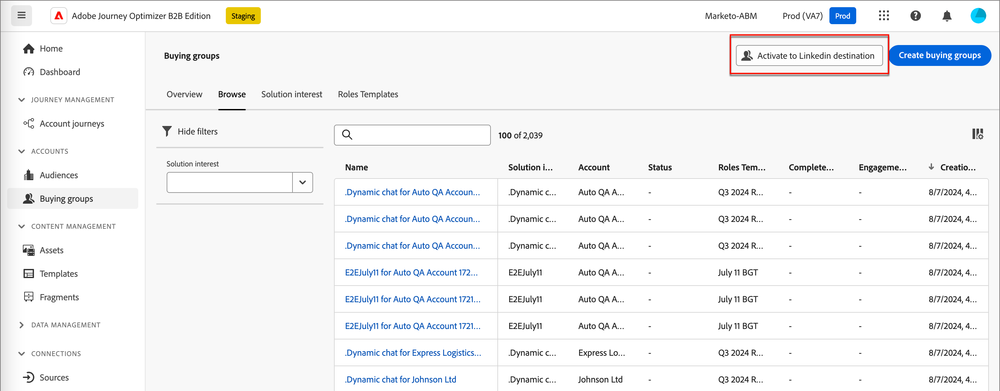

# Públicos-alvo correspondentes da conta do linkedIn

O Journey Optimizer B2B Edition oferece a capacidade de gerar públicos-alvo de anúncios do LinkedIn por meio de públicos-alvo correspondentes à conta, e foi projetado para ajudar você a preencher funções vazias em seus grupos de compra. Definindo um conjunto de filtros de grupo de compras, você pode manter um Público-alvo correspondente do LinkedIn para direcionar prospetos que correspondem aos parâmetros do grupo de compras. Esse recurso aproveita o Experience Platform Destinations para gerenciar alguns aspectos da integração. Há um limite de dez fluxos de dados.

Antes de iniciar um fluxo de dados do Journey Optimizer B2B Edition, você deve ter pelo menos uma instância do [(Empresas) conector de destino do LinkedIn Matched Audience](https://experienceleague.adobe.com/en/docs/experience-platform/destinations/catalog/social/linkedin#connect) com uma conta do LinkedIn Campaign Manager configurada no aplicativo Experience Platform.

## Configurar uma nova conexão com a conta do LinkedIn {#linkedin-destination-setup}

>[!CONTEXTUALHELP]
>id="ajo-b2b_linkedin_destination_setup"
>title="A configuração de destino do LinkedIn é obrigatória"
>abstract="Envie contas filtradas por grupos de compra para um destino do Linkedin para interagir com membros potenciais do grupo de compra. Você pode criar até 10 fluxos de dados para 10 grupos diferentes de contas filtradas. Para começar a usar esse recurso, adicione primeiro um destino do Linkedin."

1. No Experience Platform, vá para **[!UICONTROL Conexões]** > **[!UICONTROL Destinos]** na navegação à esquerda e selecione a guia **[!UICONTROL Catálogo]**.

1. No catálogo, localize o conector **[!UICONTROL (Empresas) LinkedIn Matched Audience]**.

   >[!TIP]
   >
   >Você pode encontrar rapidamente o conector digitando `LinkedIn` na caixa de pesquisa.

1. No cartão do conector, clique no ícone _Mais_ (**...**) e escolha **[!UICONTROL Configurar novo destino]**.

   {width="800" zoomable="yes"}

1. Selecione **[!UICONTROL Nova conta]** e clique em **[!UICONTROL Conectar ao destino]**.

   {width="500"}

1. Forneça suas credenciais da LinkedIn e faça logon.

   Após a autenticação, a conta do LinkedIn é conectada como um destino no Experience Platform.

   {width="400"}

   >[!IMPORTANT]
   >
   >Neste ponto, **não** insira os _[!UICONTROL detalhes do Destino]_. Somente a conexão é necessária.

## Atualizar os detalhes da conta

O nome e a descrição da conta do LinkedIn estão visíveis para grupos de compra no Journey Optimizer B2B Edition. É uma prática recomendada atualizar essas informações para que sejam facilmente identificáveis para seus profissionais de marketing que trabalham com grupos de compra. Você pode alterar os detalhes da conta na interface do usuário do Experience Platform ou Journey Optimizer B2B Edition.

1. Vá para **[!UICONTROL Conexões]** > **[!UICONTROL Destinos]** na navegação à esquerda e selecione a guia **[!UICONTROL Contas]**.

1. Para a nova conta criada, clique no menu _Mais_ (**...**) e escolha **[!UICONTROL Editar detalhes]**.

   {width="800" zoomable="yes"}

1. Na caixa de diálogo do, atualize o nome e a descrição.

   {width="500"}

1. Clique em **[!UICONTROL Salvar]**.

## Ativar a conta para grupos de compras

>[!NOTE]
>
>Se você já tiver dez fluxos de dados, não poderá criar outro. Se você estiver no máximo, exclua um no Experience Platform antes de criar um novo no Journey Optimizer B2B Edition.

1. No Journey Optimizer B2B Edition, vá para **[!UICONTROL Contas]** > **[!UICONTROL Grupos de compras]** na navegação à esquerda.

1. Selecione a guia **[!UICONTROL Procurar]**.

1. Clique em **[!UICONTROL Ativar para destino do LinkedIn]** na parte superior direita.

   {width="800" zoomable="yes"}

1. Atribua um nome e uma descrição descritiva ao fluxo de dados (opcional).

   Depois de salvá-lo, o nome especificado para o fluxo de dados é anexado a _AJOB2B_ para ajudar a identificar o fluxo de dados no Experience Platform.

1. Insira a [ID da conta do seu gerente de campanha da LinkedIn](https://www.linkedin.com/help/lms/answer/a424270).

   Você pode encontrar sua ID de conta pelo Nome da conta na interface do usuário do Campaign Manager.

   {width="700" zoomable="yes"}

1. Clique em **[!UICONTROL Selecionar filtros de grupo de compra]** e defina os parâmetros do público-alvo da sua conta.

   >[!IMPORTANT]
   >
   >No momento, os filtros não podem ser editados depois que o fluxo de dados é ativado. Verifique novamente seu trabalho antes de ativar o fluxo de dados.

   {width="400"}

   Para a **[!UICONTROL Pontuação de engajamento]**, o operador `Between` é inclusivo, assim como os intervalos de porcentagem. Por exemplo, 5.1 e 5 estão ambos _entre_ 5 e 6.

   Condições vazias são tratadas como `Is Any`.

   Clique em **[!UICONTROL Salvar]** para adicionar os filtros especificados.

1. Clique em **[!UICONTROL Selecionar destino do LinkedIn]** e escolha o destino do LinkedIn configurado que deseja usar.

   Após a ativação, essa configuração cria o fluxo de dados usando a configuração de destino e um segmento virtual correspondente.

1. Verifique suas configurações e clique em **[!UICONTROL Ativar]** na parte superior direita.

   Clique novamente em **[!UICONTROL Ativar]** na caixa de diálogo de confirmação.

   Um banner é exibido com um link para o menu de fluxos de dados no Experience Platform para que você possa verificar o registro do fluxo de dados.
