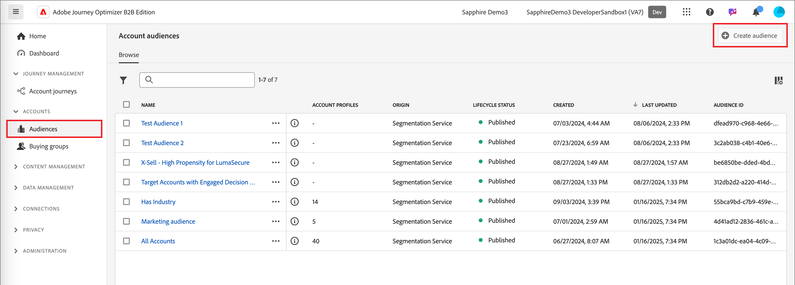

# Nós de jornada de público-alvo da conta

O nó de público-alvo da conta especifica quais contas entram na jornada. Quando você [cria uma jornada de conta](./create-publish-journey.md#create-a-journey), a jornada sempre começa com um nó de público-alvo de conta que define sua entrada.

Use uma das seguintes opções de entrada para este nó do jornada:

* **[Público-alvo da conta](../audiences/account-audience-overview.md)** — O público-alvo da conta representa o público-alvo básico que é sincronizado a partir do Serviço de Segmentação da Experience Platform.
* **[Lista de contas](../accounts/account-lists.md)** — a lista de contas é uma coleção de contas nomeadas que você usa para a orquestração de jornadas direcionadas. Uma lista de contas é direcionada a contas nomeadas usando critérios definidos, como setor, local ou tamanho da empresa.

## Definir o público-alvo para o nó de público-alvo da conta

1. Clique no nó **[!UICONTROL Público-alvo da conta]**. Essa ação exibe as propriedades do nó no painel direito.

   {width="700" zoomable="yes"}

1. Escolha o tipo de entrada para contas que entram na jornada:

   * **[!UICONTROL Público-alvo da conta]**

     Escolha a opção de público-alvo da conta. Clique em **[!UICONTROL Adicionar público-alvo da conta]**.

     Na caixa de diálogo _[!UICONTROL Adicionar público-alvo]_, selecione um segmento de público-alvo criado anteriormente. Clique em **[!UICONTROL Adicionar público-alvo]**.

     {width="700" zoomable="yes"}

   * **[!UICONTROL Lista de contas]**

     Escolha a opção de lista de contas. Clique em **[!UICONTROL Adicionar lista de contas]**.

     Na caixa de diálogo _[!UICONTROL Selecionar lista de contas ativas]_, selecione uma lista de contas publicadas. Em seguida, clique em **[!UICONTROL Salvar]**.

     {width="700" zoomable="yes"}

     Para obter mais informações sobre como criar e publicar listas de contas, consulte [Listas de contas](../accounts/account-lists.md).

## Criar um segmento de público-alvo

1. Na navegação à esquerda, selecione **[!UICONTROL Contas]** > **[!UICONTROL Públicos]**.

1. Clique em **[!UICONTROL Criar público-alvo]** no canto superior direito.

   {width="800" zoomable="yes"}

1. Siga as etapas no [guia do Serviço de segmentação](https://experienceleague.adobe.com/pt-br/docs/experience-platform/segmentation/types/account-audiences){target="_blank"}.
