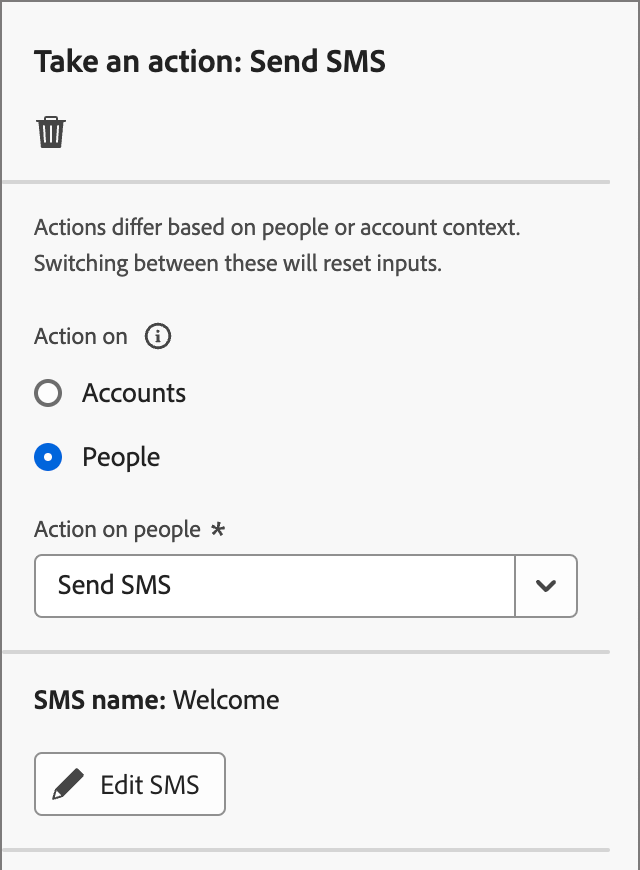

# Realizar uma ação

Na jornada da sua conta, você pode adicionar um nó _[!UICONTROL Realizar uma ação]_ para executar uma ação, como enviar um email, alterar uma pontuação, atribuir a um grupo de compra e assim por diante. As ações normalmente são o que você deseja que aconteça como resultado de algum tipo de acionador, como um evento ou uma ação anterior.

{width="30"} [Assista ao vídeo de visão geral](#overview-video)

## Ações da conta

Use uma ação nas contas quando quiser aplicar uma alteração a todas as pessoas que fazem parte das contas no caminho do nó.

### Ações e restrições {#account-action-constraints}

| Ação | Restrições |
| ------ | ----------- |
| [!UICONTROL Momento Interessante na Conta] | Tipo (email, marco ou Web) Descrição (opcional) |
| [!UICONTROL Ativar para destino] | Selecionar um destino |
| [!UICONTROL Adicionar conta à (outra) Jornada] | Selecionar jornada de conta em tempo real |
| [!UICONTROL Adicionar à lista de contas] | Selecionar lista de contas estáticas em tempo real |
| [!UICONTROL Remover Conta da Jornada] | Selecionar jornada de conta em tempo real |
| [!UICONTROL Remover da lista de contas] | Selecionar uma lista de contas estáticas em tempo real |
| [!UICONTROL Enviar Alerta de Vendas] | Selecionar interesse da solução Enviar email para |
| [!UICONTROL Atualizar perfil da conta] | Selecionar atributo Novo valor |
| [!UICONTROL Atualizar Estágio do Grupo de Compras] | Selecionar interesse de solução Selecionar estágio de grupo de compras |
| [!UICONTROL Atualizar Status do Grupo de Compras] | Selecionar status de interesse da solução (obrigatório, máximo de 50 caracteres) |

>[!NOTE]
>
>A ação _[!UICONTROL Valor de Dados de Alteração de Conta]_ está obsoleta para a versão 2025.10. _[!UICONTROL Atualizar perfil da conta]_ substitui esta ação para a [arquitetura simplificada](../simplified-architecture.md). 
>
>Um administrador pode configurar os atributos disponíveis para a conta de negócios XDM atualizando os campos nas _[!UICONTROL Classes XDM]_ > _[!UICONTROL Classes padrão]_. Para obter mais informações, consulte [Classes padrão](../admin/xdm-field-management.md#standard-classes).

### Adicionar uma ação baseada em conta

1. Navegue até o mapa de jornadas.

1. Clique no ícone de adição ( **+** ) em um caminho e escolha **[!UICONTROL Executar uma ação]**.

   {width="400"}

1. Nas propriedades do nó à direita, escolha **[!UICONTROL Contas]** para a ação.

1. Selecione uma ação na lista e defina quaisquer valores para a ação.

   Nó do {width="700" zoomable="yes"}

>[!BEGINSHADEBOX]

### Ativar para um destino do LinkedIn

Use a ação _Ativar para destino_ para que as contas sejam ativadas para destinos do Experience Platform diretamente da sua jornada. Essa ação permite enviar contas qualificadas (com base em filtros de grupo de compras, pontuações de engajamento e outros critérios) para públicos-alvo correspondentes em destinos compatíveis. É

A partir da versão 2025.10, **_LinkedIn_** é o primeiro tipo de destino com suporte. Use a ação para um destino do LinkedIn para simplificar a execução da campanha, eliminando transferências de vários sistemas e reduzindo a latência. Por exemplo, como profissional de marketing, você pode ativar automaticamente contas de alto propósito para o LinkedIn para redirecionamento quando as principais funções de compra estiverem ausentes ou reengajar contas inativas com base em filtros de inatividade.

Para obter mais informações sobre como usar públicos correspondentes à conta para um destino do LinkedIn, consulte [Públicos correspondentes à conta do LinkedIn](../data/linkedin-account-matched-audiences.md).

+++ Definir ativação de contas para um destino do LinkedIn

1. Com o nó _Realizar uma ação_ selecionado na tela de jornada, defina a **[!UICONTROL Ação nas contas]** como **[!UICONTROL Ativar para o destino]**.

1. Clique em **[!UICONTROL Selecionar destino]**.

   {width="600" zoomable="yes"}

1. Na caixa de diálogo, selecione o destino do LinkedIn configurado e clique em **[!UICONTROL Salvar]**.

{width="700" zoomable="yes"}

1. Digite o **[!UICONTROL Nome do público-alvo]** que é usado para identificar o público-alvo ativado no destino.

   {width="550" zoomable="yes"}

+++

>[!ENDSHADEBOX]

## Ações de pessoas

Use uma ação em pessoas quando quiser aplicar uma alteração a todas as pessoas no caminho do nó. Esse tipo de nó pode ser usado no caminho dividido por pessoas ou no caminho dividido por contas.

### Ações e restrições {#people-action-constraints}

| Contexto | Ação | Restrições |
| ------- | ------ | ----------- |
| [Journey Optimizer B2B](#journey-optimizer-b2b-actions) | [!UICONTROL Adicionar ao público-alvo externo do cliente] | Selecionar público-alvo do cliente externo |
| | [!UICONTROL Atribuir ao Grupo de Compras] | Selecionar interesse de solução Selecionar função |
| | [!UICONTROL Alterar pontuação] | Nome da pontuação Alteração na pontuação |
| | [!UICONTROL Momento Interessante] | Tipo Descrição |
| | [!UICONTROL Personalizar experiência da Web] (Beta) | Criar/editar experiência da Web |
| | [!UICONTROL Remover do Grupo de Compras] | Selecione o interesse na solução |
| | [!UICONTROL Enviar email] | Criar email |
| | [!UICONTROL Enviar SMS] | Criar SMS |
| | [!UICONTROL Atualizar perfil da pessoa] | Selecionar atributo de pessoa Definir novo valor |
| [Marketo Engage](#marketo-engage-actions) | [!UICONTROL Adicionar à campanha de solicitação do Marketo Engage] | Selecionar espaço de trabalho do Marketo Engage Selecionar campanha de Solicitação |
| | [!UICONTROL Adicionar à lista do Marketo] | Selecione o nome da conexão externa do Marketo  Nome da lista |
| | [!UICONTROL Remover da lista do Marketo] | Selecione o nome da conexão externa do Marketo  Nome da lista |

>[!NOTE]
>
>A ação _[!UICONTROL Alterar Partição de Pessoas no Marketo Engage]_ foi preterida para a versão 2025.10 e não está disponível na [arquitetura simplificada](../simplified-architecture.md) do Journey Optimizer B2B edition. 
>
>A ação _[!UICONTROL Alterar Valor de Dados]_ está obsoleta para a versão 2025.10. Ele foi substituído por _[!UICONTROL Atualizar perfil de pessoa]_ na arquitetura simplificada.

### Adicionar uma ação com base em pessoas

1. Navegue até o mapa de jornadas.

1. Clique no ícone de adição ( **+** ) em um caminho e escolha **[!UICONTROL Executar uma ação]**.

1. Nas propriedades do nó à direita, escolha **[!UICONTROL Pessoas]** para a ação.

1. Selecione uma ação na lista e defina quaisquer valores para a ação.

{width="700" zoomable="yes"}

### Ações B2B do Journey Optimizer

As ações com base em pessoas B2B do Journey Optimizer são projetadas para gerenciar comunicações por meio dos canais configurados e gerenciar a categorização de pessoas em seus grupos de compras e contas. A jornada aplica a ação quando uma conta qualificada com perfis de pessoa atinge o nó.

+++[!UICONTROL Adicionar ao público-alvo externo do cliente]

Use esta ação para encaminhar as pessoas para um público-alvo externo que pode ser ativado em um canal de mídia pago para direcionar ainda mais os membros de grupos de compra. Essa ação é executada por meio do Real-Time CDP B2B edition.

>[!NOTE]
>
>Quando uma conta qualificada com perfis de pessoa atinge o nó _Adicionar ao público-alvo externo de cliente_ em uma jornada publicada, pode levar até 48 horas para que esses perfis sejam preenchidos no público-alvo externo.

{width="300"}

Ao selecionar essa ação com base em pessoas, é possível criar um novo público-alvo externo ou selecionar na lista de públicos-alvo externos existentes.

* Para públicos-alvo existentes, você pode escolher entre os públicos-alvo de clientes externos que foram criados somente em [!DNL Journey Optimizer B2B Edition].
* Ao criar um público-alvo e usá-lo para esta ação de jornada, conecte o destino. Para obter mais informações, consulte [Criar uma nova conexão de destino](https://experienceleague.adobe.com/pt-br/docs/experience-platform/destinations/ui/connect-destination){target="_blank"} e [Visão geral da ativação](https://experienceleague.adobe.com/pt-br/docs/experience-platform/destinations/ui/activate/activation-overview#activate-audiences-from-the-destinations-catalog){target="_blank"} na documentação [!DNL Experience Platform].

{width="30"} [Assista a uma visão geral de vídeo para orquestração de mídia paga](../data/linkedin-account-matched-audiences.md#orchestrate-paid-media-engagement)

A partir da versão 2025.10, você também pode orquestrar por meio de públicos externos criados em [!DNL Experience Platform], como [!DNL Adobe Target] destinos. Para obter informações mais detalhadas sobre essa integração de público, consulte [Públicos externos do Adobe Target](../audiences/target-external-audience.md).

_Para criar uma audiência externa :_

1. Escolha **[!UICONTROL Criar novo]**.

1. Clique em **[!UICONTROL Criar público-alvo de cliente externo]**.

1. Insira um **[!UICONTROL Nome]** (obrigatório) e uma **[!UICONTROL Descrição]** (opcional) para o novo público externo.

   {width="300"}

1. Clique em **[!UICONTROL Criar]**.

   O sistema cria o novo público-alvo e exibe uma mensagem de confirmação. Em seguida, você pode continuar a usá-lo como um público-alvo existente para a ação do nó.

   >[!NOTE]
   >
   >Quando um novo público-alvo de cliente externo é criado do Journey Optimizer B2B edition, ele é propagado com um registro fictício (`test@email.com`). Esse registro é substituído assim que o primeiro perfil real é adicionado ao público-alvo externo pela jornada.

_Para usar um público existente :_

1. Clique em **[!UICONTROL Selecionar público-alvo de cliente externo]**.

1. Na caixa de diálogo, selecione o público-alvo que deseja usar.

   {width="700" zoomable="yes"}

1. Clique em **[!UICONTROL Adicionar audiência]**.

+++

+++[!UICONTROL Atribuir ao Grupo de Compras]

Use esta ação para adicionar perfis de pessoas a um [grupo de compras](../buying-groups/buying-groups-overview.md) com base em um interesse e função de solução selecionados.

{width="300"}

+++

+++[!UICONTROL Alterar pontuação]

Use esta ação para alterar a pontuação da pessoa no Marketo Engage. [Saiba mais](https://experienceleague.adobe.com/pt-br/docs/marketo-learn/tutorials/lead-and-data-management/lead-scoring-learn){target="_blank"}

{width="300"}

+++

+++[!UICONTROL Momento Interessante]

Use esta ação para registrar um momento interessante para as pessoas. Escolha um tipo (Email, Marco ou Web) e adicione uma descrição (opcional).

{width="300"}

+++

+++[!UICONTROL Personalizar experiência da Web] (Beta)

Use esta ação para [criar experiências personalizadas](../content/web-experiences.md) diretamente do seu site. O recurso de canal da Web oferece um kit de ferramentas flexível que você pode usar para aprimorar o engajamento com conteúdo personalizado da Web.

{width="300"}

+++

+++[!UICONTROL Remover do Grupo de Compras]

Use esta ação para remover perfis de pessoas de um [grupo de compras](../buying-groups/buying-groups-overview.md) com base em um interesse de solução selecionado.

{width="300"}

+++

+++[!UICONTROL Enviar email]

Use esta ação para enviar um email. Depois de [criar o email](../content/add-email.md#add-an-email-to-your-journey) para o nó, você pode criar, personalizar e visualizar mensagens de email no espaço de design de email (consulte [Criação de email](../content/email-authoring.md)). Você também pode enviar um email [do Marketo Engage](https://experienceleague.adobe.com/pt-br/docs/marketo/using/product-docs/email-marketing/general/creating-an-email/create-an-email){target="_blank"}. Selecione o espaço de trabalho do Marketo Engage e o email a ser enviado.

{width="300"}

>[!NOTE]
>
>Você pode usar a desduplicação de email em jornadas de conta para garantir que o mesmo email não seja enviado várias vezes para o mesmo endereço de email em uma jornada. Para obter mais informações, consulte [Desduplicação de email](../content/email-deduplication.md).

+++

+++[!UICONTROL Enviar SMS]

Use esta ação para enviar uma mensagem SMS. Você pode criar, personalizar e visualizar mensagens SMS no espaço de design visual (consulte [Criação de SMS](../content/sms-authoring.md)).

{width="300"}

+++

+++[!UICONTROL Atualizar perfil da pessoa]

Use esta ação para alterar o valor de um [atributo de perfil de pessoas](../admin/field-mapping.md#xdm-business-person-attributes). Selecione o atributo e defina o novo valor.

{width="300"}

>[!NOTE]
>
>O _[!UICONTROL Perfil de pessoa de Atualização]_ substitui a ação _[!UICONTROL Alterar Valor de Dados]_ na [arquitetura simplificada](../simplified-architecture.md). 
>
>Um administrador pode configurar os atributos disponíveis para o Perfil individual XDM atualizando os campos nas _[!UICONTROL Classes XDM]_ > [!UICONTROL Classes padrão]. Para obter mais informações, consulte [Classes padrão](../admin/xdm-field-management.md#standard-classes).

+++

### Ações do Marketo Engage

As ações com base em pessoas do Marketo Engage foram projetadas para coordenar sua orquestração de marketing com base em contas no Journey Optimizer B2B edition com seus esforços de marketing com base em clientes potenciais no Marketo Engage. Use essas ações para orquestrar a associação de listas e solicitar campanhas.

>[!NOTE]
>
>As ações do Marketo Engage exigem integração configurada com uma ou mais instâncias externas do Marketo Engage. <!-- For detailed information about configuring these connections, see #. -->

Por exemplo, talvez você queira suprimir campanhas no Marketo Engage para pessoas que fazem parte de grupos de compra no Journey Optimizer B2B edition. Nesse caso, é possível criar uma lista estática no Marketo Engage especificamente para o interesse da solução. Em seguida, em um caminho dividido por grupo de compras, use a ação _Adicionar à lista do Marketo_ de um nó de jornada. Essa ação adiciona membros do grupo de compra a uma lista estática específica em uma instância conectada do Marketo Engage. Em seguida, use a lista estática focada no interesse da solução para um filtro de lista inteligente no Marketo Engage.

+++[!UICONTROL Adicionar à campanha de solicitação do Marketo Engage]

Use esta ação para adicionar perfis de pessoas a uma [campanha de solicitação](https://experienceleague.adobe.com/pt-br/docs/marketo/using/product-docs/core-marketo-concepts/smart-campaigns/flow-actions/request-campaign){target="_blank"} no Marketo Engage.

Primeiro, selecione uma instância conectada do Marketo Engage. Em seguida, selecione o nome da campanha de solicitação.

{width="300"}

+++

+++[!UICONTROL Adicionar à lista do Marketo]

Use esta ação para adicionar pessoas a uma [Lista Estática](https://experienceleague.adobe.com/pt-br/docs/marketo/using/product-docs/core-marketo-concepts/smart-lists-and-static-lists/static-lists/understanding-static-lists){target="_blank"} no Marketo Engage.

Primeiro, selecione uma instância conectada do Marketo Engage. Em seguida, selecione o nome da lista.

{width="300"}

+++

+++[!UICONTROL Remover da lista do Marketo]

Use esta ação para remover pessoas de uma [Lista Estática](https://experienceleague.adobe.com/pt-br/docs/marketo/using/product-docs/core-marketo-concepts/smart-lists-and-static-lists/static-lists/understanding-static-lists){target="_blank"} no Marketo Engage.

Primeiro, selecione uma instância conectada do Marketo Engage. Em seguida, selecione o nome da lista.

{width="300"}

+++

## Vídeo de visão geral

>[!VIDEO](https://video.tv.adobe.com/v/3443250/?captions=por_br&learn=on)
