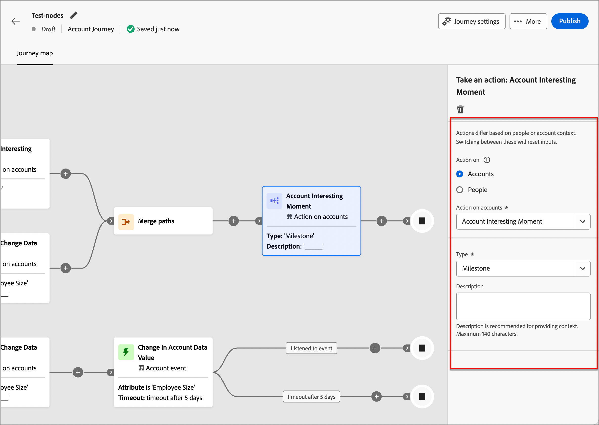
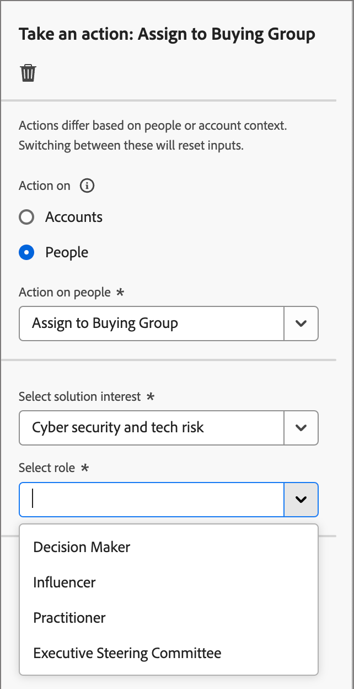
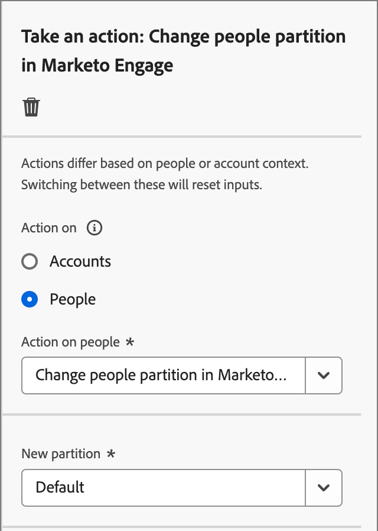

# Realizar uma ação

Na jornada da sua conta, você pode adicionar um nó _[!UICONTROL Realizar uma ação]_ para executar uma ação, como enviar um email, alterar uma pontuação, atribuir a um grupo de compra e assim por diante. As ações normalmente são o que você deseja que aconteça como resultado de algum tipo de acionador, como um evento ou uma ação anterior.

{width="30"} [Assista ao vídeo de visão geral](#overview-video)

## Ações da conta

Use uma ação nas contas quando quiser aplicar uma alteração a todas as pessoas que fazem parte das contas no caminho do nó.

### Ações e restrições {#account-action-constraints}

| Ação | Restrições |
| ------ | ----------- |
| [!UICONTROL Valor de Dados de Alteração de Conta] | Selecionar atributo Novo valor |
| [!UICONTROL Momento Interessante na Conta] | Tipo (Email, Marco ou Web) Descrição (opcional) |
| [!UICONTROL Adicionar conta à (outra) Jornada] | Selecionar Jornada de conta em tempo real |
| [!UICONTROL Adicionar à lista de contas] | Selecionar uma lista de contas estáticas em tempo real |
| [!UICONTROL Remover Conta da Jornada] | Selecionar Jornada de conta em tempo real |
| [!UICONTROL Remover da lista de contas] | Selecionar uma lista de contas estáticas em tempo real |
| [!UICONTROL Enviar Alerta de Vendas] | Selecionar interesse da solução Enviar email para |
| [!UICONTROL Atualizar Estágio do Grupo de Compras] | Selecionar interesse de solução Selecionar estágio de grupo de compras |
| [!UICONTROL Atualizar Status do Grupo de Compras] | Selecionar status de interesse da solução (obrigatório, máximo de 50 caracteres) |

### Adicionar uma ação baseada em conta

1. Navegue até o editor de jornadas.

1. Clique no ícone de adição ( **+** ) em um caminho e escolha **[!UICONTROL Executar uma ação]**.

   {width="400"}

1. Nas propriedades do nó à direita, escolha **[!UICONTROL Contas]** para a ação.

1. Selecione uma ação na lista e defina quaisquer valores para a ação.

   Nó do {width="700" zoomable="yes"}

## Ações de pessoas

Use uma ação em pessoas quando quiser aplicar uma alteração a todas as pessoas no caminho do nó. Esse tipo de nó pode ser usado no caminho dividido por pessoas ou no caminho dividido por contas.

### Ações e restrições {#people-action-constraints}

| Contexto | Ação | Restrições |
| ------- | ------ | ----------- |
| [Journey Optimizer B2B](#journey-optimizer-b2b-actions) | [!UICONTROL Adicionar ao público-alvo externo do cliente] | Selecionar público-alvo do cliente externo |
| | [!UICONTROL Atribuir ao Grupo de Compras] | Selecionar interesse de solução Selecionar função |
| | [!UICONTROL Alterar valor de dados] | Selecionar atributo de pessoa Definir novo valor |
| | [!UICONTROL Alterar pontuação] | Nome da pontuação Alteração na pontuação |
| | [!UICONTROL Momento Interessante] | Tipo Descrição |
| | [!UICONTROL Remover do Grupo de Compras] | Selecionar interesse de solução |
| | [!UICONTROL Enviar email] | Criar novo email Selecionar email do Marketo Engage |
| | [!UICONTROL Enviar SMS] | Criar SMS |
| [Marketo Engage](#marketo-engage-actions) | [!UICONTROL Adicionar à lista] | Selecionar espaço de trabalho do Marketo Engage  Nome da lista |
| | [!UICONTROL Adicionar à campanha de solicitação do Marketo Engage] | Selecionar espaço de trabalho do Marketo Engage Selecionar campanha de Solicitação |
| | [!UICONTROL Alterar Partição de Pessoas no Marketo Engage] | Nova partição |
| | [!UICONTROL Remover da lista] | Selecionar espaço de trabalho do Marketo Engage  Nome da lista |

### Adicionar uma ação com base em pessoas

1. Navegue até o editor de jornadas.

1. Clique no ícone de adição ( **+** ) em um caminho e escolha **[!UICONTROL Executar uma ação]**.

1. Nas propriedades do nó à direita, escolha **[!UICONTROL Pessoas]** para a ação.

1. Selecione uma ação na lista e defina quaisquer valores para a ação.

{width="700" zoomable="yes"}

### Ações B2B do Journey Optimizer

As ações com base em pessoas B2B do Journey Optimizer são projetadas para gerenciar comunicações por meio dos canais configurados e gerenciar a categorização de pessoas em seus grupos de compras e contas. A jornada aplica a ação quando uma conta qualificada com perfis de pessoa atinge o nó.

+++[!UICONTROL Adicionar ao público-alvo externo do cliente]

Use esta ação para encaminhar as pessoas para um público-alvo externo que pode ser ativado em um canal de mídia pago para direcionar ainda mais os membros de grupos de compra. Essa ação é executada por meio do Real-Time CDP B2B/P Edition.

>[!NOTE]
>
>Quando uma conta qualificada com perfis de pessoa atinge o nó _Adicionar ao público-alvo externo de cliente_ em uma jornada publicada, pode levar até 48 horas para que esses perfis sejam preenchidos no público-alvo externo.

{width="300"}

Ao selecionar essa ação com base em pessoas, você pode criar um novo público-alvo externo ou selecionar de um público-alvo externo existente. Para públicos existentes, é possível escolher entre públicos de clientes externos que foram criados somente no Journey Optimizer B2B edition. Ao criar um público-alvo e usá-lo para esta ação de jornada, conecte o destino. Para obter mais informações, consulte [Criar uma nova conexão de destino](https://experienceleague.adobe.com/en/docs/experience-platform/destinations/ui/connect-destination){target="_blank"} e [Visão geral da ativação](https://experienceleague.adobe.com/en/docs/experience-platform/destinations/ui/activate/activation-overview#activate-audiences-from-the-destinations-catalog){target="_blank"} na documentação do Experience Platform).

_Para criar uma audiência externa:_

1. Escolha **[!UICONTROL Criar novo]**.

1. Clique em **[!UICONTROL Criar público-alvo de cliente externo]**.

1. Insira um **[!UICONTROL Nome]** (obrigatório) e uma **[!UICONTROL Descrição]** (opcional) para o novo público externo.

   {width="300"}

1. Clique em **[!UICONTROL Criar]**.

   O sistema cria o novo público-alvo e exibe uma mensagem de confirmação. Em seguida, você pode continuar a usá-lo como um público-alvo existente para a ação do nó.

_Para usar um público existente:_

1. Clique em **[!UICONTROL Selecionar público-alvo de cliente externo]**.

1. Na caixa de diálogo, selecione o público-alvo que deseja usar.

   {width="700" zoomable="yes"}

1. Clique em **[!UICONTROL Adicionar audiência]**.

+++

+++[!UICONTROL Atribuir ao Grupo de Compras]

Use esta ação para adicionar perfis de pessoas a um [grupo de compras](../buying-groups/buying-groups-overview.md) com base em um interesse e função de solução selecionados.

{width="300"}

+++

+++[!UICONTROL Alterar valor de dados]

Use esta ação para alterar o valor de um [atributo de perfil de pessoas](../data/field-mapping.md#xdm-business-person-attributes). Selecione o atributo e defina o novo valor.

{width="300"}

+++

+++[!UICONTROL Alterar pontuação]

Use esta ação para alterar a pontuação da pessoa no Marketo Engage. [Saiba mais](https://experienceleague.adobe.com/en/docs/marketo-learn/tutorials/lead-and-data-management/lead-scoring-learn){target="_blank"}

{width="300"}

+++

+++[!UICONTROL Momento Interessante]

Use esta ação para registrar um momento interessante para perfis de pessoas. Escolha um tipo (Email, Marco ou Web) e adicione uma descrição (opcional).

{width="300"}

+++

+++[!UICONTROL Remover do Grupo de Compras]

Use esta ação para remover perfis de pessoas de um [grupo de compras](../buying-groups/buying-groups-overview.md) com base em um interesse de solução selecionado.

{width="300"}

+++

+++[!UICONTROL Enviar email]

Use esta ação para enviar um email. Você pode criar, personalizar e visualizar mensagens de email no designer visual (consulte [Criação de email](../content/email-authoring.md)). Você também pode enviar um email [do Marketo Engage](https://experienceleague.adobe.com/en/docs/marketo/using/product-docs/email-marketing/general/creating-an-email/create-an-email){target="_blank"}. Selecione o espaço de trabalho do Marketo Engage e o email a ser enviado.

{width="300"}

+++

+++[!UICONTROL Enviar SMS]

Use esta ação para enviar uma mensagem SMS. Você pode criar, personalizar e visualizar mensagens SMS no designer visual (consulte [Criação de SMS](../content/sms-authoring.md)).

{width="300"}

+++

### Ações do Marketo Engage

Os recursos com base em pessoas do Marketo Engage foram projetados para coordenar sua orquestração de marketing com base em contas no Journey Optimizer B2B edition com seus esforços de marketing com base em clientes potenciais no Marketo Engage. Use essas ações para orquestrar a associação de listas, partições de pessoas e solicitar campanhas.

+++[!UICONTROL Adicionar à lista]

Use esta ação para remover pessoas de uma [Smart List](https://experienceleague.adobe.com/en/docs/marketo/using/product-docs/core-marketo-concepts/smart-lists-and-static-lists/understanding-smart-lists){target="_blank"} da Marketo Engage.

Primeiro, selecione o espaço de trabalho na instância do Marketo Engage conectada. Em seguida, selecione o nome da lista.

{width="300"}

+++

+++[!UICONTROL Adicionar à campanha de solicitação do Marketo]

Use esta ação para adicionar perfis de pessoas a uma [campanha de solicitação](https://experienceleague.adobe.com/en/docs/marketo/using/product-docs/core-marketo-concepts/smart-campaigns/flow-actions/request-campaign){target="_blank"} no Marketo Engage.

Primeiro, selecione o espaço de trabalho na instância do Marketo Engage conectada. Em seguida, selecione o nome da campanha de solicitação.

{width="300"}

+++

+++[!UICONTROL Alterar partição de pessoas no Marketo Engage]

Use esta ação para alterar a [partição de pessoa](https://experienceleague.adobe.com/en/docs/marketo/using/product-docs/administration/workspaces-and-person-partitions/understanding-workspaces-and-person-partitions#person-partitions){target="_blank"} no Marketo Engage.

{width="300"}

+++

+++[!UICONTROL Remover da lista]

Use esta ação para remover pessoas de uma [Smart List](https://experienceleague.adobe.com/en/docs/marketo/using/product-docs/core-marketo-concepts/smart-lists-and-static-lists/understanding-smart-lists){target="_blank"} da Marketo Engage. Primeiro, selecione o espaço de trabalho na instância do Marketo Engage conectada. Em seguida, selecione o nome da lista.

{width="300"}

Se o perfil da pessoa não for membro da Smart List, a ação será ignorada.

+++

## Vídeo de visão geral

>[!VIDEO](https://video.tv.adobe.com/v/3443207/?learn=on)