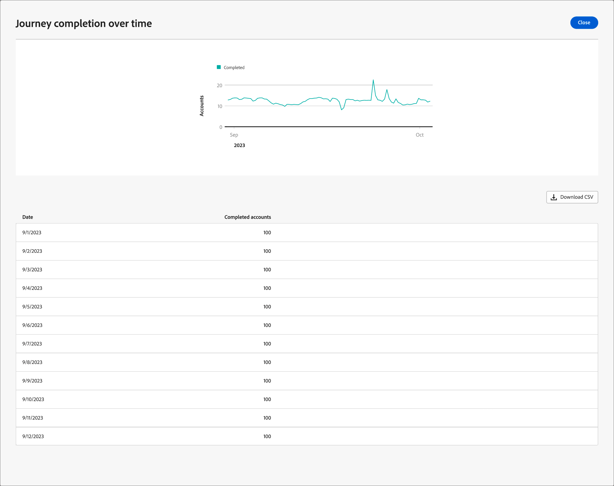

# Detalhes da jornada

Ao clicar no nome de uma jornada de conta ativa, os detalhes da jornada são exibidos. A guia _[!UICONTROL Visão geral]_ fornece informações úteis sobre a jornada, incluindo resumos de IA generativos.

Esse painel fornece uma visão geral abrangente de uma jornada de conta selecionada, detalhando o progresso da conta usando gráficos de círculo e de linha que categorizam e quantificam conclusões, atividades em andamento e anulações ao longo do tempo. Ele ajuda os profissionais de marketing a avaliar a eficiência dos canais de email e SMS por meio das principais métricas de entrega e engajamento.

Essa visão geral está disponível para jornadas de conta publicadas e leva aproximadamente quatro horas para que os dados comecem a preencher os gráficos e as tabelas.

{width="700" zoomable="yes"}

## Conclusão da jornada

Esta seção apresenta duas métricas de conclusão:

* **[!UICONTROL Status da Jornada]** - Este gráfico de círculo oferece um detalhamento dos status de jornada categorizando as contas em _Concluídas_, _Em Andamento_ e _Anuladas_. Cada segmento é rotulado com as porcentagens e os números de conta correspondentes na borda externa do gráfico.
* **[!UICONTROL Conclusão de Jornada ao longo do tempo]** - Este gráfico de linha controla o número de contas que concluíram sua jornada ao longo do tempo. O eixo horizontal mapeia a linha do tempo enquanto o eixo vertical quantifica as contas, fornecendo uma visualização simples das tendências de conclusão.

## Jornada envolvimento

Esta seção apresenta duas métricas de conclusão:

* **[!UICONTROL Envolvimento por contas]** - Este gráfico de círculo segmenta as contas em uma jornada em _Envolvido_ e _Não envolvido_ categorias. A figura central exibe a contagem total. Essa visualização fornece uma compreensão rápida do envolvimento geral com a conta.
* **Participação de pessoas** - Esta visualização exibe o número total de pessoas qualificadas como _envolvidas_ em uma jornada.

## Desempenho da jornada

Esta seção apresenta duas métricas vitais:

* **[!UICONTROL Taxa de conclusão da Jornada]** - A porcentagem de contas que concluíram com êxito sua jornada.
* **[!UICONTROL Duração da Jornada]** - O tempo médio necessário para que as contas concluam a jornada.

## Desempenho de email e SMS

As tabelas de desempenho fornecem uma visão detalhada da eficácia dos canais de email e SMS. Cada tabela mostra métricas, como taxas de delivery e taxas de click-through, que ajudam a avaliar o impacto de cada ponto de contato de comunicação.

Colunas da tabela de **[!UICONTROL Desempenho do email]**:

* _[!UICONTROL Nome do ativo]_ - nome do ativo
* _[!UICONTROL Enviado]_ - número de emails enviados
* _[!UICONTROL Taxa de entrega]_ - número de emails entregues dividido pelo número enviado
* _[!UICONTROL Taxa de Abertura]_ - número de emails abertos dividido pelo número entregue
* _[!UICONTROL Taxa de click-through]_ - número de emails clicados dividido pelo número entregue

**[!UICONTROL Colunas da tabela de desempenho de SMS]**:

* _[!UICONTROL Nome do ativo]_ - nome do ativo
* _[!UICONTROL Enviado]_ - número de mensagens SMS enviadas
* _[!UICONTROL Taxa de entrega]_ - número de mensagens SMS entregues dividido pelo número enviado
* _[!UICONTROL Taxa de click-through]_ - número de mensagens SMS clicadas dividido pelo número entregue
<!-- 
To generate a shareable PDF of your current view, click **[!UICONTROL Export]** at the top right of the page. -->

## Melhor interação

Interaja mais com os dados usando o ícone de ação (**...**) na parte superior direita de cada gráfico ou tabela.

### Drill-Through

Para o gráfico _[!UICONTROL status da Jornada]_, escolha **[!UICONTROL Drill-through]** para obter uma análise detalhada dos status de contas individuais.

{width="600" zoomable="yes"}
<!--
The applied global filters are carried over to the view and displayed at the top. Click the _Filter_ icon at the top left to filter the data display by journey.-->

### Exibir mais

Escolha **[!UICONTROL Exibir mais]** para acessar os dados estendidos. O pop-up exibido fornece um detalhamento dos dados.

{width="600" zoomable="yes"}

Para baixar os dados, clique em **[!UICONTROL Baixar CSV]** na parte superior direita da tabela de dados. Para retornar ao painel _Visão geral_, clique em **[!UICONTROL Fechar]**.
