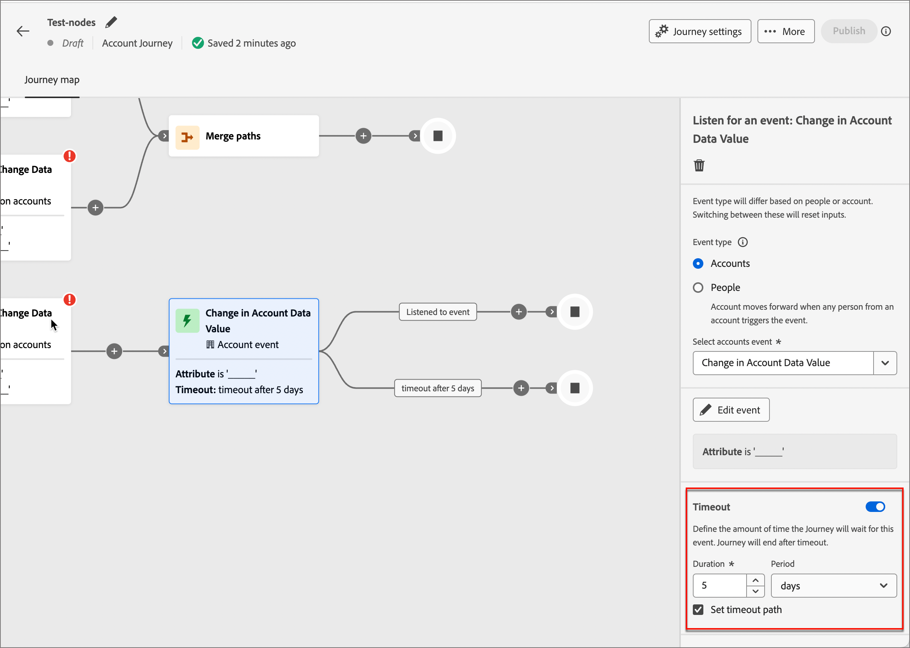

# Nós de Jornada de conta

Depois de [criar uma jornada de conta](journey-overview.md#create-an-account-journey) e [adicionar o público-alvo](journey-overview.md#add-the-account-audience-for-your-journey), compile a jornada usando nós. O mapa de jornada fornece uma tela, onde você pode criar seus casos de uso de marketing B2B em várias etapas.

Crie sua jornada de conta combinando os diferentes nós de ação, evento e orquestração como um cenário em várias etapas e entre canais. Cada nó de uma jornada representa uma etapa ao longo de um caminho lógico.

## Nó de público-alvo da conta

O nó [Público-alvo da conta](journey-overview.md#add-the-account-audience-for-your-journey) define o público-alvo da conta de entrada (criado e gerenciado no Adobe Experience Platform) para a jornada. Este nó é sempre o primeiro nó e é criado automaticamente por padrão.

## Realizar uma ação

Execute uma ação como enviar um email, alterar a pontuação e assim por diante.

**Ação nas contas**: a ação é aplicada a todas as pessoas que fazem parte das contas neste caminho.

**Ação em pessoas**: a ação é aplicada a todas as pessoas neste caminho. Uma ação em pessoas pode ser usada no caminho dividido por pessoas ou no caminho dividido por contas.

| Contexto do nó | Função | Restrições |
| ------------ | -------- | ----------- |
| [Pessoas](#add-a-people-action) | Atribuir ao Grupo de Compras | Selecionar interesse de solução Selecionar função |
| | Remover do grupo de compra | Selecionar interesse de solução |
| | Enviar SMS | Criar SMS |
| | Adicionar à campanha de solicitação do Marketo Engage | Selecionar espaço de trabalho do Marketo Engage Selecionar campanha de Solicitação |
| | Alterar Partição de Pessoas no Marketo Engage | Nova partição |
| | Momento interessante da pessoa | Tipo Descrição |
| | Alterar pontuação | Alteração do nome da pontuação  |
| | Enviar email | Criar novo email Selecionar email do Marketo Engage |
| [Contas](#add-an-account-action) | Enviar Alerta de Vendas | Selecionar interesse da solução Enviar email para |
| | Adicionar conta ao (outro) Jornada | Selecionar Jornada de conta em tempo real |
| | Atualizar Status do Grupo de Compras | Interesse da solução Status (obrigatório, máximo de 50 caracteres) |
| | Remover conta da Jornada (atual) | Selecionar Jornada de conta em tempo real |
| | Momento interessante da conta | Tipo (email, marco ou Web) Descrição (opcional) |
| | Valor dos dados de alteração da conta | Selecionar atributo Novo valor |

### Adicionar uma ação de conta

1. Navegue até o editor de jornadas.

1. Clique no ícone de adição ( **+** ) em um caminho e escolha **[!UICONTROL Executar uma ação]**.

   {width="400"}

1. Nas propriedades do nó à direita, escolha **[!UICONTROL Contas]** para a ação.

1. Selecione uma ação na lista e defina quaisquer valores para a ação.

   Nó do {width="700" zoomable="yes"}

### Adicionar uma ação de pessoas

1. Navegue até o editor de jornadas.

1. Clique no ícone de adição ( **+** ) em um caminho e escolha **[!UICONTROL Executar uma ação]**.

1. Nas propriedades do nó à direita, escolha **[!UICONTROL Pessoas]** para a ação.

1. Selecione uma ação na lista e defina quaisquer valores para a ação.

{width="700" zoomable="yes"}

## Ouvir um evento

Mova o público-alvo para a próxima etapa da jornada quando ocorrer um evento.

* Você também pode definir a quantidade de tempo que a jornada aguarda por esse evento. A jornada termina após um tempo limite.
* Além disso, você pode optar por adicionar outros nós no caminho de tempo limite.

**Ouvir eventos em contas**: se pelo menos uma pessoa de uma conta acionar um evento, a conta avançará para a próxima etapa da jornada.

**Ouvir eventos em pessoas**: eventos em pessoas só podem ser aplicados em um caminho de conta; não está disponível para uma divisão por nó de pessoas.

| Contexto do nó | Função | Restrições |
| ------------ | -------- | ----------- |
| [Pessoas](#add-a-people-event) | Alterações no valor dos dados | Atributo Restrições adicionais (opcional) Tempo limite (opcional) |
| | Clica em link no email | Email Restrições adicionais (opcional) Tempo limite (opcional) |
| | Atribuído ao Grupo de Compras | Interesse da solução Restrições adicionais (opcional) Tempo limite (opcional) |
| | Abre e-mail | Email Restrições adicionais (opcional) Tempo limite (opcional) |
| | A pontuação é alterada | Nome da pontuação Restrições adicionais (opcional) Tempo limite (opcional) |
| | Removido do Grupo de Compras | Interesse da solução Data da atividade (opcional) Tempo limite (opcional) |
| [Contas](#add-an-account-event) | Alteração no Status do Grupo de Compras | Interesse da solução Restrições adicionais (opcional) Tempo limite (opcional) |
| | Alteração na pontuação de integridade | Interesse da solução Restrições adicionais (opcional) Tempo limite (opcional) |
| | A conta teve um momento interessante | Tipo Restrições adicionais (opcional) Tempo limite (opcional) |
| | Alteração na pontuação de engajamento | Interesse da solução Restrições adicionais (opcional) Tempo limite (opcional) |
| | Alteração no valor dos dados da conta | Atributo Restrições adicionais (opcional) Tempo limite (opcional) |

### Adicionar um evento de conta

1. Navegue até o editor de jornadas.

1. Clique no ícone de adição ( **+** ) em um caminho e escolha **[!UICONTROL Ouvir um evento]**.

1. Nas propriedades do nó à direita, escolha **[!UICONTROL Contas]** para o tipo de evento.

   {width="700" zoomable="yes"}

1. Selecione um evento na lista.

1. Clique em **[!UICONTROL Editar evento]** e defina os detalhes do evento.

### Adicionar um evento de pessoas

1. Navegue até o editor de jornadas.

1. Clique no ícone de adição ( **+** ) em um caminho e escolha **[!UICONTROL Ouvir um evento]**.

1. Nas propriedades do nó à direita, escolha **[!UICONTROL Pessoas]** para o tipo de evento.

   {width="700" zoomable="yes"}

1. Selecione um evento na lista.

1. Clique em **[!UICONTROL Editar evento]** e defina os detalhes do evento.

### Adicionar um tempo limite a um nó de evento

Se necessário, defina a quantidade de tempo que a jornada aguarda pelo evento. A jornada termina após o tempo limite.

1. Ative a opção de tempo limite.

1. Selecione a duração pela qual a jornada aguarda a ocorrência de um evento antes de atingir o tempo limite.

   Você pode optar por finalizar o caminho aqui ou executar um curso de ação diferente definindo outro caminho.

1. Para criar um novo caminho na jornada, onde você pode adicionar ações e eventos aplicáveis a contas quando o evento não ocorrer, marque a caixa de seleção **[!UICONTROL Definir caminho de tempo limite]**.

   {width="700" zoomable="yes"}

## Dividir caminhos

Divida seu público-alvo com base nas condições de filtro.

>[!NOTE]
>
>Há suporte para, no máximo, 25 caminhos.

**Dividir caminhos por contas**: os caminhos divididos por contas podem incluir ações e eventos de conta e pessoas, e esses caminhos podem ser divididos ainda mais.

_Como funciona um caminho dividido por nó de contas?_

* Quando você adiciona um nó de caminho dividido e escolhe _Conta_, cada caminho adicionado inclui um nó final com a capacidade de adicionar nós a cada borda.
* É possível dividir o caminho por Contas repetidamente, por exemplo, de maneira aninhada. Um caminho dividido inclui uma opção para não adicionar o caminho padrão.
* Contas/pessoas que não se qualificam para um dos caminhos de divisão não avançam na jornada.
* Esses caminhos podem ser combinados usando um nó de mesclagem.

Nó do {width="700" zoomable="yes"}

**Dividir caminhos por pessoas**: caminhos divididos por pessoas e podem incluir somente ações de pessoas, e esses caminhos não podem ser divididos novamente. Os caminhos se associam automaticamente.

_Como funciona um caminho dividido por nó de pessoas?_

* O caminho dividido pelos nós de pessoas é um nó agrupado. Elas se mesclam automaticamente para que todas as pessoas no público-alvo possam avançar para a próxima etapa sem perder o contexto das contas às quais pertencem.
* O caminho dividido para pessoas não pode ser aninhado — não é possível adicionar um caminho dividido para pessoas em um caminho que esteja nesse nó agrupado.
* O caminho dividido inclui uma opção para não adicionar um caminho padrão. Contas/pessoas que não se qualificam não avançam na Jornada.

{width="700" zoomable="yes"}

| Contexto do nó | Condições de caminho | Descrição |
| ------------ | -------- | ----------- |
| [Pessoas](#add-a-split-path-by-people-node) | Atributos da pessoa | |
| | Valor dos dados alterado (como filtrar no histórico de atividades) | |
| | E-mail aberto | |
| | Clicou em link de e-mail | |
| | Link clicado na página da Web | |
| | Teve um momento interessante | |
| | Membro do Grupo de Compras | |
| [Contas](#add-a-split-path-by-account-node) | Alteração no valor dos dados da conta (como filtrar no histórico de atividades) | |

### Adicionar um caminho dividido pelo nó da conta

1. Navegue até o editor de jornadas.

1. Clique no ícone de adição ( **+** ) em um caminho e escolha **[!UICONTROL Dividir caminhos]**.

   {width="300"}

1. Nas propriedades do nó à direita, escolha **[!UICONTROL Contas]** para a divisão.

1. Para definir uma condição aplicável ao _[!UICONTROL Caminho 1]_, clique em **[!UICONTROL Aplicar condição]**.

   {width="500"}

1. No editor de condições, adicione um ou mais filtros para definir o caminho dividido.

   * Arraste e solte atributos de filtro da navegação à esquerda e conclua a definição de correspondência.

   * Ajuste as condições aplicando a **[!UICONTROL lógica de Filtro]** na parte superior. Você escolhe corresponder todas as condições de atributo ou qualquer condição.

     {width="700" zoomable="yes"}

   * Clique em **[!UICONTROL Concluído]**.

1. Para adicionar mais caminhos, clique em **[!UICONTROL Adicionar caminho]** e repita as etapas anteriores para adicionar condições aplicáveis a este caminho.

   Você também pode rotular cada caminho com base nessas condições ou usar os rótulos padrão.

1. (Opcional) Adicione um caminho padrão para contas não qualificadas para os outros caminhos. Caso contrário, a jornada será encerrada para essas contas.

   {width="700" zoomable="yes"}

### Adicionar um caminho dividido pelo nó de pessoas

1. Navegue até o editor de jornadas.

1. Clique no ícone de adição ( **+** ) em um caminho e escolha **[!UICONTROL Dividir caminhos]**.

   {width="300"}

1. Nas propriedades do nó à direita, escolha **[!UICONTROL Pessoas]** para a divisão.

1. Para definir uma condição aplicável ao _[!UICONTROL Caminho 1]_, clique em **[!UICONTROL Aplicar condição]**.

1. No editor de condições, adicione um ou mais filtros para definir o caminho dividido.

   * Arraste e solte atributos de filtro da navegação à esquerda e conclua a definição de correspondência.

   * Ajuste as condições aplicando a **[!UICONTROL lógica de Filtro]** na parte superior. Você escolhe corresponder todas as condições de atributo ou qualquer condição.

   * Clique em **[!UICONTROL Concluído]**.

1. Para adicionar mais caminhos, clique em **[!UICONTROL Adicionar caminho]** e repita as etapas anteriores para adicionar condições aplicáveis a este caminho.

   Você também pode rotular cada caminho com base nessas condições ou usar os rótulos padrão.

1. Por fim, você pode adicionar um caminho padrão para as pessoas não qualificadas para os caminhos acima. Caso contrário, a jornada terminará para essas pessoas

Quando você tem condições definidas para cada caminho no nível das pessoas, pode adicionar ações que deseja realizar nas pessoas.

>[!NOTE]
>
>Ao dividir o público por pessoas, você pode adicionar somente ações de pessoas.

## Aguardar

Aguarde uma certa duração antes de passar para a próxima etapa.

1. Navegue até o editor de jornadas.

1. Clique no ícone de adição ( **+** ) em um caminho e escolha **[!UICONTROL Aguardar]**.

1. Nas propriedades do nó à direita, defina a **[!UICONTROL Duração]** do tempo de espera antes que a jornada continue para o próximo nó no caminho.

{width="700" zoomable="yes"}

## Caminhos de mesclagem

Diferentes caminhos na jornada podem ser mesclados e desfeitos usando esse nó.

1. Navegue até o editor de jornadas.

1. Clique no ícone de adição ( **+** ) em um caminho e escolha **[!UICONTROL Dividir caminhos]**.

1. Clique no nó dividido para abrir as propriedades à direita.

1. Clique em [!UICONTROL Adicionar caminho] para criar três caminhos.

1. Adicione uma combinação de ações e eventos a cada caminho.

1. Clique no ícone de adição ( **+** ) de qualquer um desses caminhos e escolha **[!UICONTROL Mesclar]** nas opções exibidas.

   {width="400"}

1. Nas propriedades do nó de mesclagem, selecione os caminhos que deseja mesclar.

   {width="600" zoomable="yes"}

   Agora você deve ver que os caminhos são mesclados para que as contas dos caminhos selecionados se combinem em um único caminho e possam continuar avançando pela jornada.

1. Se necessário, você pode desfazer a mesclagem de caminhos ao navegar de volta para as propriedades do nó de mesclagem e desmarcar a caixa de seleção de qualquer caminho que deseja remover.
