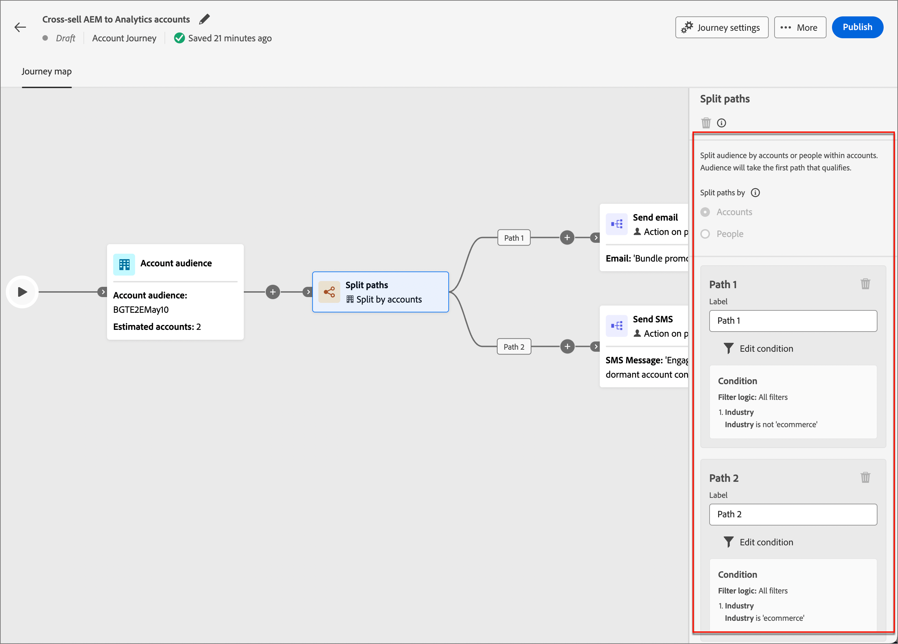

# Nós de Jornada de conta

Depois de [criar uma jornada de conta](journey-overview.md#create-an-account-journey) e [adicionar o público-alvo](journey-overview.md#add-the-account-audience-for-your-journey), compile a jornada usando nós. O mapa de jornada fornece uma tela, onde você pode criar seus casos de uso de marketing B2B em várias etapas.

Crie sua jornada de conta combinando os diferentes nós de ação, evento e orquestração como um cenário em várias etapas e entre canais. Cada nó de uma jornada representa uma etapa ao longo de um caminho lógico. Use os seguintes tipos de nó para criar uma jornada de conta:

* [Público-alvo de conta](#account-audience-node)
* [Realizar uma ação](#take-an-action)
* [Ouvir um evento](#listen-for-an-event)
* [Dividir caminhos](#split-paths)
* [Aguardar](#wait)
* [Caminhos de mesclagem](#merge-paths)

## Nó de público-alvo da conta

O nó [Público-alvo da conta](journey-overview.md#add-the-account-audience-for-your-journey) define o público-alvo da conta de entrada (criado e gerenciado no Adobe Experience Platform) para a jornada. Este nó é sempre o primeiro nó e é criado automaticamente por padrão.

## Realizar uma ação

Execute uma ação como enviar um email, alterar uma pontuação, atribuir a um grupo de compra e assim por diante.

**Ação nas contas**: a ação é aplicada a todas as pessoas que fazem parte das contas neste caminho.

**Ação em pessoas**: a ação é aplicada a todas as pessoas neste caminho. Uma ação em pessoas pode ser usada no caminho dividido por pessoas ou no caminho dividido por contas.

### Ações e restrições {#action-nodes}

| Contexto do nó | Ação | Restrições |
| ------------ | ------ | ----------- |
| [Pessoas](#add-a-people-action) | Adicionar à lista | Selecione o nome da lista do espaço de trabalho do Marketo Engage   |
| | Adicionar à campanha de solicitação do Marketo Engage | Selecionar espaço de trabalho do Marketo Engage Selecionar campanha de Solicitação |
| | Atribuir ao Grupo de Compras | Selecionar interesse de solução Selecionar função |
| | Alterar Partição de Pessoas no Marketo Engage | Nova partição |
| | Alterar pontuação | Alteração do nome da pontuação  |
| | Momento interessante da pessoa | Tipo Descrição |
| | Remover do grupo de compra | Selecionar interesse de solução |
| | Remover da lista | Selecione o nome da lista do espaço de trabalho do Marketo Engage   |
| | Enviar email | Criar novo email Selecionar email do Marketo Engage |
| | Enviar SMS | Criar SMS |
| [Contas](#add-an-account-action) | Valor dos dados de alteração da conta | Selecionar atributo Novo valor |
| | Momento interessante da conta | Tipo (Email, Marco ou Web) Descrição (opcional) |
| | Adicionar conta ao (outro) Jornada | Selecionar Jornada de conta em tempo real |
| | Remover conta do Jornada | Selecionar Jornada de conta em tempo real |
| | Enviar Alerta de Vendas | Selecionar interesse da solução Enviar email para |
| | Atualizar Estágio do Grupo de Compras | Selecionar interesse de solução Selecionar estágio de grupo de compras |
| | Atualizar Status do Grupo de Compras | Selecionar status de interesse da solução (obrigatório, máximo de 50 caracteres) |

### Adicionar uma ação de conta

1. Navegue até o editor de jornadas.

1. Clique no ícone de adição ( **+** ) em um caminho e escolha **[!UICONTROL Executar uma ação]**.

   {width="400"}

1. Nas propriedades do nó à direita, escolha **[!UICONTROL Contas]** para a ação.

1. Selecione uma ação na lista e defina quaisquer valores para a ação.

   Nó do {width="700" zoomable="yes"}

### Adicionar uma ação de pessoas

1. Navegue até o editor de jornadas.

1. Clique no ícone de adição ( **+** ) em um caminho e escolha **[!UICONTROL Executar uma ação]**.

1. Nas propriedades do nó à direita, escolha **[!UICONTROL Pessoas]** para a ação.

1. Selecione uma ação na lista e defina quaisquer valores para a ação.

{width="700" zoomable="yes"}

## Ouvir um evento

Mova o público-alvo para a próxima etapa da jornada quando ocorrer um evento.

* Você também pode definir a quantidade de tempo que a jornada aguarda por esse evento. A jornada termina após um tempo limite.
* Além disso, você pode optar por adicionar outros nós no caminho de tempo limite.

**Ouvir eventos em contas**: se pelo menos uma pessoa de uma conta acionar um evento, a conta avançará para a próxima etapa da jornada.

**Ouvir eventos em pessoas**: eventos em pessoas só podem ser aplicados em um caminho de conta; não está disponível para uma divisão por nó de pessoas.

### Eventos e restrições {#event-nodes}

| Contexto do nó | Evento | Restrições |
| ------------ | ----- | ----------- |
| [Pessoas](#add-a-people-event) | Atribuído ao Grupo de Compras | Interesse da solução Restrições adicionais (opcional): <li>Função</li><li>Data da atividade</li> Tempo limite (opcional) |
| | Clica em link no email | Email Restrições adicionais (opcional): <li>Link</li><li>ID do link</li><li>É um dispositivo móvel</li><li>Dispositivo</li><li>Plataforma</li><li>Navegador</li><li>É conteúdo preditivo</li><li>É atividade de bot</li><li>Padrão de atividade do bot</li><li>Navegador</li><li>Data da atividade</li><li>Número número de vezes</li> Tempo limite (opcional) |
| | Cliques no link do SMS | Email Restrições adicionais (opcional): <li>Link</li><li>Dispositivo</li><li>Plataforma</li><li>Data da atividade</li><li>Número número de vezes</li> Tempo limite (opcional) |
| | Alterações no valor de dados | Atributo de pessoa Restrições adicionais (opcional): <li>Novo valor</li><li>Valor anterior</li><li>Motivo</li><li>Origem</li><li>Data da atividade</li><li>Número número de vezes</li> Tempo limite (opcional) |
| | Abre o email | Email Restrições adicionais (opcional): <li>Link</li><li>ID do link</li><li>É um dispositivo móvel</li><li>Dispositivo</li><li>Plataforma</li><li>Navegador</li><li>É conteúdo preditivo</li><li>É atividade de bot</li><li>Padrão de atividade do bot</li><li>Navegador</li><li>Data da atividade</li><li>Número número de vezes</li> Tempo limite (opcional) |
| | Removido do Grupo de Compras | Interesse da solução Data da atividade (opcional) Tempo limite (opcional) |
| | A pontuação é alterada | Nome da pontuação Restrições adicionais (opcional):<li>Alterar</li><li>Nova pontuação</li><li>Urgência</li><li>Prioridade</li><li>Pontuação relativa</li><li>Urgência relativa</li><li>Data da atividade</li><li>Número número de vezes</li> Tempo limite (opcional) |
| | Rejeições de SMS | Mensagem SMS Restrições adicionais (opcional): <li>Data da atividade</li><li>Número mínimo de vezes</li> Tempo limite (opcional) |
| [Contas](#add-an-account-event) | A conta teve um momento interessante | Tipo (Email, Marco ou Web) Restrições adicionais (opcional): <li>Descrição</li><li>Origem</li><li>Data da atividade</li>  Tempo limite (opcional) |
| | Alteração no valor dos dados da conta | Atributo Restrições adicionais (opcional): <li>Novo valor</li><li>Valor anterior</li><li>Data da atividade</li>  Tempo limite (opcional) |
| | Alteração no Estágio de Grupo de Compras | Interesse da solução Restrições adicionais (opcional): <li>Novo estágio</li><li>Fase anterior</li><li>Data da atividade</li>Tempo limite de   (opcional) |
| | Alteração no Status do Grupo de Compras | Interesse da solução Restrições adicionais (opcional): <li>Novo status</li><li>Status anterior</li><li>Data da atividade</li>Tempo limite de   (opcional) |
| | Alteração na pontuação de integridade | Interesse da solução Restrições adicionais (opcional): <li>Nova pontuação</li><li>Pontuação anterior</li><li>Data da atividade</li>Tempo limite de   (opcional) |
| | Alteração na pontuação de engajamento | Interesse da solução Restrições adicionais (opcional): <li>Nova pontuação</li><li>Pontuação anterior</li><li>Data da atividade</li>Tempo limite de   (opcional) |

### Adicionar um evento de conta

1. Navegue até o editor de jornadas.

1. Clique no ícone de adição ( **+** ) em um caminho e escolha **[!UICONTROL Ouvir um evento]**.

1. Nas propriedades do nó à direita, escolha **[!UICONTROL Contas]** para o tipo de evento.

   {width="700" zoomable="yes"}

1. Selecione um evento na lista.

1. Clique em **[!UICONTROL Editar evento]** e defina os detalhes do evento.

### Adicionar um evento de pessoas

1. Navegue até o editor de jornadas.

1. Clique no ícone de adição ( **+** ) em um caminho e escolha **[!UICONTROL Ouvir um evento]**.

1. Nas propriedades do nó à direita, escolha **[!UICONTROL Pessoas]** para o tipo de evento.

   {width="700" zoomable="yes"}

1. Selecione um evento na lista.

1. Clique em **[!UICONTROL Editar evento]** e defina os detalhes do evento.

### Adicionar um tempo limite a um nó de evento

Se necessário, defina a quantidade de tempo que a jornada aguarda pelo evento. A jornada termina após um tempo limite.

1. Ative a opção de tempo limite.

1. Selecione a duração pela qual a jornada aguarda a ocorrência de um evento antes de atingir o tempo limite.

   Você pode optar por finalizar o caminho aqui ou executar um curso de ação diferente definindo outro caminho.

1. Para criar um novo caminho na jornada, onde você pode adicionar ações e eventos aplicáveis a contas quando o evento não ocorrer, marque a caixa de seleção **[!UICONTROL Definir caminho de tempo limite]**.

   {width="700" zoomable="yes"}

## Dividir caminhos

Divida seu público-alvo com base nas condições de filtro.

>[!NOTE]
>
>Há suporte para, no máximo, 25 caminhos.

**Dividir caminhos por contas**: os caminhos divididos por contas podem incluir ações e eventos de contas e pessoas. Esses caminhos podem ser divididos ainda mais.

_Como funciona um caminho dividido por nó de contas?_

* Quando você adiciona um nó de caminho dividido e escolhe _Conta_, cada caminho adicionado inclui um nó final com a capacidade de adicionar nós a cada borda.
* É possível dividir o caminho por Contas repetidamente, por exemplo, de maneira aninhada. Um caminho dividido inclui uma opção para não adicionar o caminho padrão.
* Se uma conta/pessoa não se qualificar para um dos caminhos de divisão, ela não avançará na jornada.
* Esses caminhos podem ser combinados usando um nó de mesclagem.

Nó do {width="700" zoomable="yes"}

**Dividir caminhos por pessoas**: caminhos divididos por pessoas e podem incluir somente ações de pessoas. Esses caminhos não podem ser divididos novamente e se unem automaticamente.

_Como funciona um caminho dividido por nó de pessoas?_

* O caminho dividido pelos nós de pessoas é um nó agrupado. Os caminhos se mesclam automaticamente para que todas as pessoas no público-alvo possam avançar para a próxima etapa sem perder o contexto da conta.
* O caminho dividido para pessoas não pode ser aninhado — não é possível adicionar um caminho dividido para pessoas em um caminho que esteja nesse nó agrupado.
* O caminho dividido inclui uma opção para omitir um caminho padrão. Contas/pessoas sem correspondência para um caminho definido não avançam na Jornada.
* O caminho dividido por pessoas oferece suporte ao uso de _relacionamentos conta-pessoa_, que permite filtrar pessoas com base em sua função (como contratante ou funcionário em tempo integral), conforme definido nos modelos de funções.

{width="700" zoomable="yes"}

### Condições de caminho {#path-conditions}

| Contexto do nó | Condições de caminho | Descrição |
| ------------ | --------------- | ----------- |
| [Contas](#add-a-split-path-by-account-node) | Atributos de contas | Atributos do perfil da conta, incluindo: <li>Receita anual</li><li>Cidade</li><li>País</li><li>Tamanho do funcionário</li><li>Setor</li><li>Nome</li><li>Código SIC</li><li>Estado</li> |
| | [!UICONTROL Filtros especiais] > [!UICONTROL Tem Grupo de Compras] | A conta tem ou não membros de grupos de compras avaliados em relação a um ou mais dos seguintes critérios: <li>Interesse da solução</li><li>Status do Grupo de Compras</li><li>Pontuação de integridade</li><li>Pontuação de envolvimento</li> |
| [Pessoas](#add-a-split-path-by-people-node) > [!UICONTROL Somente atributos de pessoas] | [!UICONTROL Atributos da pessoa] | Atributos do perfil de pessoa, incluindo: <li>Cidade</li><li>País</li><li>Data de nascimento</li><li>Endereço de email</li><li>Email inválido</li><li>Email suspenso</li><li>Nome</li><li>Região inferida</li><li>Nome do cargo</li><li>Sobrenome</li><li>Número do celular</li><li>Número de telefone</li><li>Código postal</li><li>Estado</li><li>Inscrição cancelada</li><li>Motivo do cancelamento de inscrição</li> |
| | [!UICONTROL Histórico de atividades] > [!UICONTROL Email] | Atividades de email associadas à jornada: <li>[!UICONTROL Link clicado no email]</li><li>E-mail aberto</li><li>O email foi entregue</li><li>O email foi enviado</li> Essas condições são avaliadas usando uma mensagem de email selecionada anteriormente na jornada. |
| | [!UICONTROL Histórico de atividades] > [!UICONTROL Valor dos dados alterado] | Para um atributo de pessoa selecionado, ocorreu uma alteração de valor. Esses tipos de alterações incluem: <li>Novo valor</li><li>Valor anterior</li><li>Motivo</li><li>Origem</li><li>Data da atividade</li><li>Número número de vezes</li> |
| | [!UICONTROL Histórico de Atividades] > [!UICONTROL Teve Um Momento Interessante] | Atividade de momento interessante definida na instância de Marketo Engage associada. As restrições incluem: <li>Data importante</li><li>Email</li><li>Web</li> |
| | [!UICONTROL Filtros especiais] > [!UICONTROL Membro do Grupo de Compras] | A pessoa é ou não é um membro do grupo de compra avaliado em relação a um ou mais dos seguintes critérios: <li>Interesse da solução</li><li>Status do Grupo de Compras</li><li>Pontuação de integridade</li><li>Pontuação de envolvimento</li><li>Função</li> |
| [Pessoas](#add-a-split-path-by-people-node) > [!UICONTROL Somente atributos Account-person] | Função nos atributos da conta | Uma função na conta é atribuída ou não à pessoa. Restrições opcionais: <li>Insira um nome de função</li> |

### Adicionar um caminho dividido pelo nó da conta

1. Navegue até o editor de jornadas.

1. Clique no ícone de adição ( **+** ) em um caminho e escolha **[!UICONTROL Dividir caminhos]**.

   {width="300"}

1. Nas propriedades do nó à direita, escolha **[!UICONTROL Contas]** para a divisão.

1. Para definir uma condição aplicável ao _[!UICONTROL Caminho 1]_, clique em **[!UICONTROL Aplicar condição]**.

   {width="500"}

1. No editor de condições, adicione um ou mais filtros para definir o caminho dividido.

   * Arraste e solte atributos de filtro da navegação à esquerda e conclua a definição de correspondência.

   * Ajuste as condições aplicando a **[!UICONTROL lógica de Filtro]** na parte superior. Você escolhe corresponder todas as condições de atributo ou qualquer condição.

     {width="700" zoomable="yes"}

   * Clique em **[!UICONTROL Concluído]**.

1. Para adicionar mais caminhos, clique em **[!UICONTROL Adicionar caminho]** e repita as etapas anteriores para adicionar condições aplicáveis a este caminho.

   Você também pode rotular cada caminho com base nessas condições ou usar os rótulos padrão.

1. Se necessário, reordene os caminhos de acordo com a prioridade desejada para a divisão.

   A filtragem de caminho é avaliada em ordem decrescente. Cada conta continua pelo primeiro caminho correspondente.

   Clique nas setas para cima e para baixo na parte superior direita de cada cartão de caminho para movê-lo para cima ou para baixo na lista de caminhos.

   {width="500" zoomable="yes"}

1. Habilite a opção **[!UICONTROL Outras contas]** para adicionar um caminho padrão para contas que não correspondam aos caminhos definidos. Se não, a jornada acaba para essas pessoas.

### Adicionar um caminho dividido pelo nó de pessoas

1. Navegue até o editor de jornadas.

1. Clique no ícone de adição ( **+** ) em um caminho e escolha **[!UICONTROL Dividir caminhos]**.

   {width="300"}

1. Nas propriedades do nó à direita, escolha **[!UICONTROL Pessoas]** para a divisão.

1. Defina os **[!UICONTROL Atributos usados para as condições]**.

   * Escolha **[!UICONTROL Somente atributos de pessoas]** para usar condições relacionadas ao perfil de pessoa e aos eventos.
   * Escolha **[!UICONTROL Somente atributos Conta-Pessoa]** para usar condições relacionadas à associação de função da pessoa em uma conta.

1. Para definir uma condição aplicável ao _[!UICONTROL Caminho 1]_, clique em **[!UICONTROL Aplicar condição]**.

1. No editor de condições, adicione um ou mais filtros para definir o caminho dividido.

   * Arraste e solte qualquer um dos atributos de pessoas da navegação à esquerda e conclua a definição de correspondência.

     >[!NOTE]
     >
     >Se você tiver campos de pessoa personalizados definidos no esquema de público-alvo da conta no Experience Platform, esses campos também estarão disponíveis para uso como atributos de pessoa em condições.

   * Ajuste as condições aplicando a **[!UICONTROL lógica de Filtro]** na parte superior. Você escolhe corresponder todas as condições de atributo ou qualquer condição.

     {width="700" zoomable="yes"}

   * Clique em **[!UICONTROL Concluído]**.

1. Para adicionar mais caminhos, clique em **[!UICONTROL Adicionar caminho]** e repita as etapas anteriores para adicionar condições aplicáveis a este caminho.

   Você também pode rotular cada caminho com base nessas condições ou usar os rótulos padrão.

1. Se necessário, reordene os caminhos de acordo com a prioridade desejada para a divisão.

   A filtragem de caminho é avaliada em ordem decrescente. Cada pessoa continua pelo primeiro caminho que corresponde a.

   Clique nas setas para cima e para baixo na parte superior direita de cada cartão de caminho para movê-lo para cima ou para baixo na lista de caminhos.

   {width="500" zoomable="yes"}

1. Habilite a opção **[!UICONTROL Outras pessoas]** para adicionar um caminho padrão para pessoas que não correspondam aos caminhos definidos. Se não, a jornada acaba para essas pessoas.

Quando você tem condições definidas para cada caminho para dividir o público no nível das pessoas, é possível adicionar ações que deseja realizar nas pessoas.

>[!NOTE]
>
>Ao dividir o público por pessoas, você pode adicionar somente ações de pessoas até que os caminhos sejam fechados ou mesclados.

## Aguardar

Aguarde uma certa duração antes de passar para a próxima etapa.

1. Navegue até o editor de jornadas.

1. Clique no ícone de adição ( **+** ) em um caminho e escolha **[!UICONTROL Aguardar]**.

1. Nas propriedades do nó à direita, defina a **[!UICONTROL Duração]** do tempo de espera antes que a jornada continue para o próximo nó no caminho.

{width="700" zoomable="yes"}

## Caminhos de mesclagem

Diferentes caminhos na jornada podem ser mesclados e desfeitos usando esse nó.

1. Navegue até o editor de jornadas.

1. Clique no ícone de adição ( **+** ) em um caminho e escolha **[!UICONTROL Dividir caminhos]**.

1. Clique no nó dividido para abrir as propriedades à direita.

1. Clique em [!UICONTROL Adicionar caminho] para criar três caminhos.

1. Adicione uma combinação de ações e eventos a cada caminho.

1. Clique no ícone de adição ( **+** ) de qualquer um desses caminhos e escolha **[!UICONTROL Mesclar]** nas opções exibidas.

   {width="400"}

1. Nas propriedades do nó dos caminhos de mesclagem, selecione os caminhos que deseja mesclar.

   {width="600" zoomable="yes"}

   Nesse ponto, os caminhos são mesclados para que as contas dos caminhos selecionados sejam combinadas em um único caminho que possa continuar avançando pela jornada.

1. Se necessário, você pode desfazer a mesclagem de caminhos navegando de volta para as propriedades do nó dos caminhos de mesclagem e desmarcando a caixa de seleção de todos os caminhos que deseja remover.
