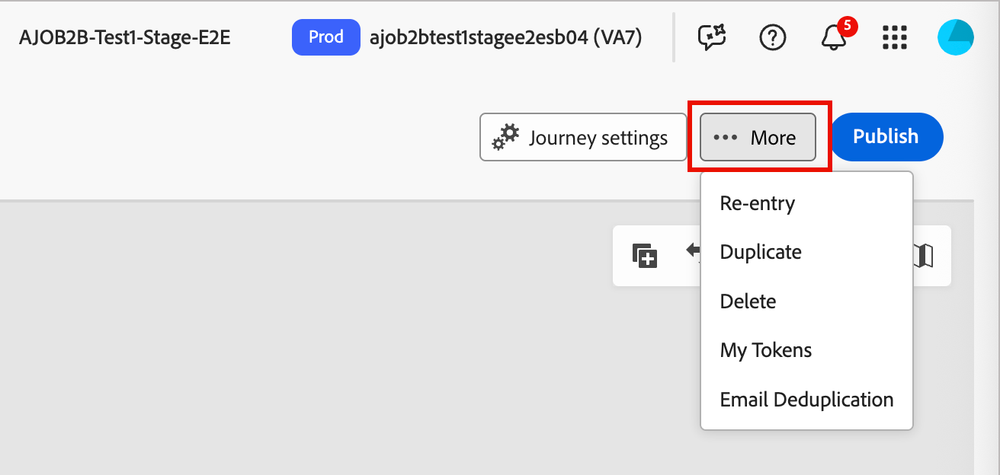

# Jornada reentrada

Quando você ativa a reentrada para uma jornada, pode controlar quando e com que frequência uma conta ou pessoa pode entrar novamente na mesma jornada. Use as configurações de reentrada para definir critérios, limites e tempos de espera para que as contas ou pessoas se requalifiquem para a jornada de forma controlada.

Uma conta ou pessoa pode se requalificar para uma jornada quando os seguintes itens forem verdadeiros:

* A conta ou pessoa está dentro do número de reentradas permitidas para a jornada.
* A conta ou pessoa atingiu o limite de tempo de espera (o tempo mínimo de espera antes da requalificação).
* A conta ou pessoa não está na jornada.

## Ativar reentrada para uma jornada

Você pode habilitar a reentrada e alterar as configurações de reentrada quando a jornada estiver com o status _Rascunho_.

>[!BEGINTABS]

>[!TAB jornada na conta]

1. Abra a jornada da conta de rascunho.

1. Clique no menu **[!UICONTROL Mais...]** na parte superior direita e escolha **[!UICONTROL Reinserir]**.

   {width="450"}

1. Na caixa de diálogo _[!UICONTROL Reentrada de Jornada]_, alterne a opção **[!UICONTROL Habilitar reentrada]**.

   Quando o recurso está ativado, as opções de tempo, atraso e limites são exibidas.

   {width="450"}

1. Para **[!UICONTROL Tempo de reentrada]**, escolha como a espera é calculada:

   * **[!UICONTROL Aguardar do fim da jornada]** - O período de espera começa quando a conta sai ou conclui a jornada. Por exemplo, &quot;30 dias depois que a conta concluir a jornada, ela poderá inserir novamente&quot;.

   * **[!UICONTROL Aguardar desde o início da jornada]** - O período de espera se baseia em quando a conta entrou pela primeira vez na jornada. Por exemplo, &quot;30 dias a partir de quando a conta iniciou a jornada, ela pode inserir novamente&quot;.

1. Defina o **[!UICONTROL Atraso de reentrada]**, que é a duração da espera em horas ou dias.

   Essa configuração determina quanto tempo uma conta deve esperar após sair ou iniciar a jornada antes de entrar novamente.

1. Para definir o número máximo de vezes que uma conta pode entrar na jornada, defina o **[!UICONTROL Limite de entradas]**.

   Quando uma conta atinge o limite, ela não se qualifica mais para entrada até que o limite seja redefinido ou a jornada seja republicada com um novo limite.

   Esse limite se aplica por conta para essa jornada.

1. Clique em **[!UICONTROL Salvar]**.

>[!TAB jornada de pessoa]

1. Abra a jornada de pessoa de rascunho.

1. Clique no menu **[!UICONTROL Mais...]** na parte superior direita e escolha **[!UICONTROL Reinserir configurações]**.

   {width="450"}

1. Na caixa de diálogo _[!UICONTROL Reentrada de Jornada]_, alterne a opção **[!UICONTROL Habilitar reentrada]**.

   Quando o recurso está ativado, as opções de tempo, atraso e limites são exibidas.

   {width="450"}

1. Para **[!UICONTROL Tempo de reentrada]**, escolha como a espera é calculada:

   * **[!UICONTROL Aguardar desde o fim da jornada]** - O período de espera começa quando a pessoa sai ou conclui a jornada. Por exemplo, &quot;30 dias depois que a pessoa conclui a jornada, ela pode entrar novamente&quot;.

   * **[!UICONTROL Aguardar desde o início da jornada]** - O período de espera se baseia em quando a pessoa entrou na jornada pela primeira vez. Por exemplo, &quot;30 dias a partir de quando a pessoa iniciou a jornada, ela pode entrar novamente&quot;.

1. Defina o **[!UICONTROL Atraso de reentrada]**, que é a duração da espera em horas ou dias.

   Essa configuração determina quanto tempo uma pessoa deve esperar após sair ou iniciar a jornada antes de entrar novamente.

1. Para definir o número máximo de vezes que uma pessoa pode entrar na jornada, defina o **[!UICONTROL Limite de entradas]**.

   Quando uma pessoa atinge o limite, ela não se qualifica mais para entrada até que o limite seja redefinido ou a jornada seja republicada com um novo limite.

   Esse limite se aplica por pessoa para essa jornada.

1. Clique em **[!UICONTROL Salvar]**.

>[!ENDTABS]

## Progressão e atividade

Para uma jornada de conta ou pessoa publicada, a tela de jornada exibe [progressão](./journeys-overview.md#review-account-progression) para os nós de jornada. Cada nó exibe o número de contas ou pessoas que acessam esse nó e, para jornadas ativas, o número atual nesse nó. Cada vez que uma conta ou pessoa entra novamente em uma jornada, ela é contada como uma entrada distinta.

<!-- 
You can see how many times accounts have entered the journey. ?? 

When you drill in to [account details](../accounts/account-details.md), the account activity shows each time the account entered the journey. It includes explicit activity and a recurrence count so that you can see re-entries clearly.
-->
