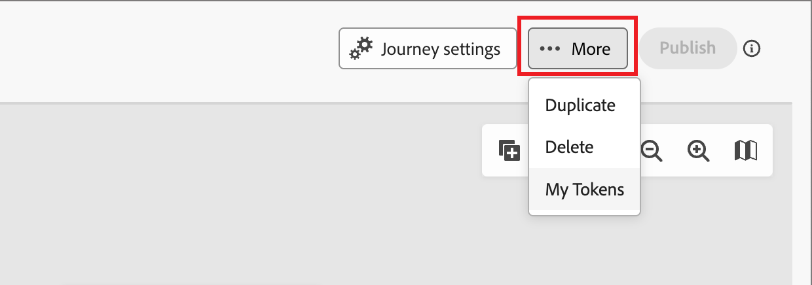

# Jornada reentrada

_Somente jornadas da conta_

Quando você habilita a reentrada de uma jornada de conta, pode controlar quando e com que frequência uma conta pode entrar novamente na mesma jornada. Use as configurações de reentrada para definir critérios, limites e tempos de espera para que as contas sejam requalificadas de forma controlada.

Uma conta pode se requalificar para uma jornada quando os seguintes itens forem verdadeiros:

* A conta está dentro do número de reentradas permitidas para a jornada.
* A conta atingiu o limite de tempo de espera (o tempo mínimo de espera antes da requalificação).
* A conta não está na jornada.

## Ativar a reentrada para uma jornada de conta

Você pode habilitar a reentrada e alterar as configurações de reentrada quando a jornada estiver com o status _Rascunho_.

1. Abra a jornada da conta de rascunho.

1. Clique no menu **[!UICONTROL Mais...]** na parte superior direita e escolha **[!UICONTROL Reinserir]**.

   {width="450"}

1. Na caixa de diálogo _[!UICONTROL Reentrada de Jornada]_, alterne a opção **[!UICONTROL Habilitar reentrada]**.

   Quando o recurso está ativado, as opções de tempo, atraso e limites são exibidas.

   {width="450"}

1. Para **[!UICONTROL Tempo de reentrada]**, escolha como a espera é calculada:

   * **[!UICONTROL Aguardar do fim da jornada]** - O período de espera começa quando a conta sai ou conclui a jornada. Por exemplo, &quot;30 dias depois que a conta concluir a jornada, ela poderá inserir novamente&quot;.

   * **[!UICONTROL Aguardar desde o início da jornada]** - O período de espera se baseia em quando a conta entrou pela primeira vez na jornada. Por exemplo, &quot;30 dias a partir de quando a conta iniciou a jornada, eles podem inserir novamente&quot;.

1. Defina o **[!UICONTROL Atraso de reentrada]**, que é a duração da espera em horas ou dias.

   Essa configuração determina por quanto tempo uma conta deve aguardar depois de sair ou iniciar a jornada, antes de ser inserida novamente.

1. Defina o **[!UICONTROL Limite de entradas]** para definir o número máximo de vezes que uma conta pode entrar na jornada.

   Quando uma conta atinge o limite, ela não se qualifica mais para entrada até que o limite seja redefinido ou a jornada seja republicada com um novo limite.

   Esse limite se aplica por conta para essa jornada.

1. Clique em **[!UICONTROL Salvar]**.

## Progressão e atividade da conta

Para uma jornada de conta publicada, o mapa de jornada exibe [progressão de conta](./journeys-overview.md#review-account-progression) para os nós de jornada. Cada nó no mapa exibe o número de contas para alcançar esse nó e, para jornadas ativas, o número de contas atualmente nesse nó. Cada vez que uma conta entra novamente em uma jornada, ela é contada como uma entrada distinta.
<!-- You can see how many times accounts have entered the journey. ?? -->

Quando você detalha [detalhes da conta](../accounts/account-details.md), a atividade da conta é exibida sempre que a conta entra na jornada. Inclui atividade explícita e uma contagem de recorrências para que você possa ver as reentradas claramente.
