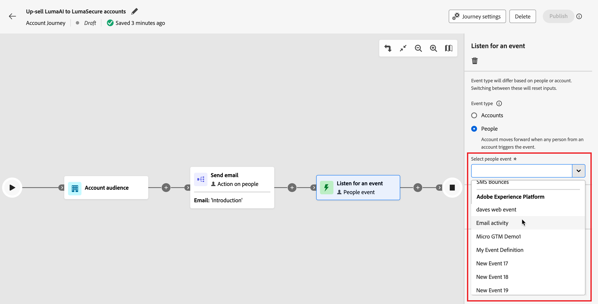
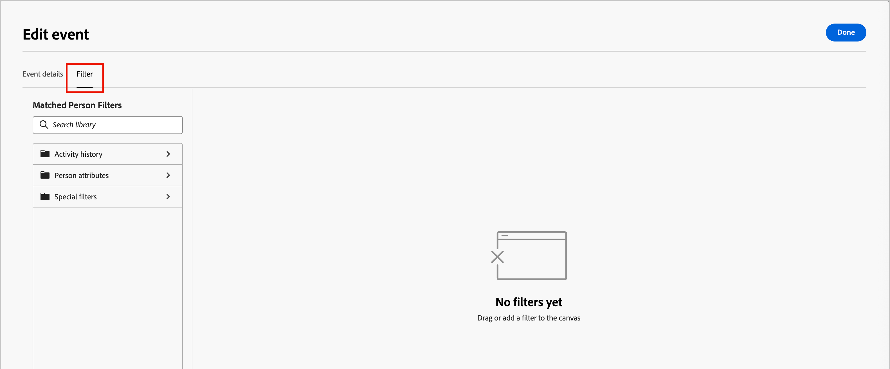

# Acompanhar um evento

Adicione o nó _Ouvir um evento_ para mover o público-alvo para a próxima etapa da jornada da conta quando ocorrer um evento.

{width=&quot;30&quot;, vertical-align=&quot;middle&quot;} [Assista ao vídeo de visão geral](#overview-video)

>[!NOTE]
>
>Não é possível adicionar esse tipo de nó no caminho dividido por pessoas.

## Eventos de conta

Analise um evento com base na conta quando quiser mover a conta para frente na jornada de acordo com os eventos acionados pela atividade da conta.

### Eventos e restrições

| Evento | Restrições |
| ----- | ----------- |
| [!UICONTROL A conta teve um momento interessante] | Tipo (Email, Marco ou Web) Restrições adicionais (opcional): <li>Descrição</li><li>Origem</li><li>Data da atividade</li>  Tempo limite (opcional) |
| [!UICONTROL Alteração no valor dos dados da conta] | Atributo Restrições adicionais (opcional): <li>Novo valor</li><li>Valor anterior</li><li>Data da atividade</li>  Tempo limite (opcional) |
| [!UICONTROL Alteração no Estágio de Grupo de Compras] | Interesse da solução Restrições adicionais (opcional): <li>Novo estágio</li><li>Fase anterior</li><li>Data da atividade</li>Tempo limite de   (opcional) |
| [!UICONTROL Alteração no Status do Grupo de Compras] | Interesse da solução Restrições adicionais (opcional): <li>Novo status</li><li>Status anterior</li><li>Data da atividade</li>Tempo limite de   (opcional) |
| [!UICONTROL Alteração na Pontuação de Integridade] | Interesse da solução Restrições adicionais (opcional): <li>Nova pontuação</li><li>Pontuação anterior</li><li>Data da atividade</li>Tempo limite de   (opcional) |
| [!UICONTROL Alteração na Pontuação de engajamento] | Interesse da solução Restrições adicionais (opcional): <li>Nova pontuação</li><li>Pontuação anterior</li><li>Data da atividade</li>Tempo limite de   (opcional) |

### Adicionar um evento de conta

1. Navegue até o mapa de jornadas.

1. Clique no ícone de adição ( **+** ) em um caminho e escolha **[!UICONTROL Ouvir um evento]**.

1. Nas propriedades do nó à direita, escolha **[!UICONTROL Contas]** para o tipo de evento.

   {width="700" zoomable="yes"}

1. Selecione um evento na lista.

1. Clique em **[!UICONTROL Editar evento]** e defina os detalhes do evento.

## Eventos de pessoas

Analise um evento com base em pessoas quando quiser mover a conta para frente na jornada de acordo com os eventos acionados pela atividade de pessoas. Também é possível filtrar eventos de acordo com atributos de pessoas,

### Eventos e restrições

| Tipo de entrada | Evento | Restrições |
| ---------- | ----- | ----------- |
| Journey Optimizer B2B | [!UICONTROL Atribuído ao Grupo de Compras] | Interesse da solução  Restrições adicionais (opcional): <li>Função</li><li>Data da atividade</li> Tempo limite (opcional) |
| | [!UICONTROL Link de cliques no email] | Email  Restrições adicionais (opcional): <li>Link</li><li>ID do link</li><li>É um dispositivo móvel</li><li>Dispositivo</li><li>Plataforma</li><li>Navegador</li><li>É conteúdo preditivo</li><li>É atividade de bot</li><li>Padrão de atividade do bot</li><li>Navegador</li><li>Data da atividade</li><li>Número número de vezes</li> Tempo limite (opcional) |
| | [!UICONTROL Link de cliques no SMS] | Email  Restrições adicionais (opcional): <li>Link</li><li>Dispositivo</li><li>Plataforma</li><li>Data da atividade</li><li>Número número de vezes</li> Tempo limite (opcional) |
| | [!UICONTROL Alterações no valor dos dados] | Atributo de pessoa  Restrições adicionais (opcional): <li>Novo valor</li><li>Valor anterior</li><li>Motivo</li><li>Origem</li><li>Data da atividade</li><li>Número número de vezes</li> Tempo limite (opcional) |
| | [!UICONTROL Abre o email] | Email  Restrições adicionais (opcional): <li>Link</li><li>ID do link</li><li>É um dispositivo móvel</li><li>Dispositivo</li><li>Plataforma</li><li>Navegador</li><li>É conteúdo preditivo</li><li>É atividade de bot</li><li>Padrão de atividade do bot</li><li>Navegador</li><li>Data da atividade</li><li>Número número de vezes</li> Tempo limite (opcional) |
| | [!UICONTROL Removido do Grupo de Compras] | Interesse da solução Data da atividade (opcional) Tempo limite (opcional) |
| | [!UICONTROL A pontuação foi alterada] | Nome da pontuação  Restrições adicionais (opcional):<li>Alterar</li><li>Nova pontuação</li><li>Urgência</li><li>Prioridade</li><li>Pontuação relativa</li><li>Urgência relativa</li><li>Data da atividade</li><li>Número número de vezes</li> Tempo limite (opcional) |
| | [!UICONTROL Rejeições de SMS] | Mensagem SMS  Restrições adicionais (opcional): <li>Data da atividade</li><li>Número mínimo de vezes</li> Tempo limite (opcional) |
| Marketo Engage | [!UICONTROL Página da Web de Visitas] | Página da Web   Selecione uma ou mais páginas do Marketo Engage para corresponder.   Restrições adicionais (opcional): <li>Cadeia de consulta</li><li>Endereço IP do cliente</li><li>Referenciador</li><li>Agente do usuário</li><li>Mecanismo de pesquisa</li><li>Pesquisar consulta</li><li>Token</li><li>Navegador</li><li>Plataforma</li><li>Dispositivo</li><li>Data da atividade</li> |
| | [!UICONTROL Preenche o formulário] | Formulário   Selecione um ou mais formulários do Marketo Engage para corresponder.   Restrições adicionais (opcional): <li>Data da atividade</li><li>Cadeia de consulta</li><li>Endereço IP do cliente</li><li>Referenciador</li><li>Agente do usuário</li><li>Plataforma</li><li>Dispositivo</li> Tempo limite (opcional) |
| Adobe Experience Platform | [!UICONTROL Definição de evento] | Tipo de evento   Restrições adicionais (opcional): <li>Campos</li>  Restrições adicionais (sem suporte): <li>Data da atividade</li><li>Número número de vezes</li>Tempo limite de   (opcional) |

### Filtros de evento de pessoas

| Filtros | Descrição |
| ------------ | ----------- |
| [!UICONTROL Histórico de atividades] > [!UICONTROL Email] | Atividades de email com base nas condições avaliadas usando uma ou mais mensagens de email selecionadas anteriormente na jornada: <li>[!UICONTROL Link clicado no email] <li>Abriu um email <li>Foi entregue por email <li>Email enviado <!--  **[!UICONTROL Switch to inactivity filter]** - Use this option to filter based on lack of activity (a person did not have the email activity).--> |
| [!UICONTROL Histórico de atividades] > [!UICONTROL Mensagem SMS] | Atividades de SMS com base em condições que são avaliadas usando uma ou mais mensagens SMS selecionadas anteriormente na jornada: <li>[!UICONTROL Link clicado em SMS] <li>[!UICONTROL SMS Devolvido] <!--   **[!UICONTROL Switch to inactivity filter]** - Use this option to filter based on lack of activity (a person did not have the SMS activity). --> |
| [!UICONTROL Histórico de atividades] > [!UICONTROL Valor dos dados alterado] | Para um atributo de pessoa selecionado, ocorreu uma alteração de valor. Esses tipos de alterações incluem: <li>Novo valor<li>Valor anterior<li>Motivo<li>Origem<li>Data da atividade<li>Número número de vezes <!--   **[!UICONTROL Switch to inactivity filter]** - Use this option to filter based on lack of activity (a person did not have a data value change). --> |
| [!UICONTROL Histórico de Atividades] > [!UICONTROL Teve Um Momento Interessante] | Atividade de momento interessante definida na instância associada do Marketo Engage. As restrições incluem: <li>Data importante<li>Email<li>Web <!--  **[!UICONTROL Switch to inactivity filter]** - Use this option to filter based on lack of activity (a person did not have an interesting moment).--> |
| [!UICONTROL Histórico de atividades] > [!UICONTROL Página da Web visitada] | Atividade da página da Web que para uma ou mais páginas da Web gerenciadas pela instância do Marketo Engage associada. As restrições incluem: <li>Página da Web (obrigatório)<li>Data da atividade<li>Endereço IP do cliente <li>Cadeia de consulta <li>Referenciador <li>Agente do usuário <li>Mecanismo de pesquisa <li>Pesquisar consulta <li>URL personalizada <li>Token <li>Navegador <li>Plataforma <li>Dispositivo <li>Número número de vezes <!--  **[!UICONTROL Switch to inactivity filter]** - Use this option to filter based on lack of activity (a person did not visit the web page). --> |
| [!UICONTROL Atributos da pessoa] | Atributos do perfil de pessoa, incluindo: <li>Cidade <li>País <li>Data de nascimento <li>Endereço de email <li>Email inválido <li>Email suspenso <li>Nome <li>Região inferida<li>Nome do cargo <li>Sobrenome <li>Número do celular <li>Pontuação de engajamento da pessoa <li>Número de telefone <li>Código postal <li>Estado <li>Inscrição cancelada <li>Motivo do cancelamento de inscrição |
| [!UICONTROL Filtros especiais] > [!UICONTROL Membro do Grupo de Compras] | A pessoa é ou não é um membro do grupo de compra avaliado em relação a um ou mais dos seguintes critérios: <li>Interesse da solução</li><li>Status do Grupo de Compras</li><li>Pontuação de integridade</li><li>Pontuação de engajamento</li><li>Função</li> |
| [!UICONTROL Filtros especiais] > [!UICONTROL Membro da Lista] | A pessoa é ou não membro de uma ou mais listas do Marketo Engage. |
| [!UICONTROL Filtros especiais] > [!UICONTROL Membro do programa] | A pessoa é ou não é membro de um ou mais programas do Marketo Engage. |

### Adicionar um evento de pessoas

1. Navegue até o mapa de jornadas.

1. Clique no ícone de adição ( **+** ) em um caminho e escolha **[!UICONTROL Ouvir um evento]**.

1. Nas propriedades do nó à direita, escolha **[!UICONTROL Pessoas]** para o tipo de evento.

   {width="700" zoomable="yes"}

1. Selecione um evento na lista.

1. Clique em **[!UICONTROL Editar evento]** e defina os detalhes do evento.

### Analise um evento do Marketo Engage

Se você tiver páginas da Web na instância conectada do Marketo Engage, poderá acionar um evento com base em uma visita/sem visita a essas páginas da Web, bem como formulários do Marketo Engage que não foram/foram preenchidos.

1. Selecione um nó **[!UICONTROL Ouvir um evento]** no mapa de jornadas.

1. Nas propriedades do nó à direita, escolha **[!UICONTROL Pessoas]** para o tipo de evento.

1. Clique na seta do seletor **[!UICONTROL Selecionar evento de pessoas]** e role o menu até a seção **[!UICONTROL Marketo Engage]**.

1. Selecione um tipo de atividade de Participação no mercado:

   * **[!UICONTROL Visita à Página da Web]**.
   * **[!UICONTROL Preenche O Formulário]**

   {width="700" zoomable="yes"}

1. Clique em **[!UICONTROL Editar evento]** e defina uma ou mais páginas da Web para corresponder e quaisquer restrições adicionais para o evento.

   * (Obrigatório) Na caixa de diálogo _[!UICONTROL Editar evento]_, defina a restrição **[!UICONTROL Página da Web]** ou **[!UICONTROL Preenche formulário]**. Use **[!UICONTROL is]** (padrão) para corresponder em uma ou mais páginas ou formulários selecionados. Use **[!UICONTROL não]** para corresponder a todas as visitas/formulários da página, com a exclusão de uma ou mais páginas/formulários selecionados. Ou use o operador **[!UICONTROL is any]** para corresponder a qualquer visita à página da Web do Marketo Engage ou formulário preenchido.

   * (Opcional) Clique em **[!UICONTROL Adicionar restrição]** e escolha o campo que deseja usar para a restrição. Defina o operador e o valor do campo.

     {width="700" zoomable="yes"}

     Você pode repetir essa ação para incluir restrições de campo adicionais, conforme necessário.

   * Se necessário, selecione a guia **[!UICONTROL Filtros]** para [adicionar filtros para o evento](#add-a-filter-to-the-people-event).

   * Quando as restrições e os filtros forem definidos, clique em **[!UICONTROL Concluído]**.

1. Se necessário, defina a opção **[!UICONTROL Tempo limite]** para limitar o período de tempo para ouvir o evento (consulte [Adicionar um tempo limite a um nó de evento](#add-a-timeout-to-an-event-node)).

1. No mapa de jornadas, adicione o próximo nó a ser executado quando o evento ocorrer.

### Analise um evento de experiência

Os administradores podem selecionar [Eventos de experiência do Adobe Experience Platform (AEP)](https://experienceleague.adobe.com/en/docs/experience-platform/xdm/classes/experienceevent){target="_blank"}, que permitem aos profissionais de marketing criar jornadas que reagem aos eventos em tempo quase real. O uso de Eventos de experiência no jornada é um processo de duas etapas:

1. Um administrador [seleciona os tipos de evento e campos de interesse](../admin/configure-aep-events.md#select-an-event) para torná-los disponíveis no jornada.

2. Em uma jornada, adicione um nó _Ouvir um evento_ e selecione um tipo de evento do Experience Platform para um evento com base em pessoas.

<!--
{width="30", vertical-align="middle"} [Watch the video overview](../admin/configure-aep-events.md#overview-video) -->

_Para incluir um Evento de Experiência na jornada :_

1. Selecione um nó **[!UICONTROL Ouvir um evento]** no mapa de jornadas.

1. Nas propriedades do nó à direita, escolha **[!UICONTROL Pessoas]** para o tipo de evento.

1. Clique na seta do seletor **[!UICONTROL Selecionar evento de pessoas]** e role o menu até a seção **[!UICONTROL Adobe Experience Platform]**.

   {width="700" zoomable="yes"}

1. Selecione o evento.

   O tipo de evento é exibido como vazio nos detalhes do nó.

   {width="400" zoomable="yes"}

1. Clique em **[!UICONTROL Editar evento]** e defina uma ou mais restrições para o evento.

   As restrições disponíveis são definidas como campos gerenciados para a configuração do evento.

   * Clique em **[!UICONTROL Adicionar restrição]** e escolha o campo que deseja usar para a restrição.

   * Conclua a condição da restrição.

     Você pode usar o operador padrão **[!UICONTROL is]** para corresponder a um ou mais valores de campo. Ou você pode usar o operador **[!UICONTROL is not]** para corresponder em todos os valores com a exclusão de um ou mais valores especificados.

     {width="700" zoomable="yes"}

   * Se necessário, selecione a guia **[!UICONTROL Filtros]** para [adicionar filtros para o evento](#add-a-filter-to-the-people-event).

   * (Opcional) Clique em **[!UICONTROL Adicionar restrição]** e repita essas etapas para incluir restrições de campo adicionais, conforme necessário.

   * Quando as restrições e os filtros forem definidos, clique em **[!UICONTROL Concluído]**.

1. Se necessário, defina a opção **[!UICONTROL Tempo limite]** para limitar o período de tempo para ouvir o evento (consulte [Adicionar um tempo limite a um nó de evento](#add-a-timeout-to-an-event-node)).

1. No mapa de jornadas, adicione o próximo nó a ser executado quando o evento ocorrer.

1. Conclua os nós restantes para sua jornada e [publique-a](./journey-overview.md).

   Quando a jornada está ativa (publicada) e atinge o nó _Ouvir um evento_, ela começa a ouvir os Eventos de experiência do AEP.

### Adicionar filtros ao evento de pessoas

1. Após definir o evento, selecione a guia **[!UICONTROL Filtros]** na caixa de diálogo _[!UICONTROL Editar Evento]_.

   {width="700" zoomable="yes"}

1. Adicione um ou mais filtros para direcionar as pessoas para o evento.

   * Arraste e solte qualquer um dos [filtros de pessoas](#people-event-filters) da navegação à esquerda e conclua a definição de correspondência.

     >[!NOTE]
     >
     >Se você tiver campos de pessoa personalizados definidos no esquema de público-alvo da conta no Experience Platform, esses campos também estarão disponíveis em **[!UICONTROL Atributos]** para serem usados como atributos de pessoa em filtros.

   * Ajuste a filtragem aplicando a **[!UICONTROL lógica do Filtro]** na parte superior. Você escolhe corresponder todos os filtros ou qualquer filtro.

     {width="700" zoomable="yes"}

   * Clique em **[!UICONTROL Concluído]**.

## Adicionar um tempo limite a um nó de evento

Se necessário, defina a quantidade de tempo que a jornada aguarda pelo evento. A jornada termina após um tempo limite, a menos que você defina um caminho de tempo limite, em que é possível adicionar outros nós.

1. Habilitar a opção **[!UICONTROL Tempo limite]**.

1. Selecione a duração pela qual a jornada aguarda a ocorrência de um evento antes de atingir o tempo limite.

   Você pode optar por finalizar o caminho aqui ou executar um curso de ação diferente definindo outro caminho.

1. Para criar um novo caminho na jornada, onde você pode adicionar ações e eventos aplicáveis a contas quando o evento não ocorrer, marque a caixa de seleção **[!UICONTROL Definir caminho de tempo limite]**.

   {width="700" zoomable="yes"}

<!-- ## Overview video

>[!VIDEO](https://video.tv.adobe.com/v/3443219/?learn=on) -->
