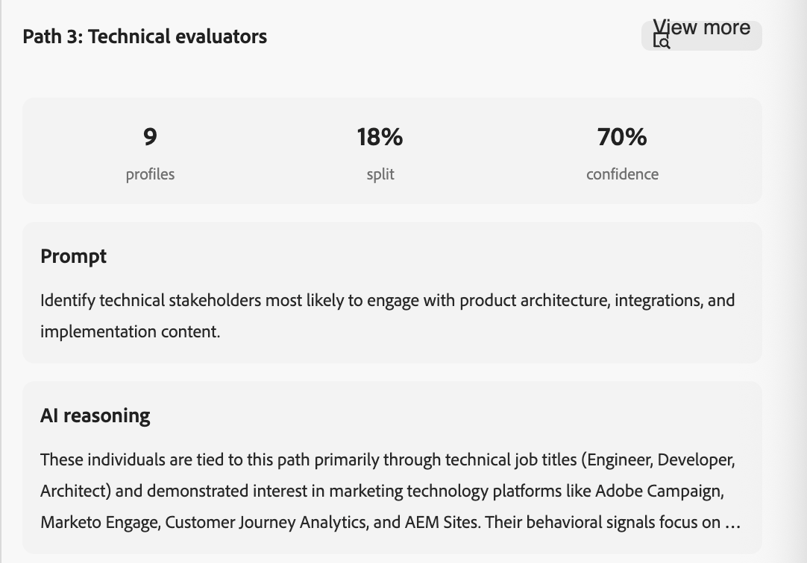

# Próximo nó de melhor caminho

O nó _Próximo melhor caminho_ traz a decisão de caminho dividido orientada por IA diretamente para a tela do jornada. Em vez de configurar condições de filtro em um nó [caminhos divididos](./split-merge-paths-nodes.md), descreva sua intenção em linguagem natural e permita que o sistema determine o caminho mais relevante para cada pessoa.

>[!NOTE]
>
>Os próximos nós de melhor caminho estão disponíveis somente em jornadas pessoais. Elas não são compatíveis com jornadas de conta.

Na compra B2B, um perfil pode parecer ser um tipo de comprador, mas seu comportamento, dados firmográficos e contexto de engajamento revelam uma história mais sutil. O próximo nó de melhor caminho avalia esse contexto para tomar uma decisão de roteamento inteligente, permitindo revisar, modificar ou substituir qualquer recomendação de IA antes de ativar a jornada.

A IA avalia cada pessoa em relação aos prompts de caminho definidos usando uma combinação de entradas:

* **Histórico de engajamento** - Aberturas de email, cliques em links, visitas a páginas da Web e outros sinais comportamentais das jornadas atuais e anteriores
* **Sinais em tempo real** - Eventos de alta intenção, como preenchimentos de formulários e preços de visitas a páginas
* **Atributos do perfil** - Dados demográficos, cargo, persona e firmográficos
* **Atributos da conta** - Dados firme e tecnológico associados à conta da pessoa

Quando uma pessoa atinge o nó, o sistema busca o contexto do perfil, aplica restrições e usa um LLM para selecionar o caminho de melhor ajuste. Cada decisão é registrada com uma pontuação de confiança e raciocínio em linguagem natural para transparência e observabilidade.

Se nenhum caminho for uma correspondência forte ou se o prompt fizer referência a dados não disponíveis para um perfil, a pessoa será roteada para o caminho de fallback padrão.

## Adicionar um próximo nó de melhor caminho {#add-next-best-path-node}

1. Abra a jornada de pessoa e navegue até o mapa de jornadas.

1. Clique no ícone de adição ( **+** ) em um caminho e escolha **[!UICONTROL Próximo melhor caminho]**.

   {width="350" zoomable="no"}

   O nó é adicionado à tela e o painel de configuração da divisão de IA é exibido à direita. Ele começa com um caminho e um caminho padrão _Outras pessoas_ para rotear pessoas que não se qualificam para nenhum dos caminhos definidos.

   {width="500"}

## Configurar caminhos {#configure-paths}

Para cada caminho, defina um nome e um prompt de linguagem natural que descreva quem deve ser roteado para lá. A entrada de prompt substitui totalmente a interface da condição de filtro; não há condições de atributo a serem configuradas.

1. Clique em **[!UICONTROL Adicionar caminho]** para cada caminho adicional que você deseja incluir para o nó.

   Para remover um caminho, clique no ícone _Excluir_ (  ) no cartão de caminho.

1. Para cada placa de caminho no painel direito:

   * Insira um **[!UICONTROL Rótulo]** que reflita o público ou a intenção para esse segmento.

   * Digite um **[!UICONTROL Prompt]** em linguagem natural descrevendo quem pertence a este caminho. Concentre-se na intenção e no resultado, não em valores de atributo específicos.

     <!-- To get prompt ideas, click **[!UICONTROL Suggest prompts]**. The system provides several example prompts tailored to the path context that you can use as-is or adapt. -->

     {width="500"}

     **O exemplo solicita uma divisão de três caminhos:**

      * _Caminho 1 - Líderes de RH :_Identifique as pessoas nas funções de liderança de RH com maior probabilidade de se envolver com gerenciamento de talentos e conteúdo de experiência do funcionário.
      * _Caminho 2 - Avaliadores técnicos :_Identificam os participantes técnicos com maior probabilidade de se envolver com arquitetura de produto, integrações e conteúdo de implementação.
      * _Caminho 3 - Tomadores de Decisão Empresariais :_Identifique as partes interessadas mais propensas a se envolver com ROI, resultados de negócios e conteúdo de estudo de caso.

1. Se necessário, reordene os caminhos para definir a ordem de prioridade para correspondência.

   A filtragem de caminho é avaliada em ordem decrescente. Cada pessoa continua pelo primeiro caminho que corresponde a.

   Clique nas setas para cima e para baixo na parte superior direita de cada cartão de caminho para movê-lo para cima ou para baixo na lista de caminhos.

   {width="500"}

1. Revise o caminho padrão (último na lista de caminhos) e altere o rótulo se necessário.

   O caminho padrão é usado quando a IA não consegue atribuir uma pessoa com confiança a qualquer caminho definido ou quando os dados relevantes não estão disponíveis. Quando um prompt faz referência a dados que não existem no conjunto de dados de um determinado perfil, o sistema roteia esse perfil para o caminho padrão e sinaliza a lacuna de dados.

### Controles humanos em loop {#human-in-the-loop}

As recomendações de IA não são vinculativas. Antes de ativar a jornada, é possível:

* Edite qualquer prompt de caminho para refinar a lógica de roteamento.
* Adicionar, remover ou reordenar caminhos.
* Substitua as sugestões de IA por condições personalizadas, conforme necessário.

As atribuições de caminho orientadas por IA não entrarão em vigor até que você publique a jornada.

## Avisar exemplos por caso de uso {#examples}

Os exemplos a seguir mostram como gravar prompts de caminho efetivos em casos de uso comuns de marketing B2B. Use-os como pontos de partida e adapte o idioma para corresponder ao contexto da jornada e aos dados do público-alvo.

### Sinais ativos de pesquisa e compra {#active-research}

+++Caminho 1 - Pesquisadores ativos de produtos

_Identifique pessoas que estão pesquisando ativamente o software CRM. Procure visitas repetidas à página do produto, envolvimento com o conteúdo de comparação, visitas de retorno frequentes e sinais elevados de intenção de terceiros nos últimos 30 dias._

+++

+++Caminho 2 - Comportamento de comparação de preços

_Identifique os usuários que visualizaram páginas de comparação de preços ou planos várias vezes nos últimos 14 dias, especialmente os usuários que alternaram entre páginas de documentação de preços e recursos._

+++

+++Caminho 3 - Alta intenção, sem conversão

_Identifique visitantes de alta intenção que participaram de demonstrações de produtos, páginas de preços ou documentação de integração nos últimos 21 dias, mas que não enviaram um formulário ou não converteram._

+++

+++Caminho 4 - Comportamento de check-out hesitante

_Identifique os usuários que iniciaram o check-out ou os fluxos de reserva de demonstração, mas não os concluíram e que retornaram pelo menos uma vez depois sem conversão._

+++

### Risco de churn e retenção {#churn-retention}

+++Caminho 1 - Sinais de risco de churn

_Identifique os clientes que mostraram sinais de churn com base no uso decrescente do produto, na frequência reduzida de logon, nos picos de tíquetes de suporte e na diminuição do engajamento de marketing nos últimos 60 dias._

+++

+++Caminho 2 - Desvincular usuários avançados

_Identifique os usuários engajados anteriormente cuja velocidade de engajamento caiu significativamente nos últimos 30 dias em comparação com sua linha de base histórica._

+++

### Educação para lacunas de avaliação {#education-evaluation}

+++Caminho 1 - Pesquisa para sequência de preços

_Identifique os usuários que baixaram um ebook e visitaram a página de preços dentro de 7 dias, mas não solicitaram uma demonstração._

+++

+++Caminho 2 - Webinário sem acompanhamento

_Identifique as pessoas que participaram de um webinário e subsequentemente retornaram às páginas do produto, mas nunca reservaram uma demonstração ou contataram as vendas._

+++

+++Caminho 3 - Avaliação orientada por comparação

_Identifique os visitantes que visualizaram um artigo de comparação com concorrentes e, em seguida, visitaram a documentação de integração ou migração dentro de 14 dias._

+++

### Sequências de engajamento de email {#email-engagement}

+++Caminho 1 - Aberturas sem cliques

_Identifique os clientes potenciais que abriram três ou mais emails de marketing em 30 dias, mas nunca clicaram no site._

+++

+++Caminho 2 - Clicou, mas sem engajamento mais profundo

_Identifique os usuários que clicaram de um email para uma página de produto, mas não exploraram páginas adicionais ou retornaram em 7 dias._

+++

### Padrões de avaliação e conversão {#trial-conversion}

+++Caminho 1 - Conversores rápidos

_Identifique os clientes que atualizaram dentro de 30 dias do início de uma avaliação e que demonstraram alto engajamento no produto durante o período de avaliação._

+++

+++Caminho 2 - Usuários paralisados por avaliação

_Identifique os usuários de avaliação que fizeram logon durante a primeira semana, mas que mostraram atividade mínima depois e não converteram antes da expiração da avaliação._

+++

### Compradores de vários canais {#multi-channel}

+++Caminho 1 - Convergência de anúncios e orgânicos

_Identifique os usuários que participaram pela primeira vez por meio de anúncios pagos e que retornaram posteriormente por canais diretos ou orgânicos em 14 dias._

+++

+++Caminho 2 - Evento para avaliação do produto

_Identifique as contas que participaram de um evento presencial ou virtual e subsequentemente aumentaram o comportamento de pesquisa do produto em 30 dias._

+++

+++Caminho 3 - Pesquisadores entre sites

_Identifique os usuários que se envolveram com conteúdo social e visitaram páginas de alta intenção posteriormente, como preços ou reservas de demonstração._

+++

### Sinais de compra regionais {#regional-buying}

+++Caminho 1 - Sobretensão na região específica

_Identifique contas na América do Norte que tenham mostrado maior atividade de pesquisa de produtos e sinais elevados de intenção de terceiros nos últimos 30 dias em comparação com sua linha de base histórica._

+++

+++Caminho 2 - Impulso do mercado emergente

_Identifique contas na APAC em que a velocidade de envolvimento aumentou significativamente nos últimos 14 dias, mesmo que o volume geral de envolvimento ainda seja moderado._

+++

+++Caminho 3 - Interesse empresarial específico da região

_Identifique contas de empresas na EMEA que estejam se envolvendo com documentação de conformidade, residência de dados ou segurança nos últimos 21 dias._

+++

+++Caminho 4 - Território subpenetrado

_Identifique contas de alto ajuste nos territórios de vendas atribuídos que tenham mostrado sinais de intenção, mas que as vendas ainda não tenham contatado._

+++

### Sinais comportamentais de cronometragem {#behavioral-timing}

+++Caminho 1 - Pesquisadores fora do horário

_Identifique usuários que estejam interagindo repetidamente com páginas de produtos e preços fora do horário comercial normal em seu fuso horário local._

+++

+++Caminho 2 - Janela de pesquisa comprimida

_Identifique contas que mostrem uma densidade de engajamento excepcionalmente alta em uma janela curta de 72 horas em várias áreas de produtos._

+++

+++Caminho 3 - Pico de atividade no final do trimestre

_Identifique as contas com um aumento na atividade dos estágios de avaliação durante os últimos 30 dias do trimestre fiscal._

+++

## Simular decisão antes de publicar {#simulate}

Use a simulação para testar como a IA avalia seus prompts em relação a um público-alvo real antes da jornada entrar em funcionamento. Ela está disponível somente enquanto a jornada está no status _Rascunho_ e não tem efeito em nenhuma jornada publicada. Use-a para validar a lógica de roteamento e criar confiança nas recomendações da IA.

### Executar uma simulação {#run-simulation}

1. Selecione o próximo nó do melhor caminho e clique no ícone _Simular_ (  ) na parte superior do painel direito.

   {width="500"}

1. Na caixa de diálogo, escolha o público-alvo a ser usado para a simulação:

   * **[!UICONTROL Listas de pessoas originais]** - Use o público-alvo do nó de público-alvo. Especifique um tamanho de amostra quando o público-alvo completo exceder o limite de simulação.
   * **[!UICONTROL Listas estáticas e dinâmicas]** - Use uma lista estática ou dinâmica [!DNL Marketo Engage].
   * **[!UICONTROL Registros de teste]** - Use perfis de teste sugeridos por IA.

   {width="300"}

   >[!NOTE]
   >
   >Se o público-alvo selecionado exceder o limite de simulação, o sistema executará a simulação em uma amostra de 100 perfis. Um indicador na interface do usuário mostra que os resultados são baseados em amostras.
   >
   >Se o público selecionado ainda não for materializado, a simulação será bloqueada. Um aviso em linha direciona você para materializar o público-alvo primeiro.

1. Clique em **[!UICONTROL Simular]**.

### Revisar resultados da simulação {#review-simulation-results}

Depois que a simulação é executada, o painel direito mostra como os perfis foram distribuídos em cada caminho e o raciocínio da IA por trás dessas atribuições:

| Resultado | Descrição |
| ------ | ----------- |
| **Perfis** | O número de perfis roteados para o caminho. |
| **Dividir** | A porcentagem de perfis roteados para o caminho. |
| **Confiança** | O nível de confiança de IA para a atribuição de caminho. A confiança reflete a atualização dos dados, a intensidade e a consistência do sinal e o sucesso histórico de padrões de roteamento semelhantes. |
| **Aviso** | O prompt que foi avaliado para o caminho. |
| **Raciocínio de IA** | Uma explicação em linguagem natural do por quê os perfis foram atribuídos coletivamente a esse caminho. |

{width="400"}

>[!NOTE]
>
>Quando os dados disponíveis ou o escopo limitam uma decisão, os resultados incluem informações sobre a limitação. Por exemplo, quando um atributo necessário não está presente no conjunto de dados, os resultados incluem um indicador explícito explicando como os dados ausentes afetaram os resultados.

Use os resultados para refinar os prompts e confirmar se o roteamento reflete o resultado pretendido. Você pode modificar prompts de caminho e executar novamente a simulação quantas vezes forem necessárias antes de publicar.

## Publicar e monitorar a jornada {#publish-and-monitor}

Após validar os resultados da simulação:

1. Conecte o público-alvo de pessoas ao nó de entrada da jornada.

1. [Publique a jornada](./create-publish-journey.md#publish-a-journey).

Depois que a jornada estiver ativa, o nó do próximo melhor caminho será executado no tempo de execução. À medida que cada pessoa atinge o nó, a IA os avalia em tempo real usando os sinais mais recentes e os direciona para o caminho mais relevante.

Para uma jornada publicada, abra o mapa de jornadas e selecione o próximo nó de melhor caminho para exibir a seção **[!UICONTROL Resultados ao vivo]** no painel direito. Os resultados ao vivo mostram:

* A distribuição percentual dos perfis em cada caminho
* A pontuação de confiança para cada atribuição de caminho
* Raciocínio em nível de caminho e de perfil, com detalhes expansíveis para perfis individuais

Os resultados ao vivo também estão disponíveis no Console do Jornada e por meio da [habilidade de Observabilidade do Jornada](../agents/journey-agent.md#journey-observability-skill) no Hub da IA.
