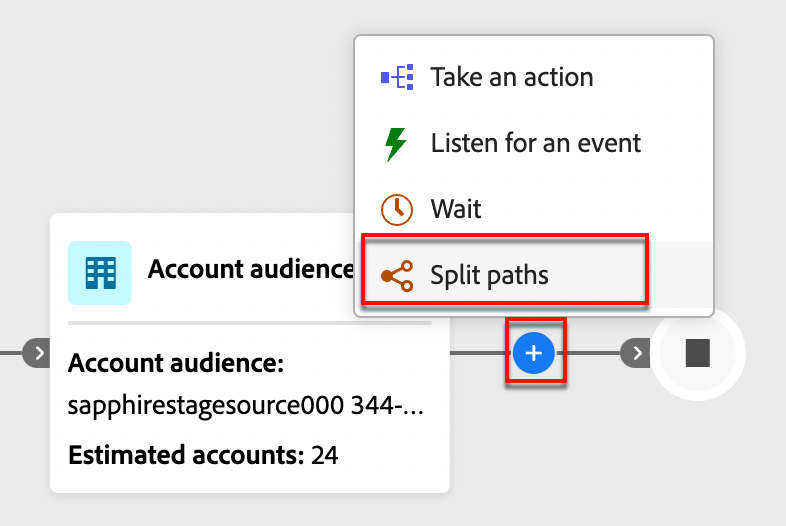
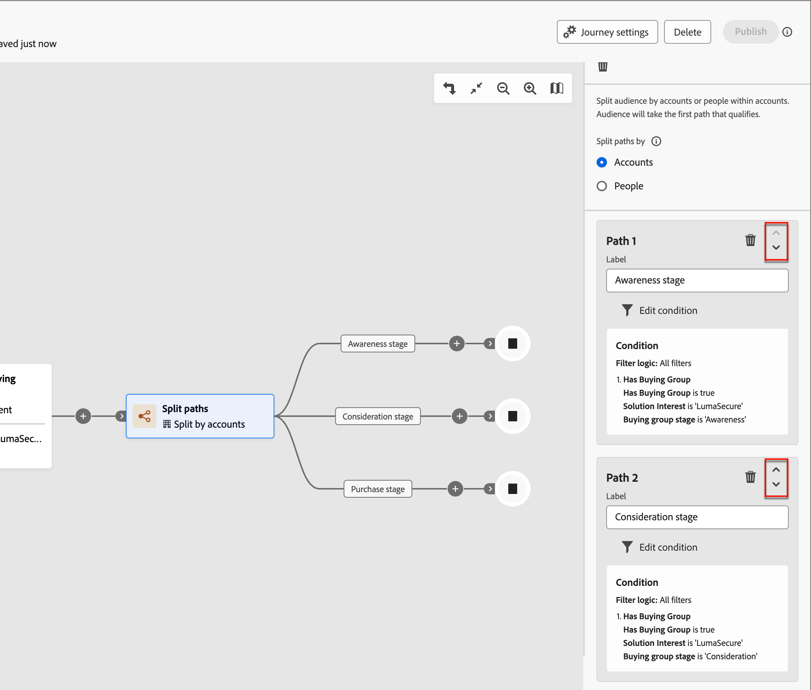
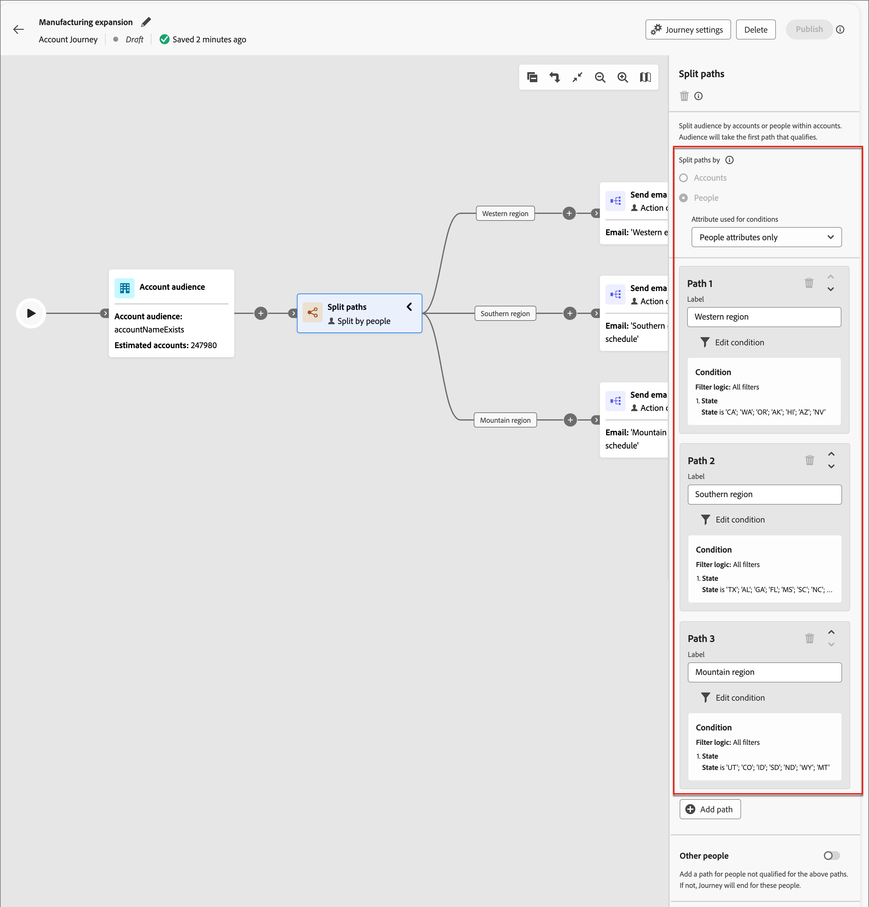
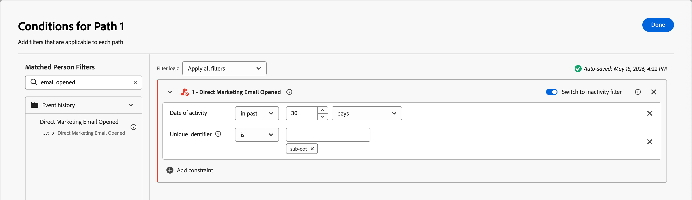
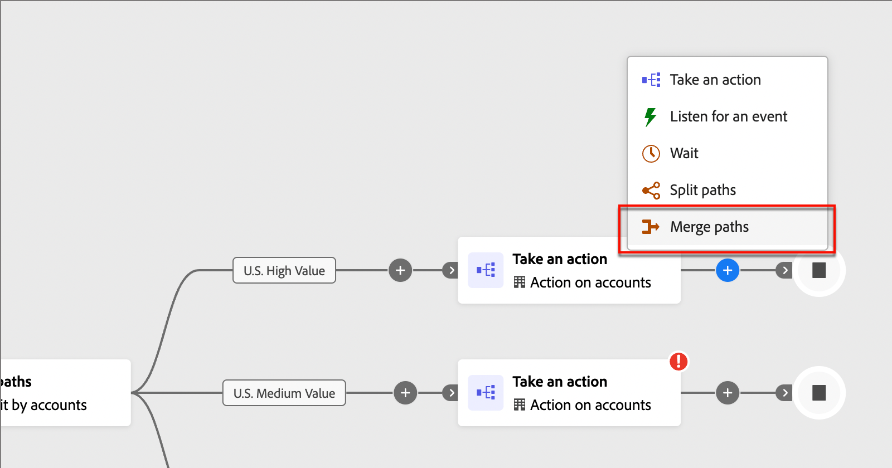
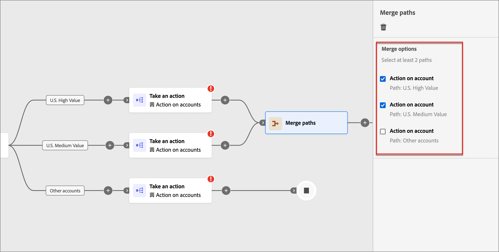

# Dividir e mesclar caminhos {#split-paths}

Use os nós de caminho de divisão e intercalação para segmentar pessoas ou contas de acordo com as condições definidas. Crie caminhos para a lista de público ou contas de acordo com as condições, defina cada caminho com nós de ação e evento para o segmento, depois combine os caminhos e continue a jornada.

{width="30"} [Assista ao vídeo de visão geral](#overview-video)

Um nó _Split paths_ define um ou mais caminhos segmentados com base em **_account_** ou filtros de pessoas. Uma divisão baseada em um filtro de pessoas é fechada automaticamente com um nó de caminhos de mesclagem para que todas as pessoas possam avançar para a próxima etapa sem perder o contexto da conta.

>[!NOTE]
>
>Há suporte para, no máximo, 25 caminhos.

## Dividir caminhos por contas {#split-paths-by-accounts}

**_(Somente jornadas de Conta)_**

Dividir por caminhos de contas pode incluir ações e eventos de contas e pessoas. Esses caminhos podem ser divididos ainda mais.

_&#x200B;**Como funciona um caminho dividido por nó de contas**&#x200B;_

* Cada caminho adicionado inclui um nó final com a capacidade de adicionar nós a cada borda.
* Os nós divididos por conta podem ser aninhados (você pode dividir o caminho por contas repetidamente).
* A avaliação de cada caminho é de cima para baixo. Se uma conta corresponder ao primeiro e ao segundo caminhos, ela continuará somente pelo primeiro caminho.
* Dois ou mais caminhos podem ser combinados usando um nó de mesclagem.
* O nó oferece suporte à definição de um caminho _[!UICONTROL Outras contas]_, em que você pode adicionar ações ou eventos para contas que não correspondam a um dos segmentos/caminhos definidos.

Nó do {width="700" zoomable="yes"}

### Condições de caminho da conta {#account-path-filters}

| Condições de caminho | Descrição |
| --------------- | ----------- |
| [!UICONTROL Atributos da conta] | Atributos do perfil da conta, incluindo: <li>Receita anual <li>Cidade <li>País <li>Tamanho do funcionário <li>Setor <li>Nome <li>Código SIC <li>Estado |
| [!UICONTROL Objetos Personalizados] > Tem `<custom object>` | [!BADGE Beta]{type=Informative tooltip="Recurso do Beta"} A conta tem ou não registros de esquema relacional. Ele também pode ser avaliado em relação a qualquer um dos critérios de objeto personalizado selecionado, conforme configurado no [esquema relacional XDM](../admin/xdm-field-management.md#relational-schemas). (Consulte [Filtragem de dados personalizada](#custom-data-filtering).) |
| [!UICONTROL Filtros especiais] > [!UICONTROL A conta corresponde ao grupo de compras] | A conta corresponde a um ou mais grupos de compra. Ele pode ser avaliado em relação a uma ou mais das seguintes restrições para um grupo de compras correspondente: <li>Interesse da solução <li>Estágio do Grupo de Compras <li>Status do Grupo de Compras <li>Pontuação de envolvimento <li>Pontuação de integridade <li> Número de pessoas na função de grupo de compra |

### Adicionar um caminho dividido pelo nó da conta

1. Navegue até o mapa de jornadas.

1. Clique no ícone de adição ( **+** ) em um caminho e escolha **[!UICONTROL Dividir caminhos]**.

   {width="300" zoomable="no"}

1. Nas propriedades do nó à direita, escolha **[!UICONTROL Contas]** para a divisão.

1. Para definir uma condição aplicável ao _[!UICONTROL Caminho 1]_, clique em **[!UICONTROL Aplicar condição]**.

   {width="500" zoomable="yes"}

1. No editor de condições, adicione um ou mais filtros para definir o caminho dividido.

   * Arraste e solte atributos de filtro da navegação à esquerda e conclua a definição de correspondência.

   * Ajuste as condições aplicando a **[!UICONTROL lógica de Filtro]** na parte superior. Você escolhe corresponder todos os filtros ou qualquer filtro.

     {width="700" zoomable="yes"}

   * Clique em **[!UICONTROL Concluído]**.

1. Para adicionar mais caminhos, clique em **[!UICONTROL Adicionar caminho]** e repita as etapas anteriores para adicionar condições aplicáveis a este caminho.

   Você também pode rotular cada caminho com base nessas condições ou usar os rótulos padrão.

1. Se necessário, reordene os caminhos de acordo com a prioridade desejada para a divisão.

   A filtragem de caminho é avaliada em ordem decrescente. Cada conta continua pelo primeiro caminho correspondente.

   Clique nas setas para cima e para baixo na parte superior direita de cada cartão de caminho para movê-lo para cima ou para baixo na lista de caminhos.

   {width="500" zoomable="yes"}

1. Habilite a opção **[!UICONTROL Outras contas]** para definir o caminho padrão para contas que não correspondem aos segmentos/caminhos definidos.

   Quando essa opção não está ativada, a jornada termina para contas que não correspondem a um segmento/caminho definido na divisão.

### Filtragem de grupo de compras para contas {#buying-group-filtering-accounts}

Você pode definir um caminho para contas associadas a grupos de compra e filtrar o caminho usando critérios de grupo de compra. Use o filtro **[!UICONTROL A conta corresponde ao grupo de compras]** para definir o segmento de caminho usando um grupo de compras correspondente. Esse filtro também inclui a opção para identificar contas com base no número de funções atribuídas em um grupo de compras correspondente.

Por exemplo, você pode querer avaliar a prontidão do grupo de compras com base na profundidade (número de pessoas) que ele tem em diferentes funções, como três tomadores de decisão e dois influenciadores. Nesse caso, defina a condição para direcionar contas com um mínimo de três (3) tomadores de decisão e dois (2) influenciadores em um grupo de compras correspondente:

1. Clique em **[!UICONTROL Adicionar filtro]** e escolha o filtro **[!UICONTROL Número de pessoas na função de grupo de compras]**.

   {width="700" zoomable="yes"}

1. Defina o primeiro parâmetro de função.

   * Defina a avaliação de número de pessoas como `at least` com um valor de `3`.
   * Defina a avaliação de função como `is` e escolha `Decision Maker` na lista de funções.

1. Repita a etapa 1 para adicionar outro parâmetro de função de grupo de compra.

1. Defina o segundo parâmetro de função.

   * Defina a avaliação de número de pessoas como `at least` com um valor de `2`.
   * Defina a avaliação de função como `is` e escolha `Influencer` na lista de funções.

   {width="700" zoomable="yes"}

1. Clique em **[!UICONTROL Concluído]** quando tiver todas as condições definidas para o caminho.

Para as contas identificadas, você pode adicionar um nó de ação no caminho para atualizar o status do grupo de compras ou estágio, ou para enviar um email de alerta de vendas.

## Dividir caminhos por pessoas

_(jornadas de conta e pessoa)_

Dividir por caminhos de pessoas pode incluir apenas ações de pessoas. Esses caminhos não podem ser divididos novamente e se unem automaticamente.

_&#x200B;**Como funciona um caminho dividido por nó de pessoas**&#x200B;_

* Divisão por nós de pessoas em uma combinação de divisão de mesclagem de _nó agrupado_. Os caminhos divididos se mesclam automaticamente para que todas as pessoas possam avançar para a próxima etapa sem perder o contexto da conta.
* Os nós Split by people não podem ser aninhados (não é possível adicionar um caminho dividido para pessoas em um caminho que esteja neste nó agrupado).
* A avaliação de cada caminho é de cima para baixo. Se uma pessoa corresponder ao primeiro e ao segundo caminhos, ela continuará somente pelo primeiro caminho.
* O nó oferece suporte ao uso de _relações conta-pessoa_, que permitem filtrar pessoas com base em sua função (como contratante ou funcionário em tempo integral), conforme definido na relação.
* O nó oferece suporte à definição de um caminho _[!UICONTROL Outras pessoas]_, em que você pode adicionar ações ou eventos para pessoas que não correspondem a um dos segmentos/caminhos definidos.

{width="700" zoomable="yes"}

### Filtros de caminho de pessoas {#people-path-filters}

| Filtros | Descrição |
| ------------ | ----------- |
| [!UICONTROL Objetos Personalizados] > Tem `<custom object>` | [!BADGE Beta]{type=Informative tooltip="Recurso do Beta"} A pessoa tem ou não registros de esquema relacional. Ele também pode ser avaliado em relação a qualquer um dos critérios de objeto personalizado selecionado, conforme configurado no [esquema relacional XDM](../admin/xdm-field-management.md#relational-schemas). (Consulte [Filtragem de dados personalizada](#custom-data-filtering)) |
| [!UICONTROL Histórico de eventos] | Divide as pessoas com base nos eventos de experiência ocorridos antes da entrada da jornada. Expanda a pasta para ver todos os tipos de evento configurados em [Admin > Configuração de evento XDM](../admin/configure-aep-events.md) e selecione um para adicionar como filtro. As restrições incluem campos do evento selecionado, uma janela de tempo de lookback medida a partir de quando a pessoa informa a jornada e um número mínimo opcional de vezes. |
| [!UICONTROL Atributos da pessoa] | Atributos do [perfil de pessoa](../admin/field-mapping.md#xdm-business-person-attributes), incluindo: <li>Cidade <li>País <li>Endereço de e-mail <li>Email inválido <li>Email suspenso <li>Nome <li>Região inferida <li>Nome do cargo <li>Sobrenome <li>Número do celular <li>Pontuação de engajamento da pessoa <li>Número de telefone <li>Código postal <li>Estado |
| [!UICONTROL Filtros especiais] > [!UICONTROL Membro do Grupo de Compras] | (Obsoleto) A pessoa é ou não um membro do grupo de compra avaliado em relação a um ou mais dos seguintes critérios: <li>Interesse da solução</li><li>Status do Grupo de Compras</li><li>Pontuação de integridade</li><li>Pontuação de envolvimento</li><li>Foi Removido</li><li>Função</li> |
| [!UICONTROL Filtros especiais] > [!UICONTROL Membro da Lista] | (Obsoleto) A pessoa é ou não membro de uma ou mais listas [!DNL Marketo Engage]. |
| [!UICONTROL Filtros especiais] > [!UICONTROL Membro do programa] | (Obsoleto) A pessoa é ou não membro de um ou mais programas do [!DNL Marketo Engage]. |

### Condições de caminho conta-pessoa

| Condições de caminho | Descrição |
| --------------- | ----------- |
| [!UICONTROL Função na conta] | Uma função na conta é atribuída ou não à pessoa. Restrições opcionais: <li>Nome da função |

### Adicionar um caminho dividido pelo nó de pessoas {#add-a-split-path-by-people-node}

>[!NOTE]
>
>Quando você divide caminhos por pessoas, um nó _Fechar caminhos divididos_ é inserido automaticamente para encerrar a divisão. Um caminho dividido por pessoas permite somente _Realizar uma ação_ em nós de pessoas.

1. Navegue até o mapa de jornadas.

1. Clique no ícone de adição ( **+** ) em um caminho e escolha **[!UICONTROL Dividir caminhos]**.

   {width="300" zoomable="no"}

1. Nas propriedades do nó à direita, escolha **[!UICONTROL Pessoas]** para a divisão.

1. (Somente jornadas de conta) Defina os **[!UICONTROL Atributos usados para as condições]**.

   * Escolha **[!UICONTROL Somente atributos de pessoas]** para usar condições relacionadas ao perfil de pessoa.
   * Escolha **[!UICONTROL Somente atributos Conta-Pessoa]** para usar condições relacionadas à associação de função da pessoa em uma conta.

1. Para definir uma condição aplicável ao _[!UICONTROL Caminho 1]_, clique em **[!UICONTROL Aplicar condição]**.

1. No editor de condições, adicione um ou mais filtros para definir o caminho dividido.

   * Arraste e solte qualquer um dos filtros de pessoas da navegação à esquerda e conclua a definição de correspondência.

     >[!NOTE]
     >
     >Se você tiver campos de pessoa personalizados definidos no esquema de público-alvo da conta na Experience Platform, esses campos também estarão disponíveis para uso como atributos de pessoa nas condições.

   * Ajuste as condições aplicando a **[!UICONTROL lógica de Filtro]** na parte superior. Você escolhe corresponder todas as condições de atributo ou qualquer condição.

     {width="700" zoomable="yes"}

   * Clique em **[!UICONTROL Concluído]**.

1. Para adicionar mais caminhos, clique em **[!UICONTROL Adicionar caminho]** e repita as etapas anteriores para adicionar condições aplicáveis a este caminho.

   Você também pode rotular cada caminho com base nessas condições ou usar os rótulos padrão.

1. Se necessário, reordene os caminhos de acordo com a prioridade desejada para a divisão.

   A filtragem de caminho é avaliada em ordem decrescente. Cada pessoa continua pelo primeiro caminho que corresponde a.

   Clique nas setas para cima e para baixo na parte superior direita de cada cartão de caminho para movê-lo para cima ou para baixo na lista de caminhos.

   {width="500" zoomable="yes"}

1. Habilite a opção **[!UICONTROL Outras pessoas]** para adicionar um caminho padrão para pessoas que não correspondam aos caminhos definidos.

   Quando essa opção não está ativada, as pessoas que não correspondem a um segmento/caminho definido passam pela divisão e avançam para a próxima etapa da jornada.

   Quando você tem condições definidas para cada caminho para dividir o público no nível das pessoas, é possível adicionar ações que deseja realizar nas pessoas.

### Filtragem do histórico de eventos de experiência {#experience-event-history-filtering}

Para um caminho dividido por pessoas, você pode definir um caminho com base nos eventos de experiência que ocorreram antes da pessoa entrar na jornada. No editor de condições, expanda a pasta **[!UICONTROL Histórico de eventos]** para ver uma lista de todos os tipos de eventos configurados pelo administrador. Selecione um tipo de evento para adicioná-lo como uma condição de filtro.

A janela de tempo de lookback para o histórico de eventos é medida retroativamente a partir do momento em que a pessoa entra na jornada. Por exemplo, uma janela de 30 dias avalia se o evento de qualificação ocorreu nos 30 dias anteriores à entrada da jornada.

É possível refinar ainda mais o filtro usando restrições específicas aos campos do evento selecionado. As restrições opcionais de **[!UICONTROL Número mínimo de vezes]** e **[!UICONTROL Data da atividade]** são avaliadas na janela de pesquisa definida. Como os dados do histórico de eventos são sincronizados do Adobe Experience Platform, pode haver um breve atraso antes que um evento recente se torne visível para esse filtro.

>[!NOTE]
>
>Os eventos disponíveis na pasta [!UICONTROL Histórico de eventos] são determinados pelas [configurações de eventos e campos de experiência](../admin/configure-aep-events.md).

**Exemplo:** para encaminhar as pessoas que clicaram em um link em um email de marketing antes de entrar na jornada, selecione o evento de clique de email na pasta [!UICONTROL Histórico de eventos], defina a janela de pesquisa para cobrir o período relevante e aplique quaisquer restrições de nível de campo (como uma URL de link específica), conforme necessário.

{width="700" zoomable="yes"}

>[!BEGINSHADEBOX &quot;Filtragem de inatividade&quot;]

Para cada um dos filtros do _[!UICONTROL Histórico de eventos]_, você pode habilitar a opção **[!UICONTROL Alternar para filtro de inatividade]**. Essa opção altera o filtro para uma avaliação de ausência desse tipo de atividade. Por exemplo, adicione o filtro _[!UICONTROL Email de Marketing Direto Aberto]_ para criar um caminho para pessoas que _&#x200B;**não**&#x200B;_ abriram um email. Ative a opção de inatividade e especifique o email.

{width="700" zoomable="yes"}

>[!ENDSHADEBOX]

### Filtragem de associação

Na seção _[!UICONTROL Filtros Especiais]_, há vários filtros que você pode usar para avaliar a associação de uma pessoa em um grupo de compra ou lista [!DNL Marketo Engage].

Por exemplo, se você deseja criar um caminho para pessoas que são membros de um grupo de compra e receberam uma função específica, adicione o filtro _[!UICONTROL Filtros especiais]_ > _[!UICONTROL Membro do grupo de compra]_. Para o filtro, defina a associação como _true_, selecione um _[!UICONTROL Interesse da solução]_ associado a um ou mais grupos de compra e defina a _[!UICONTROL Função]_ que você deseja corresponder.

{width="700" zoomable="yes"}

Você também pode incluir restrições adicionais de associação de grupo de compra:

* _[!UICONTROL Estágio de grupo de compras]_
* _[!UICONTROL Status do grupo de compras]_
* _[!UICONTROL Pontuação de integridade]_
* _[!UICONTROL Pontuação de engajamento]_
* _[!UICONTROL Foi Removido]_

>[!TIP]
>
>Para excluir membros que foram removidos de um grupo de compra, use a restrição _[!UICONTROL Is Removed]_ definida como `false`. Também é possível incluir explicitamente membros removidos definindo essa restrição como `true`.

>[!BEGINSHADEBOX &quot;Lista e associação de programa do Marketo Engage&quot;]

Em [!DNL Marketo Engage], as _Campanhas inteligentes_ verificam a associação de programas para garantir que os clientes potenciais não recebam emails duplicados e não sejam membros de vários fluxos de emails ao mesmo tempo. No Journey Optimizer B2B, você pode verificar a associação à lista [!DNL Marketo Engage] como uma condição para o caminho dividido por pessoas para ajudar a eliminar a duplicação em atividades de jornada.

Para usar a associação de lista em uma condição de divisão, expanda **[!UICONTROL Filtros Especiais]** e arraste a condição **[!UICONTROL Membro da Lista]** ou **[!UICONTROL Membro do Programa]** para o espaço de filtro. Conclua a definição do filtro para avaliar a associação em uma ou mais listas [!DNL Marketo Engage].

![Dividir caminho pela condição de pessoas para a associação à lista [!DNL Marketo Engage]](./assets/node-split-paths-conditions-people-member-of-list.png){width="700" zoomable="yes"}
 

>[!NOTE]
>
>**Descontinuação de recursos**  
>
>Na versão atual do Journey Optimizer B2B edition, a filtragem com base na lista ou associação de programa em uma instância do Marketo Engage não é compatível.

>[!ENDSHADEBOX]

## Filtragem de dados personalizada {#custom-data-filtering}

[!BADGE Beta]{type=Informative tooltip="Recurso do Beta"}

Você pode usar esquemas relacionais (classes baseadas em modelo) para dividir caminhos por conta ou pessoas. Os objetos personalizados são definidos em _esquemas relacionais_, e um administrador de produto pode [configurar campos de esquemas relacionais](../admin/xdm-field-management.md#relational-schemas) em [!DNL Journey Optimizer B2B Edition]. Os campos de esquema selecionados estão disponíveis no editor de condições para uso nos nós _caminho dividido por conta_ e _caminho dividido por pessoas_.

Para uma condição **[!UICONTROL Dividir caminho por conta]** ou **[!UICONTROL Dividir caminho por pessoas]**, expanda _[!UICONTROL Objetos Personalizados]_. Adicione a condição e defina o valor como `true` ou `false`. Clique em **[!UICONTROL Adicionar restrição]** para usar os valores de campo para filtragem.

{width="600" zoomable="yes"}

## Mesclar caminhos {#merge-paths}

Adicione um nó _Mesclar caminhos_ para combinar diferentes _caminhos divididos por conta_ em sua jornada.

1. Em um mapa de jornadas com um nó dividido que tem três ou mais caminhos, adicione uma combinação de ações e eventos a cada caminho.

1. Clique no ícone de adição ( **+** ) de qualquer um desses caminhos e escolha **[!UICONTROL Mesclar]** nas opções exibidas.

   {width="400" zoomable="no"}

1. Nas propriedades do nó dos caminhos de mesclagem, selecione os caminhos que deseja mesclar.

   {width="600" zoomable="yes"}

   Nesse ponto, os caminhos são mesclados para que as contas dos caminhos selecionados sejam combinadas em um único caminho que possa continuar avançando pela jornada.

1. Se necessário, você pode desfazer a mesclagem de caminhos navegando de volta para as propriedades do nó dos caminhos de mesclagem e desmarcando a caixa de seleção de todos os caminhos que deseja remover.

## Vídeo de visão geral {#overview-video}

>[!VIDEO](https://video.tv.adobe.com/v/3443231/?learn=on)
