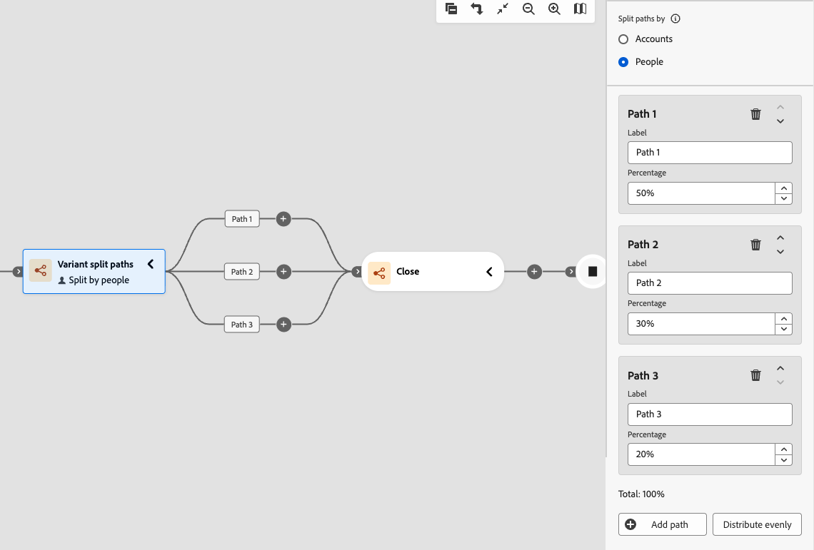

# Caminhos divididos da variante

Use um nó _Caminhos divididos de variante_ para distribuir contas aleatoriamente em dois ou mais caminhos de jornada com base nas alocações de porcentagem definidas por você. Esse nó é útil para testes exploratórios de diferentes táticas de mensagens, tempo ou envolvimento em segmentos do público-alvo da conta, sem aplicar regras condicionais. Não é adequado para experimentos A/B controlados que exigem atribuição de caminho consistente por conta.

>[!AVAILABILITY]
>
>O nó de caminhos divididos de variantes está disponível no momento para selecionar clientes como uma versão beta limitada, somente para **_jornadas de conta_**. O suporte a jornadas pessoais está planejado para uma versão futura. Para obter acesso, entre em contato com o representante da Adobe.

## Comparação com caminhos divididos {#compare-split-paths}

Os _[caminhos divididos](./split-merge-paths-nodes.md)_ e _caminhos divididos de variantes_ dividem as contas em várias ramificações de jornada, mas usam mecanismos diferentes:

| Aspecto | Dividir caminhos | Caminhos divididos da variante |
| -------- | ----------- | ------------------- |
| **Lógica de atribuição** | _Baseado em regra condicional_ - Cada conta é avaliada em relação às condições definidas e continua no primeiro caminho correspondente. | _Atribuição aleatória baseada em porcentagem_ - As contas são distribuídas entre caminhos de acordo com as porcentagens configuradas sem condições de filtragem. |
| **Determinismo** | _Determinístico_ - A mesma conta sempre segue o mesmo caminho, desde que corresponda às mesmas condições. | Não determinístico — a mesma conta pode seguir caminhos diferentes na reentrada. |
| **Caso de uso** | Segmente por atributos de conta ou grupo de compra conhecidos; avaliação com prioridade. | Distribua aleatoriamente contas para testar mensagens, cronometragem ou táticas no público da conta. |
| **Caminho de outras contas** | _Com Suporte_ - Contas que não correspondem a nenhum caminho definido podem ser roteadas para um caminho padrão. | _Não aplicável_ — Todas as contas são atribuídas a um dos caminhos definidos. |

## Dividir por conta {#split-by-account}

Quando uma conta atinge um nó de caminhos divididos variantes, o nó a atribui a exatamente um caminho com base nas porcentagens configuradas. A atribuição usa um algoritmo baseado em cota que controla quantas contas foram atribuídas a cada caminho e se ajusta ao longo do tempo para manter as taxas configuradas.

* Cada conta é atribuída a exatamente um caminho.
* A atribuição é aleatória e baseada em cota. O algoritmo ajusta as alocações dinamicamente para se aproximar das porcentagens configuradas na população geral.
* O nó suporta de 2 a 20 caminhos. Cada caminho tem um nome configurável e uma porcentagem de número inteiro de 1 a 99. A soma de todas as porcentagens de caminho deve ser exatamente igual a 100%.

>[!IMPORTANT]
>
>**Algoritmo baseado em cota: não determinístico**
>
>O algoritmo de distribuição usa atribuição aleatória baseada em cota. Este algoritmo é **_não determinístico_**: a mesma conta pode ser atribuída a um caminho diferente sempre que entrar ou entrar novamente na jornada. A atribuição de caminho depende do estado atual da cota no momento da avaliação, não de uma propriedade de conta fixa. Consulte [Limitações](#limitations) para obter detalhes sobre os casos de uso afetados.

### Algoritmo de distribuição {#distribution-algorithm}

O nó de caminhos de divisão de variante usa um algoritmo de **_atribuição aleatória baseada em cota_**. Quando uma conta atinge o nó, o sistema avalia as atribuições de conta existentes para cada caminho e roteia a conta para o caminho mais abaixo da cota configurada. Há duas propriedades principais para o algoritmo:

* A distribuição acompanha de perto as porcentagens configuradas em todos os volumes de conta. Como o algoritmo mantém ativamente as contagens de cotas, a distribuição real varia no máximo uma conta por caminho devido ao arredondamento quando os totais não são divididos uniformemente.
* O algoritmo usa um bloqueio pessimista durante a avaliação de cotas para serializar atribuições, o que garante um rastreamento de contagem preciso em execução simultânea.

### Limitações {#limitations}

Revise essas limitações antes de usar caminhos de divisão de variante em suas jornadas.

>[!CAUTION]
>
>**A atribuição de caminho não é determinística.**
>
>O algoritmo baseado em cota não garante que a mesma conta sempre siga o mesmo caminho. Se uma conta sair e entrar novamente na jornada, ela poderá ser atribuída a um caminho diferente, dependendo do estado da cota no momento da reentrada. Não use caminhos de divisão de variante para casos de uso que exigem atribuição de caminho consistente por conta em instâncias do jornada.

| Limitação | Descrição |
| ---------- | ----------- |
| **Não é adequado para experimentos controlados** | Como a atribuição de caminho não é determinística, os caminhos divididos da variante **não são adequados** para experimentos A/B ou cenários de atribuição que exigem que uma determinada conta receba consistentemente o mesmo tratamento. Casos de uso que dependem de consistência por conta — como medir taxas de resposta ou atribuir resultados a uma experiência específica — podem produzir resultados não confiáveis. |
| **Desvio de arredondamento pequeno** | Quando a contagem total de contas não é divisível uniformemente pelas porcentagens configuradas, a distribuição pode ser desativada por no máximo uma conta por caminho. Esse é um comportamento de arredondamento esperado e não é um erro. |
| **A atribuição de caminho não é idempotente** | Inserir novamente a jornada pode produzir uma atribuição de caminho diferente para a mesma conta. Se o design da jornada assumir que uma conta sempre segue o mesmo caminho após o nó dividido, essa suposição não será mantida. |
| **Somente jornadas da conta** | Os caminhos de divisão de variantes são compatíveis somente com jornadas de conta. As jornadas de pessoa não são suportadas no momento. |
| **Nenhuma filtragem condicional** | Ao contrário de _Caminhos divididos_, caminhos divididos de variantes não aplicam condições. Cada conta que atinge o nó é atribuída a um caminho. |

## Dividir por pessoas {#split-by-people}

Em uma jornada de conta, você também pode usar um nó de caminhos divididos de variante para distribuir _pessoas nas contas_ aleatoriamente em caminhos baseados em porcentagem. Esse tipo de divisão é útil quando você deseja testar conteúdo ou experiências diferentes no nível da pessoa, já que as contas continuam a se mover pela jornada. O nó de divisão de variante por pessoas opera com as seguintes medidas de proteção:

* O nó funciona como um _nó agrupado_, que é uma combinação de divisão e mesclagem. Os caminhos divididos se fecham automaticamente em um nó de mesclagem correspondente, para que todas as pessoas possam seguir em frente sem perder o contexto da conta.
* Cada pessoa na conta é atribuída a exatamente um caminho com base nas porcentagens configuradas.
* O mesmo algoritmo baseado em cota usado para contas se aplica a pessoas. A atribuição de caminho não é determinística e a mesma pessoa pode seguir um caminho diferente na reentrada.
* Somente _[!UICONTROL Executar uma ação]_ nós para pessoas têm suporte nos caminhos. Os caminhos não podem ser divididos.

>[!BEGINSHADEBOX &quot;Comportamento de distribuição entre pessoas&quot;]

As pessoas em uma conta são processadas em lote. O número atribuído a cada caminho é calculado como `floor(percentage / 100 × people_in_account)`, e o **último caminho configurado recebe todas as pessoas restantes**. Isso significa:

* Quando uma conta tem um número ímpar de pessoas, o último caminho recebe uma pessoa a mais que os caminhos anteriores.
* Para contas com uma única pessoa, essa pessoa é sempre atribuída ao primeiro caminho, independentemente das porcentagens configuradas.
* Para contas com poucas pessoas (menos de 10), a distribuição por conta pode diferir visivelmente das porcentagens configuradas. A distribuição converge para as taxas configuradas quando medidas em várias contas.

>[!NOTE]
>
>Esse comportamento de arredondamento se aplica por lote de contas, não a todas as contas na jornada. O último caminho recebe sistematicamente um pouco mais pessoas do que o configurado quando os tamanhos das contas são ímpares. Esse é o comportamento esperado.

>[!ENDSHADEBOX]

## Adicionar um nó de caminhos divididos de variante {#add-variant-split-paths-node}

1. Navegue até o mapa de jornadas.

1. Clique no ícone de adição ( **+** ) em um caminho e escolha **[!UICONTROL Caminhos divididos de variante]**.

   {width="300" zoomable="no"}

   O nó adicionado tem dois caminhos para iniciar.

1. Nas propriedades do nó à direita, escolha **[!UICONTROL Contas]** ou **[!UICONTROL Pessoas]** para a divisão.

   Se você estiver usando o tipo _[!UICONTROL Pessoas]_, um nó _Fechar caminhos de divisão de variante_ será inserido automaticamente para fechar a divisão agrupada.

   {width="700" zoomable="yes"}

1. Revise ou atualize o **[!UICONTROL Rótulo]** para cada caminho.

   Os rótulos de caminho aparecem como rótulos de borda na tela de jornada e ajudam a distinguir caminhos na análise de jornada.

   {width="600" zoomable="yes"}

1. Defina a **[!UICONTROL Porcentagem]** para cada caminho.

   Os valores devem ser números inteiros entre 1 e 99.

   {width="500" zoomable="yes"}

   O indicador de total ativo mostra a soma de todas as porcentagens de caminho. O total deve ser exatamente igual a 100% antes que você possa publicar a jornada. Um estado de erro é exibido quando o total não é igual a 100%.

   {width="500" zoomable="yes"}

   Para distribuir porcentagens uniformemente em todos os caminhos, clique em **[!UICONTROL Distribuir uniformemente]**. O sistema calcula compartilhamentos iguais e ajusta qualquer arredondamento para garantir que o total seja igual a 100%.

1. Para definir caminhos adicionais, clique em **[!UICONTROL Adicionar caminho]** para cada um.

   O nó suporta até 20 caminhos. À medida que você adicionar mais caminhos, ajuste a _[!UICONTROL Porcentagem]_ para que o total seja igual a 100%.

   Você pode remover um caminho clicando no ícone _Excluir_ (  ) no cartão de caminho. Um caminho só pode ser removido quando restarem pelo menos dois caminhos.

### Regras de validação {#validation-rules}

As regras a seguir se aplicam à configuração do caminho dividido da variante. As violações bloqueiam a publicação da jornada.

| Regra | Requisito |
| ---- | ----------- |
| Mínimo de caminhos | 2 |
| Máximo de caminhos | 20 |
| Porcentagem por caminho | Número inteiro de 1 a 99 |
| Porcentagem total | Deve ser igual a exatamente 100% |
