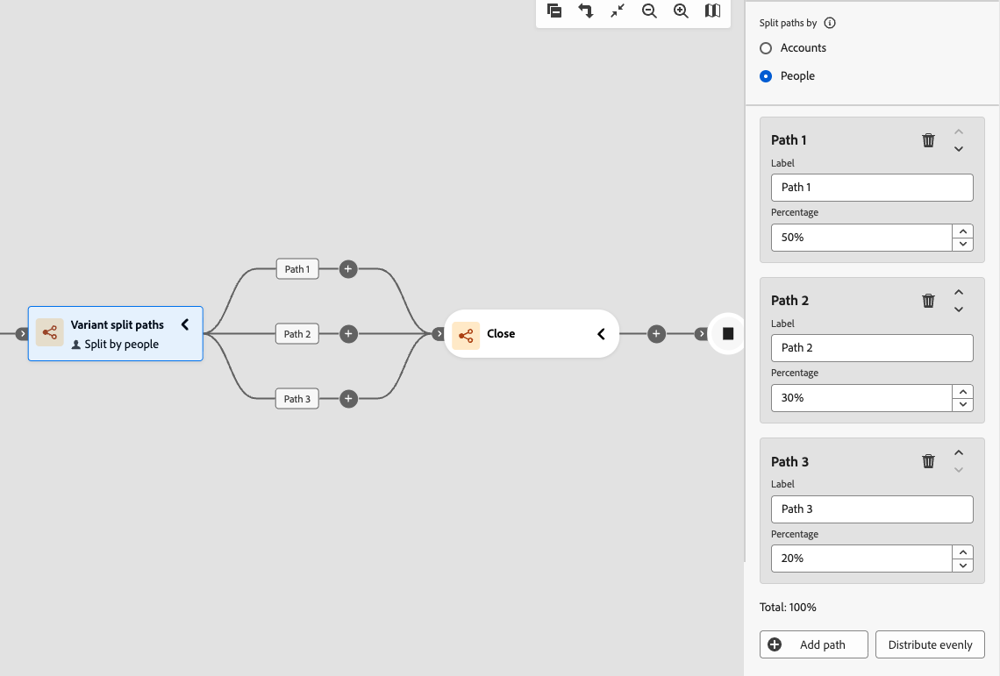

# Caminhos divididos da variante

Use um nó _Caminhos divididos variantes_ para distribuir contas ou pessoas em dois ou mais caminhos de jornada com base nas alocações percentuais definidas por você. Esse nó é útil quando você deseja testar diferentes táticas de mensagens, tempo ou envolvimento em segmentos do público-alvo sem aplicar regras condicionais.

>[!AVAILABILITY]
>
>O nó _Caminhos divididos de variante_ para jornadas de conta e pessoa está disponível para clientes selecionados como um recurso de disponibilidade limitada. Para obter acesso, entre em contato com o representante da Adobe.

## Comparação por tipo de jornada {#journey-type-comparison}

O nó de caminhos divididos da variante usa algoritmos de atribuição diferentes, dependendo do tipo de jornada. Entender essa diferença é importante para escolher o caso de uso correto para cada tipo de jornada.

| | Jornadas da conta | Jornadas de pessoas |
| - | ---------------- | --------------- |
| **Algoritmo** | Atribuição aleatória baseada em cota | Atribuição de hash determinística |
| **Determinismo** | Não determinístico — a mesma conta pode ser atribuída a um caminho diferente na reentrada, dependendo do estado da cota atual. | Determinístico — a mesma pessoa é sempre atribuída ao mesmo caminho para determinada jornada publicada, independentemente de quantas vezes ela entra ou reentra. |
| **Teste A/B** | Não adequado — a atribuição de caminho não é estável entre as reentradas. | Adequado — a atribuição consistente de caminhos por pessoa suporta experiências e atribuições controladas. |
| **Comportamento de reentrada** | A conta pode seguir um caminho diferente sempre que entrar na jornada. | A pessoa sempre segue o mesmo caminho em que foi atribuída na primeira entrada. |
| **Precisão da distribuição** | Dentro de uma conta por caminho devido à aplicação de cotas. | Converge para dentro de ±2% das porcentagens configuradas em 1.000 ou mais entradas de jornada. |

## Comparação com caminhos divididos {#compare-split-paths}

Ambos os _[caminhos divididos](./split-merge-paths-nodes.md)_ e _caminhos divididos de variantes_ dividem uma jornada em várias ramificações (caminhos), mas usam mecanismos diferentes:

| Aspecto | Dividir caminhos | Caminhos divididos da variante |
| -------- | ----------- | ------------------- |
| **Lógica de atribuição** | _Baseado em regra condicional_ — Cada entidade é avaliada em relação às condições definidas e continua no primeiro caminho correspondente. | _Atribuição baseada em porcentagem_ — as entidades são distribuídas entre caminhos de acordo com as porcentagens configuradas sem condições de filtragem. |
| **Determinismo** | _Determinístico_ — A mesma entidade sempre segue o mesmo caminho, desde que corresponda às mesmas condições. | _Depende do tipo de jornada_ - As jornadas de pessoa são determinísticas (a mesma pessoa sempre segue o mesmo caminho para uma jornada publicada). As jornadas de conta não são determinísticas (baseadas em cota). |
| **Caminho de outras contas/pessoas** | _Com Suporte_ — As entidades que não correspondem a nenhum caminho definido podem ser roteadas para um caminho padrão. | _Não aplicável_ — Todas as entidades que atingem o nó são atribuídas a um caminho. |
| **Caso de uso** | Segmentar por atributos de conta ou pessoa conhecidos; avaliação ordenada por prioridade. | Distribuir entidades para testar mensagens, cronometragem ou táticas. Jornadas de pessoas: adequado para experimentos A/B. Jornadas de conta: adequado para distribuição aleatória sem consistência por conta. |

## Jornadas da conta {#account-journeys}

Para jornadas de conta, o algoritmo de distribuição usa [atribuição aleatória baseada em cota](#account-journeys--quota-based-random-assignment). Este algoritmo é **_não determinístico_**: a mesma conta pode ser atribuída a um caminho diferente sempre que entrar ou entrar novamente na jornada. A atribuição de caminho depende do estado atual da cota no momento da avaliação, não de uma propriedade de conta fixa.

### Dividir por conta {#split-by-account}

Quando uma conta atinge um nó de caminhos divididos variantes, o tempo de execução avalia quantas contas já foram atribuídas a cada caminho durante a instância atual do jornada e roteia a conta para o caminho mais abaixo da cota configurada.

* Cada conta é atribuída a exatamente um caminho.
* A atribuição é baseada em cota. O algoritmo ajusta as alocações dinamicamente para se aproximar das porcentagens configuradas na população geral.
* Como o algoritmo rastreia as contagens de cota, a distribuição real só sofre o desvio de no máximo uma conta por caminho devido ao arredondamento quando os totais não são divididos uniformemente.

### Dividir por pessoas {#split-by-people}

Em uma jornada de conta, você também pode usar um nó de caminhos divididos de variante para distribuir _pessoas nas contas_ aleatoriamente em caminhos baseados em porcentagem. Esse tipo de divisão é útil quando você deseja testar conteúdo ou experiências diferentes no nível da pessoa. As contas continuam a se mover pela jornada. O nó de divisão de variante por pessoas opera com as seguintes medidas de proteção:

* O nó funciona como um _nó agrupado_, que é uma combinação de divisão e mesclagem. Os caminhos divididos se fecham automaticamente em um nó de mesclagem correspondente, para que todas as pessoas possam seguir em frente sem perder o contexto da conta.
* Cada pessoa na conta é atribuída a exatamente um caminho com base nas porcentagens configuradas.
* O mesmo algoritmo baseado em cota usado para contas se aplica a pessoas. A atribuição de caminho não é determinística e a mesma pessoa pode seguir um caminho diferente na reentrada.
* Somente _[!UICONTROL Executar uma ação]_ nós para pessoas têm suporte nos caminhos. Os caminhos não podem ser divididos.

>[!BEGINSHADEBOX &quot;Comportamento de distribuição entre pessoas&quot;]

As pessoas em uma conta são processadas em lote. O número atribuído a cada caminho é calculado como `floor(percentage / 100 × people_in_account)`, e o **último caminho configurado recebe todas as pessoas restantes**. Isso significa:

* Quando uma conta tem um número ímpar de pessoas, o último caminho recebe uma pessoa a mais que os caminhos anteriores.
* Para contas com uma única pessoa, essa pessoa é sempre atribuída ao primeiro caminho, independentemente das porcentagens configuradas.
* Para contas com poucas pessoas (menos de 10), a distribuição por conta pode diferir visivelmente das porcentagens configuradas. A distribuição converge para as taxas configuradas quando medidas em várias contas.

>[!NOTE]
>
>Esse comportamento de arredondamento se aplica por lote de contas, não a todas as contas na jornada. O último caminho recebe sistematicamente um pouco mais pessoas do que o configurado quando os tamanhos das contas são ímpares. Esse é o comportamento esperado.

>[!ENDSHADEBOX]

## Jornadas de pessoas {#person-journeys}

Quando uma pessoa atinge um nó de caminhos divididos de variante, o tempo de execução os mapeia para um caminho com base em um hash de sua ID e da ID da jornada.

* Cada pessoa é atribuída a exatamente um caminho.
* A atribuição é determinística — a mesma pessoa sempre recebe a mesma atribuição de caminho para determinada jornada publicada, independentemente de quantas vezes ela informa ou informa novamente.
* O hash é calculado somente a partir da ID de pessoa e da ID de jornada. Isso não depende da posição do nó, da hora de entrada ou de qualquer estado de cota. Isso significa que entrar novamente na jornada produz a mesma atribuição de caminho todas as vezes.

>[!NOTE]
>
>**A divisão de variante de jornada de pessoa é adequada para testes e experimentos A/B.**
>
>Como a atribuição é determinística e consistente entre as reentradas, os caminhos divididos de variantes em jornadas de pessoas suportam experimentos controlados, em que a mesma pessoa deve receber consistentemente a mesma experiência. Use a exibição [Detalhes da jornada](./journey-details.md) para monitorar a distribuição entre caminhos depois que a jornada estiver ativa.

## Algoritmo de distribuição

O algoritmo de distribuição aplicado depende do tipo de jornada.

### Jornadas da conta — atribuição aleatória baseada em cota

O nó de caminhos divididos de variantes no Account jornada usa um algoritmo de **atribuição aleatória baseada em cota**. Quando uma conta atinge o nó, o tempo de execução avalia quantas contas já foram atribuídas a cada caminho durante a instância do jornada atual e roteia a conta para o caminho mais abaixo da cota configurada.

**Propriedade de chave do algoritmo baseado em cota:**

* A distribuição acompanha de perto as porcentagens configuradas em todos os volumes de conta. Como o algoritmo mantém ativamente as contagens de cotas, a distribuição real só oscila em no máximo uma conta por caminho devido ao arredondamento quando os totais não são divididos uniformemente.

### Jornadas de pessoas — atribuição de hash determinístico

O nó de caminhos divididos de variante no jornada de pessoa usa um algoritmo de **atribuição de hash determinística**. Quando uma pessoa atinge o nó, o tempo de execução calcula um valor de hash da ID de pessoa e da ID de jornada e mapeia o resultado para um caminho com base nos intervalos de porcentagem configurados. O algoritmo é aplicado usando o seguinte workflow:

1. O tempo de execução calcula um hash de 32 bits MurmurHash3 de uma chave composta que combina a ID de pessoa e a ID de jornada.
1. O valor de hash é mapeado para uma posição em um intervalo de 10.000 compartimentos de tamanho igual.
1. Os buckets são particionados de acordo com as porcentagens de caminho configuradas. Por exemplo, com caminhos a 30%, 30% e 40%, os primeiros 3.000 buckets correspondem ao Caminho 1, os próximos 3.000 ao Caminho 2 e os 4.000 restantes ao Caminho 3.
1. A pessoa é atribuída ao caminho cujo intervalo do bucket contém sua posição de hash.

Há duas propriedades principais do algoritmo de hash determinístico:

* **_Consistência_** — A mesma pessoa é sempre atribuída ao mesmo bucket para determinada ID de jornada. Inserir novamente a jornada produz a mesma atribuição de caminho todas as vezes.
* **_Distribuição estatística_** — a distribuição converge para dentro de ±2% das porcentagens configuradas quando pelo menos 1.000 pessoas únicas entraram na jornada. Com públicos-alvo menores, as contagens por caminho podem diferir mais significativamente das taxas configuradas.

## Limitações {#limitations}

Revise essas limitações antes de usar caminhos de divisão de variante em suas jornadas.

### Limitações de jornada de conta {#account-journey-limitations}

>[!IMPORTANT]
>
>**A atribuição de caminho não é determinística.**
>
>O algoritmo baseado em cota não garante que a mesma conta sempre siga o mesmo caminho. Se uma conta sair e entrar novamente na jornada, ela poderá ser atribuída a um caminho diferente, dependendo do estado da cota no momento da reentrada. Não use caminhos divididos de variantes de jornada de conta para casos de uso que exigem atribuição consistente de caminho por conta em instâncias do jornada.

| Limitação | Descrição |
| ---------- | ----------- |
| **Não é adequado para experimentos controlados** | Como a atribuição de caminho não é determinística, os caminhos divididos da variante nas jornadas da conta **não são adequados** para experimentos A/B ou cenários de atribuição que exigem que uma determinada conta receba consistentemente o mesmo tratamento. |
| **Desvio de arredondamento pequeno** | Quando a contagem total de contas não é divisível uniformemente pelas porcentagens configuradas, a distribuição pode ser desativada por no máximo uma conta por caminho. Esse é um comportamento de arredondamento esperado e não é um erro. |
| **A atribuição de caminho não é idempotente** | Inserir novamente a jornada pode produzir uma atribuição de caminho diferente para a mesma conta. |
| **Nenhuma filtragem condicional** | Ao contrário de _Caminhos divididos_, caminhos divididos de variantes não aplicam condições. Cada conta que atinge o nó é atribuída a um caminho. |

### Limitações de jornada de pessoa {#person-journey-limitations}

| Limitação | Descrição |
| ---------- | ----------- |
| **Variação estatística em pequena escala** | A distribuição converge para as porcentagens configuradas dentro de aproximadamente ±2% quando pelo menos 1.000 pessoas únicas entraram na jornada. Com menos entradas, as contagens por caminho podem diferir mais visivelmente das taxas configuradas. Esse é um comportamento esperado da distribuição de hash e não é um erro. |
| **Nenhuma filtragem condicional** | Ao contrário de _Caminhos divididos_, caminhos divididos de variantes não aplicam condições. Cada pessoa que atinge o nó é atribuída a um caminho. |

## Adicionar um nó de caminhos divididos de variante {#add-variant-split-paths-node}

As etapas para adicionar e configurar um nó de caminho dividido variante são as mesmas para jornadas de conta e pessoa.

1. Navegue até o mapa de jornadas.

1. Clique no ícone _Adicionar_ ( **+** ) em um caminho e escolha **[!UICONTROL Caminhos divididos de variante]**.

   {width="300" zoomable="no"}

   No mapa de jornadas, o nó tem dois caminhos padrão.

1. (_Somente jornadas de conta_) Nas propriedades do nó à direita, escolha **[!UICONTROL Contas]** ou **[!UICONTROL Pessoas]** para a divisão.

   Se você estiver usando o tipo _[!UICONTROL Pessoas]_, um nó _Fechar caminhos de divisão de variante_ será inserido automaticamente para fechar a divisão agrupada.

   {width="700" zoomable="yes"}

1. Revise ou atualize o **[!UICONTROL Rótulo]** para cada caminho.

   Os rótulos de caminho aparecem como rótulos de borda na tela de jornada e ajudam a distinguir caminhos na análise de jornada.

   {width="600" zoomable="yes"}

1. Defina a **[!UICONTROL Porcentagem]** para cada caminho.

   Os valores devem ser números inteiros entre 1 e 99.

   {width="500" zoomable="yes"}

   O indicador de total ativo mostra a soma de todas as porcentagens de caminho. O total deve ser exatamente igual a 100% antes que você possa publicar a jornada. Um estado de erro é exibido quando o total não é igual a 100%.

   {width="500" zoomable="yes"}

   Para distribuir porcentagens uniformemente em todos os caminhos, clique em **[!UICONTROL Distribuir uniformemente]**. O sistema calcula compartilhamentos iguais e ajusta qualquer arredondamento para garantir que o total seja igual a 100%.

1. Para definir caminhos adicionais, clique em **[!UICONTROL Adicionar caminho]** para cada um.

   O nó suporta até 20 caminhos. À medida que você adicionar mais caminhos, ajuste a _[!UICONTROL Porcentagem]_ para que o total seja igual a 100%.

   Você pode remover um caminho clicando no ícone _Excluir_ (  ) no cartão de caminho. Um caminho só pode ser removido quando restarem pelo menos dois caminhos.

   As regras a seguir se aplicam à configuração do caminho dividido da variante. As violações bloqueiam a publicação da jornada.

   | Regra | Requisito |
   | ---- | ----------- |
   | Mínimo de caminhos | 2 |
   | Máximo de caminhos | 20 |
   | Porcentagem por caminho | Número inteiro de 1 a 99 |
   | Porcentagem total | Deve ser igual a exatamente 100% |
