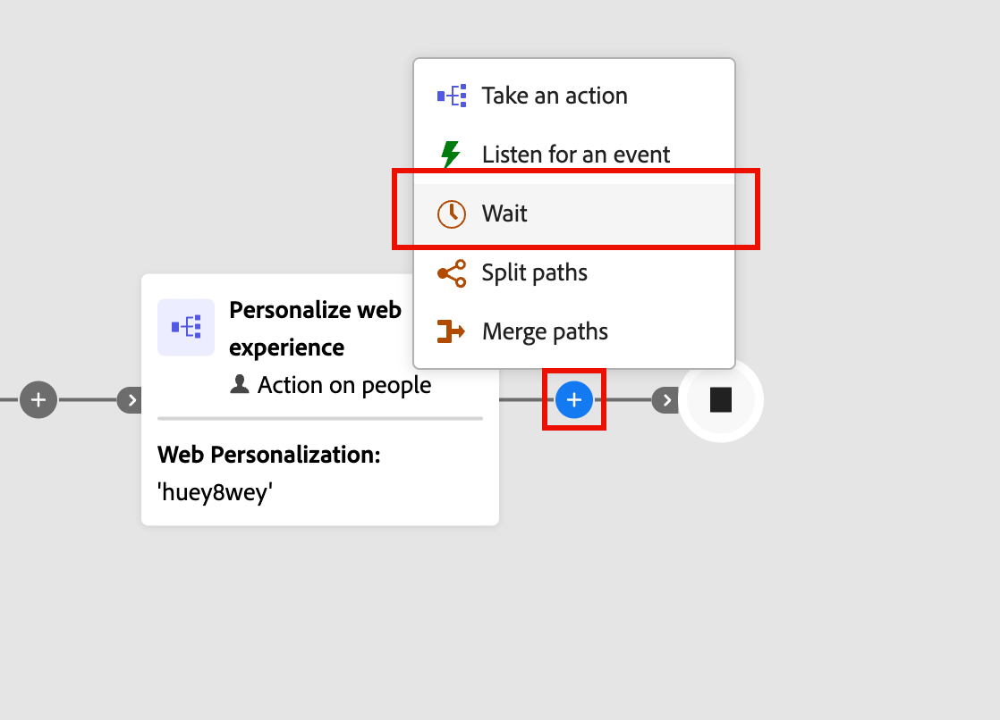
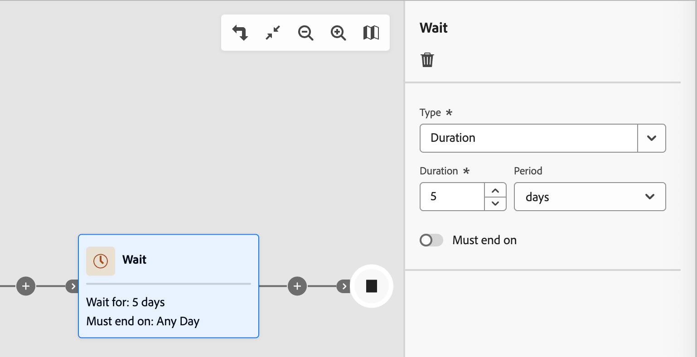
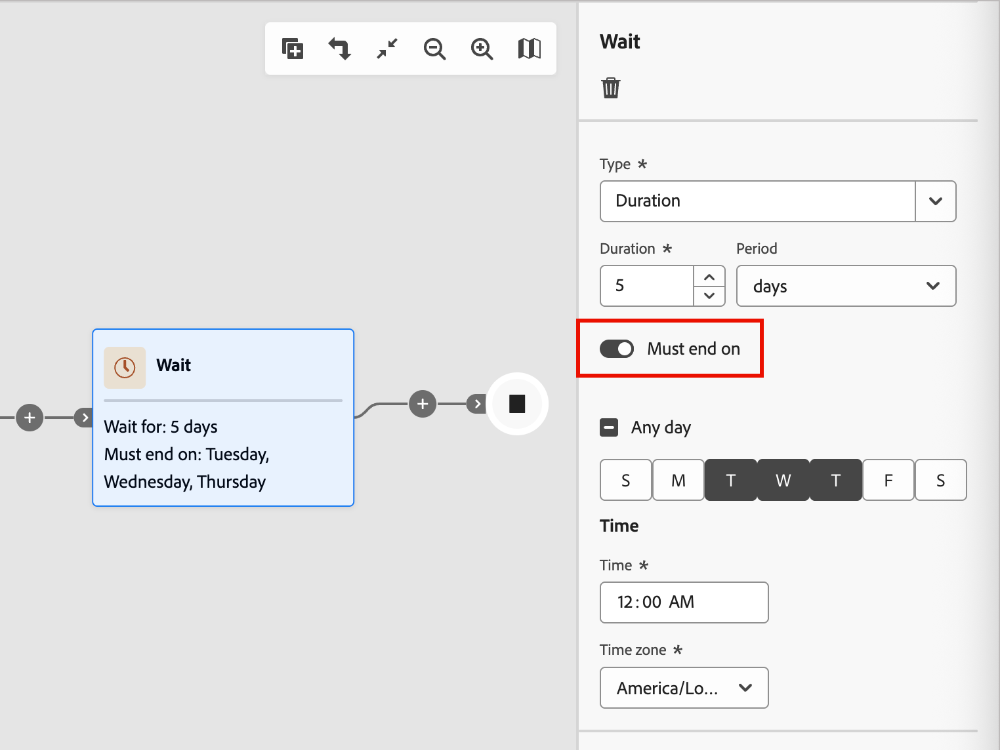

# Esperar nós

Use um nó _Wait_ quando quiser pausar a progressão da jornada por uma determinada duração antes de passar para a próxima etapa.

Há duas maneiras de definir o tempo de espera:

* Uma data específica na qual você deseja avançar para o próximo nó na jornada
* Uma duração relativa (número de minutos, horas, dias, semanas ou meses)

## Adicionar o nó de espera

1. Navegue até o mapa de jornadas.

1. Clique no ícone de adição ( **+** ) em um caminho e escolha **[!UICONTROL Aguardar]**.

   {width="440"}

1. Para definir o tempo de espera antes que a jornada continue para o próximo nó no caminho, use as propriedades do nó à direita para definir o **[!UICONTROL Tipo]**.

   * **[!UICONTROL Duração]** - Defina um número específico de dias, horas ou minutos decorridos entre a entrada e a saída do nó de espera.
   * **[!UICONTROL Data]** - Especifique uma data e hora para a saída.

   {width="500"}

## Configurações avançadas de espera

Habilite a opção **[!UICONTROL Deve terminar em]** para configurar uma _etapa de espera avançada_ e garantir que suas mensagens cheguem às pessoas e aos membros da conta no momento ideal. Essa configuração oferece controle preciso sobre quando uma pessoa ou conta sai de uma etapa de espera e prossegue para o próximo nó na jornada. Em vez de um número fixo de horas ou dias, desde a entrada até a saída, você pode agendar ações para que ocorram em horários e dias específicos da semana.

Com uma _etapa de espera avançada_, você define **_quando_** a pessoa ou a conta sai, e não apenas quanto tempo ela espera.

{width="500"}

### Tipos de espera

| Tipo de espera | Descrição | Configuração |
| --------- | ----------- | ------------- |
| **Hora específica do dia** | Mantenha pressionado até um horário específico (como 9:00) | Defina a hora (hora e minuto). Sai na próxima ocorrência desse horário (para o fuso horário selecionado). |
| **Dia da semana específico** | Manter até um dia específico (como terça-feira) | Selecione um dia da semana. Se nenhuma hora for especificada, o sai à meia-noite (para o fuso horário selecionado) no próximo dia correspondente. |
| **Intervalo ou combinação de dias** | Manter até qualquer dia dentro de um intervalo (como segunda a sexta-feira) ou em qualquer um dos dias especificados | Selecione os dias de destino. Se nenhuma hora for especificada, o sai à meia-noite (para o fuso horário selecionado) no próximo dia correspondente. |
| **Combinação de tempo + dia** | Combine ambos para obter um agendamento preciso (como terça-feira às 10h) | Selecione os dias de destino e defina o horário de destino. Sai na próxima ocorrência de dia/hora (para o fuso horário selecionado). |

### Cenários comuns

Os cenários a seguir ilustram como você pode aplicar exemplos típicos à configuração do nó de espera:

+++Chegada de email durante o horário comercial

**Cenário:** você comercializa para clientes B2B que leem emails durante seus dias úteis. Você deseja que todos os emails cheguem durante o horário comercial.

**Solução:** configure sua etapa de espera para liberar clientes potenciais às 9h nos dias da semana (de segunda a sexta). Não importa quando um lead entra no nó de espera, ele recebe seu email durante o horário comercial.

+++

+++Tempos de envio consistentes para públicos dinâmicos

**Cenário:** seu público-alvo muda diariamente à medida que novas contas ou clientes potenciais se qualificam. Deseja que todos os clientes em potencial recebam o primeiro email ao mesmo tempo, independentemente de quando se qualificaram.

**Solução:** Defina a etapa de espera para terminar em um horário específico (como 10h). Todos os clientes em potencial, sejam eles qualificados à meia-noite ou ao meio-dia, saiam da etapa de espera juntos às 10h.

+++

+++Tarefas de acompanhamento em conformidade com a SLA

**Cenário:** sua equipe de vendas tem uma SLA de dois dias úteis para acompanhar clientes em potencial qualificados para marketing. Os finais de semana são excluídos.

**Solução:** configure a etapa de espera para liberar clientes potenciais somente em dias úteis. Um lead qualificado na sexta-feira é encaminhado para acompanhamento na segunda ou terça-feira, não durante o fim de semana.

+++

### Exemplos de entrada e saída

| Aguardar configuração | Entradas de conta/cliente potencial | Saídas da conta/lead |
| ------------------ | ------------------- | ------------------ |
| 9h, qualquer dia | Segunda-feira 11:00 | Terça-feira 9:00 AM |
| 9h, qualquer dia | Segunda-feira 7:00 | Segunda-feira 9:00 |
| Terça-feira, sem horário definido | Sexta-feira 15:00 horas | Terça-feira, 12:00 |
| 10h, de segunda a sexta-feira | Sábado 14h | Segunda-feira 10:00 |
| 10h, de segunda a sexta-feira | Quarta-feira, 8:00 | Quarta-feira, 10:00 |
